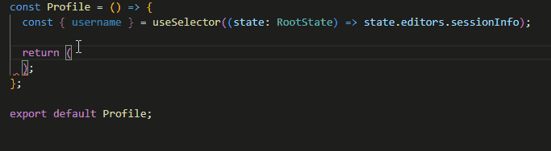

# Github Copliot First Look - 첫 인상과 React 개발 일주일 사용후기

Github에서 Copliot을 정식으로 출시해서 이제 일반 사용자들도 사용해볼 수 있게 되었습니다.(출시한지가 언젠데 이제서야...😞) 하도 주변에서 copliot에 대한 찬사를 하고, 심지어 이제 AI가 코딩을 더 잘한다는 소리까지 듣게 되니 좀 많이 궁금해지더군요!

## 정말 AI가 내 직업을 뺏을까?

AI의 발전은 갈수록 그 속도가 더 빨라지고 있습니다. 최근에 미국에서는 AI가 그린 그림이 공모전 1등을 해서 논란이 일었습니다. 보도에 따르면 출품 당시 '미드 저니'라는 AI를 통해 그린 것임을 미리 밝혔지만, 일부 심사위원은 AI가 그린 그림인지 인지하지 못할 정도였다고 합니다. 어느 정도 였길래 1등을 먹었을까요?

<p align="center"></p>
(출처: 동아일보, https://www.donga.com/news/article/all/20220905/115301579/1)
<br /><br />
확실히 이 정도면 그림을 잘 모르는 제가 봐도 "와 쩐다" 싶은 느낌이 들긴합니다. 그리고 이런 논란이 있기 한참 전 부터 각종 커뮤니티에서는 키워드만 입력해주면 일러스트나 캐릭터를 그려주는 사이트에 대한 이야기가 많이 올라오곤 했습니다. 생각난 김에 저도 [DALL·E2](https://labs.openai.com/) 로 그림을 하나 그려보기로 했습니다.
<br /><br />
<p align="center"></p>

**korean programmer** 라고 치자 제법 그럴듯한 이미지들이 몇 초만에 생성됩니다. 세세하게 살펴보면 얼굴의 눈가 쪽과 손가락이 엉성한 느낌이 들긴 하지만, 만약 제가 그림을 그리는 입장이라면 좀 민감하게 받아들일 것 같습니다.🥺

<p align="center">
  <br />
  이럴 수가... AI 네 이놈...
</p>

그런데 말입니다....

과연 개발자들은 안전한 걸까요? 아래 영상을 보면 그런 생각이 들기도 합니다...

[코딩접어야겠습니다 만원짜리 AI가 더 코딩 잘함](https://www.youtube.com/watch?v=R-lIeSR8-hE)

## 그래서 직접 테스트를 해봤습니다

남이 만들어 놓은 영상만 보고 판단하는 건 현명하지 못한 생각이겠죠? 그래서 직접 테스트를 해보기로 하고 copilot을 신청하고 환경을 세팅했습니다.

아주 간단한 것 부터 테스트를 시작했습니다.🧐

<p align="center"></p>

함수의 이름을 보고 합계를 구하는 그럴듯한 코드를 제시해줍니다.

```javascript
const caculateSum = (a, b) => a + b;
```

조금 더 복잡한 코드를 요구해볼까요?

<p align="center"></p>

문자열을 뒤집는 함수도 잘 짜줍니다.

```javascript
const reverseString = (str) => {
  return str.split("").reverse().join("");
};
```

<p align="center"><br />호오... 그럴싸 한데??</p>

좀 더 복잡한 코드를 테스트 해보죠!

<p align="center"></p>

주석으로 큐를 구현해달라고 요청하면, 큐를 구현하는 코드와 함께 테스트 할 수 있는 코드까지도 제안해줍니다!

```javascript
/**
 * implement queue using two stacks
 */
class Queue {
  constructor() {
    this.stack1 = [];
    this.stack2 = [];
  }

  enqueue(item) {
    this.stack1.push(item);
  }

  dequeue() {
    if (this.stack2.length === 0) {
      while (this.stack1.length > 0) {
        this.stack2.push(this.stack1.pop());
      }
    }
    return this.stack2.pop();
  }
}

const queue = new Queue();
queue.enqueue(1);
queue.enqueue(2);
queue.enqueue(3);
console.log(queue.dequeue());
console.log(queue.dequeue());
console.log(queue.dequeue());
```

> 내가 원하는 코드가 나오지 않을 때는 **Alt + "[" or "]"** 맥에서는 **option + "[" or "]"** 를 통해서 제안되는 코드를 변경할 수 있습니다. 그리고 제안을 받고 싶을 때는 **Alt + "\\"** 를 누릅니다.

확실히 기대했던 것 보다는 훨씬 똑똑합니다.

<p align="center"><br />조아.. 아주 조아!!!</p>

**와... 이거 쩌는데?** 하는 생각과 함께 계속 테스트를 이어나갔습니다. 이번에는 사용자에게 숫자를 입력받아서 소수인지 출력하는 코드를 요청해보기로 했습니다.

<p align="center"></p>

```javascript
/**
 * 숫자를 입력받아서
 * 숫자가 소수인지 출력하기
 */
function isPrime(num) {
  if (num < 2) {
    return false;
  }
  for (let i = 2; i < num; i++) {
    if (num % i === 0) {
      return false;
    }
  }
  return true;
}

console.log(isPrime(2)); // true
console.log(isPrime(3)); // true
console.log(isPrime(4)); // false
console.log(isPrime(5)); // true
```

<p align="center"><br />이거 아닌데...</p>

코드를 추천해주기는 하지만 제가 원하는 코드는 아닙니다. 사용자가 숫자를 입력할 수 있는 부분이 없거든요. 다시!

<p align="center"></p>

```javascript
/**
 * 사용자에게 "숫자를 입력하세요: " 라는 메시지를 출력하고
 * 숫자를 입력받아서
 * 숫자가 소수인지 아닌지 출력하기
 */
var num = prompt("숫자를 입력하세요: ");

// 소수인지 아닌지 판별하기
var isPrime = true;
for (var i = 2; i < num; i++) {
  if (num % i == 0) {
    isPrime = false;
    break;
  }
}

// 소수인지 아닌지 출력하기
if (isPrime) {
  console.log(num + "은 소수입니다.");
}
```

좀 더 구체적으로 입력하자 좀 더 적합한 코드를 주기 시작합니다. 하지만 이건 node.js가 아닌 브라우저에서 동작하는 코드죠. 물론 **prompt** 함수를 추가해서 동작하게 만들 수도 있겠지만요. 다시!

<p align="center"></p>

```javascript
/**
 * node.js
 * "숫자를 입력하세요:" 숫자 입력받아서 소수 판별
 */
var readline = require("readline");

var rl = readline.createInterface({
  input: process.stdin,
  output: process.stdout,
});

rl.question("숫자를 입력하세요: ", function (answer) {
  var num = parseInt(answer);
  var result = true;
  for (var i = 2; i < num; i++) {
    if (num % i == 0) {
      result = false;
      break;
    }
  }
  if (result) {
    console.log("소수입니다.");
  } else {
    console.log("소수가 아닙니다.");
  }
  rl.close();
});
```

**node.js** 키워드를 추가하자 이제 **node.js** 에서 실행할 수 있는 코드를 제시해줍니다. 오오오... 근데 계속 탭키 누르면서 다음줄로 가는 것도 좀 귀찮긴 하죠. 그래서 이번엔 제가 어떤 코드를 원하는지 살짝 힌트를 주기로 했습니다.

<p align="center"></p>

```javascript
/**
 * node.js
 * "숫자를 입력하세요:" 숫자 입력받아서 소수 판별
 */
const main = () => {
  const readline = require("readline");
  const rl = readline.createInterface({
    input: process.stdin,
    output: process.stdout,
  });
  rl.question("숫자를 입력하세요: ", (answer) => {
    console.log(isPrime(answer));
    rl.close();
  });
};

const isPrime = (num) => {
  if (num < 2) return false;
  for (let i = 2; i < num; i++) {
    if (num % i === 0) return false;
  }
  return true;
};

main();
```

제가 코드를 쭉 늘어놓지 말고 함수로 제안해달라고 힌트를 주자 거기에 맞춰서 코드를 제안해줍니다. 오호...😆

<p align="center"><br />아 이제 대충 사용법은 마스터 한듯 ㅋ</p>

## 이제는 실전이다. React로 일주일 써본 후기

Github Copliot의 첫 인상은 똑똑하긴 한데, 알아듣게 설명을 해줘야만 일을 잘하는 친구였습니다. 그래서 일단 React 작업을 하면서 능력을 확인해보기로 했죠.

### 첫 번째 케이스 : Good!

다음 영상은 Redux 스토어의 reducer에 코드를 작성하는 장면입니다.

<p align="center"></p>

상단에 **Todo** 타입이 명시되어 있고, 상태 값인 **todos**는 **Todo[]** 타입입니다. 그래서 **todos**에 새 항목을 추가하는 코드를 작성하자 copilot이 눈치를 까고 타입에 맞는 적절한 값을 추천해줍니다.

<p align="center"><br />오... 똑똑한데?</p>

### 두 번째 케이스 : Good!

다음은 할 일 목록을 표시하고 그 아래에 새 할일 입력 칸을 추가하는 장면입니다.

<p align="center"></p>

역시 copliot이 눈치까고 **useState**로 선언된 **todo** 값을 이용해서 새 할 일 제목을 입력받을 수 있는 **input** 태크를 완성해줍니다.

### 세 번째 케이스 : Excellent!

마지막 장면은 커스텀 hook을 만들고 사용하는 상황입니다.

<p align="center"></p>

우선 훅을 작성하고 마지막에 리턴 타입을 추가하는데요, 100% 정확하지는 않지만 리턴하는 항목의 타입을 유추해서 hook의 리턴 타입을 추천해줍니다.

그리고 이 훅을 사용하는 장면입니다.

<p align="center"></p>

아무런 힌트를 주지 않았지만 당연히 hook을 사용하겠지? 하면서 아까 만든 hook을 사용하는 코드를 추천해줍니다.

<p align="center"><br />오 이건 기대 이상인 듯</p>

### 네 번째 케이스 : What the...?

뭘 하려고 하는 건지 나도 모르고 AI도 모를 땐 아무말 대잔치가 벌어집니다.

<p align="center"></p>

이럴 땐 copilot 에게 물어보기 전에 어떤 작업을 할지 생각을 먼저 해야 겠죠...

<p align="center"><br />코딩하기 전에 생각했나요?</p>

## 결론 : 아는 만큼 쓸 수 있다.

아주 짧은 시간 copilot을 써보고 든 생각은 **아는 만큼 쓸 수 있다**는 거였습니다. 그 이유는 다음과 같습니다.

### 1. AI도 우문현답은 못한다.

| 우문현답(愚問賢答): 어리석은 질문에 현명한 대답

이건 AI가 아닌 사람을 놓고 생각해도 마찬가지인데요, 내가 뭘 모르는지 정확하게 알아야 정확한 답변을 얻을 수 있습니다.

사람은 '아 이 사람이 이걸 물어보는 건가?'하고 예측을 할 수 도 있고, 질문과 답변을 이어가면서 좀 더 정확하게 알려줄 수도 있죠.(물론 아 말해줘도 못 알아먹겠구나 싶은 느낌도 받을 수 있습니다.) 근데 AI라고 별 수 있을까요? **내가 뭘 짜려고 하는지 최소한의 구조를 알고 있고 어떻게 진행되어야 하는 흐름을 알아야 적합한 코드를 제안받을 수 있습니다.**

생각해보면 이런 경우가 아닐까요?

- 잘 기억은 안 나는데 그거 어떻게 하더라?(ex: node.js에서 readline)
- 새로운 SDK나 API 사용법에 대해서 힌트를 얻고 싶을 때(ex: dynamodb 쿼리 어떻게 날렸더라?)
- 알고리즘 구현 방법을 알고 싶을 때(ex: 소수 어떻게 구하더라?)

사실 서두에 소개해드렸던 [코딩접어야겠습니다 만원짜리 AI가 더 코딩 잘함](https://www.youtube.com/watch?v=R-lIeSR8-hE) 영상을 한 번 더 자세히 보시면, 이건 AI 도움 없이도 만들 줄 아는 사람이 이런 저런 테스트를 거쳐서 copilot에게 일을 잘 시키는 방법을 찾아낸 겁니다. 유투브니까 제목이 자극적인건 이해 해야겠죠. 🤔

### 2. 제안 받은 코드가 맞는 코드인지 확인할 수 있어야 한다.

역시 AI를 빼놓고 생각해도 당연한 이야기 입니다. Stackoverflow에서 검색할 때도 결국은 이게 무슨 코드인지 이해할 수 있어야 제대로 활용할 수 있습니다. Stackoverflow는 다른 사용자들이 답변에 대해서 검증도 해주고 다양한 의견을 남겨주기 때문에 답변에 대한 크로스 체크가 들어가는 경우가 많지만, copliot은 여러분이 직접 체크해야만 합니다. github 역시 공식 문서에서 [이 점을 분명하게 해두고 있습니다.](https://docs.github.com/en/copilot/overview-of-github-copilot/about-github-copilot#using-github-copilot)

### 3. 아예 제안할 방법이 없는 경우도 있다.

공개된 코드를 기반으로 학습하고 코드를 제안하기 때문에, 아직 공개되지 않은 코드나 공개된지 얼마 되지 않은 코드는 copliot이 제안할 방법이 없습니다. 막 SDK 새 버전이 나와서 적용해야 할 때, 아마도 copliot은 계속 옛날 버전의 코드를 제안할 겁니다. 자기도 본 적이 없으니까요 😱

그리고 이 외에도 여러가지 문제점이 있긴 합니다. 관심이 있는 분들은 이 글 [Is GitHub Copilot a blessing, or a curse?](https://www.fast.ai/posts/2021-07-19-copilot.html) 을 참고하세요.

## Your AI Pair Programmer

자 그러면 마지막으로, github는 copliot 제품을 어떻게 소개하는지 확인해볼까요?

<p align="center"></p>

**Your AI pair programmer** 라고 소개하고 있습니다. 우리 말로는 **AI 짝궁 프로그래머** 가 되겠네요. 👥

**pair programming**이란 말 그대로 두 사람이 같이 프로그래밍을 하는 걸 말하죠. 한 사람이 주도적으로 프로그래밍을 하고, 또 한 사람은 작성되는 코드의 문제점등을 확인하고 더 나은 방법이 있는지 등을 제안해주면서 최종 목표를 달성할 수 있도록 돕습니다. 물론 copliot은 현 시점에서 코드의 품질에 대해서는 할 줄 아는 게 없습니다. 하지만 제한 적으로 더 나은 방법을 제안할 수는 있어 보입니다.

## 참고 자료

- [GitHub Copilot: Fly With Python at the Speed of Thought](https://realpython.com/github-copilot-python/)
- [Is GitHub Copilot a blessing, or a curse?](https://www.fast.ai/posts/2021-07-19-copilot.html)
- ["세상 참 좋아졌네"...깃허브 코파일럿 리뷰](https://yozm.wishket.com/magazine/detail/1634/)
- [美 미술 공모전서 AI가 그린 그림이 1등상 받아 논란 “예술의 죽음” vs “AI도 사람이 작동”](https://www.donga.com/news/article/all/20220905/115301579/1)
