# How to Terraform(1) - 테라폼과의 가벼운(?) 첫 만남

## Terraform이란?

Terraform은 DevOps의 필수 구성 요소로 자리 잡고 있습니다. Terraform을 통해 서비스를 지탱하는 인프라에 대한 정의, 배포, 업데이트 그리고 삭제를 코드로 정의할 수 있으며 이러한 개념을 IaC(infrastructure as code)라고 합니다.

> DevOps는 소프트웨어 배포를 빠르고 효율적으로 할 수 있게 해주는 프로세스, 아이디어, 테크닉을 말한다.

그런데, 인프라를 코드로 작성하면 무슨 장점이 있는 걸까요?

- **자동화**: 인프라를 코드로 작성할 수 있다면 자동화할 수 있고, 필요할 때 언제든 즉시 실행 가능합니다.
- **실수 방지**: 자동화를 통해 수작업에서 발생하는 오류를 줄일 수 있고, 몇 번이고 반복해서 실행해도 안심할 수 있죠.
- **문서화**: 또한 코드는 인프라에 대한 문서로 볼 수도 있습니다. 누군가의 머리 속에만 존재하지 않고, 누구나 볼 수 있는 코드에 인프라의 정보가 담기는 셈이죠.
- **버전 관리**: 그리고 매우 큰 장점이 또 있는데요, 마치 소스 코드를 git으로 버전 관리 하듯이 인프라의 구성 역시 코드로써 버전 관리 할 수 있습니다. 뭔가 잘 못 됐을 때, 빠르게 커밋 로그를 통해 변경점을 찾을 수 있고 이전 버전으로 돌아갈 수도 있죠! 😊

그런데 Terraform으로 관리를 시작하면 누구나 거치는 어려움이 있습니다. 그건 바로 모든 리소스를 Terraform을 통해서만 관리해야 한다는 점입니다. Terraform으로 리소스를 만들어 놓고 나서, 나도 모르게 습관적으로 포털에 들어가서 마우스를 클릭클릭해서 설정을 변경하고 싶은 유혹에 빠집니다. 수작업을 추가하는 순간 Terraform의 상태 관리에서 벗어나기 시작하므로 피치 못할 사정이 아니면 Terraform을 통해서 상태를 변경해야 합니다.

> 오래된 습관은 아주 무섭습니다. 문제를 해결하려다 보면 저도 모르게 포털에 들어가서 설정을 바꾸곤 합니다...😅

## Terraform 설치하기

Terraform을 설치하는 방법은 여려가지가 있지만, 저는 `tfenv`를 추천합니다. `tfenv`는 Terraform의 버전을 관리해주는 도구로, 여러 버전의 Terraform을 설치하고 각각의 버전을 쉽게 전환할 수 있습니다. 예를 들어 1.4.0 버전의 Terraform을 사용하던 중에 1.5.0이 출시되었다고 해보죠. 1.5.0을 사용해보다가 뭔가 문제가 있어서 다시 1.4.0으로 돌아오고 싶을 수도 있습니다. 그런 경우에 1.4.0을 삭제하고 1.5.0을 설치하고... 다시 1.5.0을 삭제하고 1.4.0을 설치하고... 하는 번거로운 작업을 해야 하지만, `tfenv`를 사용하면 여러 버전을 동시에 설치하고 각각의 버전을 쉽게 전환할 수 있습니다.

```bash
# tfenv 설치
> brew install tfenv

# 설치 가능한 버전 목록 확인하기
> tfenv list-remote
1.7.0-alpha20231025
1.6.2
1.6.1
1.6.0
1.6.0-rc1
1.6.0-beta3
1.6.0-beta2
1.6.0-beta1
1.6.0-alpha20230816
1.6.0-alpha20230802
1.6.0-alpha20230719
1.5.7
1.5.6
...

# 현재 설치된 버전 확인(terraform을 alias인 tf로 등록해서 사용하고 있습니다.)
> tf version
Terraform v1.5.3
on darwin_arm64

Your version of Terraform is out of date! The latest version
is 1.6.2. You can update by downloading from https://www.terraform.io/downloads.html

# 1.6.2 버전 설치하기
> tfenv install 1.6.2
Installing Terraform v1.6.2
...
Installation of terraform v1.6.2 successful. To make this your default version, run 'tfenv use 1.6.2'

# 1.6.2 버전으로 전환하기
> tfenv use 1.6.2

# 현재 설치된 버전 확인하기
> tf version
Terraform v1.6.2
on darwin_arm64
```

> `terraform`이라고 매번 입력하는게 어려우니 .zshrc나 .bashrc에 다음과 같이 alias 설정을 해서 `tf`로 사용하는 것도 방법입니다.
>
> ```
> alias tf=terraform
> ```

> terraform 1.0 부터는 [v1-compatibility-promises](https://developer.hashicorp.com/terraform/language/v1-compatibility-promises)가 적용되는데요, 1.0 부터 향후 출시될 1.x 버전까지는 코드 변경 없이 동작한다는 걸 보장합니다. 따라서 1.x 버전에서는 최신 버전을 사용하지 않을 이유가 없을지도...?

## AWS IAM 사용자 생성하기

Terraform이 AWS의 리소스를 관리하기 위해서는 Terraform이 사용할 수 있는 AWS IAM 사용자가 필요합니다. AWS IAM 사용자를 생성하고 Terraform이 사용할 수 있는 권한을 부여해보겠습니다.

### IAM 사용자 생성하기

먼저 AWS 계정이 필요하겠죠? 계정을 생성하고 로그인하면 AWS 콘솔에 접속할 수 있습니다. AWS 콘솔에서 IAM을 검색하고 IAM을 선택합니다.

<p align="center">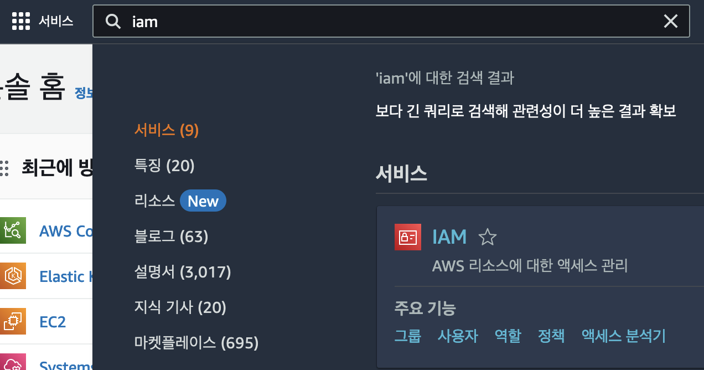</p>

좌측의 `엑세스 관리` > `사용자` > `사용자 생성`을 클릭합니다. 이어지는 단계에서 사용자 이름을 입력하고 다음으로 이동합니다.

<p align="center">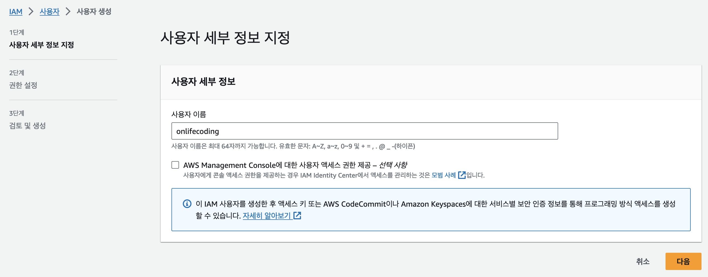</p>

우선 `사용자 그룹 생성`을 눌러 사용자 그룹의 이름을 설정하고 `권한 정책`에서는 일단 모든 AWS 리소스에 대한 권한을 가지는 `AdministratorAccess`를 선택하고 `사용자 그룹 생성`을 누릅니다.

<p align="center">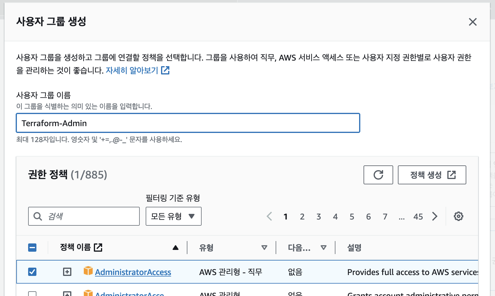</p>

> 전체 권한이 부여된 계정이 잘못 사용되면 큰 문제를 일으킬 수 있으므로 필요한 권한만을 부여하는 게 좋습니다. 필요한 만큼 권한을 부여하는 방법에 대해서는 추후 다시 설명하겠습니다.

사용자 그룹이 생성되면 다음과 같이 생성된 그룹을 선택하고 `다음`을 누릅니다.

<p align="center">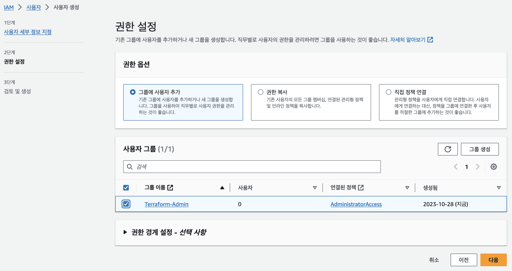</p>

그리고 마지막으로 `검토 및 생성`단계에서 사용자 정보를 확인하고 `사용자 생성`을 누릅니다. 이제 사용자 목록에서 생성된 사용자를 확인할 수 있습니다.

<p align="center">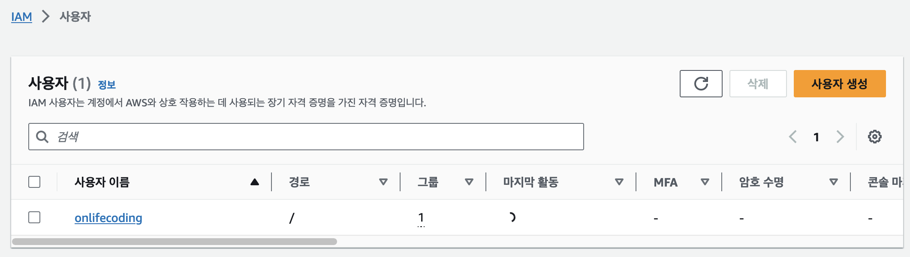</p>

사용자 이름을 눌러 세부 정보 페이지로 이동하고 우측 상단의 `액세스 키 만들기`를 클릭하고, 목록에서 `Command Line Interface(CLI)`를 선택하고 `다음`을 누릅니다.

<p align="center">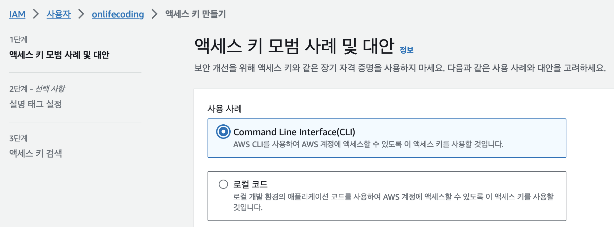</p>

`설명 태그 설정`에서 태그 이름을 작성(ex: Terraform-Access)하고 `액세스 키 만들기`를 누릅니다. 이제 액세스 키 ID와 비밀 액세스 키를 확인할 수 있습니다.

<p align="center">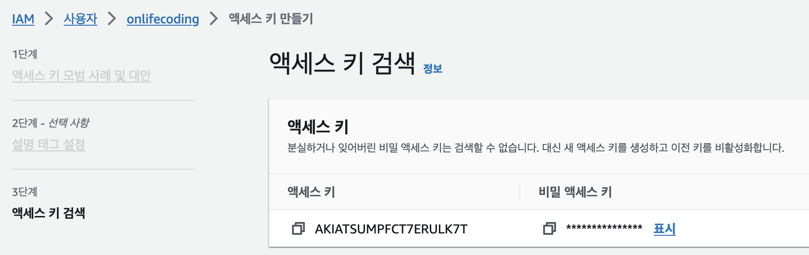</p>

비밀 액세스 키를 잃어버리면 다시 발급해야 하므로 잘 보관해두시기 바랍니다.

## Terraform 계정 정보 설정하기

앞서 Terraform이 사용할 계정을 생성하고 해당 계정의 액세스 키도 생성을 마쳤습니다. 이제 Terraform이 해당 계정을 사용할 수 있도록 환경 변수에 계정 정보를 설정해보겠습니다.

```bash
# zsh을 사용하는 경우
> vi ~/.zshrc

# bash를 사용하는 경우
> vi ~/.bashrc
```

그리고 다음과 같이 환경 변수를 설정합니다.

```bash
export AWS_ACCESS_KEY_ID={액세스 ID}
export AWS_SECRET_ACCESS_KEY={비밀 액세스 키}
```

> 참고로 vi로 파일을 열고 `i`를 누르면 편집 모드로 전환되고, `esc`를 누르면 편집 모드에서 빠져나올 수 있습니다. `:wq`를 입력하면 저장하고 빠져나올 수 있습니다.
> 그리고 환경 변수를 설정한 후에는 `source ~/.zshrc` 또는 `source ~/.bashrc`를 입력해서 환경 변수를 적용할 수 있습니다.

다음 명령어를 통해서 환경 변수가 잘 설정되었는지 확인할 수 있습니다.

```bash
> echo $AWS_ACCESS_KEY_ID
{액세스 ID}
```

## 첫 Terraform 코드 작성하기

이제 Terraform을 사용할 준비가 끝났습니다. 터미널을 열고 다음과 같이 작업할 공간을 생성합니다.

```bash
~/src
> mkdir how-to-terraform

~/src
> cd how-to-terraform

~/src/how-to-terraform
> code .
```

> 이 시리즈에서는 Visual Studio Code를 사용합니다.

에디터에서 `chapter01` 폴더를 생성하고 폴더 안에 `main.tf` 파일을 생성합니다. 그리고 다음과 같이 코드를 작성합니다.

```terraform
provider "aws" {
  // 아시아 태평양(서울) 리전
  region = "ap-northeast-2"
}

resource "aws_instance" "example" {
  // ap-northeast-2 리전의 Ubuntu 20.04 AMI
  ami           = "ami-0c6e5afdd23291f73"
  instance_type = "t2.micro"

  // 최초 인스턴스 생성 시에만 실행
  user_data = <<-EOF
              #!/bin/bash
              echo "Hello, World" > index.html
              nohup busybox httpd -f -p 8080 &
              EOF

  tags = {
    Name = "terraform-example"
  }
}
```

AWS에서 제공하는 프로바이더를 선언하였고, AWS의 ap-northeast-2(서울)리전을 대상으로 Terraform 코드를 실행하도록 설정하였습니다. 그리고 Ubuntu 20.04로 동작하는 EC2 인스턴스를 하나 생성하였습니다. 그리고 최초 인스턴스가 생성 될 때 `user_data`에 지정한 스크립트가 실행되면서 웹에서 접속하면 `Hello, World`를 출력하는 웹 서버가 실행되도록 설정하였습니다.

## Terraform 초기화 및 실행 계획 확인하기

`main.tf` 파일에 우클릭하고 `통합 터미널에서 열기`를 선택하여 `main.tf`파일이 위치한 경로에서 터미널을 실행합니다.

<p align="center">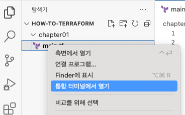</p>

그리고 다음과 같이 Terraform을 초기화합니다.

```bash
> tf init

Initializing the backend...

Initializing provider plugins...
- Finding latest version of hashicorp/aws...
- Installing hashicorp/aws v5.23.1...
- Installed hashicorp/aws v5.23.1 (signed by HashiCorp)

Terraform has created a lock file .terraform.lock.hcl to record the provider
selections it made above. Include this file in your version control repository
so that Terraform can guarantee to make the same selections by default when
you run "terraform init" in the future.

Terraform has been successfully initialized!

You may now begin working with Terraform. Try running "terraform plan" to see
any changes that are required for your infrastructure. All Terraform commands
should now work.

If you ever set or change modules or backend configuration for Terraform,
rerun this command to reinitialize your working directory. If you forget, other
commands will detect it and remind you to do so if necessary.
```

AWS 프로바이더 5.23.1 버전이 설치되었고, Terraform이 정상적으로 초기화 되었음을 알 수 있습니다. 그렇다면, 이제 Terraform 코드로 인프라가 어떻게 구성될지 미리 살펴볼까요?

```bash
> tf plan
Terraform used the selected providers to generate the following execution plan. Resource
actions are indicated with the following symbols:
  + create

Terraform will perform the following actions:

  # aws_instance.example will be created
  + resource "aws_instance" "example" {
      + ami                                  = "ami-0c6e5afdd23291f73"
      + arn                                  = (known after apply)
      + associate_public_ip_address          = (known after apply)
      + availability_zone                    = (known after apply)
      + cpu_core_count                       = (known after apply)
      + cpu_threads_per_core                 = (known after apply)
      + disable_api_stop                     = (known after apply)
      + disable_api_termination              = (known after apply)
      + ebs_optimized                        = (known after apply)
      + get_password_data                    = false
      + host_id                              = (known after apply)
      + host_resource_group_arn              = (known after apply)
      + iam_instance_profile                 = (known after apply)
      + id                                   = (known after apply)
      + instance_initiated_shutdown_behavior = (known after apply)
      + instance_lifecycle                   = (known after apply)
      + instance_state                       = (known after apply)
      + instance_type                        = "t2.micro"
      + ipv6_address_count                   = (known after apply)
      + ipv6_addresses                       = (known after apply)
      + key_name                             = (known after apply)
      + monitoring                           = (known after apply)
      + outpost_arn                          = (known after apply)
      + password_data                        = (known after apply)
      + placement_group                      = (known after apply)
      + placement_partition_number           = (known after apply)
      + primary_network_interface_id         = (known after apply)
      + private_dns                          = (known after apply)
      + private_ip                           = (known after apply)
      + public_dns                           = (known after apply)
      + public_ip                            = (known after apply)
      + secondary_private_ips                = (known after apply)
      + security_groups                      = (known after apply)
      + source_dest_check                    = true
      + spot_instance_request_id             = (known after apply)
      + subnet_id                            = (known after apply)
      + tags                                 = {
          + "Name" = "terraform-example"
        }
      + tags_all                             = {
          + "Name" = "terraform-example"
        }
      + tenancy                              = (known after apply)
      + user_data                            = "c765373c563b260626d113c4a56a46e8a8c5ca33"
      + user_data_base64                     = (known after apply)
      + user_data_replace_on_change          = false
      + vpc_security_group_ids               = (known after apply)
    }

Plan: 1 to add, 0 to change, 0 to destroy.

──────────────────────────────────────────────────────────────────────────────────────────────

Note: You didn't use the -out option to save this plan, so Terraform can't guarantee to take
exactly these actions if you run "terraform apply" now.
```

`tf plan`명령을 실행하면 Terraform이 현재 인프라의 상태와 코드에 정의된 인프라를 비교해서 어떻게 인프라에 반영할 것인지 미리 확인해볼 수 있습니다. 추가될 요소는 앞에 `+`가 붙고 삭제된 요소는 앞에 `-`가 붙습니다. 그리고 코드에서 지정해준 인스턴스의 ami, instance_type, user_data 등을 제외하면 모두 `known after apply`라고 표시되어 있습니다. 이런 정보는 인스턴스가 실제로 생성되고 나서 확인할 수 있다는 의미입니다.

이렇게 코드가 반영되면 어떻게 인프라가 변경될지 미리 상세하게 확인해볼 수 있구요, 맨 마지막 줄에는 요약 정보가 표시됩니다. 코드의 실행 게획을 미리 짜본 결과 1개의 리소스가 추가되고, 변경될 리소스는 0개, 삭제될 리소스 역시 0개라고 합니다. Terraform 코드를 처음 실행하는 거니까 당연한 결과겠죠?

## Terraform 코드 실행하기

실행 계획을 확인해보고 문제가 없으면 코드를 실행해서 인프라를 변경할 수 있습니다. 다음과 같이 `tf apply`를 입력하면 코드가 실행되고 인프라가 변경됩니다.

```bash
> tf apply
Terraform used the selected providers to generate the following execution plan. Resource
actions are indicated with the following symbols:
  + create

Terraform will perform the following actions:

  # aws_instance.example will be created
  + resource "aws_instance" "example" {
      + ami                                  = "ami-0c6e5afdd23291f73"
      + arn                                  = (known after apply)
      + associate_public_ip_address          = (known after apply)
      + availability_zone                    = (known after apply)
      + cpu_core_count                       = (known after apply)
      + cpu_threads_per_core                 = (known after apply)
      + disable_api_stop                     = (known after apply)
      + disable_api_termination              = (known after apply)
      + ebs_optimized                        = (known after apply)
      + get_password_data                    = false
      + host_id                              = (known after apply)
      + host_resource_group_arn              = (known after apply)
      + iam_instance_profile                 = (known after apply)
      + id                                   = (known after apply)
      + instance_initiated_shutdown_behavior = (known after apply)
      + instance_lifecycle                   = (known after apply)
      + instance_state                       = (known after apply)
      + instance_type                        = "t2.micro"
      + ipv6_address_count                   = (known after apply)
      + ipv6_addresses                       = (known after apply)
      + key_name                             = (known after apply)
      + monitoring                           = (known after apply)
      + outpost_arn                          = (known after apply)
      + password_data                        = (known after apply)
      + placement_group                      = (known after apply)
      + placement_partition_number           = (known after apply)
      + primary_network_interface_id         = (known after apply)
      + private_dns                          = (known after apply)
      + private_ip                           = (known after apply)
      + public_dns                           = (known after apply)
      + public_ip                            = (known after apply)
      + secondary_private_ips                = (known after apply)
      + security_groups                      = (known after apply)
      + source_dest_check                    = true
      + spot_instance_request_id             = (known after apply)
      + subnet_id                            = (known after apply)
      + tags                                 = {
          + "Name" = "terraform-example"
        }
      + tags_all                             = {
          + "Name" = "terraform-example"
        }
      + tenancy                              = (known after apply)
      + user_data                            = "c765373c563b260626d113c4a56a46e8a8c5ca33"
      + user_data_base64                     = (known after apply)
      + user_data_replace_on_change          = false
      + vpc_security_group_ids               = (known after apply)
    }

Plan: 1 to add, 0 to change, 0 to destroy.

Do you want to perform these actions?
  Terraform will perform the actions described above.
  Only 'yes' will be accepted to approve.

  Enter a value:
```

코드를 실행하면 앞서 확인한 것 처럼 실행 계획을 한 번 더 확인합니다. 그리고 정말 이 코드를 실행하려면 `yes`를 입력하라고 합니다. `yes`이외의 값을 입력하면 코드 실행이 취소됩니다.

```bash
aws_instance.example: Creating...
aws_instance.example: Still creating... [10s elapsed]
aws_instance.example: Still creating... [20s elapsed]
aws_instance.example: Creation complete after 22s [id=i-00229af6743e0ba4b]

Apply complete! Resources: 1 added, 0 changed, 0 destroyed.
```

> 참고로 실행 계획을 생성할 때, 실행 계획을 파일로 출력하여 코드를 실행할 때 실행 계획대로 바로 실행되도록 할 수도 있습니다. `tf plan -out plan.out`을 입력하면 실행 계획이 `plan.out` 파일로 저장되고, `tf apply plan.out`을 입력하면 `plan.out` 파일에 저장된 실행 계획대로 코드가 실행됩니다.

코드 실행 결과로 1개의 리소스가 생성되었습니다. 포털에서 EC2로 검색하여 EC2 포털로 들어가면 `인스턴스(실행 중)` 항목이 `1`인 걸 확인할 수 있으며, 해당 항목을 누르면 실행 중인 EC2를 확인할 수 있습니다.

<p align="center">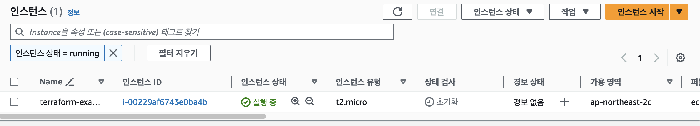</p>

인스턴스 ID를 눌러 상세 페이지로 들어가면 우측 상단에서 `퍼블릭 IPv4 주소`, `퍼블릭 IPv4 DNS` 등을 확인할 수 있지만, 해당 주소로 접속은 불가합니다.

`main.tf` 코드에 다음 항목을 추가해서 외부에서의 접속을 허용합니다.

```terraform
// AWS 프로바이더 설정
provider "aws" {
  // 아시아 태평양(서울) 리전
  region = "ap-northeast-2"
}

resource "aws_instance" "example" {
  // ap-northeast-2 리전의 Ubuntu 20.04 AMI
  ami           = "ami-0c6e5afdd23291f73"
  instance_type = "t2.micro"
  // 외부에서 접속을 허용하기 위한 설정
  vpc_security_group_ids = [aws_security_group.example.id]

  // 최초 인스턴스 생성 시에만 실행
  user_data = <<-EOF
              #!/bin/bash
              echo "Hello, World" > index.html
              nohup busybox httpd -f -p 8080 &
              EOF

  tags = {
    Name = "terraform-example"
  }
}

// 인바운드 규칙을 설정하기 위한 보안 그룹
resource "aws_security_group" "example" {
  name = "terraform-example"

  // 인바운드 규칙
  ingress {
    from_port   = 8080
    to_port     = 8080
    protocol    = "tcp"
    cidr_blocks = ["0.0.0.0/0"]
  }
}
```

다시 실행 계획을 확인해봅니다.

```bash
> tf plan
aws_instance.example: Refreshing state... [id=i-00229af6743e0ba4b]

Terraform used the selected providers to generate the following execution plan. Resource
actions are indicated with the following symbols:
  + create
  ~ update in-place

Terraform will perform the following actions:

  # aws_instance.example will be updated in-place
  ~ resource "aws_instance" "example" {
        id                                   = "i-00229af6743e0ba4b"
        tags                                 = {
            "Name" = "terraform-example"
        }
      ~ vpc_security_group_ids               = [
          - "sg-0908fdbf1d8c6156e",
        ] -> (known after apply)
        # (31 unchanged attributes hidden)

        # (8 unchanged blocks hidden)
    }

  # aws_security_group.example will be created
  + resource "aws_security_group" "example" {
      + arn                    = (known after apply)
      + description            = "Managed by Terraform"
      + egress                 = (known after apply)
      + id                     = (known after apply)
      + ingress                = [
          + {
              + cidr_blocks      = [
                  + "0.0.0.0/0",
                ]
              + description      = ""
              + from_port        = 8080
              + ipv6_cidr_blocks = []
              + prefix_list_ids  = []
              + protocol         = "tcp"
              + security_groups  = []
              + self             = false
              + to_port          = 8080
            },
        ]
      + name                   = "terraform-example"
      + name_prefix            = (known after apply)
      + owner_id               = (known after apply)
      + revoke_rules_on_delete = false
      + tags_all               = (known after apply)
      + vpc_id                 = (known after apply)
    }

Plan: 1 to add, 1 to change, 0 to destroy.

──────────────────────────────────────────────────────────────────────────────────────────────

Note: You didn't use the -out option to save this plan, so Terraform can't guarantee to take
exactly these actions if you run "terraform apply" now.
```

새로운 리소스(시큐리티 그룹)이 추가되고 시큐리티 그룹을 통해 외부에서의 접속을 허용하도록 EC2 인스턴스가 변경되는 것을 확인할 수 있습니다. 이제 코드를 실행합니다.

```bash
> tf apply
...
aws_security_group.example: Creating...
aws_security_group.example: Creation complete after 1s [id=sg-057069d47b3e7f650]
aws_instance.example: Modifying... [id=i-00229af6743e0ba4b]
aws_instance.example: Modifications complete after 2s [id=i-00229af6743e0ba4b]

Apply complete! Resources: 1 added, 1 changed, 0 destroyed.
```

이제 다시 `퍼블릭 IPv4 주소`, `퍼블릭 IPv4 DNS`를 통해 8080번 포트로 접속하면 `Hello, World`를 확인할 수 있습니다.

<p align="center">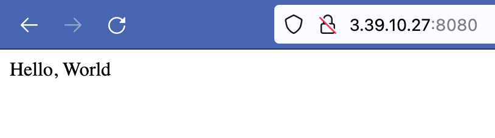</p>

## 리소스 삭제하기

Terraform 코드로 생성된 리소스는 `destroy` 명령어로 일괄 삭제할 수 있다.

```bash
> tf destroy
aws_security_group.example: Refreshing state... [id=sg-057069d47b3e7f650]
aws_instance.example: Refreshing state... [id=i-00229af6743e0ba4b]

Terraform used the selected providers to generate the following execution plan. Resource
actions are indicated with the following symbols:
  - destroy

Terraform will perform the following actions:

  # aws_instance.example will be destroyed
  - resource "aws_instance" "example" {
      - ami                                  = "ami-0c6e5afdd23291f73" -> null
      - arn                                  = "arn:aws:ec2:ap-northeast-2:246181472423:instance/i-00229af6743e0ba4b" -> null
      - associate_public_ip_address          = true -> null
      - availability_zone                    = "ap-northeast-2c" -> null
      - cpu_core_count                       = 1 -> null
      - cpu_threads_per_core                 = 1 -> null
      - disable_api_stop                     = false -> null
      - disable_api_termination              = false -> null
      - ebs_optimized                        = false -> null
      - get_password_data                    = false -> null
      - hibernation                          = false -> null
      - id                                   = "i-00229af6743e0ba4b" -> null
      - instance_initiated_shutdown_behavior = "stop" -> null
      - instance_state                       = "running" -> null
      - instance_type                        = "t2.micro" -> null
      - ipv6_address_count                   = 0 -> null
      - ipv6_addresses                       = [] -> null
      - monitoring                           = false -> null
      - placement_partition_number           = 0 -> null
      - primary_network_interface_id         = "eni-06474393b32e2d8fc" -> null
      - private_dns                          = "ip-172-31-45-210.ap-northeast-2.compute.internal" -> null
      - private_ip                           = "172.31.45.210" -> null
      - public_dns                           = "ec2-3-39-10-27.ap-northeast-2.compute.amazonaws.com" -> null
      - public_ip                            = "3.39.10.27" -> null
      - secondary_private_ips                = [] -> null
      - security_groups                      = [
          - "terraform-example",
        ] -> null
      - source_dest_check                    = true -> null
      - subnet_id                            = "subnet-03d036291a1b8a65a" -> null
      - tags                                 = {
          - "Name" = "terraform-example"
        } -> null
      - tags_all                             = {
          - "Name" = "terraform-example"
        } -> null
      - tenancy                              = "default" -> null
      - user_data                            = "c765373c563b260626d113c4a56a46e8a8c5ca33" -> null
      - user_data_replace_on_change          = false -> null
      - vpc_security_group_ids               = [
          - "sg-057069d47b3e7f650",
        ] -> null

      - capacity_reservation_specification {
          - capacity_reservation_preference = "open" -> null
        }

      - cpu_options {
          - core_count       = 1 -> null
          - threads_per_core = 1 -> null
        }

      - credit_specification {
          - cpu_credits = "standard" -> null
        }

      - enclave_options {
          - enabled = false -> null
        }

      - maintenance_options {
          - auto_recovery = "default" -> null
        }

      - metadata_options {
          - http_endpoint               = "enabled" -> null
          - http_protocol_ipv6          = "disabled" -> null
          - http_put_response_hop_limit = 1 -> null
          - http_tokens                 = "optional" -> null
          - instance_metadata_tags      = "disabled" -> null
        }

      - private_dns_name_options {
          - enable_resource_name_dns_a_record    = false -> null
          - enable_resource_name_dns_aaaa_record = false -> null
          - hostname_type                        = "ip-name" -> null
        }

      - root_block_device {
          - delete_on_termination = true -> null
          - device_name           = "/dev/sda1" -> null
          - encrypted             = false -> null
          - iops                  = 100 -> null
          - tags                  = {} -> null
          - throughput            = 0 -> null
          - volume_id             = "vol-0f74f2dbc1d7880c1" -> null
          - volume_size           = 8 -> null
          - volume_type           = "gp2" -> null
        }
    }

  # aws_security_group.example will be destroyed
  - resource "aws_security_group" "example" {
      - arn                    = "arn:aws:ec2:ap-northeast-2:246181472423:security-group/sg-057069d47b3e7f650" -> null
      - description            = "Managed by Terraform" -> null
      - egress                 = [] -> null
      - id                     = "sg-057069d47b3e7f650" -> null
      - ingress                = [
          - {
              - cidr_blocks      = [
                  - "0.0.0.0/0",
                ]
              - description      = ""
              - from_port        = 8080
              - ipv6_cidr_blocks = []
              - prefix_list_ids  = []
              - protocol         = "tcp"
              - security_groups  = []
              - self             = false
              - to_port          = 8080
            },
        ] -> null
      - name                   = "terraform-example" -> null
      - owner_id               = "246181472423" -> null
      - revoke_rules_on_delete = false -> null
      - tags                   = {} -> null
      - tags_all               = {} -> null
      - vpc_id                 = "vpc-089687c07f7572271" -> null
    }

Plan: 0 to add, 0 to change, 2 to destroy.

Do you really want to destroy all resources?
  Terraform will destroy all your managed infrastructure, as shown above.
  There is no undo. Only 'yes' will be accepted to confirm.

  Enter a value: yes

aws_instance.example: Destroying... [id=i-00229af6743e0ba4b]
aws_instance.example: Still destroying... [id=i-00229af6743e0ba4b, 10s elapsed]
aws_instance.example: Still destroying... [id=i-00229af6743e0ba4b, 20s elapsed]
aws_instance.example: Destruction complete after 30s
aws_security_group.example: Destroying... [id=sg-057069d47b3e7f650]
aws_security_group.example: Destruction complete after 0s

Destroy complete! Resources: 2 destroyed.
```

> 만약 특정한 리소스만 삭제하고 싶다면 `tf destroy -target {리소스 타입}.{리소스 이름}`을 입력하면 됩니다.
> 리소스 이름을 어떻게 확인하냐구요? 좋은 질문입니다! 리소스 이름은 `tf state list`를 입력하면 확인할 수 있습니다!

## IAM 권한 제한하기

IAM에 딱 필요한 권한 허용하려면, 우선 어떤 권한이 필요한지 알아야 합니다. 그런데.... 그걸 어떻게 알 수 있을까요??

여기서 [iamlive](https://github.com/iann0036/iamlive)이 등장할 차례입니다!

설명보다는 iamlive 사이트에서 제공하는 예시를 한 번 보시죠.

<br />

감이 오시나요?

aws를 대상으로 뭔가 작업을 진행할 때, 그 작업에서 요구되는 IAM을 바로 확인할 수 있게 해줍니다!

### iamlive 설정하기

iamlive는 homebrew등으로 직접 설치할 수도 있지만, 설치하지 않고 [docker를 이용하는 방법](https://meirg.co.il/2021/04/23/determining-aws-iam-policies-according-to-terraform-and-aws-cli/)도 있습니다.

여기서는 docker를 통해 iamlive를 실행하겠습니다. 우선, docker로 해당 이미지를 실행합니다.

```bash
> docker run \
  -p 80:10080 \
  -p 443:10080 \
  --name iamlive-test \
  -it unfor19/iamlive-docker \
  --mode proxy \
  --bind-addr 0.0.0.0:10080 \
  --force-wildcard-resource \
  --output-file "/app/iamlive.log"
```

처음 실행 하는 거기 때문에 이미지를 다운로드 받고 실행이 됩니다. 실행이 됐을 때 별도로 메세지가 표시되지는 않기 때문에 에러 없이 대기 상태에 있다면 정상적으로 실행된 것입니다.

> 만약 iamlive 컨테이너를 실행 중에 ctrl+c를 눌러서 종료하면, 다음에 실행하고 싶을 때 `docker start iamlive-test`를 입력하면 됩니다. 그리고 `docker attach iamlive-test`를 입력하면 실행 중인 컨테이너에 접속할 수 있습니다.

이제 별도로 터미널을 한 개 더 열고 다음 명령어를 실행합니다.

```bash
> docker cp iamlive-test:/home/appuser/.iamlive ~/
```

proxy 모드로 실행되는 iamlive에 접속하기 위한 키 파일을 프로필 루트 디렉토리로 복사했습니다. 다음 명령을 통해서 제대로 복사되었는지 확인할 수 있습니다.

```bash
> ls ./.iamlive
ca.key ca.pem
```

### iamlive을 통해 권한 확인하기

원문에서 권장하는 방법은 권한이 하나도 없는 사용자를 만들고, 계속 명령어를 실행하면서 꼭 필요한 권한만 하나씩 복사하는 방식입니다. 그런데 이렇게 하면 필요한 권한이 많은 수록 여러번 명령을 반복적으로 실행하면서 권한을 하나씩 확인하고, 하나씩 추가해야 합니다. 꽤나 번거로운 작업이죠. 그래서 저는 그냥 어드민 권한이 있는 계정으로 테스트해서 전체 권한을 확인하고, 필요한 권한을 한 번에 할당하는 방식으로 진행하겠습니다.

앞서 작성한 코드를 대상으로 `terraform apply`를 실행하여 인프라를 배포합니다. 그리고 iamlive가 실행 중인 터미널을 잘 살펴보세요. 그러면 뭐가 막 지나가는 데 마지막 줄이 핵심입니다. 마지막 줄에는 다음과 같은 권한이 표시됩니다.

```bash
{
  "Version": "2012-10-17",
  "Statement": [
    {
      "Effect": "Allow",
      "Action": [
        "sts:GetCallerIdentity",
        "ec2:CreateSecurityGroup",
        "ec2:DescribeSecurityGroups",
        "ec2:DescribeNetworkInterfaces",
        "ec2:DeleteSecurityGroup",
        "ec2:RevokeSecurityGroupEgress",
        "ec2:AuthorizeSecurityGroupIngress",
        "ec2:RunInstances",
        "ec2:DescribeInstances",
        "ec2:DescribeInstanceTypes",
        "ec2:DescribeTags",
        "ec2:DescribeVpcs",
        "ec2:DescribeInstanceAttribute",
        "ec2:DescribeVolumes",
        "ec2:DescribeInstanceCreditSpecifications"
      ],
      "Resource": "*"
    }
  ]
}
```

즉, 현재까지 작성된 terraform 코드를 실행해서 인프라를 구성하기 위해서는 이런 권한이 모두 필요하다는 거죠! 그럼 `tf destroy`도 바로 이어서 한 번 해볼까요? 그러면 최종적으로 이런 권한이 필요하다고 합니다.

```bash
{
  "Version": "2012-10-17",
  "Statement": [
    {
      "Effect": "Allow",
      "Action": [
        "sts:GetCallerIdentity",
        "ec2:CreateSecurityGroup",
        "ec2:DescribeSecurityGroups",
        "ec2:DescribeNetworkInterfaces",
        "ec2:DeleteSecurityGroup",
        "ec2:RevokeSecurityGroupEgress",
        "ec2:AuthorizeSecurityGroupIngress",
        "ec2:RunInstances",
        "ec2:DescribeInstances",
        "ec2:DescribeInstanceTypes",
        "ec2:DescribeTags",
        "ec2:DescribeVpcs",
        "ec2:DescribeInstanceAttribute",
        "ec2:DescribeVolumes",
        "ec2:DescribeInstanceCreditSpecifications",
        "ec2:ModifyInstanceAttribute",
        "ec2:TerminateInstances"
      ],
      "Resource": "*"
    }
  ]
}
```

> 이렇게 이쁘게 표시되지는 않습니다만... [JSON Formatter](https://jsonformatter.org/json-pretty-print)등의 사이트를 통해 이쁘게 변환하시면 됩니다!

네, 그럼 새로운 사용자를 만들어서 이 권한을 부여하겠습니다. 앞서 계정을 생성했던 것과 동일한 절차로 사용자 계정을 새로 생성합니다. 사용자 이름과 그룹 이름은 `terraform-user`로 설정하고, `그룹에는 아무런 권한을 주지 않습니다!`

`다시 한번 말씀드리면 그룹에는 아무런 권한을 주지 마세요!`

> 혹시 잊으실까봐 그러는데, 액세스 키와 비밀 액세스 키는 따로 저장해두셔야 합니다.

자 그럼 그룹 설정에서 `권한`탭을 확인합니다. 현재 아무런 권한이 없는데요, 여기서 `권한 추가` -> `인라인 정책 생성`을 선택합니다.

<p align="center">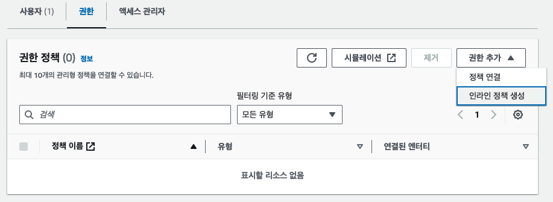</p>

그리고 `권한 지정` 페이지에서 `JSON`탭을 선택하고, 앞서 iamlive에서 확인한 권한을 복사해서 붙여넣습니다.

<p align="center">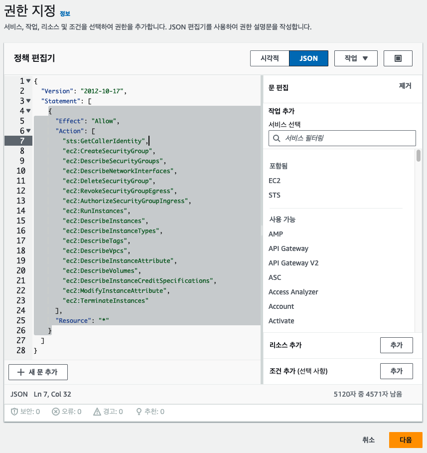</p>

그리고 `다음`을 선택하고,

<p align="center">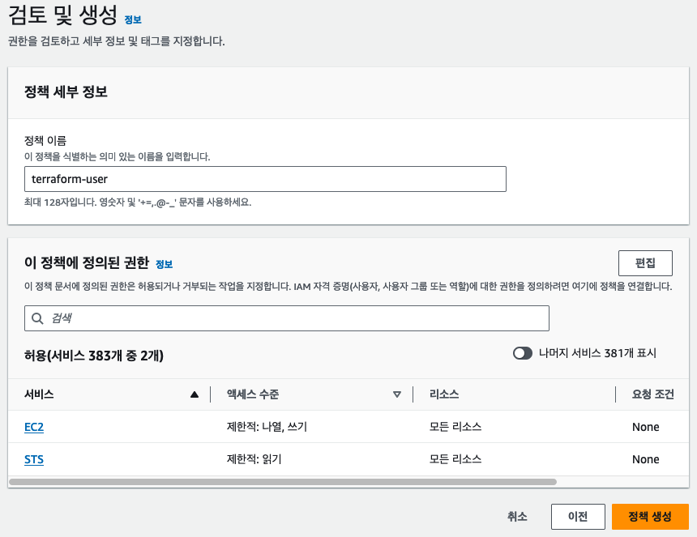</p>

`정책 이름`을 `terraform-user`로 설정하고, `정책 생성`을 선택합니다. `정책 생성` 또는 `변경 사항 저장`(수정할 때)을 꼭 눌러주셔야만 반영됩니다.

자 그러면 새로 만든 유저로 동일한 코드를 실행해볼까요?

설정 파일(~/.zshrc)을 열어서 다음 내용을 새 유저의 액세스 키와 비밀 액세스 키로 변경합니다.

```bash
# 기존 유저 액세스 키
# export AWS_ACCESS_KEY_ID=...
# export AWS_SECRET_ACCESS_KEY=...
# 새 유저 액세스 키
export AWS_ACCESS_KEY_ID=...
export AWS_SECRET_ACCESS_KEY=...
```

그리고 변경된 설정 파일을 꼭 적용해주셔야 합니다.

```bash
> source ~/.zshrc
```

자 그리고 다시 apply 해봅시다!

```bash
> tf apply
...
aws_instance.example: Creating...
╷
│ Error: creating EC2 Instance: UnauthorizedOperation: You are not authorized to perform this operation. User: arn:aws:iam::246181472423:user/terraform-user is not authorized to perform: ec2:CreateTags on resource: arn:aws:ec2:ap-northeast-2:246181472423:instance/* because no identity-based policy allows the ec2:CreateTags action. Encoded authorization failure message: -Ebof-TaMnw5iPJ_dVKP00sOBTScilmv_M3-TgALYm6r48Fi4oAIxOOMWghh0LZkPXrH1yqS5XIR9dsIgCLrHl2lua-CgXDXXWc0uq-QBmKupfCnhtGx2Sdu0-IqDwlImA5bmNOIlktmOj0WUUak8G4OtphB2zL0Yi7WnfDAruVd_CHJdYrkTEIW1are7RDvgX753V5h96s9_8zn7A8KVR479FT5qLrMy3lFAN1sfauVatYkbl8EztWa9qBC7zQ7goAq682lc-A0IbGrgQ3whJMqGaLwvK3Q5kL7QyvkJ-VXe5dq58YpZnMlvsc5uH76QVKiie_tdjMy28xpQ2EmRI3nqa9-1uvGIO6-1MKhwBbAeHQdz7kgmcp2aTI2BjBurhyDxQKWUKJqQCrY7-FTx4d2xdxyBaDM-LCujL2O-oFx2NBNYYBsRKO1E22gxcSakpwNqjg8omJ8-7X-8JhBGebfT6WM4ociL1T8OxIr6JG8dEnJWRzma4feKGZVCmkLxJbHPQW0IPF3FGtGbTFyir9YALbQDPX9yUwz4_w09slZdG7y-8aWBrlrCHccmcOmm8hpsthiNJbgtjTPxjZdHNWglMiUJ8PmiazOK04QcBLv5N71icCWdogluVBsCxmehFnPNWYq3BzWSdEhLtdQIK5sokmMEY2KFsJQ32cnBg
│       status code: 403, request id: 88a0f4a9-c313-47b6-9677-7862747f9fb9
│
│   with aws_instance.example,
│   on main.tf line 7, in resource "aws_instance" "example":
│    7: resource "aws_instance" "example" {
```

그런데 오류가 발생하네요..! iamlive가 `ec2:CreateTags` 권한을 제대로 캐치를 하지 못해서 그렇습니다. 이 권한을 계정에 추가해주고 다시 확인해보면 생성과 삭제 모두 문제 없이 진행되는 걸 확인할 수 있습니다. 물론 저 권한을 하나씩 확인하면서 추가했다면 꽤나 복잡했겠죠? 그러다가 `아 ** 안해`하게 됩니다. 하하하하하....개발이 다 그렇죠 뭐...

## 참고자료

- [https://github.com/iann0036/iamlive](https://github.com/iann0036/iamlive)
- [Determining AWS IAM Policies According To Terraform And AWS CLI](https://meirg.co.il/2021/04/23/determining-aws-iam-policies-according-to-terraform-and-aws-cli/)
- [Terraform Up and Running, 3rd Edition](https://www.terraformupandrunning.com/)

# License

[저작자표시-비영리-변경금지 2.0 대한민국 (CC BY-NC-ND 2.0 KR)](https://creativecommons.org/licenses/by-nc-nd/2.0/kr/)
