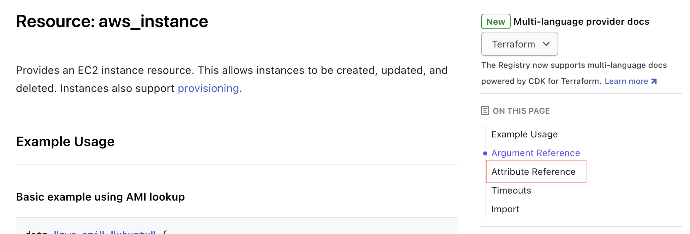
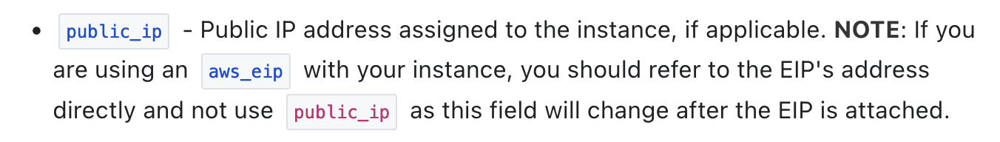

# How to Terraform(2) - 변수와 출력

## 이전 글 복습

이전 글에서 작성한 코드를 다시 한 번 볼까요?

```terraform
// AWS 프로바이더 설정
provider "aws" {
  // 아시아 태평양(서울) 리전
  region = "ap-northeast-2"
}

resource "aws_instance" "example" {
  // ap-northeast-2 리전의 Ubuntu 20.04 AMI
  ami           = "ami-0c6e5afdd23291f73"
  instance_type = "t2.micro"
  vpc_security_group_ids = [aws_security_group.example.id]

  // 최초 인스턴스 생성 시에만 실행
  user_data = <<-EOF
              #!/bin/bash
              echo "Hello, World" > index.html
              nohup busybox httpd -f -p 8080 &
              EOF

  tags = {
    Name = "terraform-example"
  }
}

resource "aws_security_group" "example" {
  name = "terraform-example"

  // 인바운드 규칙
  ingress {
    from_port   = 8080
    to_port     = 8080
    protocol    = "tcp"
    cidr_blocks = ["0.0.0.0/0"]
  }
}
```

위 코드에는 몇 가지 개선할 점이 있습니다. 만약 EC2 인스턴스를 몇 개 더 만든다고 했을 때 중복될 만한 부분이 있습니다. AMI ID나 인스턴스 타입 등이 그렇죠. 이렇게 중복될 만한 내용은 변수로 선언하여 중복을 줄일 수 있고, 중복을 줄이면 실수를 줄일 수 있습니다. 또한 EC2 인스턴스에 접근할 수 있는 IP를 AWS 콘솔에서 확인하는 번거로움이 있었습니다. 이 또한 출력을 통해 확인할 수 있습니다. 자 그럼 하나씩 해봅시다!

## 변수

가장 먼저 AMI ID 부터 변수를 선언해볼까요? `main.tf` 파일이 있는 위치에 `variables.tf` 파일을 만들고 아래와 같이 작성해봅시다.

```terraform
variable "ami_id" {
  type = string
  default = "ami-0c6e5afdd23291f73"
}
```

변수의 이름은 `ami_id`이고, 타입은 `string`입니다. 그리고 `default`에는 별도로 값이 주어지지 않는 경우 사용할 기본값을 설정합니다. 이제 `main.tf` 파일에서 `ami` 속성을 변수를 통해 입력받도록 변경합니다.

```terraform
resource "aws_instance" "example" {
  ami           = var.ami_id # 변수 ami_id 참조
  instance_type = "t2.micro"
  vpc_security_group_ids = [aws_security_group.example.id]

  ...
}
```

> VS Code를 사용하신다면 Terraform Extension for Visual Studio Code를 꼭 설치하세요! 선언된 변수나 리소스에 대해서 자동완성 기능과 오류 등을 미리 확인할 수 있게 도와줍니다!

기존에 직접 값을 지정했던 ami 속성에 변수 ami_id를 참조하도록 변경했습니다. `tf plan`을 통해 스크립트에 이상이 없는지 확인합니다. 참고로 지난 시간에 만든 EC2 인스턴스는 `tf destroy`를 통해 삭제되었다고 가정하겠습니다.

```bash
> tf plan

Terraform used the selected providers to generate the following execution plan. Resource actions are indicated with the following
symbols:
  + create

Terraform will perform the following actions:

  # aws_instance.example will be created
  + resource "aws_instance" "example" {
      + ami                                  = "ami-0c6e5afdd23291f73"
      ...
    }

  # aws_security_group.example will be created
  + resource "aws_security_group" "example" {
      ...
    }

Plan: 2 to add, 0 to change, 0 to destroy.

───────────────────────────────────────────────────────────────────────────────────────────────────────────────────────────────────

Note: You didn't use the -out option to save this plan, so Terraform can't guarantee to take exactly these actions if you run
"terraform apply" now.
```

ami 속성이 변수에 설정된 기본값으로 설정된 걸 확인할 수 있습니다. 그렇다면 기본값 대신에 변수에 값을 넘겨볼까요?

### 커맨드로 변수 지정하기

`tf plan` 또는 `tf apply`를 실행할 때 `-var` 옵션을 사용하면 변수에 값을 넘길 수 있습니다. `-var` 옵션은 변수의 개수 만큼 여러 번 사용할 수 있습니다.

```bash
> tf plan -var "ami_id=ami-09eb4311cbaecf89d"
...
  # aws_instance.example will be created
  + resource "aws_instance" "example" {
      + ami                                  = "ami-09eb4311cbaecf89d"
      ...
    }
```

### 파일로 변수 지정하기

이번에는 `terraform.tfvars` 파일을 통해 변수에 값을 지정해보겠습니다. `terraform.tfvars` 파일을 만들고 아래와 같이 작성해봅시다.

```terraform
ami_id = "ami-09eb4311cbaecf89d"
```

그리고 `tf plan`을 실행하면, 동일한 결과를 확인할 수 있습니다.

```bash
> tf plan
...
  # aws_instance.example will be created
  + resource "aws_instance" "example" {
      + ami                                  = "ami-09eb4311cbaecf89d"
      ...
    }
```

파일 이름이 `terraform.tfvars` 또는 `terraform.tfvars.json`(json 형태로 작성가능)이거나, 파일 이름이 `.auto.tfvars` 또는 `.auto.tfvars.json`으로 끝나는 경우, Terraform 코드가 실행 될 때 자동으로 파일을 읽어서 변수에 값을 지정합니다. 만약 파일 이름 앞서 설명드린 규칙과 다르다면, 파일 이름을 `-var-file` 옵션을 사용하여 파일을 지정할 수 있습니다.

한 가지 주의 할 점은 `terraform.tfvars` 파일을 사용하는 경우, 반드시 .gitignore에 terraform.tfvars를 추가해야 합니다! 참고로 [gitignore.io](https://www.toptal.com/developers/gitignore/)를 통해 Terraform의 .gitignore 파일을 생성해보면 다음과 같습니다.

```gitignore
# Created by https://www.toptal.com/developers/gitignore/api/terraform
# Edit at https://www.toptal.com/developers/gitignore?templates=terraform

### Terraform ###
# Local .terraform directories
**/.terraform/*

# .tfstate files
*.tfstate
*.tfstate.*

# Crash log files
crash.log
crash.*.log

# Exclude all .tfvars files, which are likely to contain sensitive data, such as
# password, private keys, and other secrets. These should not be part of version
# control as they are data points which are potentially sensitive and subject
# to change depending on the environment.
*.tfvars
*.tfvars.json

# Ignore override files as they are usually used to override resources locally and so
# are not checked in
override.tf
override.tf.json
*_override.tf
*_override.tf.json

# Include override files you do wish to add to version control using negated pattern
# !example_override.tf

# Include tfplan files to ignore the plan output of command: terraform plan -out=tfplan
# example: *tfplan*

# Ignore CLI configuration files
.terraformrc
terraform.rc

# End of https://www.toptal.com/developers/gitignore/api/terraform
```

### 환경변수로 변수 지정하기

마지막으로는 환경변수를 지정하는 방법이 있습니다. `TF_VAR_`로 시작해서 변수 이름을 적어주면 됩니다. `~/.zshrc`등에 환경변수를 적어도 되지만 일단은 확인을 위해 인라인으로 환경변수를 지정해서 `tf plan`을 실행해보겠습니다.

```bash
> TF_VAR_ami_id=ami-09eb4311cbaecf89d tf plan
...
  # aws_instance.example will be created
  + resource "aws_instance" "example" {
      + ami                                  = "ami-09eb4311cbaecf89d"
      ...
    }
```

## 변수 작업을 더 해보자

이제 변수를 사용하는 방법을 알았으니 나머지 값들도 변수로 변경하겠습니다.

우선 변수를 선언합니다.

```terraform
variable "ami_id" {
  type = string
  default = "ami-0c6e5afdd23291f73"
}

variable "instance_type" {
  type = string
  default = "t2.micro"
}

variable "port" {
  type = number
}

variable "cidr_blocks" {
  type = list(string)
  default = ["0.0.0.0/0"]
}
```

그리고 이 변수를 사용하도록 코드를 변경합니다.

```terraform
resource "aws_instance" "example" {
  // ap-northeast-2 리전의 Ubuntu 20.04 AMI
  ami           = var.ami_id # 변수 ami_id 참조
  instance_type = var.instance_type
  vpc_security_group_ids = [aws_security_group.example.id]

  // 최초 인스턴스 생성 시에만 실행
  user_data = <<-EOF
              #!/bin/bash
              echo "Hello, World" > index.html
              nohup busybox httpd -f -p ${var.port} &
              EOF

  tags = {
    Name = "terraform-example"
  }
}

resource "aws_security_group" "example" {
  name = "terraform-example"

  // 인바운드 규칙
  ingress {
    from_port   = var.port
    to_port     = var.port
    protocol    = "tcp"
    cidr_blocks = var.cidr_blocks
  }
}
```

그리고 `terraform.tfvars` 파일을 사용해서 변수를 지정합니다.

```terraform
ami_id = "ami-09eb4311cbaecf89d"
port = 8080
```

마지막으로 `tf plan`을 실행해서 변수가 잘 작동하는지 확인합니다.

## 다음은 출력

현재 작성 중인 코드에는 외부에서 EC2 인스턴스에 접근할 수 있는 IP를 확인할 수 있는 방법이 없고, AWS 콘솔에 접속해서 생성된 EC2 인스턴스를 찾아가야만 합니다. 이제 출력값을 설정해서 생성된 EC2 인스턴스의 IP를 확인해 보겠습니다.

`outputs.tf` 파일을 만들고 아래와 같이 작성합니다.

```terraform
output "public_ip" {
  value = aws_instance.example.public_ip
  sensitive = false
}
```

그리고 `tf plan`을 실행합니다. 그리고 마지막에 출력되는 내용을 잘 보세요!

```bash
> tf plan
...
Plan: 2 to add, 0 to change, 0 to destroy.

Changes to Outputs:
  + public_ip = (known after apply)

...
```

출력값이 추가되었다는 걸 알려주죠? 이 출력값은 EC2 인스턴스가 실제로 만들어진 다음에 확인할 수 있기 때문에 `known after apply`라고 표시되었습니다. 이제 `tf apply`를 실행해봅시다.

```bash
> tf apply
...
Apply complete! Resources: 2 added, 0 changed, 0 destroyed.

Outputs:

public_ip = "13.209.17.62"
```

약 1-2분 뒤에 해당 IP의 지정된 포트(기본 값은 8080으로 설정했었죠?)로 접속하면 `Hello, World`가 출력되는 걸 확인할 수 있습니다.

그런데 이런 출력 값이 있다는 건 어디서 알 수 있는 걸까요? [EC2 인스턴스의 공식 문서](https://registry.terraform.io/providers/hashicorp/aws/latest/docs/resources/instance)를 확인해볼까요?

이 문서에는 EC2 인스턴스를 Terraform으로 관리할 때 사용할 수 있는 속성들이 아주 많이, 상세하게 정리되어 있습니다. 여기서 우리가 주목해야 할 곳은 문서 우측 상단의 `ON THIS PAGE` 영역의 `Attribute Reference`입니다.

<p align="center"></p>

이 영역에는 생성된 EC2 인스턴스를 통해 확인할 수 있는 속성들이 정리되어 있습니다. `public_ip`를 찾아볼까요?

<p align="center"></p>

이렇게 필요한 속성을 찾아서 활용하면 됩니다. 물론... 보시면 알겠지만 속성이 좀 많습니다. 뭐 하다보면 하나씩 눈에 보이는 거죠 하하하하하...

## 내친 김에 SSH 키도 설정해보자

이번에는 EC2 인스턴스에 접속할 때 SSH 키를 사용하도록 설정해보겠습니다. 먼저 `main.tf`에서 SSH 키를 생성 및 설정합니다.

```terraform
...

resource "aws_instance" "example" {
  ...

  key_name = aws_key_pair.ssh.key_name # ssh 키 이름 참조

  tags = {
    Name = "terraform-example"
  }
}

resource "aws_security_group" "example" {
  ...

  // ssh 접속을 위한 인바운드 규칙
  ingress {
    from_port   = 22
    to_port     = 22
    protocol    = "tcp"
    cidr_blocks = var.cidr_blocks
  }
}

# ssh 키 쌍(pair) 생성
resource "tls_private_key" "ssh" {
  algorithm = "RSA"
  rsa_bits  = 4096
}

# ssh 키 쌍(pair) 리소스
resource "aws_key_pair" "ssh" {
  key_name   = "terraform-example"
  public_key = tls_private_key.ssh.public_key_openssh
}
```

그리고 `outputs.tf`에 SSH 키를 출력하도록 설정합니다.

```terraform
output "tls_private_key" {
  value     = tls_private_key.ssh.private_key_pem
  sensitive = true # 민감한 정보이므로 출력하지 않음
}
```

`tls_private_key` 리소스는 hashicorp/tls 프로바이더를 통해 제공되므로 `tf init`을 통해 프로바이더를 설치합니다.

```bash
> tf init
Initializing the backend...

Initializing provider plugins...
...
- Installing hashicorp/tls v4.0.4...
- Installed hashicorp/tls v4.0.4 (signed by HashiCorp)

...

Terraform has been successfully initialized!
```

그리고 `tf plan`으로 이상이 없는지 확인합니다.

```bash
> tf plan
...
Plan: 3 to add, 0 to change, 0 to destroy.

Changes to Outputs:
  + public_ip       = (known after apply)
  + tls_private_key = (sensitive value)
...
```

이제 `tf apply`를 실행합니다. 그런데 만약 이전 글의 내용을 따라 오면서 제한된 IAM이 설정된 계정을 사용하신다면 이런 에러가 발생합니다.

```bash
> tf apply
...
│ Error: importing EC2 Key Pair (terraform-example): UnauthorizedOperation: You are not authorized to perform this operation. User: arn:aws:iam::246181472423:user/terraform-user is not authorized to perform: ec2:ImportKeyPair on resource:
...
```

이 작업을 위해서는 여기서 에러가 발생한 `ec2:ImportKeyPair`, 그리고 `ec2:DescribeKeyPairs`, `ec2:DeleteKeyPair` 권한이 필요합니다. 이 권한을 추가해줍시다. 권한을 추가하고 다시 `tf apply`를 실행합니다.

```bash
> tf apply
...
Apply complete! Resources: 2 added, 0 changed, 1 destroyed.

Outputs:

public_ip = "15.164.214.233"
tls_private_key = <sensitive>
```

`tls_private_key`는 민감한 정보를 의미하는 `sensitive = true`로 설정되었으므로 터미널을 통해서는 확인할 수 없습니다. 하지만 EC2에 접속하려면 ssh 파일이 필요하죠? Terraform의 상태로 부터 이 파일을 생성합니다.

```bash
> tf output tls_private_key > ~/.ssh/ec2_example.pem
> chmod 400 ~/.ssh/ec2_example.pem # 권한 설정
```

그리고 생성된 파일을 통해 EC2에 접속해봅시다. 그리고 접속이 확인되면 `exit`을 통해 접속을 종료합니다.

```bash
> ssh -i ~/.ssh/ec2_example.pem ubuntu@15.164.214.233
Welcome to Ubuntu 20.04.6 LTS (GNU/Linux 5.15.0-1048-aws x86_64)
...
ubuntu@ip-172-31-43-230:~$ exit
```

모두 확인이 되었다면 `tf destroy`를 통해 리소스를 꼭 삭제 해주세요!

```bash
> tf destroy
...
Destroy complete! Resources: 4 destroyed.
```

## 하나만 더!

참고로 지금 우리가 사용한 pem 파일은 로컬 폴더의 `terraform.tfstate`에 저장되어 있어서 언제든지 파일로 생성할 수 있는 상태므로, 이 파일은 권한이 없는 사람들이 접근할 수 없도록 관리되어야 합니다. 만약 이 파일에서 pem 파일을 생성하고 싶지 않다면, 별도로 파일을 생성한 뒤에 생성된 파일을 Terraform 코드를 통해 주입하는 방법이 있습니다.

```bash
> ssh-keygen -t rsa -b 4096 -f ~/.ssh/ec2_example
Generating public/private rsa key pair.
Enter passphrase (empty for no passphrase):
Enter same passphrase again:
Your identification has been saved in /Users/onlifecoding/.ssh/ec2_example
...
```

보안을 위해 passphrase에 원하는 암호를 설정할 수 있으며, 암호를 입력하고 싶지 않은 경우는 그냥 엔터를 누르면 됩니다. 그리고 생성된 파일을 Terraform코드에서 참조하도록 설정합니다.

```terraform
resource "aws_key_pair" "ssh" {
  key_name   = "terraform-example"
  public_key = file("~/.ssh/ec2_example.pub")
}
```

이렇게 하면 Terraform의 상태에 키 값을 저장하지 않고도 Terraform 코드를 통해 키 값을 주입할 수 있습니다. 상황에 맞게 적절한 방법을 사용하면 되겠죠!

# 마치며

사실 Terraform에서 제일 중요한 걸 한 가지 꼽아보자면, Terraform의 상태를 잘 관리하는 겁니다. 지금까지는 Terraform 상태에 대한 고려 없이 그냥 진행했고, 상태는 로컬의 `terraform.tfstate`파일에 저장되어 있습니다. 다음에는 Terraform의 상태를 어떻게 관리하면 좋을지 살펴보겠습니다.

# 참고자료

- [Terraform Up and Running, 3rd Edition](https://www.terraformupandrunning.com/)
- [Creating SSH Keys for Secure Access to AWS EC2 Instances with Terraform](https://ercanermis.com/creating-ssh-keys-for-secure-access-to-aws-ec2-instances-with-terraform/)

# License

[저작자표시-비영리-변경금지 2.0 대한민국 (CC BY-NC-ND 2.0 KR)](https://creativecommons.org/licenses/by-nc-nd/2.0/kr/)
