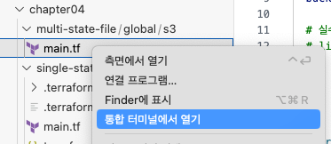

# How to Terraform(4) - 상태관리 개선하기

## 시리즈 목차

- [How to Terraform(1) - 테라폼과의 가벼운(?) 첫 만남](../How%20to%20Terraform%281%29%20-%20%ED%99%98%EA%B2%BD%20%EC%84%A4%EC%A0%95%ED%95%98%EA%B8%B0%2FHow%20to%20Terraform%281%29%20-%20%ED%85%8C%EB%9D%BC%ED%8F%BC%EA%B3%BC%EC%9D%98%20%EA%B0%80%EB%B2%BC%EC%9A%B4%28%3F%29%20%EC%B2%AB%20%EB%A7%8C%EB%82%A8.md)
- [How to Terraform(2) - 변수와 출력](../How%20to%20Terraform%282%29%20-%20%EB%B3%80%EC%88%98%EC%99%80%20%EC%B6%9C%EB%A0%A5%2FHow%20to%20Terraform%282%29%20-%20%EB%B3%80%EC%88%98%EC%99%80%20%EC%B6%9C%EB%A0%A5.md)
- [How to Terraform(3) - 상태 관리](../How%20to%20Terraform%283%29%20-%20%EC%83%81%ED%83%9C%20%EA%B4%80%EB%A6%AC%2FHow%20to%20Terraform%283%29%20-%20%EC%83%81%ED%83%9C%20%EA%B4%80%EB%A6%AC.md)

[이전 글](../How%20to%20Terraform%283%29%20-%20%EC%83%81%ED%83%9C%20%EA%B4%80%EB%A6%AC%2FHow%20to%20Terraform%283%29%20-%20%EC%83%81%ED%83%9C%20%EA%B4%80%EB%A6%AC.md)에서는 Terraform의 상태에 대해 알아보았고, 로컬 파일로 관리할 때의 단점을 해결하기 위해서 상태를 S3에 저장하는 방법을 알아보았습니다. 하지만 여전히 문제가 남아있었습니다. 그 문제가 뭐였는지 알아볼까요?

## 현재 상태관리의 문제점

이전 글에서는 모든 테라폼 리소스가 한 개의 상태 파일로 관리되고 있었습니다. 예시를 위해서 새로 폴더를 만들고 다음 코드를 `main.tf`에 작성합니다.

> 일단 예시를 위해서 S3를 사용하지 않고 로컬 파일을 사용합니다.

```terraform
// AWS 프로바이더 설정
provider "aws" {
  // 아시아 태평양(서울) 리전
  region = "ap-northeast-2"
}

resource "aws_instance" "example" {
  // ap-northeast-2 리전의 Ubuntu 20.04 AMI
  ami           = "ami-0c6e5afdd23291f73"
  instance_type = "t2.micro"
}
```

그리고 init, plan, apply 명령을 실행합니다.

> `terraform`이라고 매번 입력하는게 어려우니 .zshrc나 .bashrc에 다음과 같이 alias 설정을 해서 `tf`로 사용하는 것도 방법입니다.
>
> ```
> alias tf=terraform
> ```

```bash
> tf init
...
Terraform has been successfully initialized!
...

> tf plan
...
Plan: 1 to add, 0 to change, 0 to destroy.
...

> tf apply
...
Apply complete! Resources: 1 added, 0 changed, 0 destroyed.
```

자 여기까지는 뭐 기존과 다를 게 하나도 없습니다. 여기에 두번째 EC2 인스턴스를 추가해볼까요?

```terraform
//main.tf 기존 코드...

resource "aws_instance" "example2" {
  // ap-northeast-2 리전의 Ubuntu 20.04 AMI
  ami           = "ami-0c6e5afdd23291f73"
  instance_type = "t2.micro"
}
```

그리고 다시 plan을 실행해봅니다.

```bash
> tf plan
aws_instance.example: Refreshing state... [id=i-00c12ab694ff80dfa]

...
Plan: 1 to add, 0 to change, 0 to destroy.
...
```

두번째 EC2 인스턴스를 추가할 때 우리의 관심사는 `aws_instance.example2` 리소스 입니다. 하지만 plan 명령을 실행하자 이미 추가된 리소스인 `aws_instance.example`에 대한 검사가 먼저 진행되었죠? `aws_instance.example` 리소스가 `aws_instance.example2` 리소스와 하나의 상태 파일로 관리되고 있기 때문에 Terraform으로서는 어쩔 수 없이 상태 파일의 내용과 테라폼 코드의 리소스를 모두 비교할 수 밖에 없는 거죠. EC2 인스턴스 몇 개는 금방 끝나니까 별 문제가 아닐 수 있지만, 이런 식으로 리소스가 계속 늘어나다 보면 어느새 plan 한번 실행하는데 몇 분이 걸리는 일도 발생할 수 있습니다.

그리고 좀 더 복잡한 문제가 생기는 경우도 있습니다. 만약 반드시 변수로 입력받아야 하는 값이 있다고 생각해볼까요? 테라폼 코드에 작성된 상당수의 리소스가 환경변수 등을 통해서 변수를 입력받아야 한다면 어떨까요? 내가 관심 있는 리소스 하나 작업하기 위해서 모든 변수 값을 제대로 설정해야만 하는 문제가 발생합니다. 정리해보자면,

- 여러 리소스가 하나의 상태 파일로 관리되기 때문에, 리소스가 추가됨에 따라 상태 파일이 점점 거대해진다.
- 따라서 새로 추가하는 리소스에 대한 plan, apply 명령에도 기존에 관리되고 있는 모든 리소스에 대한 검사가 진행되므로 시간이 점점 더 오래걸린다.
- 모든 리소스가 하나의 상태 파일로 관리되면 다른 사람이 일부 리소스를 변경했을 때 변경된 상태 값 역시 공유된다. 만약 다른 사람이 변경한 테라폼 코드를 업데이트 받지 않은 상태에서 내 작업을 진행하면 리소스의 상태를 다시 변경 이전 상태로 되돌리는 등의 예상치 못한 오류가 발생할 수 있다.

이러한 문제를 해결하기 위해서는 각 리소스에 대한 상태를 최대한 작게 나눠서 관리하는 게 좋을 것 같습니다. 나눠서 관리한다는 게 생각보다 별 거 없습니다. 그냥 폴더를 쪼개면 됩니다.

## 폴더로 나눠서 관리하기

S3 백엔드와 EC2 인스턴스 2개를 만드는 상황을 가정하면 폴더는 대강 이렇게 나눌 수 있습니다.

```
.
├── global
│   └── s3
│       └── main.tf
├── dev
│   └── ec2
│       └── example
│           └── main.tf
│       └── example2
│           └── main.tf
```

우선 `global` 폴더에는 S3 백엔드를 생성하는 코드를 작성합니다.

```terraform
// AWS 프로바이더 설정
provider "aws" {
  // 아시아 태평양(서울) 리전
  region = "ap-northeast-2"
}

# S3 버킷 생성
resource "aws_s3_bucket" "terraform_state" {
  bucket = "terraform-state-example-20231125"

  # 실수로 버킷이 삭제되지 않도록 하려면 아래 주석을 해제하세요.
  # lifecycle {
  #   prevent_destroy = true
  # }
}

# 버킷 버전 관리 활성화(상태 파일의 히스토리를 관리하기 위함)
resource "aws_s3_bucket_versioning" "enabled" {
  bucket = aws_s3_bucket.terraform_state.id

  versioning_configuration {
    status = "Enabled"
  }
}

# S3에 저장될 때 암호화 하도록 설정
resource "aws_s3_bucket_server_side_encryption_configuration" "default" {
  bucket = aws_s3_bucket.terraform_state.id

  rule {
    apply_server_side_encryption_by_default {
      sse_algorithm = "AES256"
    }
  }
}

# 모든 public access를 차단(실수로 버킷이 공개되지 않도록 하기 위함)
resource "aws_s3_bucket_public_access_block" "public_access" {
  bucket = aws_s3_bucket.terraform_state.id

  block_public_acls   = true
  block_public_policy = true
  ignore_public_acls  = true
  restrict_public_buckets = true
}

# 여러 사람이 동시에 상태 파일을 수정하지 못하도록 DynamoDB를 사용한 락 설정
resource "aws_dynamodb_table" "terraform_locks" {
  name = "terraform_locks"
  billing_mode = "PAY_PER_REQUEST"
  hash_key = "LockID"

  attribute {
    name = "LockID"
    type = "S"
  }
}
```

그리고 우선 init, plan, apply 를 실행해서 백엔드 설정을 위한 S3 버킷을 생성합니다.

> 참고로, VS Code에서는 cd 명령 대신에 폴더에 우클릭하고 `통합 터미널에서 열기`를 선택하면 해당 폴더로 터미널이 이동합니다.
>
> <p align="center"></p>

```bash
> cd global/s3
> tf init
...
Terraform has been successfully initialized!
...

> tf plan
...
Plan: 5 to add, 0 to change, 0 to destroy.
...

> tf apply
...
Apply complete! Resources: 5 added, 0 changed, 0 destroyed.
```

그리고 생성된 S3에 현재 생성된 리소스의 상태를 저장하기 위해서 `main.tf`상단에 다음 코드를 추가합니다.

```terraform
terraform {
  # 필요한 프로바이더 목록과 버전 정보
  required_providers {
    aws = {
      source = "hashicorp/aws"
      version = "~> 5.0" # 5.0 이상 버전 사용
    }
  }

  # 상태 파일을 S3에 저장하도록 설정
  backend "s3" {
    bucket = "terraform-state-example-20231125"
    # 상태 파일이 저장될 경로
    key    = "global/s3/terraform.tfstate"
    region = "ap-northeast-2"

    # 상태 파일을 락으로 사용할 DynamoDB 테이블
    dynamodb_table = "terraform_locks"
    # 상태 파일을 암호화
    encrypt        = true
  }
}

// main.tf 기존 코드...
```

여기서 주목해야 할 점은 상태 파일이 저장될 경로를 리소스 파일이 정의된 폴더 경로와 일치하도록 설정했다는 점입니다. 이렇게 하면 리로스와 상태 파일의 경로가 일치하므로 상태 파일을 덮어쓴다던지 하는 오류를 피할 수 있습니다. 이제 init 명령을 통해 벡엔드를 설정하겠습니다.

```bash
> tf init
Initializing the backend...
Do you want to copy existing state to the new backend?
  Pre-existing state was found while migrating the previous "local" backend to the
  newly configured "s3" backend. No existing state was found in the newly
  configured "s3" backend. Do you want to copy this state to the new "s3"
  backend? Enter "yes" to copy and "no" to start with an empty state.

  Enter a value: yes


Successfully configured the backend "s3"! Terraform will automatically
use this backend unless the backend configuration changes.
...
```

콘솔에서 S3를 확인해보면,

<p align="center"></p>

지정된 경로에 상태 파일이 생성된 것을 확인할 수 있습니다.

> 이렇게 리소스 별로 상태를 관리할 때 아무래도 자주 관리하지 않는 리소스가 생기기 마련입니다. 시간이 한참 지나서 다시 관리를 해야 할 때, 이전에 사용하던 프로바이더의 버전과 현재 버전이 차이가 많이 날 수도 있겠죠. 그럴 때 기존에 작성한 코드가 제대로 동작하지 않는 문제가 생길 수도 있으므로 프로바이더의 버전을 명시하는 것도 좋은 방법입니다!

이제 `dev/ec2/example/main.tf` 파일을 생성하고 다음 코드를 작성합니다.

```terraform
terraform {
  # 필요한 프로바이더 목록과 버전 정보
  required_providers {
    aws = {
      source = "hashicorp/aws"
      version = "~> 5.0" # 5.0 이상 버전 사용
    }
  }

  # 상태 파일을 S3에 저장하도록 설정
  backend "s3" {
    bucket = "terraform-state-example-20231125"
    # 상태 파일이 저장될 경로
    key    = "dev/ec2/example/terraform.tfstate"
    region = "ap-northeast-2"

    # 상태 파일을 락으로 사용할 DynamoDB 테이블
    dynamodb_table = "terraform_locks"
    # 상태 파일을 암호화
    encrypt        = true
  }
}

// AWS 프로바이더 설정
provider "aws" {
  // 아시아 태평양(서울) 리전
  region = "ap-northeast-2"
}

resource "aws_instance" "example" {
  // ap-northeast-2 리전의 Ubuntu 20.04 AMI
  ami           = "ami-0c6e5afdd23291f73"
  instance_type = "t2.micro"
}
```

그리고 역시 `dev/ec2/example` 폴더에서 init, plan, apply 명령을 실행합니다.

```bash
> cd dev/ec2/example
> tf init
...
Terraform has been successfully initialized!
...

> tf plan
...
Plan: 1 to add, 0 to change, 0 to destroy.
...

> tf apply
...
Apply complete! Resources: 1 added, 0 changed, 0 destroyed.
```

그리고 `dev/ec2/example2/main.tf` 파일을 생성하고 동일한 과정으로 EC2 인스턴스를 추가할 수 있습니다.

## 정리

이제 우리는 각 리소스에 대해 개별적으로 상태 관리를 진행할 수 있습니다. 리소스는 각각의 상태를 가지므로 다른 리소스에 대해 신경쓰지 않고 관리할 수 있고, 특히 새로운 리소스를 추가할 때 역시 기존 리소스의 상태에 대해서 전혀 신경쓰지 않아도 됩니다. 다만 역시나 한 가지 마음에 걸리는 게 있습니다. EC2 인스턴스를 작성 할 때 저희는 동일한 코드를 복붙해서 새로운 인스턴스를 생성했었죠. 사실 지금은 EC2에 별다른 설정을 하지 않아서 뭐 복잡할 건 없습니다만, VPC등의 설정에 따라서는 EC2도 매우 복잡해질 수 있고 저희가 Terraform으로 EC2만 관리할 것도 아니기 때문에 이 부분은 더 나은 방법이 필요해보입니다. 다음 글에서는 모듈을 통해 중복을 줄이는 방법을 알아보겠습니다.

# 참고자료

- [Terraform Up and Running, 3rd Edition](https://www.terraformupandrunning.com/)

# License

[저작자표시-비영리-변경금지 2.0 대한민국 (CC BY-NC-ND 2.0 KR)](https://creativecommons.org/licenses/by-nc-nd/2.0/kr/)
