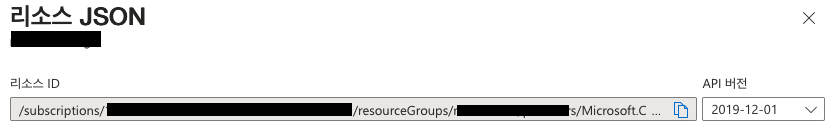

# Terraform 으로 기존 Azure 리소스 임포트하기

Terraform은 DevOps의 필수 구성 요소로 자리 잡고 있습니다. Terraform을 통해 서비스를 지탱하는 인프라에 대한 정의, 배포, 업데이트 그리고 삭제를 코드로 정의할 수 있으며 이러한 개념을 IaC(infrastructure as code)라고 합니다.

> DevOps는 소프트웨어 배포를 빠르고 효율적으로 할 수 있게 해주는 프로세스, 아이디어, 테크닉을 말한다.

그런데, 인프라를 코드로 작성하면 무슨 장점이 있는 걸까요?

- **자동화**: 인프라를 코드로 작성할 수 있다면 자동화할 수 있고, 필요할 때 언제든 즉시 실행 가능합니다.
- **실수 방지**: 자동화를 통해 수작업에서 발생하는 오류를 줄일 수 있고, 몇 번이고 반복해서 실행해도 안심할 수 있죠.
- **문서화**: 또한 코드는 인프라에 대한 문서로 볼 수도 있습니다. 누군가의 머리 속에만 존재하지 않고, 누구나 볼 수 있는 코드에 인프라의 정보가 담기는 셈이죠.
- **버전 관리**: 그리고 매우 큰 장점이 또 있는데요, 마치 소스 코드를 git으로 버전 관리 하듯이 인프라의 구성 역시 코드로써 버전 관리 할 수 있습니다. 뭔가 잘 못 됐을 때, 빠르게 커밋 로그를 통해 변경점을 찾을 수 있고 이전 버전으로 돌아갈 수도 있죠! 😊

그런데 Terraform으로 관리를 시작하면 누구나 거치는 어려움이 있습니다. 그건 바로 모든 리소스를 테라폼을 통해서만 관리해야 한다는 점입니다. 테라폼으로 리소스를 만들어 놓고 나서, 나도 모르게 습관적으로 포털에 들어가서 마우스를 클릭클릭해서 설정을 변경하고 싶은 유혹에 빠집니다. 수작업을 추가하는 순간 테라폼의 상태 관리에서 벗어나기 시작하므로 피치 못할 사정이 아니면 테라폼을 통해서 상태를 변경해야 합니다.

> 물론 어떤 기술이나 다 그렇듯이 테라폼으로 100% 다 제어가 불가능한 경우도 있습니다. 테라폼의 한계이거나 테라폼 프로바이더의 문제 등으로 100% 제어가 다 안되는 경우가 종종 발생하긴 합니다. 그럴 때는 리소스의 생성 및 삭제만 테라폼으로 관리하고 나머지는 수작업으로 관리하는 수 밖에 없습니다. 😊 물론 제가 몰라서 그럴 가능성도 충분히...쓰읍 😭

다음으로 겪는 어려움은 테라폼을 사용하기 전에 이미 배포된 리소스입니다. 가장 이상적인 방법은 물론 기존 리소스를 지우고 테라폼으로 새로 배포하는 겠지만 현실은 전혀 그렇지 않죠! 😭

그래서 테라폼은 기존에 이미 배포된 리소스를 임포트 할 수 있는 방법을 제공해왔습니다. 특히 최근 1.5 버전 부터 **import** 블록을 제공합니다.

## 예시

import 를 통해 실제 배포된 인스턴스를 가져와보고자 합니다. 현재 작업 중인 솔루션은 대부분의 운영 리소스가 Terraform으로 배포되어 Azure에서 운영되고 있습니다. 딱 한 가지 Container Instance로 동작 중인 서버들이 수작업으로 배포되어 있는데요, 이 서버를 import 블록으로 가져오고자 합니다.

### 준비

우선 가져오고자 하는 리소스의 Terraform 문서를 확인합니다. Container Instance는 [여기](https://registry.terraform.io/providers/hashicorp/azurerm/latest/docs/resources/container_group) 에서 확인할 수 있습니다.

예시 코드를 확인해보면 다음과 같습니다.

```javascript
resource "azurerm_resource_group" "example" {
  name     = "example-resources"
  location = "West Europe"
}

resource "azurerm_container_group" "example" {
  name                = "example-continst"
  location            = azurerm_resource_group.example.location
  resource_group_name = azurerm_resource_group.example.name
  ip_address_type     = "Public"
  dns_name_label      = "aci-label"
  os_type             = "Linux"

  container {
    name   = "hello-world"
    image  = "mcr.microsoft.com/azuredocs/aci-helloworld:latest"
    cpu    = "0.5"
    memory = "1.5"

    ports {
      port     = 443
      protocol = "TCP"
    }
  }

  container {
    name   = "sidecar"
    image  = "mcr.microsoft.com/azuredocs/aci-tutorial-sidecar"
    cpu    = "0.5"
    memory = "1.5"
  }

  tags = {
    environment = "testing"
  }
}
```

다행히도 복잡하지 않네요. 😊 리소스 그룹과 container instance 딱 2개만 신경쓰면 됩니다!

### main.tf 작성하기

import를 진행 할 폴더를 생성하고(ex: tf-import-test), main.tf 파일을 생성합니다.

그리고 다음과 같이 terraform 버전과 프로바이더를 설정합니다.

```jsx
terraform {
  required_version = ">= 1.0.0, < 2.0.0"

  required_providers {
    azurerm = {
      source  = "hashicorp/azurerm"
      version = "~>3.0"
    }
  }
}

provider "azurerm" {
  features {}
}
```

terraform 버전은 1.x.x 버전을 사용한다고 지정했고, Azure 클라우드 사용을 위해 azurerm 프로바이더를 지정했습니다.

> terraform 1.0 부터는 [v1-compatibility-promises](https://developer.hashicorp.com/terraform/language/v1-compatibility-promises)가 적용되는데요, 1.0 부터 향후 출시될 1.x 버전까지는 코드 변경 없이 동작한다는 걸 보장합니다. 그래서 위 main.tf에서 terraform의 버전을 1.0이상, 2.0 미만으로 설정해두었습니다. 😊

### import.tf 작성

이제 임포트 해오고 싶은 리소스를 import 블록으로 작성해 볼 차례입니다. 앞서 azurerm의 container instance의 예시 코드를 확인했었는데요, 거기에 맞춰 다음과 같이 작성합니다.

```jsx
// import resource group
import {
  to = azurerm_resource_group.rg
  id = ""
}

// import container instance
import {
  to = azurerm_container_group.container
  id = ""
}
```

2개의 import 블록은 각각 리소스 그룹과 리소스 그룹 안에 있는 container instance를 임포트합니다. 이제 구체적으로 각 import 블록이 어떤 리소스를 임포트 해와야 하는지 id를 적어줄 차례입니다. id는 각 클라우드 서비스에 따라 확인하는 방법이 다른데요 Azure는 다음과 같이 확인할 수 있습니다.

- **az cli 사용하기**
  az resource show 명령을 통해 id를 확인할 수 있습니다.
  ```bash
  > az resource show -g {리소스 그룹} —name {리소스 이름} —resource-type “{리소스 타입}” | grep id
  "id": "/subscriptions/xxxxxxx-xxxx-xxxx-xxxx-xxxxxxxxxxxx/resourceGroups/{리소스 그룹}/providers/Microsoft.ContainerInstance/containerGroups/{리소스 이름}",
  ```
  여기서는 container instance를 임포트하므로 리소스 타입은 Microsoft.ContainerInstance 입니다. Azure의 경우 리소스 타입은 [여기](https://learn.microsoft.com/en-us/azure/azure-resource-manager/management/azure-services-resource-providers)에서 확인할 수 있습니다.
  <br>
- **포털에서 확인하기**
  포털에 접근 가능한 경우 포털에서 해당 리소스를 찾고, 상단 우측의 **JSON 보기**를 클릭합니다.

  <p align="center"></p>
  화면 우측에 나타나는 정보창에서 리소스 ID를 확인 및 복사할 수 있습니다.

이렇게 확인한 리소스 ID를 각각의 import 블록에 채워 넣습니다.

### 임포트 플랜 생성하기

다음으로 **-generate-config-out** 옵션을 통해 임포트 플랜을 생성합니다.

```bash
> terraform init
...
> terraform plan -generate-config-out imported.tf
azurerm_resource_group.rg: Preparing import... [id=/subscriptions/xxxxxxx-xxxx-xxxx-xxxx-xxxxxxxxxxxx/resourceGroups/{리소스 그룹}]
azurerm_container_group.container: Preparing import... [id=/subscriptions/xxxxxxx-xxxx-xxxx-xxxx-xxxxxxxxxxxx/resourceGroups/{리소스 그룹}/providers/Microsoft.ContainerInstance/containerGroups/{리소스 이름}]
azurerm_resource_group.rg: Refreshing state... [id=/subscriptions/xxxxxxx-xxxx-xxxx-xxxx-xxxxxxxxxxxx/resourceGroups/{리소스 그룹}]
azurerm_container_group.container: Refreshing state... [id=/subscriptions/xxxxxxx-xxxx-xxxx-xxxx-xxxxxxxxxxxx/resourceGroups/{리소스 그룹}/providers/Microsoft.ContainerInstance/containerGroups/{리소스 이름}]

Terraform used the selected providers to generate the following execution plan. Resource actions are indicated with the following symbols:
-/+ destroy and then create replacement

Terraform will perform the following actions:

  # azurerm_container_group.container must be replaced
  # (imported from "/subscriptions/xxxxxxx-xxxx-xxxx-xxxx-xxxxxxxxxxxx/resourceGroups/{리소스 그룹}/providers/Microsoft.ContainerInstance/containerGroups/{리소스 이름}")
  # Warning: this will destroy the imported resource
-/+ resource "azurerm_container_group" "container" {
        dns_name_label_reuse_policy = "Unsecure"
      + exposed_port                = (known after apply) # forces replacement
      + fqdn                        = (known after apply)
      ~ id                          = "/subscriptions/xxxxxxx-xxxx-xxxx-xxxx-xxxxxxxxxxxx/resourceGroups/{리소스 그룹}/providers/Microsoft.ContainerInstance/containerGroups/{리소스 이름}" -> (known after apply)
      + ip_address                  = (known after apply)
      + ip_address_type             = "Public" # forces replacement
        location                    = "koreacentral"
        name                        = "{리소스 이름}"
      + network_profile_id          = (known after apply)
        os_type                     = "Linux"
        resource_group_name         = "{리소스 그룹}"
        restart_policy              = "Always"
      - subnet_ids                  = [] -> null
      - tags                        = {} -> null
      - zones                       = [] -> null

      ~ container {
            commands                     = []
            cpu                          = 1
            cpu_limit                    = 0
          - environment_variables        = {} -> null
            image                        = "{도커 이미지}"
            memory                       = 1.5
            memory_limit                 = 0
            name                         = "{리소스 이름}"
          - secure_environment_variables = (sensitive value) -> null
        }

        image_registry_credential {
            server   = "..."
            username = "..."
        }
    }

  # azurerm_resource_group.rg will be imported
  # (config will be generated)
    resource "azurerm_resource_group" "rg" {
        id       = "/subscriptions/xxxxxxx-xxxx-xxxx-xxxx-xxxxxxxxxxxx/resourceGroups/{리소스 그룹}"
        location = "koreacentral"
        name     = "{리소스 그룹}"
        tags     = {}
    }

Plan: 2 to import, 1 to add, 0 to change, 1 to destroy.
╷
│ Warning: Config generation is experimental
│
│ Generating configuration during import is currently experimental, and the generated configuration format may change in future versions.
```

import.tf에 설정한 대로 리소스 그룹, container instance가 각각 **azurerm_resource_group.rg**, **azurerm_container_group.container** 블록으로 매핑되었습니다. 그리고 plan 실행 결과 2개의 리소스를 임포트 할 수 있고, 그 중에 1개는 replace 된다(1 to destroy, 1 to add)고 합니다. 어… 기존에 이미 동작하는 리소스를 가져오는 거라서 replace되면 좀 곤란하긴 하지만 그건 조금 이따가 해결해보겠습니다.

우선 imported.tf를 열어서 생성된 코드를 확인합니다.

```jsx
# __generated__ by Terraform
# Please review these resources and move them into your main configuration files.

# __generated__ by Terraform from "/subscriptions/xxxxxxx-xxxx-xxxx-xxxx-xxxxxxxxxxxx/resourceGroups/{리소스 그룹}"
resource "azurerm_resource_group" "rg" {
  location   = "koreacentral"
  managed_by = null
  name       = "{리소스 그룹}"
  tags       = {}
}

# __generated__ by Terraform from "/subscriptions/xxxxxxx-xxxx-xxxx-xxxx-xxxxxxxxxxxx/resourceGroups/{리소스 그룹}/providers/Microsoft.ContainerInstance/containerGroups/{리소스 이름}"
resource "azurerm_container_group" "container" {
  dns_name_label              = null
  dns_name_label_reuse_policy = "Unsecure"
  exposed_port                = null
  ip_address_type             = null
  key_vault_key_id            = null
  location                    = "koreacentral"
  name                        = "{리소스 이름}"
  os_type                     = "Linux"
  resource_group_name         = "{리소스 그룹}"
  restart_policy              = "Always"
  subnet_ids                  = []
  tags                        = {}
  zones                       = []
  container {
    commands                     = []
    cpu                          = 1
    cpu_limit                    = 0
    environment_variables        = {}
    image                        = "{도커 이미지}"
    memory                       = 1.5
    memory_limit                 = 0
    name                         = "{리소스 이름}"
    secure_environment_variables = null # sensitive
  }
  image_registry_credential {
    password                  = null # sensitive
    server                    = "..."
    user_assigned_identity_id = null
    username                  = "..."
  }
}
```

이 container instance는 외부에서 접근할 수 있는 ip나 포트가 없고, 혼자서 자기 할 일을 하는 리소스입니다. 따라서 **ip_address_type**등의 값이 null로 설정된 걸 볼 수 있습니다. 그런데 방금 전의 plan 결과를 다시 한번 볼까요?

```bash
...
-/+ resource "azurerm_container_group" "container" {
        dns_name_label_reuse_policy = "Unsecure"
      + exposed_port                = (known after apply) # forces replacement
      + fqdn                        = (known after apply)
      ~ id                          = "/subscriptions/xxxxxxx-xxxx-xxxx-xxxx-xxxxxxxxxxxx/resourceGroups/{리소스 그룹}/providers/Microsoft.ContainerInstance/containerGroups/{리소스 이름}" -> (known after apply)
      + ip_address                  = (known after apply)
      + ip_address_type             = "Public" # forces replacement
...
```

**ip_address_type**은 분명 null인데 Public으로 설정된다고 하고, **exposed_port** 역시 apply 실행 후에 얻을 수 있다고 하면서 강제로 이 리소스가 교체될 거라고(**forces replacement**) 합니다. 음… 왜 그런지 모르겠지만 일단 이 값들의 변경을 무시하도록 처리해서 해결해보겠습니다.

imported.tf의 **azurerm_container_group.container** 에 **lifecycle** 속성을 추가합니다.

```bash
resource "azurerm_container_group" "container" {
  ...

  lifecycle {
    ignore_changes = [exposed_port, ip_address_type]
  }
}
```

그리고 다시 plan을 실행합니다.

```bash
❯ terraform plan
...

Terraform will perform the following actions:

  # azurerm_container_group.container will be imported
    resource "azurerm_container_group" "container" {
        dns_name_label_reuse_policy = "Unsecure"
        id                          = "/subscriptions/xxxxxxx-xxxx-xxxx-xxxx-xxxxxxxxxxxx/resourceGroups/{리소스 그룹}/providers/Microsoft.ContainerInstance/containerGroups/{리소스 이름}"
        location                    = "koreacentral"
        name                        = "{리소스 이름}"
        os_type                     = "Linux"
        resource_group_name         = "{리소스 그룹}"
        restart_policy              = "Always"
        subnet_ids                  = []
        tags                        = {}
        zones                       = []

        container {
            commands                     = []
            cpu                          = 1
            cpu_limit                    = 0
            environment_variables        = {}
            image                        = "{도커 이미지}"
            memory                       = 1.5
            memory_limit                 = 0
            name                         = "{리소스 이름}"
            secure_environment_variables = (sensitive value)
        }

        image_registry_credential {
            server   = "..."
            username = "..."
        }
    }

  # azurerm_resource_group.rg will be imported
    resource "azurerm_resource_group" "rg" {
        id       = "/subscriptions/xxxxxxx-xxxx-xxxx-xxxx-xxxxxxxxxxxx/resourceGroups/{리소스 그룹}"
        location = "koreacentral"
        name     = "{리소스 그룹}"
        tags     = {}
    }

Plan: 2 to import, 0 to add, 0 to change, 0 to destroy.
```

오! 무시무시한 force replacement 가 사라졌습니다! 😀 이제 apply 해볼까요?

```bash
> terraform apply
...

Plan: 2 to import, 0 to add, 0 to change, 0 to destroy.

Do you want to perform these actions?
  Terraform will perform the actions described above.
  Only 'yes' will be accepted to approve.

  Enter a value: yes

azurerm_resource_group.rg: Importing... [id=/subscriptions/xxxxxxx-xxxx-xxxx-xxxx-xxxxxxxxxxxx/resourceGroups/{리소스 그룹}]
azurerm_resource_group.rg: Import complete [id=/subscriptions/xxxxxxx-xxxx-xxxx-xxxx-xxxxxxxxxxxx/resourceGroups/{리소스 그룹}]
azurerm_container_group.container: Importing... [id=/subscriptions/xxxxxxx-xxxx-xxxx-xxxx-xxxxxxxxxxxx/resourceGroups/{리소스 그룹}/providers/Microsoft.ContainerInstance/containerGroups/{리소스 이름}]
azurerm_container_group.container: Import complete [id=/subscriptions/xxxxxxx-xxxx-xxxx-xxxx-xxxxxxxxxxxx/resourceGroups/{리소스 그룹}/providers/Microsoft.ContainerInstance/containerGroups/{리소스 이름}]

Apply complete! Resources: 2 imported, 0 added, 0 changed, 0 destroyed.
```

임포트가 끝났습니다! 임포트된 상태 값은 같은 폴더의 **terraform.tfstate** 파일에 저장되어 있는데요, 테라폼 상태는 **backend** 설정을 통해 원격 상태 저장소(Azure Storage, AWS S3)에 저장하는 게 일반적이죠.

```jsx
// Azure
terraform {
	...

	// Store Terraform state in Azure Storage
  backend "azurerm" {
    resource_group_name  = "{리소스 그룹}"
    storage_account_name = "{스토리지 계정 이름}"
    container_name       = "{스토리지 컨테이너 이름}"
    key                  = "{경로}/terraform.tfstate"
  }
}

// AWS
terraform {

  // Store Terraform state in AWS S3
  backend "s3" {
    bucket = "{버킷 이름}"
    key    = "{경로}/terraform.tfstate"
    region = "ap-northeast-2"

    // lock을 사용하는 경우
    dynamodb_table = "{테이블 이름}"
    // 암호화 사용 여부
    encrypt        = true
  }
}

```

이렇게 backend를 설정하고 나서 **terraform init** 을 실행하면, 로컬에 저장되어 있는 상태 값을 원격 저장소로 옮기게 됩니다.

```bash
> terraform init

Initializing the backend...
Do you want to copy existing state to the new backend?
  Pre-existing state was found while migrating the previous "local" backend to the
  newly configured "azurerm" backend. No existing state was found in the newly
  configured "azurerm" backend. Do you want to copy this state to the new "azurerm"
  backend? Enter "yes" to copy and "no" to start with an empty state.

  Enter a value: yes

Successfully configured the backend "azurerm"! Terraform will automatically
use this backend unless the backend configuration changes.
```

## 심화: 모듈화 까지 진행해보기

그런데 사실 임포트 하고자 하는 container instance는 1대가 아니었습니다. 스테이징, 운영 환경에서 동일한 설정으로 각가 1대씩 운영 중인 상황입니다.

동일한 방법으로 추가로 1대를 더 임포트 했다 치고 모듈화해봅시다!

### 모듈 작성하기

우선 모듈을 저장하기 위한 폴더를 생성합니다. 여기서는 **xxx-modules** 폴더에 작성합니다. 모듈은 종류에 따라서 구분되는 게 바람직한데요, 지금 작성하는 모듈은 container instance이므로 **xxx-modules/modules/services/container-instance** 폴더를 생성하고 **main.tf** 를 작성합니다.

```jsx
locals {
  vm_name = "${var.vm_name}-${var.env_alias}"
  // 현재 두 인스턴스가 동일한 리소스 그룹에 배포되어 있으므로, 리소스 그룹 이름에서 환경은 일단 제외
  resource_group_name = "${var.vm_name}"
}

data "azurerm_container_registry" "acr" {
  name                = var.container_registry_name
  resource_group_name = var.container_registry_rg
}

resource "azurerm_resource_group" "rg" {
  location   = var.location
  managed_by = null
  name       = local.resource_group_name
  tags       = {}
}

resource "azurerm_container_group" "container" {
  dns_name_label              = null
  dns_name_label_reuse_policy = "Unsecure"
  exposed_port                = null
  ip_address_type             = null
  key_vault_key_id            = null
  location                    = azurerm_resource_group.rg.location
  name                        = local.vm_name
  os_type                     = "Linux"
  resource_group_name         = azurerm_resource_group.rg.name
  restart_policy              = "Always"
  subnet_ids                  = []
  tags                        = {}
  zones                       = []
  container {
    commands                     = []
    cpu                          = 1
    cpu_limit                    = 0
    environment_variables        = {}
    image                        = var.vm_image_name
    memory                       = 1.5
    memory_limit                 = 0
    name                         = local.vm_name
    secure_environment_variables = null # sensitive
  }
  image_registry_credential {
    password                  = null # sensitive
    server                    = data.azurerm_container_registry.acr.login_server
    user_assigned_identity_id = null
    username                  = data.azurerm_container_registry.acr.admin_username
  }

	// acr의 스펠링 변경도 무시할 수 있도록 image_registry_credential 추가
  lifecycle {
    ignore_changes = [exposed_port, ip_address_type, image_registry_credential]
  }
}
```

기존에 임포트된 **imported.tf** 를 복사해온 다음에 필요한 정보를 추가하고, 모듈화 하기 위해서 하드코딩 되어 있던 내용을 변수로 추출했습니다. 추출된 변수는 **variables.tf** 에 작성합니다.

```jsx
//---------------------------Required Variables---------------------------//
variable vm_name {
  type        = string
  description = "name of the vm"
}

variable env_alias {
  type        = string
  description = "alias of the environment"
  validation {
    condition     = contains(["dev", "stg", "prod", "g"], var.env_alias)
    error_message = "env_alias must be any of dev, stg or prod, g"
  }
}

//---------------------------Optional Variables---------------------------//
variable location {
  type        = string
  default     = "koreacentral"
  description = "location of the resource group"
}

variable "vm_image_name" {
  type        = string
  description = "name of the vm image"
}

variable container_registry_name {
  type        = string
  default     = "..."
  description = "name of the container registry"
}

variable container_registry_rg {
  type        = string
  default     = "..."
  description = "name of the resource group for the container registry"
}
```

에를 들어서 **vm_name**을 **some-vm**, **env_alias**를 **dev**로 지정하면 리소스 그룹의 이름은 **some-vm**, container instance의 이름은 **some-vm-dev**가 되는 셈이죠. 개인적으로 리소스 그룹은 리소스의 이름과 일치시키는 걸 선호하지만 현재 배포된 상황이 같은 리소스 그룹에 2개의 container instance가 들어있기 때문에 어쩔 수 없이 일단 이렇게 작성했습니다.

### 모듈 사용하기

그리고 이 모듈을 사용해서 리소스를 관리하기 위한 테라폼 코드를 작성할 차례입니다. 여기서는 **xxx-live/live/stg/services/container-instance/some-vm** 에 작성합니다.

**main.tf** 부터 작성을 시작해볼까요?

```jsx
terraform {
  required_version = ">= 1.0.0, < 2.0.0"

  required_providers {
    azurerm = {
      source  = "hashicorp/azurerm"
      version = "~>3.0"
    }
  }

  # Store Terraform state in Azure Storage
  backend "azurerm" {
    resource_group_name  = "..."
    storage_account_name = "..."
    container_name       = "..."
    key                  = "stg/services/container-instance/some-vm/terraform.tfstate"
  }
}

provider "azurerm" {
  features {}
}

module "some-vm" {
  source = "../../../../../../xxx-modules/modules/services/container-instance"

  location = "koreacentral"

  container_registry_name = "..."
  container_registry_rg = "..."

  vm_name = "some-vm"
  env_alias = "stg"
  vm_image_name = "..."
}
```

앞서 작성한 모듈을 **source** 속성으로 참조하였고 필요한 파라미터를 지정해주었습니다. 이제 앞서 import 했던 terraform.tfstate 파일을 main.tf 파일과 동일한 폴더에 복사합니다. 그리고 terraform init 명령을 실행합니다.

```jsx
❯ terraform init

Initializing the backend...
Do you want to copy existing state to the new backend?
  Pre-existing state was found while migrating the previous "local" backend to the
  newly configured "azurerm" backend. No existing state was found in the newly
  configured "azurerm" backend. Do you want to copy this state to the new "azurerm"
  backend? Enter "yes" to copy and "no" to start with an empty state.

  Enter a value: yes

Successfully configured the backend "azurerm"! Terraform will automatically
use this backend unless the backend configuration changes.
Initializing modules...
- some-vm in ../../../../../../xxx-modules/modules/services/container-instance

Initializing provider plugins...
- Finding hashicorp/azurerm versions matching "~> 3.0"...
- Installing hashicorp/azurerm v3.67.0...
- Installed hashicorp/azurerm v3.67.0 (signed by HashiCorp)

Terraform has created a lock file .terraform.lock.hcl to record the provider
selections it made above. Include this file in your version control repository
so that Terraform can guarantee to make the same selections by default when
you run "terraform init" in the future.

Terraform has been successfully initialized!

You may now begin working with Terraform. Try running "terraform plan" to see
any changes that are required for your infrastructure. All Terraform commands
should now work.

If you ever set or change modules or backend configuration for Terraform,
rerun this command to reinitialize your working directory. If you forget, other
commands will detect it and remind you to do so if necessary.
```

모듈과 필요한 프로바이더를 설치하였고, import 로 생성했던 상태 역시 새로 지정된 backend로 이관되었습니다. 그러면 plan을 실행해볼까요?

```jsx
❯ terraform plan
module.some-vm.data.azurerm_container_registry.acr: Reading...
azurerm_resource_group.rg: Refreshing state... [id=/subscriptions/xxxxxxx-xxxx-xxxx-xxxx-xxxxxxxxxxxx/resourceGroups/{리소스 그룹}]
azurerm_container_group.container: Refreshing state... [id=/subscriptions/xxxxxxx-xxxx-xxxx-xxxx-xxxxxxxxxxxx/resourceGroups/{리소스 그룹}/providers/Microsoft.ContainerInstance/containerGroups/{리소스 이름}]
module.some-vm.data.azurerm_container_registry.acr: Read complete after 0s [id={acr id}]

Terraform used the selected providers to generate the following execution plan. Resource actions are indicated
with the following symbols:
  + create
  - destroy

Terraform will perform the following actions:

  # azurerm_container_group.container will be destroyed
  # (because azurerm_container_group.container is not in configuration)
  - resource "azurerm_container_group" "container" {
      - dns_name_label_reuse_policy = "Unsecure" -> null
      - id                          = "id=/subscriptions/xxxxxxx-xxxx-xxxx-xxxx-xxxxxxxxxxxx/resourceGroups/{리소스 그룹}/providers/Microsoft.ContainerInstance/containerGroups/{리소스 이름}" -> null
      - location                    = "koreacentral" -> null
      - name                        = "{리소스 이름}" -> null
      - os_type                     = "Linux" -> null
      - resource_group_name         = "{리소스 그룹}" -> null
      - restart_policy              = "Always" -> null
      - subnet_ids                  = [] -> null
      - tags                        = {} -> null
      - zones                       = [] -> null

      - container {
          - commands                     = [] -> null
          - cpu                          = 1 -> null
          - cpu_limit                    = 0 -> null
          - environment_variables        = {} -> null
          - image                        = "..." -> null
          - memory                       = 1.5 -> null
          - memory_limit                 = 0 -> null
          - name                         = "{리소스 이름}" -> null
          - secure_environment_variables = (sensitive value) -> null
        }

      - image_registry_credential {
          - server   = "..." -> null
          - username = "..." -> null
        }
    }

  # azurerm_resource_group.rg will be destroyed
  # (because azurerm_resource_group.rg is not in configuration)
  - resource "azurerm_resource_group" "rg" {
      - id       = "..." -> null
      - location = "koreacentral" -> null
      - name     = "..." -> null
      - tags     = {} -> null
    }

  # module.some-vm.azurerm_container_group.container will be created
  + resource "azurerm_container_group" "container" {
      + dns_name_label_reuse_policy = "Unsecure"
      + exposed_port                = (known after apply)
      + fqdn                        = (known after apply)
      + id                          = (known after apply)
      + ip_address                  = (known after apply)
      + ip_address_type             = "Public"
      + location                    = "koreacentral"
      + name                        = "some-vm-stg"
      + network_profile_id          = (known after apply)
      + os_type                     = "Linux"
      + resource_group_name         = "some-vm"
      + restart_policy              = "Always"

      + container {
          + commands     = []
          + cpu          = 1
          + cpu_limit    = 0
          + image        = "..."
          + memory       = 1.5
          + memory_limit = 0
          + name         = "some-vm-stg"
        }

      + image_registry_credential {
          + server   = "..."
          + username = "..."
        }
    }

  # module.some-vm.azurerm_resource_group.rg will be created
  + resource "azurerm_resource_group" "rg" {
      + id       = (known after apply)
      + location = "koreacentral"
      + name     = "some-vm"
    }

Plan: 2 to add, 0 to change, 2 to destroy.

─────────────────────────────────────────────────────────────────────────────────────────────────────────────────

Note: You didn't use the -out option to save this plan, so Terraform can't guarantee to take exactly these
actions if you run "terraform apply" now.
```

음…. 기존 리소스를 모두 삭제하고 새로 만들겠다고 합니다. 분명 terraform.tfstate 파일을 가져와서 backend로 이관 했음에도 불구하고 삭제 하겠다는 군요! 문제가 되는 부분이 바로 이 부분입니다.

```jsx
  # azurerm_container_group.container will be destroyed
  # (because azurerm_container_group.container is not in configuration)
...
  # azurerm_resource_group.rg will be destroyed
  # (because azurerm_resource_group.rg is not in configuration)
...
```

그러니까 현재 작성중인 테라폼 코드에 **azurerm_container_group.container**, **azurerm_resource_group.rg** 가 없다는 말입니다!

지금 우리는 모듈을 정의하고 모듈을 사용해서 테라폼 코드를 작성했죠? 그래서 사실 각 리소스의 이름은 이렇게 변경됩니다.

- azurerm_container_group.container → module.some-vm.azurerm_container_group.container
- azurerm_resource_group.rg → module.some-vm.azurerm_resource_group.rg

따라서 기존 상태에 있는 리소스를 새 이름으로 import 해주고 기존 리소스는 상태에서 제거해야 합니다! 😤
우선 import로 기존 리소스를 새로운 이름으로 가져옵니다.

```jsx
❯ terraform import module.some-vm.azurerm_container_group.container /subscriptions/xxxxxxx-xxxx-xxxx-xxxx-xxxxxxxxxxxx/resourceGroups/{리소스 그룹}/providers/Microsoft.ContainerInstance/containerGroups/{리소스 이름}
...

Import successful!

The resources that were imported are shown above. These resources are now in
your Terraform state and will henceforth be managed by Terraform.

❯ terraform import module.some-vm.azurerm_resource_group.rg /subscriptions/xxxxxxx-xxxx-xxxx-xxxx-xxxxxxxxxxxx/resourceGroups/{리소스 그룹}
...

Import successful!

The resources that were imported are shown above. These resources are now in
your Terraform state and will henceforth be managed by Terraform.
```

다음으로 현재 상태에 있는 리소스 이름을 목록으로 확인해보고 기존 항목을 삭제합니다.

```jsx
❯ terraform state list
azurerm_container_group.container
azurerm_resource_group.rg
module.some-vm.data.azurerm_container_registry.acr
module.some-vm.azurerm_container_group.container
module.some-vm.azurerm_resource_group.rg

❯ terraform state rm azurerm_container_group.container
Removed azurerm_container_group.container
Successfully removed 1 resource instance(s).

❯ terraform state rm azurerm_resource_group.rg
Removed azurerm_resource_group.rg
Successfully removed 1 resource instance(s).

❯ terraform state list
module.some-vm.data.azurerm_container_registry.acr
module.some-vm.azurerm_container_group.container
module.some-vm.azurerm_resource_group.rg
```

그리고 마지막으로 plan 을 실행해 봅시다!

```jsx
❯ terraform plan
...

No changes. Your infrastructure matches the configuration.

Terraform has compared your real infrastructure against your configuration and found no differences, so no
changes are needed.
```

Wow! 이제 드디어 import 해온 상태와 현재 제가 원하는 상태가 일치합니다! 그리고 모듈화도 성공했죠! 👍

# 참고자료

- terraform up and running 3rd edition
- [Testing Terraform Import in v.1.5.0+ with Azure Resources](https://jakewalsh.co.uk/testing-terraform-import-in-v-1-5-0-with-azure-resources/)
