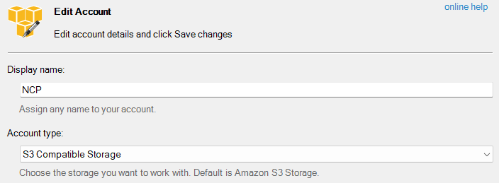

# S3에 업로드된 이미지 접근시 CORS 이슈, 그리고 no-cors

## 개요

현재 개발 중인 서비스는 이미지나 기타 파일을 업로드하고 가져올 때 NCP(네이버 클라우드 플랫폼)의 Object Storage를 사용 중입니다. `제목에서는 S3라고 했는데?` 라고 생각하실 수 있지만, NCP의 Object Storage는 S3와 호환되는 API를 제공하기 때문에 사실상 S3와 동일하게 생각하고 사용할 수 있습니다. 따라서 이후에는 그냥 S3라고 표현하겠습니다.

S3에 업로드된 이미지 등의 에셋을 가져올 때는 CORS 이슈가 발생할 수 있습니다. 이 문제를 해결하려면 S3의 버킷에 CORS 설정을 추가해줘야 합니다. 여러가지 방법이 있을 수 있지만 이 글에서는 [S3 Browser](https://s3browser.com/)를 사용하여 CORS 설정을 추가하는 방법을 알아보겠습니다.

## 버킷에 CORS 설정하기

S3 Browser를 통해 S3에 접속합니다. 만약 NCP의 Object Storage와 같이 S3 API와 호환되는 서비스를 사용 중이라면, **Account type**을 **S3 Compatible Storage**로 선택하고, 접속합니다.

<p align="center"></p>

접속하면, 해당 계정의 버킷 목록이 나타납니다. CORS를 설정하고자 하는 버킷을 선택하고 **Ctrl + R** 을 누르거나 마우스 우클릭 후 **CORS Configuration**을 선택합니다. 그리고 XML 형식으로 CORS 설정을 추가합니다.

```xml
<?xml version="1.0" encoding="UTF-8" standalone="yes"?>
<CORSConfiguration xmlns="http://s3.amazonaws.com/doc/2006-03-01/">
  <CORSRule>
    <AllowedMethod>GET</AllowedMethod>
    <AllowedOrigin>http://localhost:3000</AllowedOrigin>
    <AllowedHeader>*</AllowedHeader>
  </CORSRule>
</CORSConfiguration>
```

그리고 **Apply** 버튼을 눌러 설정을 저장합니다. 이제 해당 버킷에 업로드된 이미지 등의 에셋을 가져올 때 CORS 이슈가 발생하지 않습니다... 그런데 말입니다. 😣

## 그런데 말입니다

그런데 한 가지 변수가 있습니다. 이 글의 제목에서 언급된 **no-cors**입니다. **no-cors**가 뭔지 일단 알아보야겠죠? **no-cors**는 [Sec-Fetch-Mode](https://developer.mozilla.org/en-US/docs/Web/HTTP/Headers/Sec-Fetch-Mode) 헤더의 설정 값 중에 하나입니다.

### Sec-Fetch-Mode??

MDN의 설명을 보면, 유저가 HTML 페이지를 왔다 갔다 하는 요청과 이미지 등의 리소스를 가져오는 요청을 구분하기 위해 사용된다고 합니다. 그러니까 HTML 문서를 요청하는 경우는 **navigate**, [이미지 등의 리소스를 요청하는 경우는 **no-cors**로 설정된다는 거죠.](https://developer.mozilla.org/en-US/docs/Web/API/Request/mode#value)

**no-cors** 요청은 메서드가 HEAD, GET, POST 중 하나여야 하고, [CORS에서 허용된 헤더](https://developer.mozilla.org/en-US/docs/Glossary/CORS-safelisted_request_header) 만을 사용할 수 있으며 요청의 결과로 받은 응답을 javascript 등에서 접근할 수 없다고 합니다.

이제 제가 왜 갑자기 **no-cors** 이야기를 하는지 눈치 채신 분들도 있을 겁니다. css의 **background-image** 속성에 S3에 업로르된 이미지가 url로 지정되는 부분이 있었는데, 바로 여기서 그 이미지를 가져오는 요청이 **no-cors** 였던 겁니다!

그러니까 S3에 CORS 설정을 해줬지만 계속 CORS 오류가 발생한 거죠... 😫

## 해결 방법

관련해서 문제를 찾다보니 이미 관련해서 먼저 고민한 분들이 있었습니다. [CloudFront 이미지 CORS 이슈](https://velog.io/@wwlee94/CloudFront-%EC%9D%B4%EB%AF%B8%EC%A7%80-CORS-%EC%9D%B4%EC%8A%88) 를 보면, 결론적으로 이 문제는 **Origin** 헤더가 누락되었기 때문에 발생한 문제였습니다. CORS 허용이 필요한 경우 요청에 대한 응답으로 **Access-Control-Allow-Origin** 헤더에 요청한 **Origin**을 포함해서 돌려줘야 하는데, S3는 요청에 **Origin** 헤더가 없는 경우 응답에 **Access-Control-Allow-Origin** 헤더를 넣어주지 않는다는 거죠!

그래서 기존에는 S3의 에셋에 직접 접근 하던걸 NCP의 CDN+로 접근하도록 변경한 다음에, CDN+가 응답 헤더에 `Access-Control-Allow-Origin: *`를 추가해주도록 설정해서 문제를 해결했습니다. 에셋에 접근하는 도메인이 하나가 아니었기 때문에 부득이 하게 `*`로 설정했지만, 그렇지 않은 경우는 명시적으로 도메인을 적어줘야 합니다.

## 난 잘되는데?

참고로 브라우저 마다 **no-cors** 를 처리하는 방법이 조금씩 다른 듯 합니다. 테스트 결과 별도의 처리 없이도 **Firefox**에서는 이미지를 가져오는 데 문제가 없었지만, **Chrome**에서는 문제가 발생했습니다.

## 참고 자료

- [Sec-Fetch-Mode](https://developer.mozilla.org/en-US/docs/Web/HTTP/Headers/Sec-Fetch-Mode)
- [CORS](https://developer.mozilla.org/en-US/docs/Web/HTTP/CORS)
- [CORS-safelisted_request_header](https://developer.mozilla.org/en-US/docs/Glossary/CORS-safelisted_request_header)
- [CloudFront 이미지 CORS 이슈](https://velog.io/@wwlee94/CloudFront-%EC%9D%B4%EB%AF%B8%EC%A7%80-CORS-%EC%9D%B4%EC%8A%88)
