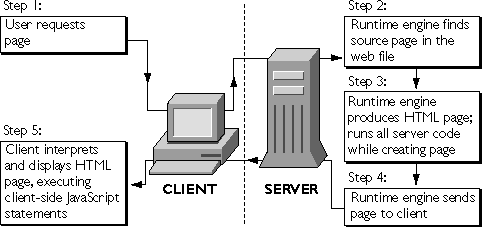

# Node.js: --experimental-vm-modules

최근에 클로드 코드의 작업을 지켜보던 중, 눈에 들어오는 커맨드가 있었습니다. 테스트를 실행하는 코드 앞에 `NODE_OPTIONS=--experimental-vm-modules` 이런 환경변수가 붙어있더군요. 그래서 vm? 노드에 무슨 vm? 하는 궁금증과 함께 찾아보기 시작했습니다. 확인하다 보니... 이게 그렇게 간단한 이야기는 아니었고, 그동안 노드를 계속 쓰면서도 알려고 하지 않았던 부끄러운 과거를 반성하게 되더군요...

`--experimental-vm-modules` 를 좀 많이 단순화해서 한 마디로 정리하면, "테스트를 위해 CommonJS 시절에 mocking 하던 것처럼 ESM에서도 할 수 있게 해줄게" 정도일까요? 그러니까 이건 모듈에 관련된 내용이고, 모듈을 알아보려면 일단 Javascript의 서버 런타임의 역사를 좀 살펴볼 필요가 있습니다.

## Javascript 초창기의 서버 런타임

1994년에 전설적인 Netscape 브라우저가 출시되었습니다. 그 이후에 전세계가 인터넷의 미래를 선점하기 위해서 움직였고, 마이크로소프트 역시 지금은 사라진 인터넷 익스플로러를 1995년 8월에 공개했습니다. 이후 각 회사는 브라우저와 함께 웹 개발 생태계의 주도권을 쥐기 위해 웹 서버 개발 환경을 출시합니다. 넷스케이프에서는 Netscape Enterprise Server와 LiveWire를 마이크로소프트에서는 IIS와 ASP를 1996년에 출시합니다.

[LiveWire의 당시 개발자 문서](https://docs.oracle.com/cd/E19957-01/816-6411-10/contents.htm)는 현재도 확인할 수 있는데요, 아래 구조에서 볼 수 있듯이 서버에서 html 페이지를 렌더링해서 프론트로 보내주는 형태입니다. 지금 우리가 쓰는 서버 사이드 렌더링(SSR)의 개념인 셈이죠.

<p align="center"><br />출처: https://docs.oracle.com/cd/E19957-01/816-6411-10/jsserv.htm#1028696</p>

그리고 이후에도 Helma(1998), Jaxer(2008) 등 Javascript를 서버에서 구동할 수 있는 런타임이 등장했지만 한 가지 큰 문제가 있었는데요, 초창기 Javascript에는 모듈의 개념이 아예 없었습니다. 어느 정도 규모가 있는 코드를 작성하다보면 필연적으로 코드를 자르고 묶어서 서로 참조하게 하고, 누군가가 만든 코드를 가져와서 쓰기도 하고 해야 합니다. 그런데 이런 개념이 아예 없었기 때문에 각 서버 런타임별로 자기 나름대로의 방법을 추구하고 있었던 셈이죠.

> Netscape LiveWire의 좀 더 자세한 내용이 궁금하신 분은 [Server-side JavaScript a decade before Node.js with Netscape LiveWire](https://dev.to/macargnelutti/server-side-javascript-a-decade-before-node-js-with-netscape-livewire-l72) 를 참고하세요!

## 나는 꿈이 있어요!

이런 상황 속에서 2009년 1월 Kevin Dangoor는 [What Server Side JavaScript needs](https://www.blueskyonmars.com/2009/01/29/what-server-side-javascript-needs/) 라는 글에서 다음과 같이 이야기합니다.

> JavaScript needs a standard way to include other modules and for those modules to live in discreet namespaces. ... There needs to be a way to package up code for deployment and distribution and further to install packages. ... To that end, I’ve set up a new ServerJS group in hopes of getting the interested parties talking and maybe even to get us together face-to-face to produce some code and settle on some interfaces. ...

Javascript에게 패키지 배포 및 모듈을 다루는 표준방식이 필요하며, 이를 위해서 ServerJS라는 논의 그룹을 시작한다는 내용입니다. 이후 ServerJS는 CommonJS로 이름을 바꿨고 이후 십 수년간 Node.js의 사실상 표준으로 사용됩니다. 지금와서 보면 그 당시에 대단한 꿈이었고, 저 같은 개발자는 그 덕을 많이 봤던 거죠.

## 하지만 그렇게 간단하지 않았다

하지만 지금, 우리는 결론을 알고 있습니다. ESM이 결국 표준이 되었고, 그동안 CommonJS로 배포된 패키지는 셀 수도 없이 많았죠. 아주 오랜 시간동안 패키지들은 CommonJS와 ESM을 동시에 지원하려고 애썼고, 결국은 ESM만을 지원하는 패키지를 CommonJS에서 사용할 수 있도록 [require()ing Synchronous ESM Graphs](https://netscout.github.io/posts/commonjs%EC%99%80-esm%EC%9D%98-%EC%B0%A8%EC%9D%B4%EC%A0%90/#requireing-synchronous-esm-graphs) 기능이 추가되기도 했습니다. 오랜 기간 동안 CommonJS가 사용된 탓에(특히 Node.js가 폭발적으로 성장하던 시절에!) CommonJS를 무시할 수 없게 된 거죠.

> CommonJS와 ESM에 대해 알고 싶으신 분들은 [CommonJS와 ESM의 차이점](https://netscout.github.io/posts/commonjs%EC%99%80-esm%EC%9D%98-%EC%B0%A8%EC%9D%B4%EC%A0%90/) 을 참고하세요!

## 그 시절 우리가 좋아했던 mocking

`흉내지빠귀`는 곤충이나 다른 새의 울음소리를 흉내낸다고 해서 영어로는 `Mockingbird`라고 불립니다. 

<p align="center"><br />출처: https://simple.wikipedia.org/wiki/Mockingbird</p>

우리가 테스트를 작성하다보면 Mockingbird 같이, 코드의 각 부분이 실제와 동일한 인터페이스를 갖지만 내부 동작은 완전히 다른 무언가를 만들어야 합니다. 예를 들어서 DB에서 뭔가 데이터를 가져오는 코드를 테스트 한다고 생각해보죠.

```javascript
// user-service.js
const { db } = require('./database.js');
exports.getUser = (id) => db.query('SELECT * FROM users WHERE id = ?', id);
```

실제 DB에서 데이터를 가져오는 코드를 그대로 테스트에 활용한다면 다음과 같은 문제가 발생합니다.

- 테스트하는 환경에 실제 DB가 구동되어야 함
- DB에 지연/장애 발생시 테스트 시간이 길어지거나 타임아웃 등으로 실패 발생
- DB에 데이터를 쓰는 경우, 테스트용 데이터가 섞여들어가는 문제 발생 가능

그래서 다음과 같이 DB 응답을 대체하는 mock 코드를 통해 테스트를 진행합니다.

```javascript
// user-service.test.js
jest.mock('./database.js', () => ({ db: { query: jest.fn() } }));

const { db } = require('./database.js');
const { getUser } = require('./user-service.js');

beforeEach(() => jest.resetAllMocks());

...

test('id로 유저 한 명을 조회한다', async () => {
  db.query.mockResolvedValue([{ id: 42, name: '홍길동', email: 'a@b.com' }]);

  const rows = await getUser(42);

  expect(rows).toEqual([{ id: 42, name: '홍길동', email: 'a@b.com' }]);
  expect(db.query).toHaveBeenCalledWith('SELECT * FROM users WHERE id = ?', 42);
});
```

만약 DB에 조회해오는 쿼리나 인덱스 등의 체크도 필요하다면, 메모리에서 동작하는 [better-sqlite3](https://github.com/WiseLibs/better-sqlite3)나 [mongodb-memory-server](https://github.com/typegoose/mongodb-memory-server) 등을 사용하기도 합니다.

## 그런데 뭐가 문제인가요?

앞선 예시 코드를 보시면 알겠지만, require를 사용하고 있습니다. CommonJS죠. CommonJS에서는 mocking이 매우 쉽습니다. 왜 그런지 결론부터 말씀드리면, **CommonJS는 여러분의 코드를 함수로 감싸서 실행하는데, 이때 모듈이 로드되는 과정을 임의로 조정할 수 있습니다.**

즉, CommonJS에서는 모든 게 다 함수입니다. 우선 이 부분 부터 확인해보죠.

### 모든 게 다 함수다.

일단 다음 커맨드를 실행해 볼까요?

```bash
> node -v
v26.0.0

> node -e "console.log(require('node:module').wrapper)"
Proxy([
  '(function (exports, require, module, __filename, __dirname) { ',
  '\n});'
])
```

굉장히 간단한 명령과 출력이지만, 저는 이게 좀 이해하기 어려웠습니다. 하나씩 확인해보면,

#### 1. node:module

앞에 `node:`가 붙으면, `이 모듈은 Node.js에서 기본으로 제공하는(built-in) 모듈이니까 node_modules 뒤지지 마라` 뭐 그런 의미입니다.
그리고 `module`은 말 그대로 Node.js의 모듈 시스템을 가리킵니다. 다음과 같이 실행해보면,

```bash
> node -e "console.log(require('node:module'))"
<ref *1> [Function: Module] {
...
}
```

Module의 생성자 함수가 리턴되는 걸 확인할 수 있죠?

#### 2. .wrapper

말 그대로 코드의 앞과 뒤를 감싸는 wrapper를 의미합니다. 앞선 .wrapper의 출력 결과를 보면,

```bash
Proxy([
  '(function (exports, require, module, __filename, __dirname) { ',
  '\n});'
])
```

배열에 2개의 요소가 있습니다. 

- '(function (exports, require, module, __filename, __dirname) { '
- '\n});'

우리가 어떤 코드를 작성하든지, CommonJS는 우리의 코드를 저 두 줄로 감싸서 함수로 실행한다는 거죠. 그러니까,

```javascript
// greeting.js
const name = 'world';
module.exports = 'hello, ' + name;
```

이런 코드가 있다면, Node.js 는 이 코드를 다음과 같이 컴파일합니다.

```javascript
(function (exports, require, module, __filename, __dirname) { const name = 'world';
module.exports = 'hello, ' + name;

});
```

즉, 다음과 같은 형태인거죠.

```
┌──────────────────────────────────────────────────────────────┐
│ (function (exports, require, module, __filename, __dirname) {│  ← Node가 추가
├──────────────────────────────────────────────────────────────┤
│ const name = 'world';                                        │
│ module.exports = 'hello, ' + name;                           │  ← 내가 작성한 코드
├──────────────────────────────────────────────────────────────┤
│ });                                                          │  ← Node가 추가
└──────────────────────────────────────────────────────────────┘
```

### 그래서 이게 다 뭐라는 건가요?

Node.js가 붙여주는 wrapper의 파라미터를 잘 보시면, exports, require, module, __filename, __dirname 등 우리에게 매우 친숙한 이름들입니다. 그러니까 이게 무슨 전역 변수 같은 게 아니라 wrapper를 통해서 파라미터로 주입된 애들이라는 거죠!(저는 처음 알았습니다...)

그래서 require를 제 맘대로 정의하는 것도 가능합니다.

```javascript
// my-require.js
const fs = require('fs');

function myRequire(filename) {
  // 1. 대상이 되는 파일을 텍스트로 읽어오기
  const yourCode = fs.readFileSync(filename, 'utf8');

  // 2. 앞, 뒤로 wrapper 코드 붙이기
  const wrapped =
    '(function (exports, require, module, __filename, __dirname) {' +
    yourCode +
    '\n})';

  // 3. 실행 가능한 함수로 변환
  const fn = eval(wrapped);

  // 4. 매개변수를 정의하고 호출하기
  const module = { exports: {} };
  // require 파라미터에 myRequire를 전달함!!!!!
  fn(module.exports, myRequire, module, filename, __dirname);

  // 5. module.exports 값을 리턴
  return module.exports;
}

console.log(myRequire('./greeting.js'));   // hello, world
```

그리고 실행하면 다음과 같은 결과를 볼 수 있습니다.

```bash
> node my-require.js                                                 
hello, world
```

그러니까, Node.js가 wrapper로 코드를 감싸게 되면, 테스트를 위해서 만든 mock을 대신 로드하는 require를 주입해서 호출 경로를 바꿀 수 있다는 거죠! 그래서 CommonJS 코드는 mock 테스트가 아주 쉽습니다.

> 여담이지만, 그래서 최상위 레벨의 return이 코드를 종료시키게 됩니다.
> ```javascript
> console.log("hello, world");
> return;
> console.log("앞 줄의 return에서 wrapper 함수를 빠져나가므로 출력되지 않습니다!!");
> ```

## 그런데 ESM은... 달라요!

근데 ESM은... 다릅니다. 아까 봤던 코드를 ESM으로 작성하면 이렇습니다.

```javascript
import { db } from './database.js';
export function getUser(id) { return db.query('...', id); }
```

import는 함수가 아니라 선언입니다.(require는 함수였죠!) 게다가 import는 코드가 실행되기 전에 어떤 모듈을 로드할지 결정(resolve)됩니다. 위 코드가 실행되는 시점에서는 이미 db가 선언된 모듈로 로드된 상태라는 거죠. 조금 더 자세히 살펴보면 ESM에서 모듈은 다음과 같이 3단계로 로드됩니다.

1. 분석(parse): 코드 실행 전에 import, export 선언을 추출함
2. 연결(link): 모듈간의 참조 관계를 그래프로 구성함
3. 실행(evaluate): 코드가 실행됨

CommonJS처럼 모듈을 중간에 바꿔치기 하려면 2번 연결 단계가 유일한 희망이지만, ESM은 CommonJS처럼 쉬운 방법은 없습니다.

> 하지만 Jest가 아니라 node:test 를 사용한다면 이런 방법을 고민할 필요가 없습니다. node:test는 vm 모듈을 사용하지 않습니다!

## 다시 --experimental-vm-modules 이야기

이제 드디어 `--experimental-vm-modules` 플래그를 이야기할 차례입니다. 참 먼 길을 돌아왔네요... 제가 모르는 게 이렇게 많았다니 저도 슬픕니다.

어쨌거나, 플래그가 뭘하는 건지 다음 커맨드로 확인해보죠.

```bash
> node -e "const vm=require('node:vm'); console.log(typeof vm.SourceTextModule)"
undefined

> node --experimental-vm-modules -e "const vm=require('node:vm'); console.log(typeof vm.SourceTextModule)"
function
```

`vm.SourceTextModule`이 원래는 없었는데, 플래그를 설정하자 나타났죠? 이 플래그를 설정하면 `vm.Module`, `vm.SourceTextModule`, `vm.SyntheticModule`을 사용할 수 있게 해줍니다.

이 클래스들을 활용하면 앞서 살펴봤던 ESM 모듈의 3단계를 직접 제어할 수 있습니다.

> [노드 공식 문서](https://nodejs.org/api/vm.html)에 따르면 vm.Module, vm.SourceTextModule, vm.SyntheticModule 모두 아직까지 `Stability: 1 - Experimental` 상태입니다. 각 모듈이 추가된 시점을 보면 9.6.0, 12.16.0 등으로 아주 오래전인데 말이죠. 어쩌면 이 기능은 앞으로 사용하지 않는게 더 좋을 거 같은 느낌도 드네요.

## ESM의 모듈 임포트를 직접 제어해보자!

앞서 살펴본 `vm.SourceTextModule`를 이용해서 다음과 같이 코드를 작성해보겠습니다.

```javascript
// esm-3steps.js
import vm from 'node:vm';

// vm.createContext는 독립적인 코드 실행공간(샌드박스)을 생성합니다.
// 새로 생성된 context에는 console 조차도 없기 때문에 주입해줘야 합니다.
const context = vm.createContext({ console });

// 1단계 - 분석. 코드를 컴파일하면서 import와 export를 추출합니다.
// 아직 코드는 실행되지 않습니다.
const module = new vm.SourceTextModule(
  `export const greeting = 'hello world';`,
  { context, identifier: 'hello.mjs' },
);
console.log(module.status);            // 'unlinked'

// 2단계 - 연결. 모든 import, export에서 로드할 모듈을 결정합니다.
// hello.mjs는 다른 모듈을 import하지 않기 때문에, linker는 아무 일도 하지 않습니다.
await module.link(() => { throw new Error('no imports'); });
console.log(module.status);            // 'linked'

// 3단계 - 실행. 이제 코드가 실행됩니다.
await module.evaluate();
console.log(module.status);            // 'evaluated'

console.log(module.namespace.greeting); // 'hello world'
```

그리고 플래그를 붙여서 실행합니다.

```bash
> node --experimental-vm-modules esm-3steps.js
unlinked
linked
evaluated
hello world
(node:68009) ExperimentalWarning: VM Modules is an experimental feature and might change at any time
(Use `node --trace-warnings ...` to show where the warning was created)
```

`분석 -> 연결 -> 실행`의 3단계가 명확하게 드러나죠? 이제 CommonJS 때 처럼 직접 로드하는 방법을 시도해보려고.... 했습니다만. 코드를 보다 보니, `아 이건 그냥 가능하다 정도만 확인하고 넘어가야겠다` 싶었습니다. 좀 많이 복잡하기 때문에 직접 이런 코드를 작성하는 일은 없어야겠다는 생각이 들더군요! 혹시 관심있으신 분들은 `esm-loader` 폴더 안에 있는 파일을 참조하시면 되고요, 실행 결과는 아래와 같습니다.

```bash
> node --experimental-vm-modules esm-loadMock.js
{ id: 42, name: '홍길동' }
(node:81468) ExperimentalWarning: VM Modules is an experimental feature and might change at any time
(Use `node --trace-warnings ...` to show where the warning was created)
```

## mock을 사용하지 않는 디자인

ESM 예제를 보고 나니 mocking을 꼭 이렇게까지 해야 하나 싶은 생각이 들었습니다. 꼭 필요한 경우도 있겠죠. 예를 들면,

- 내가 작성하지 않은 라이브러리가 껴있는 경우
- 특정 레이어에서 몇 개의 레이어를 그냥 전달만 하는 경우(ex: handler.js -> service.js -> repository.js -> db.js)
- 코드 실행 전에 import로 인해 실행되는 경우

뭐 이런 경우는 mocking을 하는 게 더 나을 수도 있습니다. 그런데 실제 코드와 테스트 코드에서 서로 다른 뭔가를 주입할 수 있도록 구성한다면 애초에 mocking을 피할 수 있습니다.

우선 아주 간단하게 실제 DB에 접근할 때 사용될 database.js를 작성합니다.

```javascript
// database.js
// 코드가 실행되기 전에 import로 인해 실행됩니다!
console.log('  [database.js] connecting to postgres://prod...');

export const db = {
  query(sql, id) {
    throw new Error('REAL DATABASE HIT');
  },
};
```

그리고 db를 넘겨받아서 데이터를 조회할 user-service.js 를 작성하고요,

```javascript
// user-service.js
// 팩토리 패턴을 사용해서 import를 하나도 선언하지 않습니다.
// db 파라미터에는 실제 DB나 fake DB가 사용될 수 있죠.
export function createUserService({ db }) {
  return {
    getUser(id) {
      return db.query('SELECT * FROM users WHERE id = ?', id);
    },
  };
}
```

다음으로 실제 db를 통해 사용자 정보를 조회하는 main.js 입니다.

```javascript
// 실제 코드를 실행하는 진입점입니다.
import { db } from './database.js';
import { createUserService } from './user-service.js';

export const userService = createUserService({ db });
```

그리고 마지막으로 fake DB를 사용해서 user-service.js를 테스트할 user-service.test.mjs 를 작성합니다.

```javascript
// user-service.test.mjs
// 실행 방법:  node --test
// node:test는 vm 모듈을 사용하지 않기 때문에 --experimental-vm-modules 플래그가 필요 없습니다!

import { test } from 'node:test';
import assert from 'node:assert';

// fake DB를 만드는 함수
function createFakeDb(rows = {}) {
  const calls = [];
  return {
    calls,
    query(sql, id) {
      calls.push({ sql, id });
      return rows[id] ?? null;
    },
  };
}

test('fake DB로 서비스를 생성하기', async () => {
  const { createUserService } = await import('./user-service.js');
  const fakeDb = createFakeDb({ 42: { id: 42, name: '홍길동' } });

  const service = createUserService({ db: fakeDb });
  const user = service.getUser(42);

  assert.deepStrictEqual(user, { id: 42, name: '홍길동' });
  assert.deepStrictEqual(fakeDb.calls, [
    { sql: 'SELECT * FROM users WHERE id = ?', id: 42 },
  ]);
});

test('찾을 수 없는 데이터 테스트', async () => {
  const { createUserService } = await import('./user-service.js');
  const service = createUserService({ db: createFakeDb() });

  assert.strictEqual(service.getUser(999), null);
});

test('db 오류가 전파되는지 확인하는 테스트', async () => {
  const { createUserService } = await import('./user-service.js');
  const service = createUserService({
    db: { query() { throw new Error('connection reset'); } },
  });

  assert.throws(() => service.getUser(42), /connection reset/);
});
```

fake DB를 만들고 그걸 팩토리 createUserService 함수에 넘겨줘서, userService가 fake DB를 통해 테스트를 진행하도록 구성하고 있습니다. 테스트 실행 결과는 다음과 같습니다.

```bash
> node --test                                   
✔ fake DB로 서비스를 생성하기 (1.105083ms)
✔ 찾을 수 없는 데이터 테스트 (0.085625ms)
✔ db 오류가 전파되는지 확인하는 테스트 (0.432792ms)
ℹ tests 3
ℹ suites 0
ℹ pass 3
ℹ fail 0
ℹ cancelled 0
ℹ skipped 0
ℹ todo 0
ℹ duration_ms 42.566208
```

mocking 없이도 깔끔하게 테스트를 진행할 수 있죠? 의존성이 강하게 결합되는 부분을 제거하도록 디자인하면 mocking의 필요성 자체를 없앨 수도 있습니다!

## 정리

이 글의 시작은 한 플래그에 포함된 "vm"이라는 글자 때문이었지만, 조사를 하는 과정에서 예전에 어떤 일이 있었고, 내가 아무 생각없이 오랫동안 쓰던 게 이런 고민을 통해 나왔던 거구나 하고 공부하는 기회가 되었습니다. 역시... 모르는 게 너무 많군요!

## 참고자료

- [Node.js 공식 문서: vm - SourceTextModule과 SyntheticModule](https://nodejs.org/api/vm.html)
- [Node.js 공식 문서: The module wrapper](https://nodejs.org/api/modules.html#the-module-wrapper)
- [Jest 공식 문서: ECMAScript Modules](https://jestjs.io/docs/ecmascript-modules)
- [LiveWire 개발자 문서(Oracle 아카이브)](https://docs.oracle.com/cd/E19957-01/816-6411-10/contents.htm)
- [Server-side JavaScript a decade before Node.js with Netscape LiveWire](https://dev.to/macargnelutti/server-side-javascript-a-decade-before-node-js-with-netscape-livewire-l72)
- [What Server Side JavaScript needs - Kevin Dangoor](https://www.blueskyonmars.com/2009/01/29/what-server-side-javascript-needs/)
- [CommonJS와 ESM의 차이점](https://netscout.github.io/posts/commonjs%EC%99%80-esm%EC%9D%98-%EC%B0%A8%EC%9D%B4%EC%A0%90/)