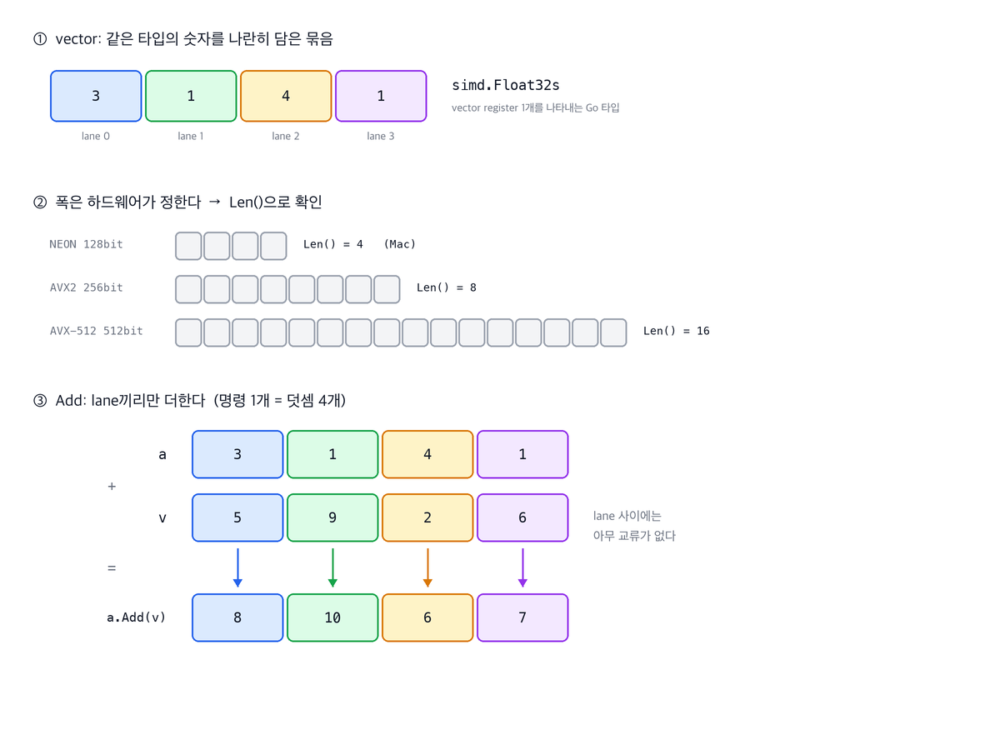
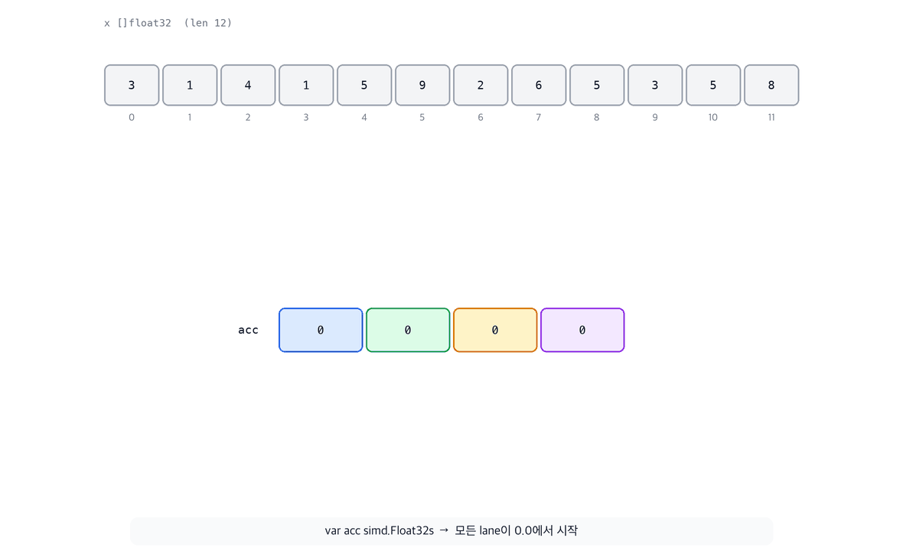
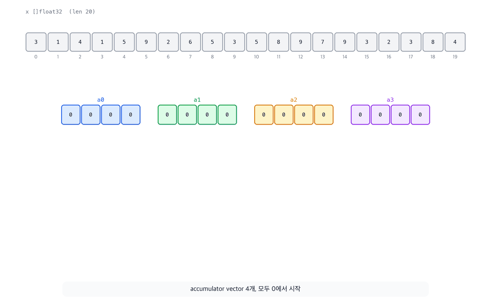
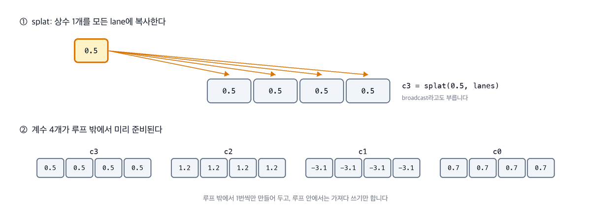
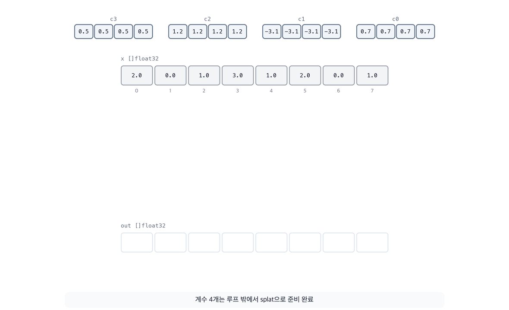
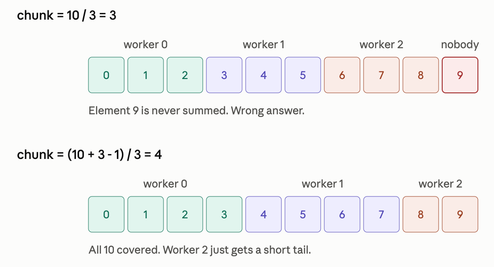

# SIMD를 알아보자(feat. Go)

최근에 Youtube에서 재밌는 영상 하나를 봤습니다. [People Are Mad They're Told to Learn](https://youtu.be/4nJ2tEPD4-k?si=vpg1EWAFg4DQ4DkX) 이라는 영상인데요, 영상의 발단은 Mitchell Hashimoto의 [Everyone Should Know SIMD](https://mitchellh.com/writing/everyone-should-know-simd) 라는 글이었습니다. 인터넷에서는 그 글에 대한 반발로 "아니 왜 모든 개발자가 이런 걸 꼭 알아야 한다는 말이냐"등과 같은 반응이 있었고, 저 영상에서는 그 글에 대한 반응과 함께 SIMD로 코드를 작성해보는 내용이 있었습니다. 그걸 보고 나니 저도 궁금해졌습니다. SIMD가 뭔데? 왜 이걸 다 알아야 한다는 거지? 그래서 그냥 한번 시작해봤습니다.

## Go 환경설정

우선 Go를 통해 SIMD를 테스트할 수 있는 환경을 마련해보겠습니다. 저는 Go를 brew를 통해 설치했었는데요, 2026년 8월 현재 brew를 통해 설치할 수 있는 최신 버전은 1.26.5입니다. 1.26.5버전도 SIMD가 지원되긴 하지만 AMD64 환경에서만 제한적으로 지원되고, 맥(ARM64)에서 SIMD를 활용하려면 1.27rc2를 설치해야 합니다. 기존에 정식으로 설치된 버전과 간섭없이 동작할 수 있고, 나중에 제거할 때도 아무런 간섭없이 제거할 수 있습니다.

### 1. 래퍼 프로그램 설치

다음 명령으로 아주 작은 래퍼 프로그램을 설치합니다.

```bash
> go install golang.org/dl/go1.27rc2@latest
```

### 2. `~/go/bin` 을 PATH에 설정하기

```bash
> echo 'export PATH="$HOME/go/bin:$PATH"' >> ~/.zshrc
> source ~/.zshrc
> which go1.27rc2
/Users/onlifecoding/go/bin/go1.27rc2
```

### 3. 실제 SDK 다운로드

```bash
go1.27rc2 download
Downloaded   0.0% (    2952 / 68280741 bytes) ...
Downloaded   5.6% ( 3833856 / 68280741 bytes) ...
Downloaded  24.7% (16859008 / 68280741 bytes) ...
Downloaded  41.2% (28131120 / 68280741 bytes) ...
Downloaded  58.3% (39828640 / 68280741 bytes) ...
Downloaded  74.9% (51134112 / 68280741 bytes) ...
Downloaded  90.1% (61488688 / 68280741 bytes) ...
Downloaded 100.0% (68280741 / 68280741 bytes)
Unpacking /Users/onlifecoding/sdk/go1.27rc2/go1.27rc2.darwin-arm64.tar.gz ...
Success. You may now run 'go1.27rc2'
```

### 4. 버전 확인하기

```bash
> go version
go version go1.26.5 darwin/arm64
> go1.27rc2 version
go version go1.27rc2 darwin/arm64
> go1.27rc2 env GOROOT
/Users/onlifecoding/sdk/go1.27rc2
```

### 5. SIMD 지원 확인하기

아래 명령을 통해 simd 패키지의 설명이 출력되면 환경 설정이 잘 끝났습니다.

```bash
> GOEXPERIMENT=simd go1.27rc2 doc simd | head -40 
package simd // import "simd"
...
```

### 6. 설정 삭제하기

추후에 설정을 삭제하려면, SDK를 삭제하고 `rm -rf ~/sdk/go1.27rc2`, 래퍼 프로그램을 삭제하고 `rm ~/go/bin/go1.27rc2`, PATH 설정을 `~/.zshrc` 에서 삭제하면 깔끔하게 제거할 수 있습니다.

## 테스트용 코드 작성하기

자 이제 일반 코드와 SIMD가 적용된 코드 간의 비교를 위해서 다음과 같이 코드를 작성 해볼겁니다.

```plaintext
simdbench/
├── go.mod
├── kernels.go        # 스칼라 커널
├── kernel_simd.go    # SIMD 커널 (goexperiment.simd 전용)
├── kernel_stub.go    # SIMD 미지원 환경용 대체 커널
└── kernel_test.go    # 정확성 테스트 + 벤치마크
```


### 1. 폴더와 모듈 생성

우선 폴더와 모듈을 생성합니다.

```bash
> mkdir simdbench && cd simdbench
> go mod init simdbench
```

### 2. 테스트에 사용할 2개의 연산 커널

이 테스트는 2개의 연산 커널의 기준으로 모든 테스트가 진행됩니다.

#### 2-1. 합 구하기

다음과 같이 float32 배열의 합을 구합니다.

```plaintext
s = x[0] + x[1] + ... + x[n-1]
```

4 바이트를 읽어들일 때 마다 1개의 연산이 발생하기 때문에 메모리 중심의 연산 커널입니다. 또한 합을 구하기 위해서는 이전 단계의 합이 존재해야 하기 때문에 CPU가 대기해야 하는 구간이 발생합니다.

#### 2-2. 삼차 다항식 계산

다음과 같은 삼차 다항식을 배열의 각 요소에 대해 독립적으로 계산합니다.

```plaintext
out[i] = ((0.5*x[i] + 1.2) * x[i] - 3.1) * x[i] + 0.7
```

1개의 요소 당 6번의 연산이 발생하는 계산 중심의 연산 커널입니다. 1번 연산 커널(합 구하기)에 비해 바이트당 연산 횟수가 더 많기 때문에 SIMD가 병렬화하기 더 좋은 구조입니다.

### 3. 커널 구현하기(kernels.go)

다음과 같이 kernels.go 를 작성합니다.

```go
package kernels

func SumScalar(x []float32) float32 {
	var s float32
	for _, v := range x {
		s += v
	}
	return s
}

// 호너의 방법을 사용하여 거듭제곱 계산을 (곱셈, 덧셈)의 조합으로 변환
// 0.5v³ + 1.2v² − 3.1v + 0.7
// = v(0.5v² + 1.2v − 3.1) + 0.7
// = v(v(0.5v + 1.2) − 3.1) + 0.7
// = ((0.5v + 1.2)·v − 3.1)·v + 0.7
func PolyScalar(x, out []float32) {
	// 입력값을 체크한다. 동시에 컴파일러가 prove 과정에서 len(x) <= len(out)임을 확인한다.
	// 그러면 컴파일러는 아래 for 루프 안의 out[i]에 인덱스 접근 가드를 넣지 않는다.
	if len(out) < len(x) {
		panic("PolyScalar: out이 x보다 짧습니다.")
	}
	for i, v := range x {
		out[i] = ((0.5*v+1.2)*v-3.1)*v + 0.7
	}
}

// SumUnrolled4는 독립된 accumulator 4개를 사용한다.
// 각 덧셈이 앞 덧셈의 결과를 기다리지 않는다. 그래서 CPU가 덧셈 4개를 겹쳐 실행한다.
func SumUnrolled4(x []float32) float32 {
	var s0, s1, s2, s3 float32
	n := len(x)
	m := n - n%4 // 동시에 4개의 계산을 진행하니까 4로 나눠떨어지는 구간을 구하기
	i := 0
	for ; i < m; i += 4 {
		s0 += x[i]
		s1 += x[i+1]
		s2 += x[i+2]
		s3 += x[i+3]
	}
	s := s0 + s1 + s2 + s3
	for ; i < n; i++ { // 4로 나눠 남은 나머지 구간을 계산
		s += x[i]
	}
	return s
}
```

총 3개의 함수가 작성되었는데요. SumScalar, PolyScalar는 앞서 이야기 했던 연산 커널을 그대로 작성한 함수이고, SumUnrolled4 는 추가 설명이 필요합니다.

CPU는 float32를 더하는 작업에 3-4 사이클을 소비합니다. 그렇기 때문에 순차적으로 하나씩 더하는 SumScalar는 매 루프마다 앞선 더하기가 끝나기를 기다리는 비효율이 발생하게 되죠.

> float32는 숫자로 저장되지 않으며, 1 부호 비트 + 8 지수 비트 + 23비트의 가수로 묶여있습니다. 그래서 float32 덧셈을 위해 각 피연산자를 계산 가능한 형태로 묶음을 해제(unpack)하는 1사이클과 계산의 1사이클, 계산 결과를 다시 float32의 형태로 재조정하는 데 1사이클이 필요합니다. 이 과정에 CPU 아키텍처에 따라서 3-4 사이클이 필요하다고 합니다.

그래서 앞선 계산을 기다리는 비효율이 발생하지 않도록 CPU가 4개의 계산을 동시에 진행한 뒤, 결과를 합치도록 하는 겁니다. 이런 방식을 ILP(Instruction-Level Parallelism)이라고 합니다.

### 4. SIMD 커널 구현하기(kernel_simd.go)

```go
//go:build goexperiment.simd

package kernels

import "simd"

func SumSIMDSingle(x []float32) float32 {
	var acc simd.Float32s // accumulator vector. 실행 환경이 지원하는 SIMD lane 수만큼 누적 슬롯을 가진다. 초깃값은 Mac의 경우 [0, 0, 0, 0]
	lanes := acc.Len()    // NEON은 4, AVX는 8 또는 16

	i := 0
	for ; i+lanes <= len(x); i += lanes { // lane 수만큼 딱 떨어지는 구간을 동시에 계산
		acc = acc.Add(simd.LoadFloat32s(x[i : i+lanes])) // 주어진 슬라이스에서 lane 수만큼 잘라서 각 lane별로 누적
	}

	var tmp [16]float32    // 스택에 배열을 생성(AVX512의 경우 최대 float32를 16개 담을 수 있으므로 최댓값으로 생성)
	acc.Store(tmp[:lanes]) // 각 lane의 값을 배열에 저장
	var s float32
	for j := 0; j < lanes; j++ { // 모든 lane의 결과 값을 더하기
		s += tmp[j]
	}

	for ; i < len(x); i++ { // lane 수로 딱 떨어지지 않고 남았던 인덱스에 대해 계산
		s += x[i]
	}
	return s
}

func SumSIMDUnrolled4(x []float32) float32 {
	var a0, a1, a2, a3 simd.Float32s // 4개의 accumulator vector를 생성
	lanes := a0.Len()                // vector 하나가 담는 lane 수 확인
	step := lanes * 4                // 4개의 accumulator vector -> Mac의 경우 4 * 4 => 16

	i := 0
	for ; i+step <= len(x); i += step { // step 단위로 딱 떨어지는 구간을 계산 (Mac은 한 번에 16개)
		a0 = a0.Add(simd.LoadFloat32s(x[i : i+lanes])) // 각 accumulator vector에 lane 수만큼 끊어서 누적
		a1 = a1.Add(simd.LoadFloat32s(x[i+lanes : i+2*lanes]))
		a2 = a2.Add(simd.LoadFloat32s(x[i+2*lanes : i+3*lanes]))
		a3 = a3.Add(simd.LoadFloat32s(x[i+3*lanes : i+4*lanes]))
	}

	// step만큼 끊고 남은 나머지 중에서 lane 수만큼 끊을 수 있는 구간을 계산
	for ; i+lanes <= len(x); i += lanes {
		a0 = a0.Add(simd.LoadFloat32s(x[i : i+lanes]))
	}

	// (a0+a1)과 (a2+a3)를 먼저 묶어서 안쪽 Add 두 개가 겹쳐 실행되게 한다
	acc := a0.Add(a1).Add(a2.Add(a3))

	var tmp [16]float32 // 스택에 배열을 생성(AVX512의 경우 최대 float32를 16개 담을 수 있으므로 최댓값으로 생성)
	acc.Store(tmp[:lanes])
	var s float32
	for j := 0; j < lanes; j++ {
		s += tmp[j]
	}

	for ; i < len(x); i++ {
		s += x[i]
	}
	return s
}

func SumSIMDUnrolled8(x []float32) float32 {
	var a0, a1, a2, a3, a4, a5, a6, a7 simd.Float32s // 8개의 accumulator vector를 생성
	lanes := a0.Len()                                // vector 하나가 담는 lane 수 확인
	step := lanes * 8                                // 8개의 accumulator vector -> Mac의 경우 4 * 8 => 32

	i := 0
	for ; i+step <= len(x); i += step { // step 단위로 딱 떨어지는 구간을 계산 (Mac은 한 번에 32개)
		a0 = a0.Add(simd.LoadFloat32s(x[i : i+lanes])) // 각 accumulator vector에 lane 수만큼 끊어서 누적
		a1 = a1.Add(simd.LoadFloat32s(x[i+lanes : i+2*lanes]))
		a2 = a2.Add(simd.LoadFloat32s(x[i+2*lanes : i+3*lanes]))
		a3 = a3.Add(simd.LoadFloat32s(x[i+3*lanes : i+4*lanes]))
		a4 = a4.Add(simd.LoadFloat32s(x[i+4*lanes : i+5*lanes]))
		a5 = a5.Add(simd.LoadFloat32s(x[i+5*lanes : i+6*lanes]))
		a6 = a6.Add(simd.LoadFloat32s(x[i+6*lanes : i+7*lanes]))
		a7 = a7.Add(simd.LoadFloat32s(x[i+7*lanes : i+8*lanes]))
	}

	// step만큼 끊고 남은 나머지 중에서 lane 수만큼 끊을 수 있는 구간을 계산
	for ; i+lanes <= len(x); i += lanes {
		a0 = a0.Add(simd.LoadFloat32s(x[i : i+lanes]))
	}

	// (a0+a1) (a2+a3) (a4+a5) (a6+a7)
	acc := a0.Add(a1).Add(a2.Add(a3)).Add(a4.Add(a5).Add(a6.Add(a7)))

	var tmp [16]float32 // 스택에 배열을 생성(AVX512의 경우 최대 float32를 16개 담을 수 있으므로 최댓값으로 생성)
	acc.Store(tmp[:lanes])
	var s float32
	for j := 0; j < lanes; j++ {
		s += tmp[j]
	}

	for ; i < len(x); i++ {
		s += x[i]
	}
	return s
}

// splat은 모든 lane을 v로 채운 vector를 만든다.
// hot loop 밖에서만 호출하므로 이 작은 루프의 비용은 무시해도 된다.
func splat(v float32, lanes int) simd.Float32s {
	b := make([]float32, lanes)
	for i := 0; i < lanes; i++ {
		b[i] = v
	}
	return simd.LoadFloat32s(b[:lanes])
}

// 호너의 방법을 사용하여 거듭제곱 계산을 (곱셈, 덧셈)의 조합으로 변환
// 0.5v³ + 1.2v² − 3.1v + 0.7
// = v(0.5v² + 1.2v − 3.1) + 0.7
// = v(v(0.5v + 1.2) − 3.1) + 0.7
// = ((0.5v + 1.2)·v − 3.1)·v + 0.7
func PolySIMD(x, out []float32) {
	var probe simd.Float32s
	lanes := probe.Len() // lane 수를 확인하는 용도로만 사용

	// 4개의 다항식 계수를 lane 수만큼 펼쳐서 레지스터에 로드(ex: [0.5, 0.5, 0.5, 0.5])
	c3 := splat(0.5, lanes)
	c2 := splat(1.2, lanes)
	c1 := splat(-3.1, lanes)
	c0 := splat(0.7, lanes)

	i := 0
	for ; i+lanes <= len(x); i += lanes {
		v := simd.LoadFloat32s(x[i : i+lanes]) // 레지스터에 lane 수만큼 로드
		r := c3.Mul(v).Add(c2)                 // c3 * v + c2 => [0.5*v1+1.2, ... , 0.5*v4+1.2]
		r = r.Mul(v).Add(c1)
		r = r.Mul(v).Add(c0)
		r.Store(out[i : i+lanes]) // 출력 슬라이스의 해당되는 인덱스에 결과값을 저장
	}
	for ; i < len(x); i++ { // lane 수만큼 딱 떨어지지 않고 남은 항목에 대해 계산
		v := x[i]
		out[i] = ((0.5*v+1.2)*v-3.1)*v + 0.7
	}
}
```

처음에 이 코드를 보면 좀 복잡할 수 있습니다. 저는 상당히 복잡하다고 느꼈었거든요... 그럼 한 줄씩 천천히 가보겠습니다.

```go
//go:build goexperiment.simd
```

첫 줄의 `//go:build goexperiment.simd` 는 이 코드가 빌드되는 환경에서 goexperiment.simd 태그가 설정되어있다면 이 파일을 포함하고 아니면 제외하라는 의미입니다. 이 파일에는 SIMD를 사용하는 코드가 작성되어있으니, simd 활성화가 되지 않은 환경에서는 아예 제외하라는 의미인거죠. 환경을 설정하는 과정에서 `GOEXPERIMENT=simd go1.27rc2 ...` 형식으로 설정을 확인했었는데요. `GOEXPERIMENT=simd` 이 환경변수가 goexperiment.simd 태그를 활성화 하게 됩니다.

> 그러면 저 환경변수가 없을 때는 어떻게 될까요? `kernel_simd.go` 가 빌드에 포함되지 않으니까 빌드 오류가 발생하지 않을까요? 맞습니다. 오류가 발생하죠! 그래서 simd 활성화가 되지 않은 환경을 위해 잠시 뒤에 `kernel_stub.go` 를 추가하게 됩니다. 잠시 뒤에 다시 알아보죠.

```go
import "simd"
```

다음으로는 simd 패키지를 임포트합니다. 참고로 simd/archsimd 패키지도 있는데요, 그건 1.26 버전에 AMD64 전용으로 추가된 패키지입니다. arm64에서는 1.27이상에서 제공하는 simd 패키지를 써야 하죠.

#### 4-1. SumSIMDSingle 함수

```go
func SumSIMDSingle(x []float32) float32 {
	var acc simd.Float32s // accumulator vector. 실행 환경이 지원하는 SIMD lane 수만큼 누적 슬롯을 가진다. 초깃값은 Mac의 경우 [0, 0, 0, 0]
	lanes := acc.Len()    // NEON은 4, AVX는 8 또는 16

	i := 0
	for ; i+lanes <= len(x); i += lanes { // lane 수만큼 딱 떨어지는 구간을 동시에 계산
		acc = acc.Add(simd.LoadFloat32s(x[i : i+lanes])) // 주어진 슬라이스에서 lane 수만큼 잘라서 각 lane별로 누적
	}

	var tmp [16]float32    // 스택에 배열을 생성(AVX512의 경우 최대 float32를 16개 담을 수 있으므로 최댓값으로 생성)
	acc.Store(tmp[:lanes]) // 각 lane의 값을 배열에 저장
	var s float32
	for j := 0; j < lanes; j++ { // 모든 lane의 결과 값을 더하기
		s += tmp[j]
	}

	for ; i < len(x); i++ { // lane 수로 딱 떨어지지 않고 남았던 인덱스에 대해 계산
		s += x[i]
	}
	return s
}
```

이 글에서 다루는 첫 번째 SIMD 구현입니다! 이 함수에서도, 그리고 이후로도 `simd.Float32s` 타입이 중점적으로 쓰이기 때문에 별도로 설명을 하고 넘어가겠습니다.

위 코드를 보면, simd.Float32s에 대해서 accumulator vector라고 적어뒀습니다. accumulator는 뭔가 누적해서 담아두는 걸 말하니까 단어의 뜻은 알겠는데 "vector"는 뭘까요?

여기서 vector는 수학 시간에 이야기하던, 크기와 방향을 가진 화살표가 아니라 **같은 타입의 숫자 여러 개를 한 줄로 나란히 담은 묶음**입니다. CPU에는 이 묶음을 통째로 담는 넓은 레지스터(vector register)가 있고, SIMD 명령 1개는 묶음 전체에 같은 연산을 한 번에 적용합니다. 계란판에 담긴 계란 4개가 같이 이동하고 같이 계산된다고 생각하면 됩니다. 이때 계란판의 칸 하나하나를 lane이라고 부릅니다.

`simd.Float32s`는 이 vector register 하나를 Go 타입으로 나타낸 것입니다.

```plaintext
NEON(128비트, 맥):    [ f32 | f32 | f32 | f32 ]              Len() = 4
AVX2(256비트):       [ f32 | f32 | f32 | f32 | f32 x 4 ]    Len() = 8
AVX-512(512비트):    [ f32 x 16 ]                           Len() = 16
```

이 타입의 특징은 4가지입니다.

- **이름에 개수가 없습니다.** 하나의 레지스터에 몇 개의 float32가 들어갈지는 하드웨어가 정하기 때문인데요, 그래서 `Len()`으로 물어봐야 합니다. 맥(NEON)은 4, AVX2는 8, AVX-512는 16입니다. `Float32s`를 쓰면 같은 코드가 어느 CPU에서든 그 CPU에서 지원하는 레지스터의 크기로 설정됩니다.
- **슬라이스가 아니라 값입니다.** 크기가 고정이라 힙 할당이 없고, 컴파일러가 가능하면 변수를 레지스터에 그대로 둡니다. 루프 내내 메모리를 오가지 않는 것이 SIMD 성능의 핵심입니다.
- **메서드 하나가 명령 하나입니다.** `a.Add(b)`는 덧셈 4개를 동시에 수행하는 명령 1개입니다. 이때 lane 0은 lane 0끼리, lane 1은 lane 1끼리만 더해지고 lane 사이에는 아무 교류가 없습니다.
- **zero value는 모든 lane이 0.0입니다.** 그래서 `var acc simd.Float32s` 선언만으로 누적 계산을 시작할 준비가 끝납니다.

지금까지의 내용을 그림 하나로 정리하면 이렇습니다.



이제 simd.Float32s를 이해했기 때문에 이 함수를 이해할 수 있는 준비가 됐습니다! 위 함수가 하는 일은

1. accumulator vector 준비
2. lane 수 만큼 x를 잘라서 SIMD로 누적 계산
3. accumulator vector의 계산 결과를 배열에 저장
4. 배열에 저장된 각 lane의 계산 결과를 합산
5. lane 수로 나눠서 딱 떨어지지 않고 남은 x의 요소들을 별도로 합산

생각보다 간단하죠? 이 흐름을 애니메이션으로 보면 더 명확합니다. 12개짜리 슬라이스가 4개씩 레지스터로 올라가고, lane마다 부분합이 쌓이고, 마지막에 부분합 4개가 하나로 합쳐집니다.



#### 4-2. SumSIMDUnrolled4 함수

```go
func SumSIMDUnrolled4(x []float32) float32 {
	var a0, a1, a2, a3 simd.Float32s // 4개의 accumulator vector를 생성
	lanes := a0.Len()                // vector 하나가 담는 lane 수 확인
	step := lanes * 4                // 4개의 accumulator vector -> Mac의 경우 4 * 4 => 16

	i := 0
	for ; i+step <= len(x); i += step { // step 단위로 딱 떨어지는 구간을 계산 (Mac은 한 번에 16개)
		a0 = a0.Add(simd.LoadFloat32s(x[i : i+lanes])) // 각 accumulator vector에 lane 수만큼 끊어서 누적
		a1 = a1.Add(simd.LoadFloat32s(x[i+lanes : i+2*lanes]))
		a2 = a2.Add(simd.LoadFloat32s(x[i+2*lanes : i+3*lanes]))
		a3 = a3.Add(simd.LoadFloat32s(x[i+3*lanes : i+4*lanes]))
	}

	// step만큼 끊고 남은 나머지 중에서 lane 수만큼 끊을 수 있는 구간을 계산
	for ; i+lanes <= len(x); i += lanes {
		a0 = a0.Add(simd.LoadFloat32s(x[i : i+lanes]))
	}

	// (a0+a1)과 (a2+a3)를 먼저 묶어서 안쪽 Add 두 개가 겹쳐 실행되게 한다
	acc := a0.Add(a1).Add(a2.Add(a3))

	var tmp [16]float32 // 스택에 배열을 생성(AVX512의 경우 최대 float32를 16개 담을 수 있으므로 최댓값으로 생성)
	acc.Store(tmp[:lanes])
	var s float32
	for j := 0; j < lanes; j++ {
		s += tmp[j]
	}

	for ; i < len(x); i++ {
		s += x[i]
	}
	return s
}
```

SumSIMDSingle로 이미 4개씩 동시에 더하고 있는데, 여기서 더 빨라질 수 있을까요? 있습니다. 사실 SumSIMDSingle에는 SumScalar에서 봤던 비효율이 그대로 남아있거든요.

`acc = acc.Add(...)` 는 앞선 Add의 결과가 나와야 다음 Add를 시작할 수 있습니다. vector 덧셈도 결국 덧셈이라 3-4 사이클을 소비하는데요, 그래서 매 루프마다 CPU가 앞선 vector 덧셈이 끝나기를 기다리게 됩니다. SumScalar의 대기 문제가 vector 세계에서 똑같이 재현된 거죠.

해법도 이미 알고 있습니다. SumUnrolled4에서 썼던 트릭을 vector에 그대로 적용하는 겁니다. 서로 독립적인 accumulator vector를 4개 만들어서 기다림 없이 겹쳐 실행되게 하는 거죠. 말하자면 SumUnrolled4의 SIMD 버전인 셈입니다.

```plaintext
accumulator 1개:  Add ──▶ Add ──▶ Add ──▶ Add ──▶ ...   (앞 결과를 기다린다)

accumulator 4개:  a0: Add ───▶ Add ───▶ ...
                  a1:  Add ───▶ Add ───▶ ...
                  a2:   Add ───▶ Add ───▶ ...
                  a3:    Add ───▶ Add ───▶ ...          (4개의 연산이 기다림 없이 진행된다)
```

그래서 이 함수의 루프는 한 번에 step(= lanes * 4, 맥에서는 16개)만큼 전진합니다. 연속된 4개 구간을 각자의 accumulator에 나눠 담는 거죠.

```plaintext
한 바퀴 (i = 0, 맥 기준):
x: [ x0~x3 ][ x4~x7 ][ x8~x11 ][ x12~x15 ]
      ↓a0      ↓a1       ↓a2        ↓a3      ← 4개의 Add가 겹쳐서 실행
```

그리고 SumSIMDSingle에는 없던 루프가 하나 추가됐는데요, 16개 단위로 끊고 남은 나머지 중에서 4개 단위로 끊을 수 있는 구간을 처리하는 중간 단계입니다. 이 구간은 a0에 몰아서 누적합니다. 많아야 3번 도는 루프라서 accumulator 1개로도 충분하거든요.

마지막 합치기에도 눈여겨볼 부분이 있습니다. `a0.Add(a1).Add(a2.Add(a3))` 는 (a0+a1)과 (a2+a3)를 먼저 계산하는 균형 트리 모양인데요, 이렇게 하면 안쪽 Add 2개도 서로 독립이라 겹쳐 실행됩니다. 마지막까지 기다림을 줄이는 거죠.

정리하면 이 함수가 하는 일은 다음과 같습니다.

1. accumulator vector 4개 준비
2. step(16개) 단위로 x를 잘라서 accumulator 4개에 겹쳐서 누적
3. 남은 구간 중 lane 수만큼 끊을 수 있는 구간은 a0에 누적
4. accumulator 4개를 균형 트리로 하나로 합치기
5. 이후는 SumSIMDSingle과 동일 (배열에 저장 → lane 합산 → 나머지 합산)

구조가 SumUnrolled4 + SumSIMDSingle 이라는 게 보이시죠? 전체 흐름을 애니메이션으로 보면 이렇습니다. 20개짜리 슬라이스가 한 바퀴에 16개씩 accumulator 4개로 나눠 담기고, 남은 4개는 중간 단계에서 a0에 더해진 뒤, 균형 트리로 하나로 합쳐집니다.



실제로 얼마나 빨라졌는지는 잠시 뒤 벤치마크에서 확인해 보겠습니다.

#### 4-3. SumSIMDUnrolled8 함수

이 함수는 8개의 accumulator vector를 동시에 사용하면 4개보다 얼마나 빨라질까...를 테스트해보기 위해서 만들었습니다.

구조는 Unrolled4와 동일하기 때문에 설명은 생략하겠습니다!

#### 4-4. PolySIMD 함수

마지막으로 두 번째 연산 커널, 삼차 다항식의 SIMD 버전입니다. 그런데 이 함수를 보기 전에 먼저 봐야 할 함수가 하나 있습니다. 바로 splat 함수입니다.

```go
// splat은 모든 lane을 v로 채운 vector를 만든다.
// hot loop 밖에서만 호출하므로 이 작은 루프의 비용은 무시해도 된다.
func splat(v float32, lanes int) simd.Float32s {
	b := make([]float32, lanes)
	for i := 0; i < lanes; i++ {
		b[i] = v
	}
	return simd.LoadFloat32s(b[:lanes])
}
```

왜 이런 함수가 필요할까요? 다항식 계산에는 0.5, 1.2 같은 상수 계수가 등장하는데요, vector의 `Mul`과 `Add`는 양쪽 모두 vector여야 합니다. 계란판과 계란 1개를 곱할 수는 없는 거죠. 그래서 상수 하나를 모든 lane에 복사해서 `[0.5, 0.5, 0.5, 0.5]` 같은 vector로 만들어야 하는데, 이 작업을 하는 함수가 splat입니다.

> splat은 "철퍼덕 퍼뜨린다"는 뜻으로 SIMD 관련해서 자주 쓰인다고 합니다. broadcast라고도 한다네요.

슬라이스를 만들고 작은 루프를 돌긴 하지만, 잠시 뒤에 보듯 hot loop(빡세게 도는 루프) 밖에서 계수당 1번씩만 호출되기 때문에 무시해도 됩니다. splat이 하는 일을 그림으로 보면 이렇습니다.



```go
// 호너의 방법을 사용하여 거듭제곱 계산을 (곱셈, 덧셈)의 조합으로 변환
// 0.5v³ + 1.2v² − 3.1v + 0.7
// = v(0.5v² + 1.2v − 3.1) + 0.7
// = v(v(0.5v + 1.2) − 3.1) + 0.7
// = ((0.5v + 1.2)·v − 3.1)·v + 0.7
func PolySIMD(x, out []float32) {
	var probe simd.Float32s
	lanes := probe.Len() // lane 수를 확인하는 용도로만 사용

	// 4개의 다항식 계수를 lane 수만큼 펼쳐서 레지스터에 로드(ex: [0.5, 0.5, 0.5, 0.5])
	c3 := splat(0.5, lanes)
	c2 := splat(1.2, lanes)
	c1 := splat(-3.1, lanes)
	c0 := splat(0.7, lanes)

	i := 0
	for ; i+lanes <= len(x); i += lanes {
		v := simd.LoadFloat32s(x[i : i+lanes]) // 레지스터에 lane 수만큼 로드
		r := c3.Mul(v).Add(c2)                 // c3 * v + c2 => [0.5*v1+1.2, ... , 0.5*v4+1.2]
		r = r.Mul(v).Add(c1)
		r = r.Mul(v).Add(c0)
		r.Store(out[i : i+lanes]) // 출력 슬라이스의 해당되는 인덱스에 결과값을 저장
	}
	for ; i < len(x); i++ { // lane 수만큼 딱 떨어지지 않고 남은 항목에 대해 계산
		v := x[i]
		out[i] = ((0.5*v+1.2)*v-3.1)*v + 0.7
	}
}
```

함수 위의 주석은 PolyScalar에서 봤던 호너의 방법 그대로입니다. 거듭제곱 없이 (곱하고 더하기) 3단계로 삼차 다항식을 계산하는 거죠. 이 3단계가 SIMD와 만나면 각 단계가 lane 4개를 동시에 처리하게 됩니다.

코드를 위에서부터 따라가 보겠습니다.

먼저 `probe`는 계산에는 전혀 쓰이지 않는 변수입니다. `Len()`을 물어보는 용도로만 존재하죠. 그 다음 계수 4개를 splat으로 미리 vector로 펼쳐 둡니다. 루프 밖에서 딱 1번씩만 호출되고, 루프 안에서는 이미 레지스터에 준비된 상수 vector를 가져다 쓰기만 하면 됩니다.

메인 루프는 이렇게 한 번씩 돌아갑니다.

```plaintext
한 바퀴 (맥 기준):
v:      [  v0   |  v1   |  v2   |  v3   ]    ← x[i:i+4]를 로드
1단계:  r = c3·v + c2                         (lane 4개 동시)
2단계:  r = r·v + c1
3단계:  r = r·v + c0
Store:  [ f(v0) | f(v1) | f(v2) | f(v3) ]    → out[i:i+4]에 기록
```

lane 0은 v0만으로, lane 1은 v1만으로 자기 다항식을 계산합니다. Add에서 봤던 것과 똑같이 lane 사이에는 아무 교류가 없는 거죠.

그런데 Sum 함수들과 비교해보면 구조가 눈에 띄게 다릅니다. 3가지가 없거든요.

1. **accumulator가 없습니다.** `v`와 `r`은 매번 새로 만들어지고 해당 반복이 끝나면 사라집니다. 각 반복 사이에 이어지는 값이 없는 거죠.
2. **horizontal reduction이 없습니다.** 결과를 `Store`로 out에 바로 내려쓰면 끝입니다. lane끼리 합칠 일이 없으니까요.
3. **unrolled 버전이 없습니다.** 4-2에서 봤던 대기 문제는 이전 계산의 결과를 기다릴 때 생기는데, 이 루프는 각 반복 사이에 의존성이 없습니다. 그래서 accumulator를 늘리지 않아도 CPU가 알아서 여러 반복을 겹쳐 실행합니다.

그러고 나면 마지막으로 동일한 계산식으로 나머지 요소들을 계산합니다.

전체 흐름을 애니메이션으로 보면 이렇습니다. 미리 준비된 계수 vector 4개 아래로, 4개씩 로드 → 호너 3단계 → out에 기록이 반복됩니다. 각 단계에서 사용되는 계수가 주황색으로 표시됩니다.



정리하면 이 함수가 하는 일은 다음과 같습니다.

1. 계수 4개를 splat으로 vector화 (루프 밖에서 1번)
2. lane 수만큼 로드해서 호너의 방법 3단계로 계산
3. 결과를 out에 바로 저장
4. 남은 원소는 같은 모양의 스칼라 코드로 계산

Sum보다 오히려 단순하죠? 이제 SIMD 커널은 모두 준비되었습니다.

### 5. 대체 커널 구현하기(kernel_stub.go)

4번 섹션 초반에 다시 돌아온다고 이야기 했던 바로 그 부분입니다. `GOEXPERIMENT=simd` 없이 빌드하면 kernel_simd.go가 통째로 빠지면서 SumSIMDSingle 같은 함수들이 존재하지 않게 되고, 이 함수들을 부르는 코드는 전부 컴파일 오류가 난다고 했었죠. 그 구멍을 메우는 파일이 kernel_stub.go입니다.

```go
//go:build !goexperiment.simd

package kernels

func SumSIMDUnrolled8(x []float32) float32 { return SumUnrolled4(x) }
func SumSIMDUnrolled4(x []float32) float32 { return SumUnrolled4(x) }
func SumSIMDSingle(x []float32) float32    { return SumUnrolled4(x) }
func PolySIMD(x, out []float32)            { PolyScalar(x, out) }
```

첫 줄의 build tag를 보면 `!goexperiment.simd`, kernel_simd.go와 정확히 반대 조건입니다. 그래서 어떤 환경에서 빌드하든 두 파일 중 정확히 하나만 빌드에 포함됩니다.

```plaintext
GOEXPERIMENT=simd 있음:  kernel_simd.go ✓   kernel_stub.go ✗   → 진짜 SIMD
GOEXPERIMENT=simd 없음:  kernel_simd.go ✗   kernel_stub.go ✓   → 스칼라 fallback
```

내용은 아주 단순합니다. SIMD 함수들과 같은 이름의 함수를 선언하고, 몸통에서는 우리가 가진 가장 빠른 스칼라 버전(SumUnrolled4, PolyScalar)을 그대로 호출합니다. 덕분에 SIMD를 지원하지 않는 환경에서도 컴파일이 항상 성공하고, 호출하는 쪽은 아무것도 바꿀 필요가 없죠.

> 한 가지 조심할 점이 있는데요, 이 파일 덕분에 GOEXPERIMENT=simd를 빼먹어도 아무 오류 없이 잘 돌아갑니다. "SIMD가 생각보다 안 빠른데?" 싶으면 환경변수부터 확인해보세요!

### 6. 테스트 작성하기(kernel_test.go)

커널이 다 모였으니 이제 두 가지를 확인해야 합니다. 정답을 내는가(test), 그리고 얼마나 빠른가(benchmark). 순서는 아무래도 정확성이 우선이겠죠?

```go
package kernels

import (
	"fmt"
	"math"
	"math/rand/v2"
	"testing"
)

func data(n int) []float32 {
	x := make([]float32, n)
	for i := range x {
		x[i] = rand.Float32()
	}
	return x
}

// 정확성 우선. 허용 오차를 두는 이유: SIMD는 스칼라와 다른 순서로 더하므로
// 완전히 같은 값을 기대하는 검증은 잘못된 검증이다.
func TestSumImplsMatchScalar(t *testing.T) {
	impls := []struct {
		name string
		fn   func([]float32) float32
	}{
		{"unrolled4", SumUnrolled4},
		{"simd-single", SumSIMDSingle},
		{"simd-unrolled4", SumSIMDUnrolled4},
		{"simd-unrolled8", SumSIMDUnrolled8},
	}
	// 모든 분기를 지나도록 길이를 고른다.
	// 32의 배수는 8-vector 본 루프만, 그 사이 값은 중간 단계와 스칼라 tail을 지난다.
	// 0과 1은 본 루프에 한 번도 들어가지 않는 극단값이다.
	for _, n := range []int{0, 1, 3, 4, 5, 7, 8, 15, 16, 17, 31, 32, 33, 63, 64, 65, 1000, 10_037} {
		x := data(n)
		want := SumScalar(x)
		for _, impl := range impls {
			t.Run(fmt.Sprintf("%s/n=%d", impl.name, n), func(t *testing.T) {
				got := impl.fn(x)
				// 상대 오차 1%에 절대 오차 1e-6을 더한다. 합이 0에 가까운 극단값 대비.
				if math.Abs(float64(want-got)) > 1e-2*math.Abs(float64(want))+1e-6 {
					t.Errorf("scalar=%v got=%v", want, got)
				}
			})
		}
	}
}

func BenchmarkSum(b *testing.B) {
	for _, n := range []int{1024, 65536, 1 << 20} {
		x := data(n)
		for _, impl := range []struct {
			name string
			fn   func([]float32) float32
		}{
			{"scalar", SumScalar},
			{"unrolled4", SumUnrolled4},
			{"simd-single", SumSIMDSingle},
			{"simd-unrolled4", SumSIMDUnrolled4},
			{"simd-unrolled8", SumSIMDUnrolled8},
		} {
			b.Run(fmt.Sprintf("%s/n=%d", impl.name, n), func(b *testing.B) {
				b.SetBytes(int64(n * 4)) // → MB/s in the output
				for b.Loop() {           // Go 1.24+: keeps the call alive
					impl.fn(x)
				}
			})
		}
	}
}

func BenchmarkPoly(b *testing.B) {
	for _, n := range []int{1024, 65536, 1 << 20} {
		x, out := data(n), make([]float32, n)
		b.Run(fmt.Sprintf("scalar/n=%d", n), func(b *testing.B) {
			b.SetBytes(int64(n * 4))
			for b.Loop() {
				PolyScalar(x, out)
			}
		})
		b.Run(fmt.Sprintf("simd/n=%d", n), func(b *testing.B) {
			b.SetBytes(int64(n * 4))
			for b.Loop() {
				PolySIMD(x, out)
			}
		})
	}
}
```

**data 함수**는 랜덤 float32 슬라이스를 만드는 도우미입니다. 테스트와 벤치마크가 같이 씁니다.

**TestSumImplsMatchScalar**는 Sum 구현 4개를 전부 SumScalar와 비교하는 테스트입니다. 가장 단순한 SumScalar를 정답지로 삼는 거죠. 눈여겨볼 부분이 2가지 있습니다.

- **다양한 길이의 데이터를 사용합니다.** 0, 1, 17, 33 같은 값이 섞여 있는 이유는 모든 분기를 지나가게 만들기 위해서입니다. 32의 배수는 Unrolled8의 본 루프만 지나가고, 어중간한 값은 중간 단계와 스칼라 tail까지 지나갑니다. 0과 1은 vector 루프에 한 번도 못 들어가는 극단값이고요.
- **완전히 같은 값이 아니라 허용 오차로 비교합니다.** float 덧셈은 더하는 순서가 바뀌면 마지막 자리가 조금 달라질 수 있습니다(결합법칙이 성립하지 않습니다). SIMD는 스칼라와 더하는 순서가 다르니까 `==` 비교는 잘못된 검증인 거죠. 그래서 상대 오차 1%에, 합이 0에 가까운 경우를 대비한 절대 오차 1e-6(0.000001)을 더해서 비교합니다.

**BenchmarkSum**은 구현 5개 × 크기 3개 = 15개의 서브벤치마크를 만듭니다. 크기 3개는 cache에 쏙 들어가는 1024부터 cache를 벗어나는 100만 개까지, 메모리 계층이 달라지는 구간을 골랐습니다.

- `b.Run`에 붙인 이름이 결과에 `BenchmarkSum/scalar/n=1024` 형태로 그대로 나타납니다.
- `b.SetBytes(n*4)`는 1번 호출이 n×4 바이트를 처리한다고 알려주는 겁니다. 이 덕분에 결과에 MB/s 컬럼이 붙어서 크기가 다른 벤치마크끼리도 처리량으로 비교할 수 있습니다.
- `for b.Loop()`는 Go 1.24에 추가된 벤치마크 루프입니다. 정해진 시간(기본 1초)이 찰 때까지 알아서 반복하고, 반환값을 안 쓰더라도 컴파일러가 호출 자체를 없애버리지 않도록 지켜줍니다.

**BenchmarkPoly**도 같은 패턴입니다. out 슬라이스를 벤치마크 루프 밖에서 만들어 재사용하기 때문에 측정값에 메모리 할당 비용이 섞이지 않습니다.

이제 정말로 돌려볼 시간입니다!

## 테스트와 벤치마크 돌려보기

먼저 테스트를 돌려볼까요?

```bash
>  GOEXPERIMENT=simd go1.27rc2 test -run=Test -v ./...
=== RUN   TestSumImplsMatchScalar
=== RUN   TestSumImplsMatchScalar/unrolled4/n=0
=== RUN   TestSumImplsMatchScalar/simd-single/n=0
=== RUN   TestSumImplsMatchScalar/simd-unrolled4/n=0
=== RUN   TestSumImplsMatchScalar/simd-unrolled8/n=0
=== RUN   TestSumImplsMatchScalar/unrolled4/n=1
=== RUN   TestSumImplsMatchScalar/simd-single/n=1
=== RUN   TestSumImplsMatchScalar/simd-unrolled4/n=1
=== RUN   TestSumImplsMatchScalar/simd-unrolled8/n=1
=== RUN   TestSumImplsMatchScalar/unrolled4/n=3
=== RUN   TestSumImplsMatchScalar/simd-single/n=3
=== RUN   TestSumImplsMatchScalar/simd-unrolled4/n=3
=== RUN   TestSumImplsMatchScalar/simd-unrolled8/n=3
...
=== RUN   TestSumImplsMatchScalar/unrolled4/n=10037
=== RUN   TestSumImplsMatchScalar/simd-single/n=10037
=== RUN   TestSumImplsMatchScalar/simd-unrolled4/n=10037
=== RUN   TestSumImplsMatchScalar/simd-unrolled8/n=10037
--- PASS: TestSumImplsMatchScalar (0.00s)
    --- PASS: TestSumImplsMatchScalar/unrolled4/n=0 (0.00s)
    --- PASS: TestSumImplsMatchScalar/simd-single/n=0 (0.00s)
    --- PASS: TestSumImplsMatchScalar/simd-unrolled4/n=0 (0.00s)
    --- PASS: TestSumImplsMatchScalar/simd-unrolled8/n=0 (0.00s)
    --- PASS: TestSumImplsMatchScalar/unrolled4/n=1 (0.00s)
    --- PASS: TestSumImplsMatchScalar/simd-single/n=1 (0.00s)
    --- PASS: TestSumImplsMatchScalar/simd-unrolled4/n=1 (0.00s)
    --- PASS: TestSumImplsMatchScalar/simd-unrolled8/n=1 (0.00s)
    --- PASS: TestSumImplsMatchScalar/unrolled4/n=3 (0.00s)
    --- PASS: TestSumImplsMatchScalar/simd-single/n=3 (0.00s)
    --- PASS: TestSumImplsMatchScalar/simd-unrolled4/n=3 (0.00s)
    --- PASS: TestSumImplsMatchScalar/simd-unrolled8/n=3 (0.00s)
    ...
    --- PASS: TestSumImplsMatchScalar/unrolled4/n=10037 (0.00s)
    --- PASS: TestSumImplsMatchScalar/simd-single/n=10037 (0.00s)
    --- PASS: TestSumImplsMatchScalar/simd-unrolled4/n=10037 (0.00s)
    --- PASS: TestSumImplsMatchScalar/simd-unrolled8/n=10037 (0.00s)
PASS
ok      simdbench       (cached)
```

다양한 경우의 수에 대해서 모든 테스트가 통과하는 걸 볼 수 있습니다. 코드가 정확한 걸 확인했으니 이제 벤치마크를 돌려봅시다!

```bash
> GOEXPERIMENT=simd go1.27rc2 test -bench=. -benchmem ./...
goos: darwin
goarch: arm64
pkg: simdbench
cpu: Apple M5 Pro
BenchmarkSum/scalar/n=1024-18            2244930               532.5 ns/op      7691.73 MB/s           0 B/op          0 allocs/op
BenchmarkSum/unrolled4/n=1024-18         4383312               273.3 ns/op      14985.48 MB/s          0 B/op          0 allocs/op
BenchmarkSum/simd-single/n=1024-18       8875933               134.0 ns/op      30566.12 MB/s          0 B/op          0 allocs/op
BenchmarkSum/simd-unrolled4/n=1024-18   19148451                62.21 ns/op     65842.86 MB/s          0 B/op          0 allocs/op
BenchmarkSum/simd-unrolled8/n=1024-18   20095088                59.71 ns/op     68592.91 MB/s          0 B/op          0 allocs/op
BenchmarkSum/scalar/n=65536-18             31131             38428 ns/op        6821.65 MB/s           0 B/op          0 allocs/op
BenchmarkSum/unrolled4/n=65536-18          62958             19042 ns/op        13766.93 MB/s          0 B/op          0 allocs/op
BenchmarkSum/simd-single/n=65536-18       122510              9654 ns/op        27153.36 MB/s          0 B/op          0 allocs/op
BenchmarkSum/simd-unrolled4/n=65536-18            318691              3733 ns/op        70220.68 MB/s          0 B/op          0 allocs/op
BenchmarkSum/simd-unrolled8/n=65536-18            332295              3638 ns/op        72056.81 MB/s          0 B/op          0 allocs/op
BenchmarkSum/scalar/n=1048576-18                    1942            613160 ns/op        6840.47 MB/s           0 B/op          0 allocs/op
BenchmarkSum/unrolled4/n=1048576-18                 3706            308846 ns/op        13580.58 MB/s          0 B/op          0 allocs/op
BenchmarkSum/simd-single/n=1048576-18               7534            159293 ns/op        26330.67 MB/s          0 B/op          0 allocs/op
BenchmarkSum/simd-unrolled4/n=1048576-18           19327             61679 ns/op        68001.61 MB/s          0 B/op          0 allocs/op
BenchmarkSum/simd-unrolled8/n=1048576-18           20790             57774 ns/op        72597.91 MB/s          0 B/op          0 allocs/op
BenchmarkPoly/scalar/n=1024-18                   3528297               340.6 ns/op      12024.97 MB/s          0 B/op          0 allocs/op
BenchmarkPoly/simd/n=1024-18                     6932178               172.9 ns/op      23692.89 MB/s          0 B/op          0 allocs/op
BenchmarkPoly/scalar/n=65536-18                    55312             21780 ns/op        12036.22 MB/s          0 B/op          0 allocs/op
BenchmarkPoly/simd/n=65536-18                     113785             10453 ns/op        25077.27 MB/s          0 B/op          0 allocs/op
BenchmarkPoly/scalar/n=1048576-18                   3398            349927 ns/op        11986.24 MB/s          0 B/op          0 allocs/op
BenchmarkPoly/simd/n=1048576-18                     7154            168198 ns/op        24936.76 MB/s          0 B/op          0 allocs/op
PASS
ok      simdbench       25.564s
```

### 결과 한 줄 해부하기

처음 보면 숫자가 잔뜩이라 어지러운데요, 한 줄만 잘라서 보면 구조가 단순합니다.

```plaintext
BenchmarkSum/scalar/n=1024-18   2244930   532.5 ns/op   7691.73 MB/s   0 B/op   0 allocs/op
└──────────┬────────────┘└┬┘    └──┬──┘   └────┬────┘   └─────┬────┘   └─┬─┘    └────┬─────┘
    함수/서브벤치마크 이름     ①        ②          ③              ④          ⑤          ⑤
```

- **이름**: BenchmarkSum 함수 아래에 `b.Run`으로 만든 서브벤치마크 이름이 그대로 붙습니다.
- **① `-18`**: GOMAXPROCS 값입니다. 이 벤치마크를 실행 중인 맥의 CPU 코어가 18개라는 표시입니다.
- **② 반복 횟수**: 측정 시간 동안 함수를 몇 번 호출했는지 센 값입니다. 설정값이 아니라 결과물인 거죠. `b.Loop`가 약 1.2초 동안 돌 수 있는 만큼 돌고 멈춘 겁니다. 실제로 2,244,930 × 532.5ns ≈ 1.2초가 나옵니다.
- **③ ns/op**: 호출 1번에 걸린 시간인데요, 사실 이 부분 말고는 다 사족에 불과합니다!
- **④ MB/s**: 초당 처리한 데이터 양입니다. `b.SetBytes`를 호출했기 때문에 붙는 컬럼이고, 크기가 다른 벤치마크끼리 비교할 때는 이 컬럼이 제일 편합니다.
- **⑤ B/op, allocs/op**: `-benchmem` 옵션이 붙여주는 컬럼입니다. 호출 1번당 힙 할당량인데요, 전부 0인 이유는 커널들이 `var tmp [16]float32`처럼 스택 배열만 쓰기 때문입니다. 여기 0이 아닌 값이 보이면 측정에 할당 비용이 섞이고 있다는 신호입니다.

> 반복 횟수를 ops/sec로 읽으면 안 됩니다. 측정 창이 정확히 1초가 아니거든요. 속도 정보는 ns/op와 MB/s에 있고, 반복 횟수는 "몇 번의 호출을 바탕으로 ns/op와 MB/s를 도출했나"를 뜻합니다.

이렇게 읽고 나면 n=1024의 Sum 결과에서 속도가 개선되는 경향이 보입니다. 532 → 273 → 134 → 62 → 60 ns로, 단계마다 절반씩 줄어들다가 마지막에 멈칫하죠. 그런데 이 표는 각 벤치마크를 1번씩만 잰 겁니다. 1번의 측정은 동전 던지기 1번과 같아서, CPU 발열이나 백그라운드 작업에 따라 몇 %씩 쉽게 흔들립니다. 마지막에 멈칫 한게 진짜인지 아니면 뭔가가 개입해서 그런지는 명확하지 않은 거죠.

### 10번 재서 통계로 판정하기

그래서 제대로 잴 때는 `-count=10`으로 10번 반복하고, 결과를 파일로 저장합니다.

```bash
> GOEXPERIMENT=simd go1.27rc2 test -bench=. -count=10 ./... > result.txt
```

result.txt를 열어보면 같은 이름이 10줄씩, 조금씩 다른 숫자로 반복됩니다.

```plaintext
goos: darwin
goarch: arm64
pkg: simdbench
cpu: Apple M5 Pro
BenchmarkSum/scalar/n=1024-18    2344214    503.0 ns/op    8142.36 MB/s
BenchmarkSum/scalar/n=1024-18    2438886    492.0 ns/op    8324.60 MB/s
BenchmarkSum/scalar/n=1024-18    2422869    493.4 ns/op    8300.86 MB/s
BenchmarkSum/scalar/n=1024-18    2431774    493.6 ns/op    8298.66 MB/s
BenchmarkSum/scalar/n=1024-18    2439853    492.7 ns/op    8314.17 MB/s
...(이하 200여 줄 생략)...
```

벤치마크를 10번씩 실행하면 몇가지 잡음이 있더라도 분포를 통해 경향을 비교적 정확하게 파악할 수 있습니다.

### 결과가 말해주는 것

10개 표본의 중앙값으로 n=1024의 벤치 결과를 그려보면 이렇습니다.

```plaintext
scalar          492.7 ns  ████                              8.3 GB/s
unrolled4       254.1 ns  ████████                         16.1 GB/s   ×1.94
simd-single     126.3 ns  ████████████████                 32.4 GB/s   ×2.01
simd-unrolled4   58.4 ns  ███████████████████████████████  70.2 GB/s   ×2.16
simd-unrolled8   56.7 ns  ████████████████████████████████ 72.2 GB/s   ×1.03
```

각 단계가 병목을 하나씩 제거하면서 약 2배씩 빨라졌습니다.

| 단계 | 제거한 병목 |
|---|---|
| scalar → unrolled4 | 덧셈 대기 사슬. 독립 accumulator 4개로 덧셈을 겹쳐 실행 |
| unrolled4 → simd-single | 명령 1개가 float32 1개만 처리하던 한계. lane 4개를 동시에 계산 |
| simd-single → simd-unrolled4 | vector 덧셈의 대기 사슬. accumulator vector 4개로 다시 겹침 |
| simd-unrolled4 → simd-unrolled8 | 남은 병목이 거의 없음. 그래서 3~4%에 그침 (아래에서 설명) |

크기별 처리량(GB/s, 중앙값)을 보면 또 하나 재미있는 점이 있습니다.

| 구현 | n=1024 | n=65536 | n=1M | scalar 대비 (n=1M) |
|---|---|---|---|---|
| scalar | 8.3 | 7.3 | 7.3 | ×1.0 |
| unrolled4 | 16.1 | 14.6 | 14.4 | ×2.0 |
| simd-single | 32.4 | 28.3 | 28.2 | ×3.9 |
| simd-unrolled4 | 70.2 | 71.7 | 70.9 | ×9.7 |
| simd-unrolled8 | 72.2 | 74.4 | 73.9 | ×10.1 |

크기가 100만 개로 커져도(cache를 완전히 벗어나도) 처리량이 거의 그대로입니다. 병목이 memory가 아니라 계산 쪽에 있다는 뜻이죠. memory 대역폭이 한계였다면 n=1M에서 그래프가 뚝 꺾였을 겁니다.

그러면 4개 → 8개 unroll이 정말 이득이 있긴 한 걸까요? 이럴 때 쓰는 도구가 benchstat입니다. unrolled4 줄과 unrolled8 줄을 뽑아서 같은 이름으로 바꾼 파일 2개를 만들면, benchstat가 둘을 짝지어 통계 판정을 내려줍니다.

```bash
> grep 'simd-unrolled4' result.txt | sed 's|simd-unrolled4|X|' > u4.txt
> grep 'simd-unrolled8' result.txt | sed 's|simd-unrolled8|X|' > u8.txt
> benchstat u4.txt u8.txt
```

```plaintext
                     unrolled4    unrolled8    delta
Sum/n=1024             58.35n  →   56.67n    -2.88%  (p=0.000, n=10)
Sum/n=65536            3.655µ  →   3.522µ    -3.65%  (p=0.000, n=10)
Sum/n=1048576          59.09µ  →   56.71µ    -4.03%  (p=0.000, n=10)
```

p=0.000은 "이 차이가 우연일 확률이 사실상 0"이라는 뜻입니다. 그러니까 진짜 이득은 맞는데, 3~4%뿐인 거죠. 이유는 4-2에서 배운 원리 그대로입니다. 여러 accumulator는 CPU가 앞선 덧셈을 기다리는 동안만 일감을 주는데, 4개면 그 대기 시간이 이미 거의 다 채워집니다. 그 다음 한계는 CPU가 1 cycle에 발행할 수 있는 명령 수와 memory에서 데이터를 끌어오는 속도인데, accumulator를 늘려도 이 둘은 개선할 수 없습니다. 남은 3~4%는 루프 1바퀴가 32개를 처리하면서 비교/분기 비용이 절반으로 준 몫입니다. 즉, 합계 구하기의 경우 SIMD + 4개 accumulator 사용하기가 최적인 셈이죠.

Poly는 어떨까요?

| 구현 | n=1024 | n=65536 | n=1M |
|---|---|---|---|
| scalar | 12.1 | 12.3 | 12.2 |
| simd | 24.2 | 25.6 | 25.6 |

모든 크기에서 일관되게 약 2.1배입니다. lane이 4개인데 왜 4배가 안 될까요? 호너의 방법 3단계가 앞 단계의 결과에 의존하는 사슬이라서, vector 안에서도 대기가 남기 때문입니다. Sum에서 accumulator를 늘렸던 것처럼, 서로 다른 원소 묶음 여러 개를 겹쳐서 처리하는 unroll을 실험해볼 수 있을 것 같습니다.

### 후속 실험: Poly도 unroll 해보기

후보로만 남겨두면 아쉬우니 바로 실험해봤습니다. 한 번에 원소 묶음 4개(16개)를 처리하는 PolySIMDUnrolled4를 추가했는데요, 핵심은 연산을 원소별이 아니라 **단계별로** 묶는 겁니다. 이렇게 하면 매 단계마다 서로 독립적인 연산 4개를 CPU가 처리하게 됩니다.

```go
	v0 := simd.LoadFloat32s(x[i : i+lanes]) // v1, v2, v3도 같은 방식으로 로드
	...
	// 1단계 4개를 먼저 전부, 그 다음 2단계 4개, 3단계 4개 순서로
	r0 := c3.Mul(v0).Add(c2)
	r1 := c3.Mul(v1).Add(c2)
	r2 := c3.Mul(v2).Add(c2)
	r3 := c3.Mul(v3).Add(c2)

	r0 = r0.Mul(v0).Add(c1)
	// ... r1, r2, r3도 동일
```

Sum 때처럼 정확성 테스트(TestPolyImplsMatchScalar)를 먼저 통과시키고, `-count=10`으로 재서 benchstat로 판정했습니다.

```plaintext
                  PolySIMD    PolySIMDUnrolled4    delta
Poly/n=1024        169.0n   →   160.6n           -4.97%  (p=0.000, n=10)
Poly/n=65536      10.358µ   →    9.678µ          -6.56%  (p=0.000, n=10)
Poly/n=1048576     168.1µ   →   154.4µ           -8.15%  (p=0.000, n=10)
```

5~8% 빨라졌습니다. p=0.000이니 진짜 이득이고, Sum의 4개 → 8개(3~4%)보다는 얻는 이익이 크긴 한데... 굳이? 싶은 느낌도 있긴 하네요.

> 참고로 PolySIMDUnrolled4의 전체 코드와 정확성 테스트(TestPolyImplsMatchScalar), 벤치마크 추가분은 이 글의 저장소 simdbench 폴더에 있습니다.

### 마지막 실험: core는 다 쓰고 있었을까?

여기까지 읽고 이런 의문이 들 수 있습니다. "SumSIMDUnrolled4가 이미 core를 다 쓰고 있는 거라면, 더 병렬화할 곳은 없을까?" 그런데 사실 지금까지의 모든 측정에는 함정이 하나 숨어 있습니다. 벤치마크 결과에 표시되던 `-18`은 GOMAXPROCS 표시일 뿐이고, 벤치마크는 goroutine 1개를 쓰고 있었습니다. 70 GB/s가 전부 **core 1개**의 처리량이었던 거죠.

지금까지는 2개의 병렬화 수단(accumulator로 명령을 겹치기, 그리고 lane 4개로 데이터를 겹치는 SIMD)을 이용했습니다. 그런데 둘 다 core 1개 안에서 일어나는 일이기 때문에 모든 코어를 다 활용하진 못했던 거죠. 이번에 확인할 마지막 SIMD 커널에서는 슬라이스를 core 수만큼 나눠서 goroutine마다 SumSIMDUnrolled4를 돌리고, 부분합을 하나로 합쳐볼 겁니다!

```go
// SumSIMDParallel은 슬라이스를 core 수만큼 나눠서 goroutine마다 SumSIMDUnrolled4를 돌린다.
// SIMD(lane)와 ILP(accumulator)에 이어 세 번째 병렬화 요소인 core 병렬화를 추가하는 구현이다.
func SumSIMDParallel(x []float32) float32 {
	workers := runtime.GOMAXPROCS(0)
	// 작은 입력(65535 이하)는 goroutine을 만들고 기다리는 비용이 계산 비용보다 크다
	if len(x) < 1<<16 || workers == 1 {
		return SumSIMDUnrolled4(x)
	}

	// 각 워커가 처리해야 할 데이터의 크기
	// 남는 데이터가 발생하지 않도록 worker-1을 더하고 worker로 나눠준다.
	chunk := (len(x) + workers - 1) / workers
	// 각 worker의 출력을 저장할 슬라이스
	partial := make([]float32, workers)
	var wg sync.WaitGroup
	for w := 0; w < workers; w++ {
		lo := w * chunk
		// 남는 데이터가 발생하지 않도록 chunk의 크기를 조정했기 때문에, 후반부 작업에서는 worker의 시작 지점이 데이터의 길이를 넘어서는 경우가 있음.
		if lo >= len(x) {
			break
		}
		hi := min(lo+chunk, len(x))
		wg.Add(1)
		go func(w, lo, hi int) {
			defer wg.Done()
			partial[w] = SumSIMDUnrolled4(x[lo:hi])
		}(w, lo, hi)
	}
	wg.Wait()

	var s float32
	// 부분합을 모두 더하기
	for _, p := range partial {
		s += p
	}
	return s
}
```

위 코드에서 chunk를 나누는 부분이 헷갈릴 수 있는데요,(제가 그랬다는 겁니다...) 그림으로 보면 좀 더 명확합니다.

<p align="center"></p>

10개 입력에 대해서 3개의 worker가 작업을 나눠가질 때, 10/3을 해버리면 결과가 3이 되어서 9번 요소는 버려지는 상황이 되죠. 그래서 딱 떨어지는 경우를 제외하고 +1의 경계에 걸리도록 worker-1을 더해주고 나누도록 합니다. 뭐... 그렇답니다!

> 이 함수를 추가할 때는 kernel_simd.go의 import에 runtime과 sync를 추가해야 합니다. 측정에 쓴 벤치마크(BenchmarkSumBig)를 포함한 전체 코드는 이 글의 저장소 simdbench 폴더에 있습니다.

작은 입력에 core 병렬화를 걸면 비효율이 증가합니다. 그래서 큰 입력 2개(1M, 16M 원소)로 측정해봤는데요, 16M(64MB)은 cache를 완전히 벗어나 DRAM까지 내려가는 크기입니다.

```plaintext
                     simd-unrolled4    simd-parallel
n=1M   (4MB)            60.06µ      →    28.55µ       ×2.1  (p=0.000, n=10)
n=16M  (64MB)          1003.3µ      →   329.7µ        ×3.0  (p=0.000, n=10)

처리량:  70 GB/s  →  147 GB/s (n=1M)  →  204 GB/s (n=16M)
```

core를 18개나 줬는데 3배밖에 안 빨라졌습니다. 왜일까요? 204 GB/s가 CPU core들이 실제로 끌어낼 수 있는 실효 대역폭 근처이기 때문입니다. core 1개가 이미 70 GB/s, 그러니까 실효 대역폭의 1/3을 혼자 끌어오고 있었던 겁니다. core가 18개라도 메모리가 데이터를 그보다 빨리 못 내주는 거죠.

앞에서 진행했던 single core 측정에서는 크기가 커져도 처리량이 안 꺾여서 계산 병목이라고 했었는데요, 정확히 말하면 "core 1개의 명령 발행 한계가 core 1개 몫의 메모리 대역폭보다 낮았던" 겁니다.

정리하면 병렬화의 축은 3개이고, 축마다 부딪히는 벽이 다릅니다.

| 축 | 기법 | 부딪히는 벽 |
|---|---|---|
| ILP | accumulator 4개로 명령 겹치기 | 덧셈 latency → 명령 발행 폭 |
| SIMD | lane 4개로 데이터 겹치기 | 명령 발행 폭 |
| core | goroutine으로 나눠 돌리기 | **DRAM 대역폭** |

축 3개를 다 쌓으면 n=16M 기준 scalar 대비 약 27배입니다(scalar 처리량 7.3 GB/s로 환산하면 약 8.8ms → 330µs). 여기까지 하고 나면 더 적용할만한 방법은 없어보입니다. 데이터를 읽는 속도보다 빠르게 더할 수는 없으니까요.

정리하면 이번 측정의 교훈은 4가지입니다.

1. 최적화는 병목을 제거할 때만 배수로 돌아옵니다. 병목이 사라진 뒤의 같은 기법은 몇 %짜리입니다.
2. 몇 % 차이는 눈으로 판정할 수 없습니다. `-count=10`과 benchstat의 p 값이 근거입니다.
3. 벤치마크가 빠르다는 것과 결과가 맞다는 것은 별개입니다. 정확성 테스트가 벤치마크보다 먼저입니다.
4. 병렬화의 축은 3개입니다(ILP, SIMD, core). 그리고 마지막 벽은 memory 대역폭입니다. 데이터를 읽는 속도보다 빠르게 계산할 수는 없습니다.


## 마치면서

생각보다 복잡한 과정이긴 했지만, 그래도 SIMD가 뭐다 정도는 이해를 한 거 같습니다. 곧 까먹긴 하겠지만요...하하하하하...

## 참고자료

- [People Are Mad They're Told to Learn](https://youtu.be/4nJ2tEPD4-k?si=vpg1EWAFg4DQ4DkX)
- [Everyone Should Know SIMD](https://mitchellh.com/writing/everyone-should-know-simd)