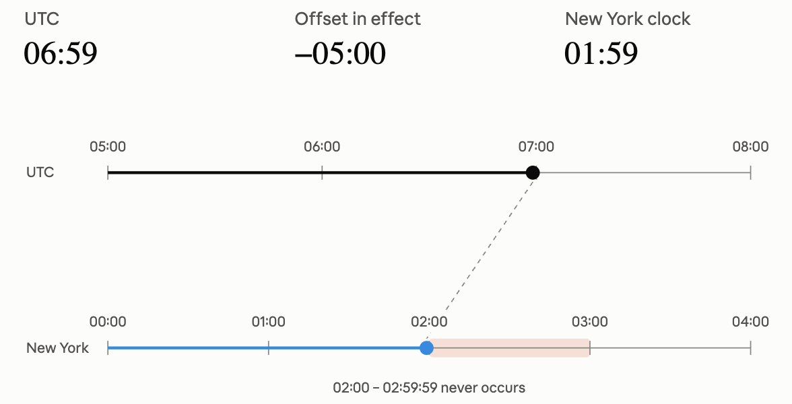
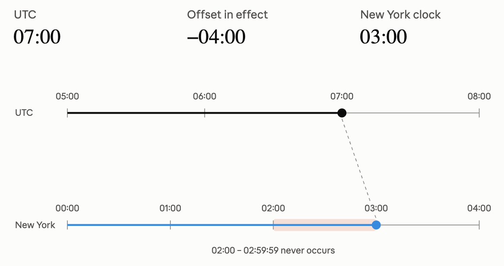

# Typescript: Temporal

Javascript는 아주 혼란스러운 시간을 지나왔습니다. 특히 es6로 넘어가기 전까지는 혼돈 그 자체였죠. 이제서야 어엿한 메이저 언어로서 자리매김했지만 한때는 정말 느리고, 건드리기 싫었던 언어였습니다. 그 덕에 2000년대 말에 RIA(플래시, 실버라이트 등)가 아주 인기를 끌기도 했었죠.

Javascript는 그 이후에 많은 변화를 거치면서 정돈되어 왔습니다. 그런데 아직까지도 제대로 해결되지 못한 부분도 여전히 존재합니다. 최근 Typescript 6.0에 Temporal 이라는 최상위 네임스페이스(ex: Math)가 추가되었는데요, 기존에 사용되어 왔던 Date도 아주 오래전 부터 해결되지 못했던 부분입니다. Temporal에 대한 이야기를 하기 전에 잠시 왜 이런 문제가 발생했는지 짧게 짚고 넘어가죠!

## Javascript의 간략한 역사

Maggie Pint에 따르면 2017년에 Javascript를 만든 브랜든 아이크(Brendan Eich)와 [다음과 같은 대화를 나눴다고 합니다.](https://maggiepint.com/2017/04/09/fixing-javascript-date-getting-started/)

> It is now common knowledge that in 1995 Brendan was given only 10 days to write the JavaScript language and get it into Netscape. Date handling is a fundamental part of almost all programming languages, and JavaScript had to have it. That said, it’s a complex problem domain and there was a short timeline. Brendan, under orders to “make it like Java” copied the date object from the existing, infant, java.Util.Date date implementation. This implementation was frankly terrible. In fact, basically all of it’s methods were deprecated and replaced in the Java 1.1 release in 1997. Yet we’re still living with this API 20 years later in the JavaScript programming language.

1995년 당시 Netscape 브라우저 출시를 앞두고 웹 페이지에 동적인 액션을 구현할 스크립트 언어가 필요했고, 그 언어를 10일 만에 완성해야 했습니다. 그리고 그 언어는 Java와 유사하게 만들어야 했다고 합니다. 그 당시 Java는 베타 버전 상태였고, 정식 1.0 출시는 1996년이었습니다. 그러니까 베타 버전이었던 언어의, 제대로 정리되지 않았던 구현을 그대로 Javascript로 옮겼고 그게 아직까지 제대로 정리되지 않았다 뭐 그런 이야기입니다. Javascript가 참고했던 Java 구현은 1997년에 교체되었다고 하니까, Javascript는 이미 이 세상에 존재하지 않는 deprecated된 구현을 30년 넘게 유지하고 있었던 셈이죠!

10일만에 언어를 만든다는 건 정말 대단한 일이죠. 그런데 그렇게 급조한 언어가 이렇게 인기를 끌게 될 줄은 아무도 몰랐던 거죠. 그러다보니 앤더스 헬스버그
(Anders Hejlsberg)가 `Javascript that scales`를 모토로 Typescript를 만들게 되기도 했죠.

## Temporal로 다시 돌아와서

Temporal은 이렇게 오래된 문제를 해결하기 위해 제안되었습니다. 뒤에서 자세히 알아보겠지만 우선 Temporal에서 뭘 지원해준다는 건지 알아볼까요?

Date는 혼자서 모든 걸 다 하려고 했지만, Temporal은 그걸 여러 타입으로 쪼갰습니다. 그래서 좀.. 복잡해 보일 수도 있긴 합니다.

| 타입 | 담는 것 | 값을 찍어보면 | 이럴 때 씁니다 |
| --- | --- | --- | --- |
| `PlainDate` | 날짜만 | `2026-07-31` | 생일, 기념일 |
| `PlainTime` | 시각만 | `09:00:00` | 매일 같은 시각에 울리는 알람 |
| `PlainDateTime` | 날짜 + 시각 | `2026-07-31T09:00:00` | 아직 어느 지역인지 안 정한 일정 |
| `ZonedDateTime` | 날짜 + 시각 + 타임존 | `2026-07-31T09:00:00-04:00[America/New_York]` | 실제로 잡힌 뉴욕 회의 |
| `Instant` | 절대적인 한 순간 | `2026-07-31T13:00:00Z` | 로그 시각, 서버끼리 시각 비교 |
| `Duration` | 흘러간 양(기간) | `P8M14D` (8개월 14일) | "3일 뒤", 두 날짜의 간격 |

잘 보시면 앞에 붙은 이름에 따라 타입이 다루는 값이 다릅니다.

- **`Plain`으로 시작하면 타임존이 없습니다.** 달력이나 시계에 적힌 글씨 그대로라고 보면 됩니다. "7월 31일 오전 9시"는 서울에서 읽든 뉴욕에서 읽든 그냥 7월 31일 오전 9시죠.
- **`Zoned`가 붙으면 값 안에 타임존까지 들어 있습니다.** 그래서 "뉴욕의 오전 9시"처럼 지구상의 딱 한 순간을 가리킬 수 있습니다.

`Instant`는 Date와 가장 비슷한 타입입니다. Date도 속을 들여다보면 "1970년 1월 1일부터 몇 밀리초 지났나"라는 숫자 하나거든요. 이 밖에 연-월만 담는 `PlainYearMonth`(`2026-07`), 월-일만 담는 `PlainMonthDay`(`07-31`), 지금 시각을 가져오는 `Temporal.Now`도 있습니다.

지금 이 테이블은 일단 확인만 해두세요, 이제 부터 Date 객체의 구체적인 문제점과 Temporal의 해결책을 하나씩 확인해 볼거니까요!

> `date-issues.js` 파일을 통해 각각의 문제점 코드를 확인할 수 있고, `date-issues-fixed.mjs` 파일을 통해 Temporal의 코드를 확인할 수 있습니다. node 24 버전까지는 Temporal이 지원되지 않으므로, `npm i @js-temporal/polyfill` 명령으로 폴리필을 설치해 줘야 합니다.

## 1. 타임존은 '로컬'과 'UTC' 딱 두 개뿐입니다

다음 예제를 볼까요?

```javascript
process.env.TZ = "America/New_York";

const noon = new Date("2026-07-31T12:00:00Z");
console.log("로컬: getHours()", noon.getHours()); // 로컬: getHours() 8
console.log("UTC: getUTCHours()", noon.getUTCHours()); // UTC: getUTCHours() 12

const seoulHour = new Intl.DateTimeFormat("en-CA", {
  timeZone: "Asia/Seoul",
  hour: "2-digit",
  hourCycle: "h23",
}).format(noon);

// 결과값이 문자열이므로, 시간의 계산은 불가
console.log("서울: ", seoulHour); // 서울:  21
```

noon은 UTC로 7월 31일 12시 입니다. 이 시점에서 다른 타임존을 적용해서, 예를 들면 UTC->Asia/Seoul 로 변환해서 값을 가져와야 할 때가 있겠죠. 그런데 Date 객체는 딱 두가지만 지원합니다. UTC로 가져오던지, 현재 이 코드를 실행 중인 장비의 로컬 타임존으로 가져오던지.

Intl.DateTimeFormat을 활용하면 다른 타임존의 값을 가져올 수는 있지만, 결과가 문자열이기 때문에 표시이외의 용도로 사용하려면 또 다른 변환 작업을 해야만 합니다.

### Temporal은 날짜에 타임존을 결합할 수 있습니다

Temporal은 날짜 값에 타임존을 결합할 수 있습니다(ZonedDateTime). 그 결과 특정 시점에서 다른 타임존의 변환은 물론, 변환된 날짜를 기반으로 계산도 가능합니다.

```javascript
// 특정 순간을 의미하는 Instant를 생성(Date는 항상 Instant 입니다)
const noon = Temporal.Instant.from("2026-07-31T12:00:00Z");

// 각 타임존으로 noon을 변환
for (const tz of ["America/New_York", "UTC", "Asia/Seoul"]) {
  const z = noon.toZonedDateTimeISO(tz);
  console.log(`${tz.padEnd(20)} ${z.hour}시  (offset ${z.offset})`);
  // America/New_York     8시  (offset -04:00)
  // UTC                  12시  (offset +00:00)
  // Asia/Seoul           21시  (offset +09:00)
}

// 문자열이 아니라 값이므로 그대로 계산에 쓸 수 있습니다.
const seoul = noon.toZonedDateTimeISO("Asia/Seoul");
console.log("서울 기준 3시간 뒤:", seoul.add({ hours: 3 }).hour + "시"); // 서울 기준 3시간 뒤: 0시
```

## 2. 파서(parser)를 신뢰할 수 없습니다

Date 객체는 문자열을 날짜로 변환할 수 있습니다. 그런데 문자열을 해석하는 파서의 동작이 명확하지 않습니다. 아주 간단하게 살펴볼까요?

```javascript
process.env.TZ = "America/New_York";

for (const input of [
  '2026-07-31', //       날짜만 있는 ISO      → UTC로 해석
  '2026-07-31T09:00', // 시각이 붙은 ISO      → 로컬로 해석 (!)
  '2026-07-31 09:00', // T 대신 공백          → 명세 밖, 엔진 재량
  '07/31/2026', //       ISO가 아예 아님      → 명세 밖, 엔진 재량
  '2026-07-31T09:00Z', // 명시적 UTC          → UTC로 해석
]) {
  console.log(input, "-->", new Date(input).toISOString());
}
// 2026-07-31 --> 2026-07-31T00:00:00.000Z
// 2026-07-31T09:00 --> 2026-07-31T13:00:00.000Z
// 2026-07-31 09:00 --> 2026-07-31T13:00:00.000Z
// 07/31/2026 --> 2026-07-31T04:00:00.000Z
// 2026-07-31T09:00Z --> 2026-07-31T09:00:00.000Z

```

날짜만 있는 경우 UTC로, 시간이 붙어 있는 경우 로컬로... 이렇게 좀 복잡한 동작을 수행합니다.

### Temporal은 명확한 규칙을 요구합니다

```javascript
// 날짜만 있는 문자열 → PlainDate. 타임존이 아예 개입하지 않습니다.
console.log(`PlainDate.from("2026-07-31")`, Temporal.PlainDate.from("2026-07-31").toString()); // PlainDate.from("2026-07-31") 2026-07-31

// 시각까지 있지만 타임존이 없는 문자열 → PlainDateTime. 역시 타임존은 포함되지 않습니다.
console.log(`PlainDateTime.from("...T09:00")`, Temporal.PlainDateTime.from("2026-07-31T09:00").toString()); // PlainDateTime.from("...T09:00") 2026-07-31T09:00:00

// 명확한 시점을 원하면 타임존을 명시해야 합니다. 생략하면 통과하지 않습니다.
console.log(`ZonedDateTime.from("...[NY]")`, Temporal.ZonedDateTime.from("2026-07-31T09:00[America/New_York]").toString()); // ZonedDateTime.from("...[NY]") 2026-07-31T09:00:00-04:00[America/New_York]

// 추측을 요구하는 입력은 모두 거부됩니다.
for (const [desc, action] of [
  ["타임존 없이 Instant 요구", () => Temporal.Instant.from("2026-07-31T09:00")],
  ["타임존 없이 Zoned 요구", () => Temporal.ZonedDateTime.from("2026-07-31T09:00")],
  ["존재하지 않는 2월 30일", () => Temporal.PlainDate.from("2026-02-30")],
  ["ISO가 아닌 07/31/2026", () => Temporal.PlainDate.from("07/31/2026")],
  ["banana", () => Temporal.PlainDate.from("banana")],
]) {
  try {
    console.log(desc, "→", action().toString(), "(통과)");
  } catch (e) {
    console.log(desc, "→", e.constructor.name, "즉시 예외");
  }
}
// 타임존 없이 Instant 요구 → RangeError 즉시 예외
// 타임존 없이 Zoned 요구 → RangeError 즉시 예외
// 존재하지 않는 2월 30일 → RangeError 즉시 예외
// ISO가 아닌 07/31/2026 → RangeError 즉시 예외
// banana → RangeError 즉시 예외
```

## 3. Date는 변경 가능(mutable)합니다

Date 객체는 const로 선언해서 불변하도록(immutable) 만들 수 없습니다.

```javascript
function startOfMonth(date) {
  date.setDate(1); // 인자로 받은 객체를 직접 수정합니다
  return date;
}

const someDate = new Date('2026-07-31T12:00:00Z');
console.log("함수 호출 전", someDate.toISOString().slice(0, 10)); // 함수 호출 전 2026-07-31
startOfMonth(someDate);
console.log("함수 호출 후", someDate.toISOString().slice(0, 10)); // 함수 호출 후 2026-07-01
```

### Temporal의 날짜는 불변(immutable) 합니다

```javascript
function startOfMonth(date) {
  return date.with({ day: 1 }); // 원본을 건드리지 않고 새 값을 반환
}

const someDate = Temporal.PlainDate.from("2026-07-31");
console.log("함수 호출 전", someDate.toString()); // 함수 호출 전 2026-07-31
const firstDay = startOfMonth(someDate);
console.log("함수 호출 후", someDate.toString(), "  ← 원본 그대로"); // 함수 호출 후 2026-07-31   ← 원본 그대로
console.log("반환값", firstDay.toString()); // 반환값 2026-07-01
```

## 4. 서머타임(DST) 동작을 예측할 수 없습니다

서머타임은 시간을 1시간 앞당겨서 해가 떠있는 시간을 좀 더 많이 활용할 수 있도록 하는 제도입니다. 그래서 특정 시간부터 시간이 1시간 앞당겨지고, 서머타임이 끝날 때는 1시간 밀리게 됩니다.

미국의 경우 3월의 둘째 일요일 오전 2시에 서머타임이 시작됩니다. 그러니까 2026년으로 치면 3월 8일 오전 1시 59분에서 2시가 되는 순간, 서머타임이 적용되면서 2시가 아닌 3시가 되는겁니다.

그림으로 보자면, 우선 뉴욕의 2026년 3월 8일 오전 1시 59분입니다.

<p align="center"></p>

그리고 오전 2시가 되는 순간, 2시가 통째로 사라지고 3시가 됩니다!

<p align="center"></p>

UTC 시간을 잘 보시면, 시간은 그대로 흘러가지만 표시되는 시간만 2시 -> 3시로 변경되면서 2시가 통째로 사라지게 됩니다. 즉 3월 8일 오전 2시 30분은 존재할 수 없는 시간이며, 3월 8일은 24시간이 아닌 23시간짜리 하루입니다.

Date 객체는 이 문제를 제대로 처리하지 못합니다.

```javascript
// 3월의 두번째 일요일 2am -> 3am으로 변경(-05:00 EST-> -04:00 EDT). 따라서 뉴욕기준 2026년 3월 8일 2am은 존재하지 않음.
// 따라서 2026년 3월 8일은 23시간
// 이후 11월 1일 2am에 다시 EDT->EST로 변경되며, 1am을 두번 통과하므로 11월 1일은 25시간
const beforeSpringForward = new Date('2026-03-08T00:00:00-05:00');
console.log("3월 8일 자정", beforeSpringForward); // 3월 8일 자정 2026-03-08T05:00:00.000Z

// 다음 날(+ 86,400,000 ms) -> 2026-03-09T05:00:00.000Z 이므로, EDT 기준으로는 3월 9일 오전 1시.
const nextDay = new Date(beforeSpringForward.getTime() + 86400000);
console.log("다음날 자정이 아니다!", nextDay.toLocaleString('en-US', { timeZone: 'America/New_York' })); // 다음날 자정이 아니다! 3/9/2026, 1:00:00 AM
```

### Temporal은 서머타임이 정확하게 적용됩니다!

days/weeks/months와 같이 달력의 날짜 기준 계산에는 DST를 적용하고, 시간 단위 계산은 Date와 동일하게 정확한 시간 단위로 계산합니다.

```javascript
const midnight = Temporal.ZonedDateTime.from("2026-03-08T00:00[America/New_York]");

console.log("3월 8일 자정", midnight.toString());
console.log("  .add({ days: 1 })  ", midnight.add({ days: 1 }).toString(), " ← 진짜 다음 날 자정"); // .add({ days: 1 })   2026-03-09T00:00:00-04:00[America/New_York]  ← 진짜 다음 날 자정
console.log("  .add({ hours: 24 })", midnight.add({ hours: 24 }).toString(), " ← 24시간 뒤 (오전 1시)"); // .add({ hours: 24 }) 2026-03-09T01:00:00-04:00[America/New_York]  ← 24시간 뒤 (오전 1시)

// 하루가 몇 시간인지 직접 물어볼 수 있습니다.
for (const d of ["2026-03-07", "2026-03-08", "2026-11-01"]) {
  const z = Temporal.PlainDate.from(d).toZonedDateTime({ timeZone: "America/New_York" });
  console.log(`  ${d} → ${z.hoursInDay}시간`);
}
// 2026-03-07 → 24시간
// 2026-03-08 → 23시간
// 2026-11-01 → 25시간

// 존재하지 않는 시각을 예약하려 하면 조용히 옮기지 않고 거부할 수 있습니다.
for (const option of ["compatible", "reject"]) {
  try {
    const r = Temporal.PlainDateTime.from("2026-03-08T02:30")
      .toZonedDateTime("America/New_York", { disambiguation: option });
    console.log(`  02:30 (${option})`.padEnd(24), r.toPlainTime().toString(), "← 조용히 이동함");
  } catch (e) {
    console.log(`  02:30 (${option})`.padEnd(24), e.constructor.name, "← 없는 시각이라고 알려줌");
  }
}
// 02:30 (compatible)     03:30:00 ← 조용히 이동함
// 02:30 (reject)         RangeError ← 없는 시각이라고 알려줌

// 11월 1일 01:30은 두 번 존재합니다. 어느 쪽인지 고를 수 있습니다.
for (const option of ["earlier", "later"]) {
  const r = Temporal.PlainDateTime.from("2026-11-01T01:30")
    .toZonedDateTime("America/New_York", { disambiguation: option });
  console.log(`  01:30 (${option})`.padEnd(24), r.toInstant().toString());
}
// 01:30 (earlier)        2026-11-01T05:30:00Z
// 01:30 (later)          2026-11-01T06:30:00Z
```

## 5. 계산 API가 조악합니다

Date 객체는 제대로된 날짜 계산 API를 제공하지 않고, 메서드의 이름은 오래 전에 혼란스러웠던 형태를 그대로 가지고 있습니다.(심지어 month는 0부터 시작합니다!)

```javascript
// 1월 31일 + 1달 -> 2월 31일 -> 3월 3일
const monthEnd = new Date('2026-01-31T12:00:00Z');
monthEnd.setUTCMonth(monthEnd.getUTCMonth() + 1);
console.log("1월 31일 + 1달", monthEnd.toISOString().slice(0, 10)); // 1월 31일 + 1달 2026-03-03

// 두 날짜의 차이 구하기. 86,400,000 ms를 이용해서 나눠야 함. DST를 사용하는 경우 1년에 두 번 틀림
const rangeStart = new Date('2026-01-01T00:00:00Z');
const rangeEnd = new Date('2026-09-15T00:00:00Z');
console.log("두 날짜의 간격", (rangeEnd - rangeStart) / 86400000); // 두 날짜의 간격 257

// 날짜의 각 요소 구하기, getMonth는 0부터 시작하고, getDay는 요일을 리턴 함.
const july31 = new Date("2026-07-31T12:00:00Z");
console.log("getMonth:", july31.getUTCMonth());
console.log("getDay:", july31.getUTCDay());
console.log("getFullYear:", july31.getUTCFullYear());
// getMonth: 6
// getDay: 5
// getFullYear: 2026
```

### Temporal은 오해 없이 정확한 API를 제공합니다.

```javascript
// 1월 31일 + 1달 → 2월 28일로 잘라냅니다(clamp). 3월로 넘어가지 않습니다.
const endMonth = Temporal.PlainDate.from("2026-01-31");
console.log("1월 31일 + 1달      ", endMonth.add({ months: 1 }).toString()); // 1월 31일 + 1달       2026-02-28
console.log(`  overflow:"reject" `, (() => {
  try { return endMonth.add({ months: 1 }, { overflow: "reject" }).toString(); }
  catch (e) { return e.constructor.name + " (넘침을 알려달라고 할 수도 있음)"; }
})());
// overflow:"reject"  RangeError (넘침을 알려달라고 할 수도 있음)

// 주의: 한 달씩 두 번 더하는 것과 두 달을 한 번에 더하는 것은 다릅니다.
// ex: 매월 구독 결제일은 최초 결제일에서 누적된 달만큼 한 번에 계산해야 합니다.
console.log("  1달+1달           ", endMonth.add({ months: 1 }).add({ months: 1 }).toString()); // 1달+1달            2026-03-28
console.log("  2달 한 번에       ", endMonth.add({ months: 2 }).toString()); // 2달 한 번에        2026-03-31

// 두 날짜의 간격. 86,400,000 같은 상수가 필요 없습니다.
const start = Temporal.PlainDate.from("2026-01-01");
const end = Temporal.PlainDate.from("2026-09-15");
console.log("두 날짜의 간격(일)  ", start.until(end).total({ unit: "day" })); // 두 날짜의 간격(일)   257
console.log("  ISO 8601 표기     ", start.until(end, { largestUnit: "month" }).toString()); // ISO 8601 표기      P8M14D

// 필드 접근. 메서드가 아니라 속성이고, 월은 1부터 시작합니다.
const july31 = Temporal.PlainDate.from("2026-07-31");
console.log("month (1부터)       ", july31.month);
console.log("day   (일)          ", july31.day);
console.log("dayOfWeek (요일)    ", july31.dayOfWeek, "(1=월요일)");
console.log("year                ", july31.year);
console.log("daysInMonth         ", july31.daysInMonth);
// month (1부터)        7
// day   (일)           31
// dayOfWeek (요일)     5 (1=월요일)
// year                 2026
// daysInMonth          31
```

## 6. 그레고리력 외의 달력을 지원하지 않습니다

그레고리력은 1582년 교황 그레고리우스 13세가 반포했으며, 윤년과 관련된 오차를 없애기 위해서 제정되었습니다. 지금 전 세계가 쓰고 있는 달력이 바로 그레고리력인 셈이죠. 하지만 가끔은 다른 달력을 써야 하는 경우도 있습니다.

우리와 가장 가까운 나라인 일본을 보자면, 2026년 7월 31일에 연호를 붙여서 "레이와 8년 7월 31일" 이라고 표현합니다. 이런 그레고리력 이외의 달력을 Date 객체는 제대로 지원하지 않습니다.

```javascript
const july31 = new Date("2026-07-31T12:00:00Z");

// 표기는 가능하지만, 결과는 문자열 값이므로 1과 같은 이유로 날짜 계산 등은 불가능.
for (const calendar of ['hebrew', 'islamic-umalqura', 'japanese', 'buddhist']) {
  console.log(
    calendar,
    new Intl.DateTimeFormat(`en-u-ca-${calendar}`, {
      timeZone: 'UTC',
      dateStyle: 'long',
    }).format(july31)
  );
}
// hebrew 17 Av 5786
// islamic-umalqura Safar 17, 1448 AH
// japanese July 31, 8 Reiwa
// buddhist July 31, 2569 BE
```

### Temporal은 제대로 지원합니다.

```javascript
const july31 = Temporal.PlainDate.from("2026-07-31");

for (const calendar of ['hebrew', 'islamic-umalqura', 'japanese', 'buddhist']) {
  const d = july31.withCalendar(calendar);
  const year = d.era ? `${d.era} ${d.eraYear}년 (연속 ${d.year})` : `${d.year}년`;
  console.log(calendar, year);
}
// hebrew 5786년
// islamic-umalqura 1448년
// japanese reiwa 8년 (연속 2026)
// buddhist 2569년

// 문자열이 아니기 때문에 계산이 가능합니다.
const japaneseJuly31 = july31.withCalendar("japanese");
console.log(japaneseJuly31.add({ days: 2}).toString()); // 2026-08-02[u-ca=japanese]
```

## Temporal의 현재

[Temporal 스펙은 현재 Stage 4 단계](https://github.com/tc39/proposal-temporal#status)이며, 곧 표준으로 병합될 예정입니다. 주요 브라우저들(Safari는 2026년 8월 기준으로 아직 개발 중)은 구현을 마쳤고, Node.js 역시 26 버전에서 Temporal을 정식 지원하고 있습니다.

정식 지원되지 않는 환경에서 Temporal을 사용하려면, `@js-temporal/polyfill` 를 통해 폴리필해서 사용하는 방법이 권장됩니다.

## Typescript의 지원

Typescript 6 와 7에서 Temporal을 정식 지원합니다. 하지만, 지원되는 건 어디까지나 타입 체크이고 실제 실행은 js 런타임에서 진행되니까 실행 가능 여부는 js 런타임에 의해 결정됩니다.

우선 typescript 7 을 설치하고 node의 버전을 체크합니다.

```bash
> npm i -D typescript@7 @types/node
> node -v         
v26.6.0
```

> VS Code를 사용하는 경우, `Typescript 7` 확장을 설치해야 7 버전의 IDE 지원을 받을 수 있습니다.

그리고 `tsconfig.json` 을 다음과 같이 설정합니다.

```json
{
  "compilerOptions": {
    "target": "esnext",
    "module": "nodenext",
    "moduleResolution": "nodenext",
    "lib": ["esnext", "dom"],
    "types": ["node"],
    "strict": true,
    "skipLibCheck": true,
    "noEmit": true
  }
}
```

그리고 다음 코드를 작성합니다.

```typescript
// Temporal은 전역(global)이므로 import가 필요 없습니다.
// 타입은 tsconfig의 lib: ["esnext"] 에서 옵니다.
const meeting: Temporal.ZonedDateTime =
  Temporal.ZonedDateTime.from('2026-03-08T09:00[America/New_York]');

console.log(meeting.toString());
console.log(`이 날은 ${meeting.hoursInDay}시간`);          // 23 — 서머타임 시작
console.log('서울에서는:', meeting.withTimeZone('Asia/Seoul').toPlainDateTime().toString());
```

그리고 다음과 같이 실행하여 결과를 확인할 수 있습니다.

```bash
> node temporal.ts 
2026-03-08T09:00:00-04:00[America/New_York]
이 날은 23시간
서울에서는: 2026-03-08T22:00:00
```

## 마치면서

아주 가끔씩 생각날 때 마다 Typescript 업데이트 노트를 읽어봅니다. 이번에도 Go로 재작성된 7 버전도 보고 6 버전도 읽어봤습니다. 그러던 중에 Temporal이라는 게 있는데 이게 도대체 뭔지 모르겠더군요. 그래서 이리저리 찾아보면서 미래의 저를 위해서 정리를 해봤는데 생각보다 꽤나 복잡한 내용이었습니다. 아마도 가까운 시일 내에 금방 잊어버리겠죠...하하하...

## 참고자료

- [tc39/proposal-temporal](https://github.com/tc39/proposal-temporal#status)
- [Fixing JavaScript Date – Getting Started](https://maggiepint.com/2017/04/09/fixing-javascript-date-getting-started/)
- [What Permanent Daylight Saving Time Could Mean for You](https://www.usnews.com/news/national-news/articles/2026-07-16/the-house-voted-for-permanent-daylight-saving-time-here-is-what-it-means-for-you)
- [Announcing TypeScript 7.0](https://devblogs.microsoft.com/typescript/announcing-typescript-7-0/)
- [Announcing TypeScript 6.0](https://devblogs.microsoft.com/typescript/announcing-typescript-6-0/)