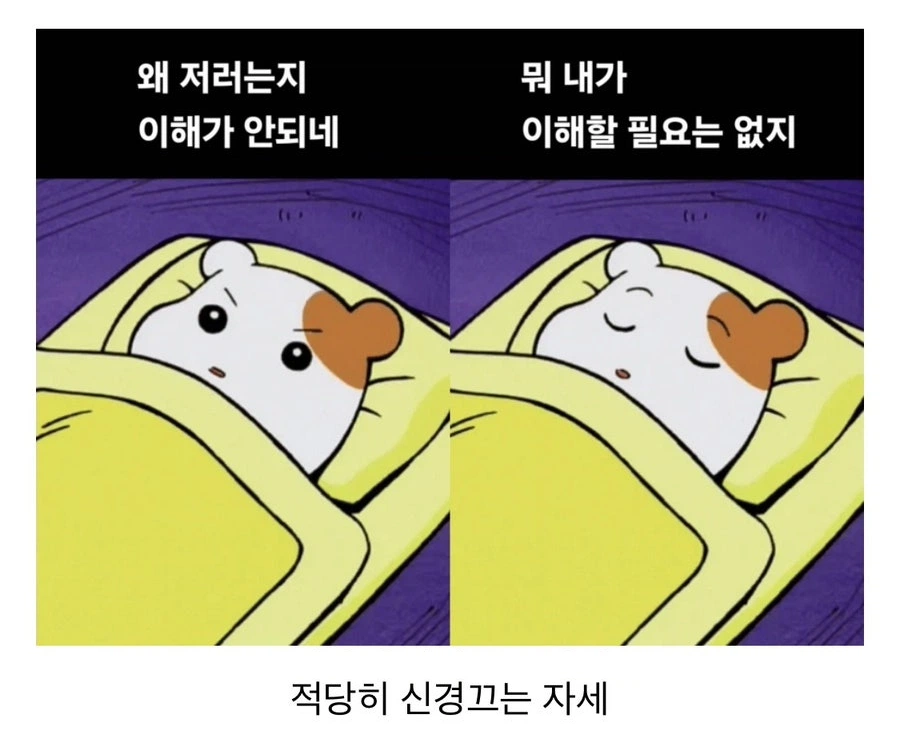

# go를 알아보자(2) - gRPC

[paxos 기반의 분산 key-value 스토어](https://github.com/netscout/dkv) 를 만들면서 가장 처음에 '뭐지?' 싶었던 건 gRPC였습니다. gRPC자체를 몰랐다기 보다는 뭔가 코드가 완전 암호같아 보였기 때문이죠. 그래서 gRPC만 우선 따로 간단하게 이해해보자 하고 간단한 앱을 만들어 보고 한 줄씩 따라가면서 이해해보려고 노력했습니다.

## gRPC란?

RPC(Remote Procedure Call)은 원격, 그러니까 실행되는 프로그램 입장에서 자신이 아닌 외부의 함수를 호출하는 걸 뜻합니다. 그럼 `g`는 뭐냐 싶었는데 찾아보니 이건 좀 [개발자들의 말장난](https://github.com/bojand/fsto-2018-grpc/blob/master/slides.md#grpc-) 같은 느낌이네요... 버전마다 뜻이 다르답니다. 뭐 그렇다니까 그렇겠죠...

<p align="center"></p>

어쨌거나 gRPC는 바이너리 형식인 Protocol Buffer(protobuf)를 사용해서 REST에 비해 매우 빠르고, 엄격하게 주고 받을 데이터 및 호출할 함수에 대한 정의를 해줄 수 있는 등의 장점이 있습니다. 단점이라면... 코드가 기존 REST에 비해서 좀 이해하기 어렵다? 별도의 코드 생성과정이 필요하다? 뭐 이런게 있겠네요. 그래서 저도 좀 이해하기가 어려웠었죠.

| 항목 | REST | gRPC |
|------|------|------|
| 프로토콜 | HTTP/1.1 (주로) | HTTP/2 |
| 데이터 형식 | JSON (텍스트) | Protocol Buffers (바이너리) |
| 계약 정의 | OpenAPI/Swagger (선택) | .proto 파일 (필수) |
| 스트리밍 | 제한적 | 양방향 스트리밍 지원 |
| 브라우저 지원 | 네이티브 | gRPC-Web 필요 |

## 그냥 한 번 해보자!

자 그럼 일단 그냥 한 번 해보죠. 아주 간단하게 서버와 클라이언트가 인사를 주고 받는 예제를 만들어 보겠습니다.

### 폴더 생성 및 go 모듈을 초기화

`grpc-helloworld` 폴더를 만들고 모듈을 초기화 합니다.

```bash
> mkdir grpc-helloworld
> cd grpc-helloworld
> go mod init grpc-helloworld
```

### gRPC 계약(contract) 작성

이제 gRPC를 통해 어떤 메시지를 주고 받을 거며, 어떤 원격의 함수를 호출할 수 있는지 계약(contract)을 정의해주겠습니다. `greet.proto` 파일에 다음과 같이 작성합니다.

```proto
syntax = "proto3";

package greet;

// 생성된 go 코드가 위치할 경로
option go_package = "./pb";

// gRPC를 통해 제공할 서비스(함수 목록)
service Greeter {
  rpc SayHello (HelloRequest) returns (HelloReply) {}
}

// 요청 메시지 형식
message HelloRequest {
  string name = 1; // 필드 번호
}

// 응답 메시지 형식
message HelloReply {
  string message = 1; // 필드 번호
}
```

추가 설명이 필요 없을 정도로 직관적이죠?

### gRPC 코드 생성

이제 proto 파일에 정의된 서비스를 호출 및 응답하는데 사용할 코드를 생성해야 합니다.

```bash
# Protocol Buffer 컴파일러 설치
# macos의 경우
> brew install protobuf
# linux(ubuntu / debian)의 경우
# > sudo apt install -y protobuf-compiler

# go install 명령으로 설치된 패키지 경로 설정
> echo 'export PATH="$PATH:$(go env GOPATH)/bin"' >> ~/.zshrc
> source ~/.zshrc

# grpc 관련 패키지 설치
> go install google.golang.org/protobuf/cmd/protoc-gen-go@latest
> go install google.golang.org/grpc/cmd/protoc-gen-go-grpc@latest

# 코드 생성
> protoc --go_out=. --go-grpc_out=. greet.proto
```

pb 폴더를 확인해보면 `greet_grpc.pb.go`, `greet.pb.go` 파일 두 개가 생성된 걸 확인할 수 있습니다.

- greet.pb.go: proto 파일에 정의된 서비스와 요청/응답 메시지에 대한 정의를 담고 있습니다.
- greet_grpc.pb.go: gRPC 클라이언트와 서버의 구현을 담고 있습니다.

### 서버 코드 작성

일단 코드를 작성하기 전에 다음 명령을 실행하여 부수적으로 필요한 패키지들을 모두 설치하고, go.mod 파일을 정리하도록 합니다.

```bash
> go mod tidy
```

그리고 `server/main.go` 파일을 다음과 같이 작성합니다.

```go
package main

import (
	"context"
	"log"
	"net"

	"grpc-helloworld/pb"

	"google.golang.org/grpc"
)

type server struct {
	/*
		"protoc --go_out=. --go-grpc_out=. greet.proto" 명령으로 생성된 코드에는 greeterServer, greeterClient 구현이 있음.
		UnimplementedGreeterServer 구조체 역시 protoc가 생성한 것으로 proto 파일에 정의된 Greeter 서비스의 모든 메서드에 대해 껍데기 구현을 가지고 있음.(호출시 codes.Unimplemented 오류 리턴)
		이는 추후 proto 파일에 새로운 메서드가 추가되고, 이에 대한 구현이 되지 않았을 때 컴파일 단계의 오류를 방지하기 위함.
		-> 컴파일은 잘 되지만, 해당 함수를 호출하면 codes.Unimplemented 오류 리턴.
	*/
	pb.UnimplementedGreeterServer
}

// pb.UnimplementedGreeterServer의 SayHello 함수를 오버라이드(더 정확히는 덮어서 감추기, shadowing)
func (s *server) SayHello(ctx context.Context, in *pb.HelloRequest) (*pb.HelloReply, error) {
	return &pb.HelloReply{Message: "Hello " + in.GetName()}, nil
}

func main() {
	// 50051번 포트에 대해 네트워크 리스너를 생성
	lis, err := net.Listen("tcp", ":50051")
	if err != nil {
		log.Fatalf("failed to listen: %v", err)
	}

	// gRPC 서버 생성
	s := grpc.NewServer()
	// Greeter grpc 서비스에 서버를 등록
	pb.RegisterGreeterServer(s, &server{})

	// 서버 시작
	log.Println("Server listening at :50051")
	if err := s.Serve(lis); err != nil {
		log.Fatalf("failed to serve: %v", err)
	}
}
```

이 코드에서 유심히 봐야 할 내용은(처음에 제가 이해를 못했던 내용은) server 선언부 입니다. 이걸 이해하려면 일단 `greet_grpc.pb.go` 파일의 다음 내용을 봐야 합니다.

```go
...

// UnimplementedGreeterServer must be embedded to have
// forward compatible implementations.
//
// NOTE: this should be embedded by value instead of pointer to avoid a nil
// pointer dereference when methods are called.
type UnimplementedGreeterServer struct{}

func (UnimplementedGreeterServer) SayHello(context.Context, *HelloRequest) (*HelloReply, error) {
	return nil, status.Error(codes.Unimplemented, "method SayHello not implemented")
}

...
```

proto 파일에 정의했던 서비스의 함수가 UnimplementedGreeterServer의 메서드로 정의되어 있는데요, 내용을 보면 `이 함수가 아직 구현되지 않았다` 는 오류 메시지입니다. 그러니까 gRPC 서버를 구현할 때, `SayHello` 라는 메서드를 직접 구현하지 않으면 대신 이 기본 구현이 실행되면서 `서비스를 제공할 함수를 구현해야 한다` 고 알려주는 거죠.

근데 왜 이렇게 할까요? 이건 안전장치입니다.

새로운 gRPC 함수가 추가된다고 생각해보죠. 그러면 우선 proto 파일을 수정합니다. 그리고 코드를 생성하죠. 그런데 만약 gRPC 서버 구현을 맡은 사람이 새 함수를 구현하는 걸 깜빡하면 어떻게 될까요? 갑자기 gRPC 서버는 컴파일 조차 되지 않을겁니다. 인터페이스의 함수를 모두 구현하지 못했기 때문이죠.

그런데 기본 구현을 생성해서 그걸 서버 구현에 임베드 하게 된다면? 구현을 못 한 상태에서도 기존 구현은 아무 문제 없이 컴파일 되고 동작합니다!

### 클라이언트 코드 작성

다음으로 `client/main.go`를 다음과 같이 작성합니다.

```go
package main

import (
	"context"
	"grpc-helloworld/pb"
	"log"
	"time"

	"google.golang.org/grpc"
	"google.golang.org/grpc/credentials/insecure"
)

func main() {
	// 1. 서버에 연결하기
	conn, err := grpc.NewClient("localhost:50051", grpc.WithTransportCredentials(insecure.NewCredentials()))
	if err != nil {
		log.Fatalf("failed to dial: %v", err)
	}
	defer conn.Close()

	// 2. GreeterClient 생성
	client := pb.NewGreeterClient(conn)

	// 3. SayHello 메서드 호출(1초 동안 서버가 응답하지 않으면 컨텍스트 취소)
	ctx, cancel := context.WithTimeout(context.Background(), time.Second)
	defer cancel()

	r, err := client.SayHello(ctx, &pb.HelloRequest{Name: "World"})
	if err != nil {
		log.Fatalf("failed to say hello: %v", err)
	}

	log.Printf("Server response: %s", r.GetMessage())
}
```

gRPC 서버에 연결해서 요청을 보내고 응답을 수신합니다. 만약 요청이 처리되는데 1초 이상 소요된다면, 요청을 취소하게 설정되었습니다.

### 서버와 클라이언트 실행

2개의 터미널을 열고 먼저 서버를 실행합니다.

```bash
❯ go run server/main.go
2026/03/22 10:22:14 Server listening at :50051
```

그리고 클라이언트를 실행해서 요청을 전송하고 응답을 받습니다.

```bash
❯ go run client/main.go
2026/03/22 10:22:51 Server response: Hello World
```

## 정리

매우 간단한 예제지만 gRPC 계약 정의와 코드 생성 및 서버와 클라이언트 사용 등의 내용은 충분히 확인할 수 있었습니다. 이걸 몰랐을 때는 완전히 블랙박스 처럼 보였던 코드와 과정을 좀 더 명확하게 이해할 수 있었죠! 이 글의 모든 학습과정은 gemini가 생성한 튜토리얼을 기반으로 저의 삽질을 통해 진행하였습니다.