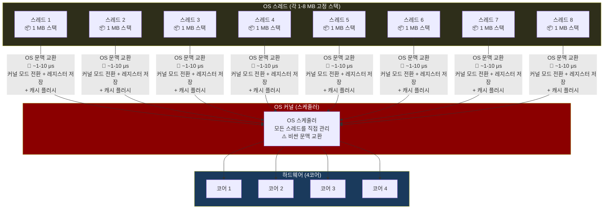
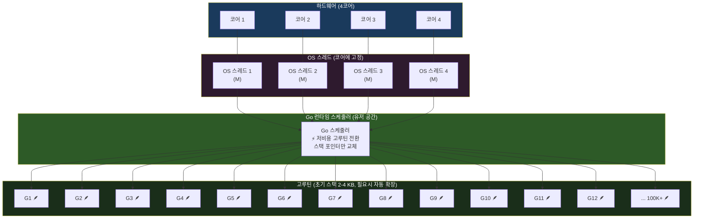

# 분산 시스템 설계(1) - Paxos 알고리즘(GO)

[지난 글](../%EB%B6%84%EC%82%B0%20%EC%8B%9C%EC%8A%A4%ED%85%9C%20%EC%84%A4%EA%B3%84%281%29%20-%20Paxos%20%EC%95%8C%EA%B3%A0%EB%A6%AC%EC%A6%98/%EB%B6%84%EC%82%B0%20%EC%8B%9C%EC%8A%A4%ED%85%9C%20%EC%84%A4%EA%B3%84%281%29%20-%20Paxos%20%EC%95%8C%EA%B3%A0%EB%A6%AC%EC%A6%98.md)에서는 Paxos 알고리즘에 대해서 정리를 했고, 리더 선출 예시를 살펴보면서 구체적인 알고리즘 동작과정을 살펴봤습니다. 해당 예시는 node.js로 작성을 했었죠. 이번에는 그 예시의 Go 버전을 확인해볼까 합니다. 이유는... 별게 없고 그냥 제가 최근에 Go를 좀 보기 시작 했기 때문입니다! 하하하하하....

구조와 동작은 지난 글의 내용과 똑같습니다. 다만, Go는 접근 방식이 다르다 보니 구체적인 구현에서는 좀 차이를 보이는데요. 그런 특징적인 부분들을 정리해보고자 합니다. 미래의 저를 위해서 말이죠!

## 목차

- [코드 실행 방법](#코드-실행-방법)
- [프로그램 진입점 구현](#프로그램-진입점-구현)
- [클러스터 관리자 cli 구현](#클러스터-관리자-cli-구현)
  - [map 타입](#map-타입)
  - [동시성 처리 및 lock 걸기](#동시성-처리-및-lock-걸기)
    - [스레드와 고루틴 비교](#스레드와-고루틴-비교)
    - [동시성 처리 작업에 lock 걸기](#동시성-처리-작업에-lock-걸기)
  - [채널](#채널)
  - [즉시 실행 익명 함수(IIFE)로 defer 보장](#즉시-실행-익명-함수iife로-defer-보장)
- [웹 서버 노드 구현](#웹-서버-노드-구현)
  - [포인터를 이용한 nullable 필드(*int)](#포인터를-이용한-nullable-필드int)
  - [모든 고루틴이 종료될 때까지 기다리는 WaitGroup](#모든-고루틴이-종료될-때까지-기다리는-waitgroup)
  - [채널 select -> 채널을 위한 switch](#채널-select---채널을-위한-switch)
  - [context.Context 로 우아한 종료(graceful shutdown)](#contextcontext-로-우아한-종료graceful-shutdown)
- [참고자료](#참고자료)

## 코드 실행 방법

go는 원래 컴파일을 통해 실행 파일을 생성하지만, 다음 명령을 통해 바로 실행 해볼 수 있으며, 실행 과정은 이전의 node.js 버전과 동일합니다!

```bash
> go run . cluster
```

> go run 명령도 컴파일을 합니다! 컴파일을 통해 임시 바이너리를 생성해서 실행을 하지만, 눈에 보이지 않을 뿐입니다. 개발 중에 계속 컴파일 -> 실행은 너무 귀찮죠 하하하하...

## 프로그램 진입점 구현

프로그램이 시작되는 `main.go`는 다음과 같습니다.

```go
package main

import (
	"fmt"
	"os"
)

func main() {
	if len(os.Args) < 2 {
		fmt.Println("사용법:")
		fmt.Println("  go run . cluster              -- 클러스터 모드 (3개 노드 실행)")
		os.Exit(1)
	}

	switch os.Args[1] {
	case "node":
		runNode() // 클러스터 관리 cli가 각 노드를 실행할 때 사용
	case "cluster":
		runCluster() // 클러스터 관리 cli를 실행
	default:
		fmt.Printf("알 수 없는 명령어: %s\n", os.Args[1])
		os.Exit(1)
	}
}
```

프로그램에 설정된 인자에 따라서 서로 다른 모드로 실행합니다.
- cluster: 클러스터 관리 cli를 실행
- node: 서버 노드를 실행

앞서 실행 방법에서 봤듯이 우리는 "cluster" 모드로 클러스터 관리 cli를 실행합니다. 그리고 클러스터 관리 cli가 "node" 모드로 3개의 서버 노드를 실행하게 되죠. `main.go`와 이후에 살펴볼 `cluster.go`, `node.go` 가 모두 같은 `main` 패키지에 포함되어 있기 때문에 다른 파일의 함수를 자유롭게 가져다 쓸 수 있습니다.

## 클러스터 관리자 cli 구현

`cluster.go`의 전체 소스코드는 다음과 같습니다.

```go
package main

import (
	"bufio"
	"encoding/json"
	"fmt"
	"net/http"
	"os"
	"os/exec"
	"os/signal"
	"strconv"
	"strings"
	"sync"
	"syscall"
	"time"
)

type nodeConfig struct {
	id   int
	port int
}

// 각 노드 아이디와 포트 번호 정의
var nodes = []nodeConfig{
	{id: 1, port: 3001},
	{id: 2, port: 3002},
	{id: 3, port: 3003},
}

// 가독성을 위해 각 노드의 아이디별 출력 색상 정의
var colors = map[int]string{
	1: "\033[36m", // 파란색 (cyan)
	2: "\033[33m", // 노란색
	3: "\033[35m", // 핑크색 (magenta)
}

const colorReset = "\033[0m"

// 노드 프로세스 관리를 위한 맵 정의
var (
	// 키 타입이 int이고, 값 타입이 *exec.Cmd인 맵
	processes = make(map[int]*exec.Cmd)
	// 맵에 대한 동시성 접근을 위한 뮤텍스(lock)
	processesMu sync.Mutex
)

// 노드 프로세스 시작 처리 함수
func startNode(nc nodeConfig) {
	// 현재 노드가 통신해야 할 다른 노드의 URL 목록 생성
	var peers []string
	for _, n := range nodes {
		if n.id != nc.id {
			peers = append(peers, fmt.Sprintf("http://localhost:%d", n.port))
		}
	}

	color := colors[nc.id]
	fmt.Printf("%s노드 %d 시작...%s\n", color, nc.id, colorReset)

	// 노드 프로세스 생성
	args := []string{"run", ".", "node", strconv.Itoa(nc.id), strconv.Itoa(nc.port)}
	args = append(args, peers...)

	cmd := exec.Command("go", args...)

	stdout, err := cmd.StdoutPipe()
	if err != nil {
		fmt.Printf("노드 %d stdout pipe 실패: %v\n", nc.id, err)
		return
	}
	stderr, err := cmd.StderrPipe()
	if err != nil {
		fmt.Printf("노드 %d stderr pipe 실패: %v\n", nc.id, err)
		return
	}

	if err := cmd.Start(); err != nil {
		fmt.Printf("노드 %d 시작 실패: %v\n", nc.id, err)
		return
	}

	// 여러 goroutine에서 동시에 접근할 수 있으므로, 동시성 접근을 위해 뮤텍스를 사용
	processesMu.Lock()
	processes[nc.id] = cmd
	processesMu.Unlock()

	// goroutine: 노드 프로세스의 출력에 색상을 적용하여 출력
	go func() {
		scanner := bufio.NewScanner(stdout)
		for scanner.Scan() {
			fmt.Printf("%s%s%s\n", color, scanner.Text(), colorReset)
		}
	}()

	// goroutine: 노드 프로세스의 에러 출력에 색상을 적용하여 출력
	go func() {
		scanner := bufio.NewScanner(stderr)
		for scanner.Scan() {
			fmt.Printf("%s[노드 %d 에러] %s%s\n", color, nc.id, scanner.Text(), colorReset)
		}
	}()

	// goroutine: 노드 프로세스가 종료될 때 처리
	go func() {
		err := cmd.Wait()
		exitCode := -1
		if cmd.ProcessState != nil {
			exitCode = cmd.ProcessState.ExitCode()
		}
		fmt.Printf("%s[노드 %d] 프로세스 종료 (code: %d, err: %v)%s\n",
			color, nc.id, exitCode, err, colorReset)

		processesMu.Lock()
		delete(processes, nc.id)
		processesMu.Unlock()
	}()
}

// 노드 프로세스 종료 처리 함수
func killNode(id int) {
	processesMu.Lock()
	// 맵에서 노드 프로세스 조회
	cmd, exists := processes[id]
	processesMu.Unlock()

	// 노드 프로세스가 존재하면 종료
	if exists && cmd.Process != nil {
		if err := cmd.Process.Signal(syscall.SIGTERM); err != nil {
			fmt.Printf("[클러스터] 노드 %d 시그널 전송 실패: %v\n", id, err)
		}
		color := colors[id]
		fmt.Printf("\n%s[클러스터] 노드 %d 종료%s\n\n", color, id, colorReset)
	} else {
		fmt.Printf("\n[클러스터] 노드 %d 실행 중이 아님\n\n", id)
	}
}

// 클러스터 상태 출력 함수
func printStatus() {
	fmt.Println("\n=== 클러스터 상태 ===")

	// 타임아웃이 1초인 http.Client 생성
	client := &http.Client{Timeout: 1 * time.Second}

	for _, node := range nodes {
		// 즉시 실행되는 익명 함수. 함수 종료시 defer 처리된 리소스 해제
		func() {
			url := fmt.Sprintf("http://localhost:%d/status", node.port)
			resp, err := client.Get(url)
			color := colors[node.id]

			if err != nil {
				fmt.Printf("%s   노드 %d: 다운%s\n", color, node.id, colorReset)
				return
			}
			// err 발생시 resp는 nil. 따라서 err 체크 후 defer 처리가 일반적인 방법.
			defer resp.Body.Close()

			var data StatusResponse
			// resp.Body를 JSON -> StatusResponse 타입으로 변환; 그리고 err 발생시 처리
			if err := json.NewDecoder(resp.Body).Decode(&data); err != nil {
				fmt.Printf("%s   노드 %d: (응답 파싱 실패)%s\n", color, node.id, colorReset)
				return
			}

			leaderMark := "  "
			if data.IsLeader {
				leaderMark = "👑"
			}

			leaderStr := "none"
			if data.CurrentLeaderID != nil {
				leaderStr = strconv.Itoa(*data.CurrentLeaderID)
			}
			promisedStr := "none"
			if data.PromisedProposal != nil {
				promisedStr = strconv.Itoa(*data.PromisedProposal)
			}
			acceptedStr := "none"
			if data.AcceptedProposal != nil {
				acceptedStr = strconv.Itoa(*data.AcceptedProposal)
			}

			// 노드 상태 출력
			fmt.Printf("%s%s 노드 %d: leader=%s, term=%d, isLeader=%v, promised=%s, accepted=%s%s\n",
				color, leaderMark, node.id, leaderStr, data.CurrentTerm, data.IsLeader,
				promisedStr, acceptedStr, colorReset)
		}()
	}
	fmt.Println()
}

func isValidNodeID(id int) bool {
	for _, n := range nodes {
		if n.id == id {
			return true
		}
	}
	return false
}

func findNode(id int) *nodeConfig {
	for _, n := range nodes {
		if n.id == id {
			return &n
		}
	}
	return nil
}

// === 대화형 CLI 구현 ===

func runCluster() {
	// 모든 노드 시작
	fmt.Print("\n🚀 Starting Paxos Leader Election Cluster...\n\n")

	for _, node := range nodes {
		startNode(node)
	}

	// 모든 노드가 시작될 때까지 대기 후 명령어 출력
	time.AfterFunc(1*time.Second, func() {
		fmt.Println()
		fmt.Println(strings.Repeat("=", 60))
		fmt.Println("📋 사용 가능한 명령어:")
		fmt.Println("  kill <id>   - 노드 종료 (특정 노드에 장애가 발생하여 종료되는 걸 시뮬레이션)")
		fmt.Println("  start <id>  - 종료된 노드 재시작")
		fmt.Println("  status      - 클러스터 상태 출력")
		fmt.Println("  exit        - 모든 노드 종료 및 종료")
		fmt.Println(strings.Repeat("=", 60))
		fmt.Println()
	})

	// goroutine 끼리 메세지를 주고받기 위한 채널 생성, 버퍼 크기를 1로 설정하여 수신자가 메세지를 받을 때까지 대기할 수 있도록 함
	sigChan := make(chan os.Signal, 1)
	// Ctrl+C 발생시 해당 시그널을 채널로 전달
	signal.Notify(sigChan, os.Interrupt)

	go func() {
		// 채널에서 메세지(Ctrl+C)를 받을 때까지 대기
		<-sigChan
		fmt.Print("\n\n🛑 모든 노드 종료...\n\n")
		// 모든 노드 프로세스에 SIGTERM 시그널 전송
		processesMu.Lock()
		for _, cmd := range processes {
			if cmd.Process != nil {
				cmd.Process.Signal(syscall.SIGTERM)
			}
		}
		processesMu.Unlock()
		time.Sleep(500 * time.Millisecond)
		os.Exit(0)
	}()

	// 대화형 CLI 명령어 처리
	scanner := bufio.NewScanner(os.Stdin)
	// Stdin이 종료될 때까지 한 줄씩 읽어서 처리
	for scanner.Scan() {
		line := strings.TrimSpace(scanner.Text())
		if line == "" {
			continue
		}

		parts := strings.SplitN(line, " ", 2)
		cmd := parts[0]
		arg := ""
		if len(parts) > 1 {
			arg = parts[1]
		}

		// 명령어 처리
		switch cmd {
		case "kill":
			id, err := strconv.Atoi(arg)
			if err != nil || !isValidNodeID(id) {
				fmt.Printf("잘못된 노드 ID: %s\n", arg)
				continue
			}
			killNode(id)

		case "start":
			id, err := strconv.Atoi(arg)
			if err != nil || !isValidNodeID(id) {
				fmt.Printf("잘못된 노드 ID: %s\n", arg)
				continue
			}
			processesMu.Lock()
			_, running := processes[id]
			processesMu.Unlock()
			if running {
				fmt.Printf("\n노드 %d 이미 실행 중\n\n", id)
			} else {
				nc := findNode(id)
				if nc != nil {
					startNode(*nc)
				}
			}

		case "status":
			printStatus()

		case "exit":
			fmt.Print("\n🛑 모든 노드 종료...\n\n")
			processesMu.Lock()
			for _, cmd := range processes {
				if cmd.Process != nil {
					cmd.Process.Signal(syscall.SIGTERM)
				}
			}
			processesMu.Unlock()
			time.Sleep(500 * time.Millisecond)
			os.Exit(0)

		case "help":
			fmt.Println("\n📋 사용 가능한 명령어:")
			fmt.Println("  kill <id>   - 노드 종료")
			fmt.Println("  start <id>  - 종료된 노드 재시작")
			fmt.Println("  status      - 클러스터 상태 출력")
			fmt.Println("  exit        - 모든 노드 종료 및 종료")

		default:
			fmt.Printf("알 수 없는 명령어: %s. 'help' 명령어를 사용하세요.\n\n", cmd)
		}
	}
}
```

### map 타입

두 군데에서 map을 사용하고 있는데 타입 정의 생김새가 좀 다릅니다.

```go
// 키 타입이 int이고, 값 타입이 string인 맵
var colors = map[int]string{
	1: "\033[36m", // 파란색 (cyan)
	2: "\033[33m", // 노란색
	3: "\033[35m", // 핑크색 (magenta)
}
...
// 키 타입이 int이고, 값 타입이 *exec.Cmd인 맵
processes = make(map[int]*exec.Cmd)
```

우선 배열의 인덱스 처럼 둘러싸인 타입이 키의 값이고, 그 위에 붙은 타입이 값의 타입이다 하는 건 몇 번 보다보면 알 수 있어 보입니다. 그런데 colors는 그냥 map을 생성했고, processes는 make 함수를 호출해서 생성하고 있네요? 

우선 colors는 map 리터럴(literal) 방식으로 map을 생성하고 있습니다. map안에 어떤 값이 들어갈지를 명시해주면서 동시에 생성하고 있죠. 그래서 이 때는 Go가 map의 생성을 암묵적으로(implicitly) 처리해줍니다. 그런데 processes는 빈 map을 생성하고 있습니다. 그래서 암묵적으로 map을 생성할 수 없고, 따라서 make 함수를 호출해서 Go가 런타임 초기화를 실행하도록 해줘야 합니다.

> map은 javascript의 map, C#의 Dictionary와 같은 key-value 매핑을 저장하는 자료 구조이고 동작방식도 동일합니다. 다만, Go에서는 map을 생성하기 위해서 `make` 함수를 사용해야 합니다. 이외에도 make 함수를 사용하는 경우는 슬라이스와 채널이 있는데요, 이 타입들은 내부적으로 해시테이블, 동적 배열, 큐 등의 자료구조를 사용하기 때문에 Go가 런타임 초기화를 실행해야 합니다. 그래서 make를 실행해야 한다고 하네요! struct나 배열, int등의 다른 기본 타입들은 make없이도 각 타입의 기본 값(zero value)으로도 충분합니다.

또 한가지 Go의 특징은 map에서 값을 찾을 때도 볼 수 있습니다.

```go
// 맵에서 노드 프로세스 조회
cmd, exists := processes[id]
```

map에서 값을 조회할 때, 리턴 받을 변수를 2개 지정해주면 2번째 변수에는 map에 특정 키에 해당하는 값이 있는지 여부를 같이 리턴해주는데요, 예를 들어 타입스크립트에서는 다음과 같이 해야 합니다.

```typescript
const cmd = processes.get(id);
const exists = processes.has(id);
```

typescript 버전과 비교하면 가독성은 떨어지는 느낌입니다. 하지만 간결하죠? 간결함을 우선하는 Go의 철학이 느껴지네요!

### 동시성 처리 및 lock 걸기

#### 스레드와 고루틴 비교

각 언어와 런타임은 여러 작업을 동시에 처리하기 위한 동시성 처리를 지원합니다. 그 대표적인 게 스레드(thread)죠. CPU의 각 코어는 한 번에 하나의 스레드만 처리할 수 있는데요. 예를 들어 1번 코어가 처리 중인 스레드가 네트워크를 통해 응답이 아주 오래걸리는 요청을 처리 중이라면 어떻게 될까요? 1번 코어가 그 스레드를 계속 처리하게 둔다면 우리는 코어 1개를 낭비하는 셈이죠. OS는 이런 비효율을 참지 못합니다. 오래 걸리는 스레드는 응답이 올 때 까지 잠깐 대기 시키고 다른 스레드를 처리하게 하는 등 멀티 스레드 작업을 진행하게 합니다.

다만, 이 멀티 스레드라는 게 공짜가 아닙니다. 코어가 처리해야 되는 스레드를 변경할 때는 문맥 교환(context-switching)이 발생합니다. 스레드1->스레드2로 문맥 교환되는 과정을 간략하게 살펴보면요,

- 커널 모드 진입*: CPU는 필요한 권한을 얻기 위해 유저 모드에서 커널 모드로 진입
- 스레드1의 상태 저장: CPU 레지스터, 프로그램 카운터, 스택 포인터 등 스레드1의 모든 상태를 스레드1의 메모리 블록에 기록(TCB, Thread Control Block)
- 스케쥴러 상태 갱신: OS가 스레드1을 대기 상태로 설정하고 스레드2를 대기 큐에서 선택
- TLB/cache 초기화*: 스레드1과 스레드2가 서로 다른 프로세스의 스레드라면, TLB(translation lookaside buffer)를 초기화
- 스레드2의 상태 불러오기: 스레드2의 TCB에서 모든 상태를 불러오기
- 유저 모드로 복귀*: CPU가 유저 모드로 돌아와서 스레드2의 이전 상태로 부터 계속 실행

저도 정확하게 다 아는 건 아니지만, 어쨌든 이런 복잡한 작업을 매번 진행해야 하고 특히 `*` 가 붙은 부분들이 비교적 많은 시간이 걸리는 작업이라고 합니다. 게다가 또 하나의 문제점도 있습니다. 저 유명한 `StackOverflow` 에러를 다들 아시겠지만, OS의 스레드는 대략 1-8MB 정도의 스택 메모리를 가진다고 합니다. 스택 메모리는 스레드 내부에서 발생하는 각 로컬 변수와 함수 호출 등을 기록하기 위해서 사용하죠. 그래서 어마어마하게 큰 로컬 변수나 어마어마하게 복잡한 제귀 호출을 하다보면 띵하고 StackOverflow가 발생합니다. 그런데 Go는 이걸 조금 다르게 접근한다고 하네요.

Go는 이런 동시성 처리의 문제를 고루틴(Goroutine)으로 접근합니다. 고루틴은 OS레벨의 스레드가 아니라 각 스레드에서 스위칭해서 실행할 수 있도록 하는 일종의 경량 스레드라고 할 수 있을 거 같네요. 그리고 OS레벨의 스레드가 아니라는 건 앞서 살펴본 문맥 교환이 발생하지 않도록 수많은 동시성 작업을 처리할 수 있다는 말이 됩니다. 게다가 한 가지 더 장점이 있는데요, 고루틴은 스택 메모리를 유연하게 사용합니다. 매우 작게 시작해서(2-4KB) 필요에 따라 늘리고 줄일 수 있게 설계되었습니다.

그러니까 OS 레벨의 스레드를 사용하는 경우,



스레드의 문맥 교환 비용도 막대 하지만, `스레드의 개수 * 스택 메모리` 를 계산해보면, 메모리 사용량 역시 부담이 되죠.

하지만 고루틴을 사용하는 경우,



각 고루틴은 CPU의 커널 전환 같은 문맥 교환 없이 사용할 수 있으므로 스레드 전환에 비해 50-100배 정도 빠르고 메모리 사용량도 현저히 적습니다.

> 위 다이어그램에서는 간단하게 설명하기 위해서 마치 Go가 코어와 OS 스레드를 1:1 매핑 시키는 것 처럼 묘사했지만, 사실은 그렇지 않습니다. Go는 GMP(Goroutine-Machine-Processor) 스케쥴러를 사용하는데요, 이 스케쥴러는 OS 스레드(M)를 코어에 1:1 매핑하지는 않습니다. 실제로는 GOMAXPROCS 설정에 따라 논리적 프로세서(P)를 생성하고, 각 P는 OS 스레드(M)에 붙어서 고루틴(G)을 실행합니다. 그러니까 코어와 OS 스레드(M)가 1:N이 될 수도 있는거죠. 또한 특정 P의 대기열이 비면, 다른 P의 대기 중인 고루틴(G)을 빼앗아 올 수도 있습니다!

> Java의 Project Loom(JDK 21)에서 지원하는 Virtual Thread가 이 고루틴을 구현한 것입니다!

#### 동시성 처리 작업에 lock 걸기

자 지금까지 미래의 저를 위해서 스레드와 고루틴을 비교해서 적어봤는데요, 어떤 방법을 사용하든 동시성을 다루다 보면 상태 값을 공유하는 문제가 생깁니다. 스레드나 고루틴은 생성 순서가 처리 순서를 보장하지 못하기 때문에 예상하지 못한 결과가 나올 수 있죠. 그래서 먼저 접근 한 쪽이 처리 우선권을 가지도록 lock을 걸 필요가 있습니다.

```go
// 노드 프로세스 관리를 위한 맵 정의
var (
	// 키 타입이 int이고, 값 타입이 *exec.Cmd인 맵
	processes = make(map[int]*exec.Cmd)
	// 맵에 대한 동시성 접근을 위한 뮤텍스(lock)
	processesMu sync.Mutex
)
...
// 여러 goroutine에서 동시에 접근할 수 있으므로, 동시성 접근을 위해 뮤텍스를 사용
processesMu.Lock()
processes[nc.id] = cmd
processesMu.Unlock()
```

Mutex를 통해 lock을 획득한 고루틴만 값을 변경할 수 있도록 하고 있습니다. lock은 필요한 작업을 마치면 반드시 해제 해야 하고, lock을 거는 시간은 최소화 해야 합니다. 따라서 다음과 같은 두 가지 패턴역시 이후 살펴볼 `node.go` 파일에서 등장합니다.

```go
func (node *PaxosNode) runElection() {
	node.mu.Lock()
	...
	allNodes := make([]string, len(node.allNodes))
	/**
	 * lock은 최대한 짧게 유지하는게 중요하므로 필요한 작업 이후에 해제해야 함.
	 * 따라서 이후 작업에 사용할 node.allNodes를 로컬 변수에 복사하여 사용.
	 */
	copy(allNodes, node.allNodes)
	majority := node.majority
	nodeID := node.nodeID
	// lock 해제
	node.mu.Unlock()

    // 함수 종료시 리더 선출 상태를 초기화하기 위해 defer 처리
	defer func() {
		node.mu.Lock()
		node.electionInProgress = false
		node.mu.Unlock()
	}()
    ...
}
```

- lock이 필요한 최소한의 작업을 진행하고 그 값을 로컬 변수에 복사. 그리고 lock을 해제하고, 이후의 작업에서는 복사한 로컬 변수로 현재 상태에 대한 작업 진행
- 함수 종료시 실행되어야 하는 작업을 defer로 감싸고 lock을 통해 상태 값을 변경

### 채널

채널은 고루틴끼리 서로 메세지를 주고 받을 수 있는 메세지 큐 같은 자료구조입니다. 이 코드에서는 다음과 같이 사용되고 있습니다.

```go
func runCluster() {
    ...
    // goroutine 끼리 메세지를 주고받기 위한 채널 생성, 버퍼 크기를 1로 설정하여 수신자가 메세지를 받을 때까지 대기할 수 있도록 함
	sigChan := make(chan os.Signal, 1)
	// Ctrl+C 발생시 해당 시그널을 채널로 전달
	signal.Notify(sigChan, os.Interrupt)

	go func() {
		// 채널에서 메세지(Ctrl+C)를 받을 때까지 대기
		<-sigChan
		fmt.Print("\n\n🛑 모든 노드 종료...\n\n")
		// 모든 노드 프로세스에 SIGTERM 시그널 전송
		processesMu.Lock()
		for _, cmd := range processes {
			if cmd.Process != nil {
				cmd.Process.Signal(syscall.SIGTERM)
			}
		}
		processesMu.Unlock()
		time.Sleep(500 * time.Millisecond)
		os.Exit(0)
	}()
    ...
}
```

`runCluster`를 실행하는 메인 고루틴에서 프로그램 종료 시그널을 수신하면, 해당 시그널을 채널을 통해 고루틴에게 전송합니다. 그리고 시그널을 받은(<-sigChan) 고루틴은 각 프로세스에 종료 시그널을 전송해서 모든 노드가 종료될 수 있도록 합니다.

여기서 주목할 점은 채널을 생성할 때 버퍼 크기를 1로 설정해준 부분입니다. 만약 버퍼 크기가 없다면, 채널을 통해 전송한 메세지는 그 즉시 수신되어야 하며 수신자가 없다면 메세지를 전송한 고루틴은 수신자가 나타날 때 까지 계속 대기 하게됩니다. 그리고 만약 모든 고루틴이 메세지를 수신할 수 없는 상황이 된다면 deadlock이 발생하여 종료됩니다. 이후 `node.go` 파일에서 좀 더 다양한 채널의 사용 예시가 등장합니다!

### 즉시 실행 익명 함수(IIFE)로 defer 보장

`printStatus` 함수를 보면, 클러스터의 상태를 조회하기 위해 각 노드에 상태 조회 api 요청을 전송합니다. 그리고 api 응답을 닫기 위해 defer를 사용하는데요, 이 작업이 항상 실행되도록 보장하기 위해 즉시 실행되는 익명 함수(IIFE, Immediately Invoked Function Express)를 사용하고 있습니다.

```go
// 클러스터 상태 출력 함수
func printStatus() {
	fmt.Println("\n=== 클러스터 상태 ===")

	// 타임아웃이 1초인 http.Client 생성
	client := &http.Client{Timeout: 1 * time.Second}

	for _, node := range nodes {
		// 즉시 실행되는 익명 함수. 함수 종료시 defer 처리된 리소스 해제
		func() {
			url := fmt.Sprintf("http://localhost:%d/status", node.port)
			resp, err := client.Get(url)
			color := colors[node.id]

			if err != nil {
				fmt.Printf("%s   노드 %d: 다운%s\n", color, node.id, colorReset)
				return
			}
			// err 발생시 resp는 nil. 따라서 err 체크 후 defer 처리가 일반적인 방법.
			defer resp.Body.Close()

			var data StatusResponse
			// resp.Body를 JSON -> StatusResponse 타입으로 변환; 그리고 err 발생시 처리
			if err := json.NewDecoder(resp.Body).Decode(&data); err != nil {
				fmt.Printf("%s   노드 %d: (응답 파싱 실패)%s\n", color, node.id, colorReset)
				return
			}
            ...
        }()
    }
}
```

각 API 요청을 IIFE로 감싸면서 해당 함수가 끝날 때 defer된 `defer resp.Body.Close()` 가 실행될 수 있도록 하고 있습니다.

## 웹 서버 노드 구현

이제 웹 서버 노드의 구현을 확인해보겠습니다. 우선 `node.go`의 전체 코드는 다음과 같습니다.

```go
package main

import (
	"bytes"
	"context"
	"encoding/json"
	"fmt"
	"math/rand/v2"
	"net/http"
	"os"
	"os/signal"
	"strconv"
	"strings"
	"sync"
	"syscall"
	"time"
)

// === 타입 정의 ===

type PrepareRequest struct {
	ProposalNumber int `json:"proposalNumber"`
}

type PrepareResponse struct {
	Promise          bool `json:"promise"`
	AcceptedProposal *int `json:"acceptedProposal"`
	AcceptedValue    *int `json:"acceptedValue"`
}

type AcceptRequest struct {
	ProposalNumber int `json:"proposalNumber"`
	Value          int `json:"value"`
}

type AcceptResponse struct {
	Accepted bool `json:"accepted"`
}

type HeartbeatMessage struct {
	LeaderID int `json:"leaderId"`
	Term     int `json:"term"`
}

type StatusResponse struct {
	NodeID           int  `json:"nodeId"`
	CurrentLeaderID  *int `json:"currentLeaderId"`
	CurrentTerm      int  `json:"currentTerm"`
	PromisedProposal *int `json:"promisedProposal"`
	AcceptedProposal *int `json:"acceptedProposal"`
	AcceptedValue    *int `json:"acceptedValue"`
	IsLeader         bool `json:"isLeader"`
}

// === Paxos 노드 구조체 ===

// PaxosNode는 Paxos 노드의 모든 상태를 관리합니다.
type PaxosNode struct {
	mu sync.Mutex

	// 컨텍스트 (graceful shutdown 용도)
	ctx    context.Context
	cancel context.CancelFunc

	// 설정
	nodeID   int      // 노드 아이디
	port     int      // 노드 포트
	peers    []string // 통신해야 할 다른 노드의 URL 목록
	allNodes []string // 자신을 포함한 모든 노드의 URL 목록
	majority int      // 다수 필요 개수 (전체 노드 수 / 2 + 1)

	// === Paxos Acceptor 상태 변수들 ===
	promisedProposal *int // 약속한 제안 번호 (nil = 아직 약속 없음)
	acceptedProposal *int // 수락된 제안 번호 (nil = 아직 수락 없음)
	acceptedValue    *int // 수락된 값(리더의 노드 아이디) (nil = 아직 수락 없음)

	// === Leader 상태와 Heartbeat ===
	currentLeaderID *int // 현재 리더 아이디 (nil = 리더 없음)
	currentTerm     int  // 현재 턴
	electionRound   int  // 선거 라운드

	// === 타이머 ===
	heartbeatStop      chan struct{} // 리더의 하트비트 전송 중지 시그널
	electionTimer      *time.Timer   // 하트비트 타임아웃 감시 타이머 (3~5초, 리더는 선출 후 중지)
	nextElectionTimer  *time.Timer   // 다음 선거 시작 타이머
	electionInProgress bool          // 선거 진행 중 플래그 (동시 선거 방지)

	// HTTP 클라이언트
	httpClient *http.Client
}

// newPaxosNode는 새로운 Paxos 노드를 생성합니다.
// cli 매개변수로 전달받은 노드 아이디, 포트, 통신해야 할 다른 노드의 URL 목록 등의 값을 변수에 저장
func newPaxosNode(ctx context.Context, nodeID, port int, peers []string) *PaxosNode {
	ctx, cancel := context.WithCancel(ctx)
	selfURL := fmt.Sprintf("http://localhost:%d", port)
	allNodes := append([]string{selfURL}, peers...)
	majority := len(allNodes)/2 + 1

	return &PaxosNode{
		ctx:        ctx,
		cancel:     cancel,
		nodeID:     nodeID,
		port:       port,
		peers:      peers,
		allNodes:   allNodes,
		majority:   majority,
		httpClient: &http.Client{Timeout: 1 * time.Second},
	}
}

// intPtr는 int를 *int로 변환하는 헬퍼 함수입니다.
func intPtr(v int) *int {
	return &v
}

// ceilDiv는 올림 나눗셈을 수행합니다.
func ceilDiv(a, b int) int {
	return (a + b - 1) / b
}

// === Paxos Proposer 로직 ===

// runElection은 리더 선출 시작
func (node *PaxosNode) runElection() {
	node.mu.Lock()
	// 이미 리더 선출 중인 경우
	if node.electionInProgress {
		node.mu.Unlock()
		// 리더 선출 중단
		return
	}
	node.electionInProgress = true

	// 제안 번호가 이미 있는 것보다 큰지 확인
	if node.promisedProposal != nil {
		/**
		 * 이전에 약속된 제안 번호가 있는 경우, 라운드 조정(다른 노드가 이미 제안한 제안 번호보다 높은 제안 번호를 사용하도록 함)
		 *
		 * ex: max(0, ceilDiv(6, 3)) = max(0, 2) = 2
		 */
		node.electionRound = max(node.electionRound, ceilDiv(*node.promisedProposal, len(node.allNodes)))
	}
	node.electionRound++

	/**
	 * 제안 번호 = 노드 아이디 + (라운드 * 노드 개수) -> 각 라운드 마다 노드의 제안 번호의 고유성을 보장하기 위함
	 *
	 * 예를 들어, 노드 1, 2, 3이 있고, 라운드가 1인 경우,
	 * 노드 1, 라운드 1: 1 + (1 * 3) = 4
	 * 노드 2, 라운드 1: 2 + (1 * 3) = 5
	 * 노드 3, 라운드 1: 3 + (1 * 3) = 6
	 * 노드 1, 라운드 2: 1 + (2 * 3) = 7
	 * 노드 2, 라운드 2: 2 + (2 * 3) = 8
	 * 노드 3, 라운드 2: 3 + (2 * 3) = 9
	 * ...
	 */
	proposalNumber := node.nodeID + (node.electionRound * len(node.allNodes))
	allNodes := make([]string, len(node.allNodes))
	/**
	 * lock은 최대한 짧게 유지하는게 중요하므로 필요한 작업 이후에 해제해야 함.
	 * 따라서 이후 작업에 사용할 node.allNodes를 로컬 변수에 복사하여 사용.
	 */
	copy(allNodes, node.allNodes)
	majority := node.majority
	nodeID := node.nodeID
	// lock 해제
	node.mu.Unlock()

	// 함수 종료시 리더 선출 상태를 초기화하기 위해 defer 처리
	defer func() {
		node.mu.Lock()
		node.electionInProgress = false
		node.mu.Unlock()
	}()

	fmt.Printf("\n[노드 %d] 🗳️  리더 선출 시작 / 제안 번호 #%d\n", nodeID, proposalNumber)

	// === Phase 1: PREPARE 요청 전송 ===
	fmt.Printf("[노드 %d] Phase 1: 모든 노드에 PREPARE 요청 전송...\n", nodeID)

	type prepareResult struct {
		resp *PrepareResponse
		err  error
	}
	results := make([]prepareResult, len(allNodes))
	var wg sync.WaitGroup

	// 자신을 포함한 모든 노드에 PREPARE 요청 전송
	for i, nodeURL := range allNodes {
		wg.Add(1)
		go func(idx int, url string) {
			defer wg.Done()
			resp, err := node.sendPrepare(url, proposalNumber)
			results[idx] = prepareResult{resp: resp, err: err}
		}(i, nodeURL)
	}
	wg.Wait()

	// PREPARE 요청 결과 처리 - 약속을 받은 것들만 추출
	var promises []PrepareResponse
	for _, r := range results {
		if r.err == nil && r.resp != nil && r.resp.Promise {
			promises = append(promises, *r.resp)
		}
	}

	fmt.Printf("[노드 %d] Phase 1: 약속을 받은 노드 %d/%d 개 (필요 %d 개)\n",
		nodeID, len(promises), len(allNodes), majority)

	if len(promises) < majority {
		fmt.Printf("[노드 %d] ❌ Phase 1 실패: 약속을 받은 노드가 다수 필요 개수보다 적습니다. 리더 선출을 중단하고 다음 선거 시작.\n", nodeID)
		node.scheduleNextElection()
		return
	}

	// 수락된 값 중 가장 높은 값을 채택, 없으면 자신을 제안
	proposedValue := nodeID
	highestAcceptedProposal := -1

	for _, p := range promises {
		// 수락된 값 중 가장 높은 값을 채택
		if p.AcceptedProposal != nil && *p.AcceptedProposal > highestAcceptedProposal {
			highestAcceptedProposal = *p.AcceptedProposal
			proposedValue = *p.AcceptedValue
		}
	}

	if highestAcceptedProposal > -1 {
		fmt.Printf("[노드 %d] Phase 1: 이전에 수락된 값 (노드 %d) 채택 / 제안 번호 #%d\n",
			nodeID, proposedValue, highestAcceptedProposal)
	} else {
		fmt.Printf("[노드 %d] Phase 1: 이전에 수락된 값이 없으므로 자신을 제안 (노드 %d)\n", nodeID, proposedValue)
	}

	// === Phase 2: Accept ===
	fmt.Printf("[노드 %d] Phase 2: 모든 노드에 ACCEPT (값: 노드 %d) 요청 전송...\n", nodeID, proposedValue)

	type acceptResult struct {
		resp *AcceptResponse
		err  error
	}
	// ACCEPT 요청 결과를 저장할 슬라이스 생성
	acceptResults := make([]acceptResult, len(allNodes))
	// 모든 작업이 완료될 때까지 대기할 WaitGroup 생성
	wg = sync.WaitGroup{}

	// 자신을 포함한 모든 노드에 ACCEPT 요청 전송, 병렬 처리
	for i, nodeURL := range allNodes {
		// 대기 그룹에 작업 1개 추가
		wg.Add(1)
		// goroutine: ACCEPT 요청 전송
		go func(idx int, url string) {
			// 작업 완료시 대기 그룹에서 작업 1개 제거
			defer wg.Done()
			resp, err := node.sendAccept(url, proposalNumber, proposedValue)
			acceptResults[idx] = acceptResult{resp: resp, err: err}
		}(i, nodeURL)
	}
	// 모든 작업이 완료될 때까지 대기
	wg.Wait()

	// ACCEPT 요청 결과 처리 - 수락된 것들 카운트
	accepts := 0
	for _, r := range acceptResults {
		if r.err == nil && r.resp != nil && r.resp.Accepted {
			accepts++
		}
	}

	fmt.Printf("[노드 %d] Phase 2: 수락된 노드 %d/%d 개 (필요 %d 개)\n",
		nodeID, accepts, len(allNodes), majority)

	if accepts >= majority {
		fmt.Printf("[노드 %d] ✅ 리더 선출 성공! 노드 %d 가 리더가 되었습니다. (제안 번호 %d)\n",
			nodeID, proposedValue, proposalNumber)

		if proposedValue == nodeID {
			fmt.Printf("[노드 %d] 👑 나는 리더!\n", nodeID)
			// 리더는 자신의 선출 타임아웃을 중지 (팔로워만 타임아웃을 감시)
			node.mu.Lock()
			if node.electionTimer != nil {
				node.electionTimer.Stop()
			}
			node.mu.Unlock()
			node.startHeartbeat(proposalNumber)
		}
	} else {
		fmt.Printf("[노드 %d] ❌ Phase 2 실패: 수락된 노드가 다수 필요 개수보다 적습니다. 리더 선출을 중단하고 다음 선거 시작.\n", nodeID)
		node.scheduleNextElection()
	}
}

func (node *PaxosNode) sendPrepare(url string, proposalNumber int) (*PrepareResponse, error) {
	body, err := json.Marshal(PrepareRequest{ProposalNumber: proposalNumber})
	if err != nil {
		return nil, fmt.Errorf("marshal prepare request: %w", err)
	}

	req, err := http.NewRequestWithContext(node.ctx, "POST", url+"/paxos/prepare", bytes.NewReader(body))
	if err != nil {
		return nil, fmt.Errorf("create prepare request: %w", err)
	}
	req.Header.Set("Content-Type", "application/json")

	resp, err := node.httpClient.Do(req)
	if err != nil {
		return nil, fmt.Errorf("send prepare to %s: %w", url, err)
	}
	defer resp.Body.Close()

	if resp.StatusCode != http.StatusOK {
		return nil, fmt.Errorf("prepare request to %s returned status %d", url, resp.StatusCode)
	}

	var result PrepareResponse
	if err := json.NewDecoder(resp.Body).Decode(&result); err != nil {
		return nil, fmt.Errorf("decode prepare response from %s: %w", url, err)
	}

	return &result, nil
}

func (node *PaxosNode) sendAccept(url string, proposalNumber, value int) (*AcceptResponse, error) {
	body, err := json.Marshal(AcceptRequest{ProposalNumber: proposalNumber, Value: value})
	if err != nil {
		return nil, fmt.Errorf("marshal accept request: %w", err)
	}

	req, err := http.NewRequestWithContext(node.ctx, "POST", url+"/paxos/accept", bytes.NewReader(body))
	if err != nil {
		return nil, fmt.Errorf("create accept request: %w", err)
	}
	req.Header.Set("Content-Type", "application/json")

	resp, err := node.httpClient.Do(req)
	if err != nil {
		return nil, fmt.Errorf("send accept to %s: %w", url, err)
	}
	defer resp.Body.Close()

	if resp.StatusCode != http.StatusOK {
		return nil, fmt.Errorf("accept request to %s returned status %d", url, resp.StatusCode)
	}

	var result AcceptResponse
	if err := json.NewDecoder(resp.Body).Decode(&result); err != nil {
		return nil, fmt.Errorf("decode accept response from %s: %w", url, err)
	}

	return &result, nil
}

func (node *PaxosNode) sendHeartbeat(url string, leaderID, term int) error {
	body, err := json.Marshal(HeartbeatMessage{LeaderID: leaderID, Term: term})
	if err != nil {
		return fmt.Errorf("marshal heartbeat: %w", err)
	}

	req, err := http.NewRequestWithContext(node.ctx, "POST", url+"/leader/heartbeat", bytes.NewReader(body))
	if err != nil {
		return fmt.Errorf("create heartbeat request: %w", err)
	}
	req.Header.Set("Content-Type", "application/json")

	resp, err := node.httpClient.Do(req)
	if err != nil {
		return fmt.Errorf("send heartbeat to %s: %w", url, err)
	}
	defer resp.Body.Close()

	return nil
}

// 리더가 자신을 생존을 알리는 하트비트 전송을 시작하는 함수 (리더만 실행)
func (node *PaxosNode) startHeartbeat(term int) {
	node.mu.Lock()
	// 기존 하트비트 중지 (TOCTOU 경합 방지를 위해 인라인 처리)
	if node.heartbeatStop != nil {
		// 기존 하트비트 채널 종료
		close(node.heartbeatStop)
	}
	// 데이터는 없이 신호만 수신할 채널 생성
	stopCh := make(chan struct{})
	node.heartbeatStop = stopCh
	node.mu.Unlock()

	// goroutine: 각 채널의 메세지 수신 및 처리
	go func() {
		// 1초 간격 타이머 채널 생성
		ticker := time.NewTicker(1 * time.Second)
		// goroutine 종료시 타이머 종료
		defer ticker.Stop()

		for { // 종료될 때까지 무한 반복하는 이벤트 루프
			// 각 채널에서 수신되는 신호를 대기하며, 수신된 신호에 따라 동작 결정(select)
			select {
			case <-stopCh: // 하트비트 중지 신호
				return
			case <-node.ctx.Done(): // context 취소 신호
				return
			case <-ticker.C: // 1초 간격 타이머 채널 신호
				fmt.Printf("[노드 %d] 💓 하트비트 전송 (턴 %d)\n", node.nodeID, term)

				node.mu.Lock()
				// 이후 작업에 사용할 node.peers를 로컬 변수에 복사하여 사용
				peers := make([]string, len(node.peers))
				copy(peers, node.peers)
				// lock 해제
				node.mu.Unlock()

				// 자신(리더)를 제외한 나머지 노드에 하트비트 전송
				for _, peerURL := range peers {
					// goroutine: 하트비트 전송
					go func(url string) {
						_ = node.sendHeartbeat(url, node.nodeID, term)
					}(peerURL)
				}
			}
		}
	}()
}

// 하트비트 중지 처리 함수
func (node *PaxosNode) stopHeartbeat() {
	node.mu.Lock()
	if node.heartbeatStop != nil {
		close(node.heartbeatStop)
		node.heartbeatStop = nil
	}
	node.mu.Unlock()
}

// 모든 타이머와 하트비트를 정리하고 context를 취소하는 함수
func (node *PaxosNode) shutdown() {
	node.mu.Lock()
	if node.electionTimer != nil {
		node.electionTimer.Stop()
	}
	if node.nextElectionTimer != nil {
		node.nextElectionTimer.Stop()
	}
	node.mu.Unlock()
	node.stopHeartbeat()
	node.cancel()
}

// 리더 선출 타임아웃 리셋 처리 함수
//
// 타임아웃 이후, 리더가 없으면 리더 선출 시작
func (node *PaxosNode) resetElectionTimeout() {
	node.mu.Lock()
	defer node.mu.Unlock()

	if node.electionTimer != nil {
		// 기존 리더 선출 타이머 중지
		node.electionTimer.Stop()
	}

	// 리더 선출 타임아웃 랜덤 적용 (3-5초)
	timeout := 3*time.Second + time.Duration(rand.Float64()*2000)*time.Millisecond

	// goroutine: 리더 선출 타임아웃 타이머 설정
	node.electionTimer = time.AfterFunc(timeout, func() {
		fmt.Printf("[노드 %d] ⏰ 하트비트 타임아웃 - 리더 없음 감지, 리더 선출 시작...\n", node.nodeID)

		node.mu.Lock()
		node.currentLeaderID = nil
		// 현재 리더로 선출된 노드가 서비스 다운되는 경우에 해당 노드는 리더 선출에서 제외되어야 함
		// 따라서 수락된 상태를 리셋하여 진행하며, 각 리더 선출은 사실상 새로운 Paxos 인스턴스가 되도록 함
		node.acceptedProposal = nil
		node.acceptedValue = nil
		node.mu.Unlock()

		node.runElection()
	})
}

// 다음 리더 선출 예약 처리 함수
func (node *PaxosNode) scheduleNextElection() {
	node.mu.Lock()
	defer node.mu.Unlock()

	if node.nextElectionTimer != nil {
		// 기존 다음 리더 선출 타이머 중지
		node.nextElectionTimer.Stop()
	}

	// 다음 선거 시작 전 랜덤 딜레이 적용
	delay := 2*time.Second + time.Duration(rand.Float64()*3000)*time.Millisecond

	// goroutine: 다음 리더 선출 타이머 설정
	node.nextElectionTimer = time.AfterFunc(delay, func() {
		node.mu.Lock()
		hasLeader := node.currentLeaderID != nil
		node.mu.Unlock()

		// 현재 리더가 없으면 다음 선거 시작
		if !hasLeader {
			node.runElection()
		}
	})
}

// === HTTP 핸들러들 ===

// Paxos Phase 1: Prepare 요청 처리 함수
func (node *PaxosNode) handlePrepare(w http.ResponseWriter, r *http.Request) {
	// 요청 본문을 JSON -> PrepareRequest 타입으로 변환; 그리고 err 발생시 처리
	var req PrepareRequest
	if err := json.NewDecoder(r.Body).Decode(&req); err != nil {
		http.Error(w, "bad request", http.StatusBadRequest)
		return
	}

	node.mu.Lock()
	fmt.Printf("[노드 %d] PREPARE 요청 수신 / 제안 번호 #%d\n", node.nodeID, req.ProposalNumber)

	// 함수 내부에서만 쓰이므로 포인터(*) 없이 사용
	var resp PrepareResponse

	if node.promisedProposal == nil || req.ProposalNumber > *node.promisedProposal {
		node.promisedProposal = intPtr(req.ProposalNumber)
		// 수락된 상태를 리셋하여 진행하며, 각 리더 선출은 사실상 새로운 Paxos 인스턴스가 되도록 함(죽은 리더 재선출 방지)
		node.acceptedProposal = nil
		node.acceptedValue = nil

		fmt.Printf("[노드 %d] → 제안 번호 #%d 약속\n", node.nodeID, req.ProposalNumber)
		resp = PrepareResponse{Promise: true, AcceptedProposal: nil, AcceptedValue: nil}
	} else {
		fmt.Printf("[노드 %d] → 이미 약속한 제안 번호 #%d 거절\n", node.nodeID, *node.promisedProposal)
		resp = PrepareResponse{Promise: false, AcceptedProposal: nil, AcceptedValue: nil}
	}
	node.mu.Unlock()

	w.Header().Set("Content-Type", "application/json")
	if err := json.NewEncoder(w).Encode(resp); err != nil {
		fmt.Printf("[노드 %d] 응답 쓰기 실패: %v\n", node.nodeID, err)
	}
}

// Paxos Phase 2: ACCEPT 요청 처리 함수
func (node *PaxosNode) handleAccept(w http.ResponseWriter, r *http.Request) {
	var req AcceptRequest
	if err := json.NewDecoder(r.Body).Decode(&req); err != nil {
		http.Error(w, "bad request", http.StatusBadRequest)
		return
	}

	node.mu.Lock()
	fmt.Printf("[노드 %d] ACCEPT 요청 수신 / 제안 번호 #%d, 값: 노드 %d\n",
		node.nodeID, req.ProposalNumber, req.Value)

	var resp AcceptResponse

	// 약속된 제안 번호가 없거나, 현재 제안 번호가 약속된 제안 번호보다 크거나 같으면 수락
	if node.promisedProposal == nil || req.ProposalNumber >= *node.promisedProposal {
		// 약속된 제안 번호 갱신
		node.promisedProposal = intPtr(req.ProposalNumber)
		// 수락된 제안 번호 갱신
		node.acceptedProposal = intPtr(req.ProposalNumber)
		// 수락된 값 갱신(리더의 노드 아이디)
		node.acceptedValue = intPtr(req.Value)
		// 현재 리더 아이디 갱신
		node.currentLeaderID = intPtr(req.Value)
		// 현재 턴 갱신
		node.currentTerm = req.ProposalNumber

		fmt.Printf("[노드 %d] → 수락! 새로운 리더: 노드 %d (제안 번호 %d)\n",
			node.nodeID, req.Value, req.ProposalNumber)

		// 리더가 아니라면 하트비트 중지
		shouldStopHeartbeat := req.Value != node.nodeID
		node.mu.Unlock()

		if shouldStopHeartbeat {
			node.stopHeartbeat()
		}

		// 리더 선출 타임아웃 리셋
		node.resetElectionTimeout()

		resp = AcceptResponse{Accepted: true}
	} else {
		fmt.Printf("[노드 %d] → 이미 약속한 제안 번호 #%d 거절\n",
			node.nodeID, *node.promisedProposal)
		node.mu.Unlock()
		resp = AcceptResponse{Accepted: false}
	}

	w.Header().Set("Content-Type", "application/json")
	if err := json.NewEncoder(w).Encode(resp); err != nil {
		fmt.Printf("[노드 %d] 응답 쓰기 실패: %v\n", node.nodeID, err)
	}
}

// 리더가 전송하는 하트비트 수신 처리 함수
func (node *PaxosNode) handleHeartbeat(w http.ResponseWriter, r *http.Request) {
	var msg HeartbeatMessage
	if err := json.NewDecoder(r.Body).Decode(&msg); err != nil {
		http.Error(w, "bad request", http.StatusBadRequest)
		return
	}

	node.mu.Lock()
	// 새로운 턴이 시작되었다면,
	shouldReset := msg.Term >= node.currentTerm
	if shouldReset {
		// 새로운 리더가 등장했다면,
		if node.currentLeaderID == nil || *node.currentLeaderID != msg.LeaderID {
			fmt.Printf("[노드 %d] 💓 새로운 리더로부터 하트비트 수신 / 리더: 노드 %d (턴 %d)\n",
				node.nodeID, msg.LeaderID, msg.Term)
		}

		// 현재 리더 아이디 갱신
		node.currentLeaderID = intPtr(msg.LeaderID)
		// 현재 턴 갱신
		node.currentTerm = msg.Term
	}
	node.mu.Unlock()

	/**
	 * 리더 선출 타임아웃 리셋(타임아웃 이후, 리더가 없으면 리더 선출 시작)
	 *
	 * 리더의 하트비트가 안정적으로 수신된다면, 리더 선출의 타임아웃은 계속 리셋된다. -> 현재 상태 유지.
	 * 현재 턴 이상의 하트비트만 타임아웃 리셋 (오래된 리더의 하트비트는 무시)
	 */
	if shouldReset {
		node.resetElectionTimeout()
	}

	w.Header().Set("Content-Type", "application/json")
	if err := json.NewEncoder(w).Encode(map[string]bool{"ok": true}); err != nil {
		fmt.Printf("[노드 %d] 응답 쓰기 실패: %v\n", node.nodeID, err)
	}
}

// 상태 조회 엔드포인트 처리 함수
func (node *PaxosNode) handleStatus(w http.ResponseWriter, r *http.Request) {
	node.mu.Lock()
	isLeader := node.currentLeaderID != nil && *node.currentLeaderID == node.nodeID
	resp := StatusResponse{
		NodeID:           node.nodeID,
		CurrentLeaderID:  node.currentLeaderID,
		CurrentTerm:      node.currentTerm,
		PromisedProposal: node.promisedProposal,
		AcceptedProposal: node.acceptedProposal,
		AcceptedValue:    node.acceptedValue,
		IsLeader:         isLeader,
	}
	node.mu.Unlock()

	w.Header().Set("Content-Type", "application/json")
	if err := json.NewEncoder(w).Encode(resp); err != nil {
		fmt.Printf("[노드 %d] 응답 쓰기 실패: %v\n", node.nodeID, err)
	}
}

// === 메인 함수 ===

func runNode() {
	if len(os.Args) < 4 {
		fmt.Println("Usage: go run . node <id> <port> <peers...>")
		os.Exit(1)
	}

	nodeID, err := strconv.Atoi(os.Args[2])
	if err != nil {
		fmt.Fprintf(os.Stderr, "invalid node ID %q: %v\n", os.Args[2], err)
		os.Exit(1)
	}

	port, err := strconv.Atoi(os.Args[3])
	if err != nil {
		fmt.Fprintf(os.Stderr, "invalid port %q: %v\n", os.Args[3], err)
		os.Exit(1)
	}

	peers := os.Args[4:]

	ctx := context.Background()
	node := newPaxosNode(ctx, nodeID, port, peers)

	fmt.Printf("[노드 %d] 시작 with 통신해야 할 다른 노드의 URL 목록: %s\n",
		nodeID, strings.Join(peers, ", "))
	fmt.Printf("[노드 %d] 다수 필요: %d 중 %d 이상\n",
		nodeID, len(node.allNodes), node.majority)

	mux := http.NewServeMux()
	mux.HandleFunc("POST /paxos/prepare", node.handlePrepare)
	mux.HandleFunc("POST /paxos/accept", node.handleAccept)
	mux.HandleFunc("POST /leader/heartbeat", node.handleHeartbeat)
	mux.HandleFunc("GET /status", node.handleStatus)

	server := &http.Server{
		Addr:    fmt.Sprintf(":%d", port),
		Handler: mux,
	}

	go func() {
		fmt.Printf("[노드 %d] 🚀 포트 %d에서 수신 중...\n", nodeID, port)
		if err := server.ListenAndServe(); err != nil && err != http.ErrServerClosed {
			fmt.Printf("[노드 %d] 서버 에러: %v\n", nodeID, err)
			os.Exit(1)
		}
	}()

	// 리더 선출 예약(랜덤 딜레이 적용)
	delay := 1*time.Second + time.Duration(rand.Float64()*2000)*time.Millisecond
	fmt.Printf("[노드 %d] 리더 조회 전 %dms 대기...\n", nodeID, delay.Milliseconds())

	// 랜덤 딜레이 이후, 리더가 없으면 리더 선출 시작
	time.AfterFunc(delay, func() {
		node.mu.Lock()
		hasLeader := node.currentLeaderID != nil
		node.mu.Unlock()

		if !hasLeader {
			fmt.Printf("[노드 %d] 리더 없음, 리더 선출 시작...\n", nodeID)
			node.runElection()
		}
	})

	// 리더 선출 타임아웃 리셋(타임아웃 이후, 리더가 없으면 리더 선출 시작)
	node.resetElectionTimeout()

	sigChan := make(chan os.Signal, 1)
	signal.Notify(sigChan, os.Interrupt, syscall.SIGTERM)
	<-sigChan

	fmt.Printf("[노드 %d] 종료 중...\n", nodeID)
	node.shutdown()

	shutdownCtx, shutdownCancel := context.WithTimeout(context.Background(), 2*time.Second)
	defer shutdownCancel()
	_ = server.Shutdown(shutdownCtx)
}
```

### 포인터를 이용한 nullable 필드(*int)

이제와서 뒷북이긴 하지만, Go는 포인터를 사용합니다! 하하하하... 그런데 정말 다행인 건 C, C++ 처럼 직접 메모리를 관리하거나 포인터 연산을 걱정할 필요는 없습니다. Go에서 포인터는 그저 모든 게 값인 세상에서 어떤 값을 참조로 사용할지 선택권을 주는 수단입니다. 포인터에 대한 자세한 설명은 다음으로 미루고, 일단 여기서는 nullable 필드를 눈 여겨 보도록 할까요?

```go
type PaxosNode struct {
    ...
	// 설정
	nodeID   int      // 노드 아이디
	port     int      // 노드 포트
	peers    []string // 통신해야 할 다른 노드의 URL 목록
	allNodes []string // 자신을 포함한 모든 노드의 URL 목록
	majority int      // 다수 필요 개수 (전체 노드 수 / 2 + 1)

	// === Paxos Acceptor 상태 변수들 ===
	promisedProposal *int // 약속한 제안 번호 (nil = 아직 약속 없음)
	acceptedProposal *int // 수락된 제안 번호 (nil = 아직 수락 없음)
	acceptedValue    *int // 수락된 값(리더의 노드 아이디) (nil = 아직 수락 없음)
    ...
}
```

똑같은 int 변수 지만 어떤 변수는 int로, 어떤 변수는 *int로 선언되었습니다. Go에서는 변수를 선언할 때 값을 선언하지 않으면 해당 변수 타입의 기본 값으로 초기화를 진행합니다. int의 경우 0이고, *int의 경우는 nil 이죠. 즉, 반드시 값이 존재하지만 초기값이 0인 변수와 값이 존재하지 않을 수도 있는 변수를 선언하는 거죠.

### 모든 고루틴이 종료될 때까지 기다리는 WaitGroup

자신을 포함해서 모든 노드에 prepare를 전송하는 코드를 살펴보죠.

```go
// === Phase 1: PREPARE 요청 전송 ===
fmt.Printf("[노드 %d] Phase 1: 모든 노드에 PREPARE 요청 전송...\n", nodeID)

type prepareResult struct {
    resp *PrepareResponse
    err  error
}
results := make([]prepareResult, len(allNodes))
var wg sync.WaitGroup

// 자신을 포함한 모든 노드에 PREPARE 요청 전송 ----> 모든 요청을 병렬로 처리
for i, nodeURL := range allNodes {
    wg.Add(1) // 고루틴 시작전 ----> WaitGroup 1 증가
    go func(idx int, url string) {
        defer wg.Done() // 고루틴 종료시 작업 완료 ----> WaitGroup 1 감소
        resp, err := node.sendPrepare(url, proposalNumber)
        results[idx] = prepareResult{resp: resp, err: err}
    }(i, nodeURL)
}
wg.Wait() // 모든 작업이 완료될 때 까지 대기
```

각 고루틴을 실행하기 전에 Add로 작업 수를 증가시키고, 병렬로 실행되는 고루틴이 종료될 때(defer) Done으로 작업 완료 처리합니다. 그리고 Wait으로 모든 작업이 완료될 때까지 대기하게 되죠. javascript의 `Promise.allSettled` 와 닮았네요!

### 채널 select -> 채널을 위한 switch

리더가 자신의 생존을 다른 노드에게 알리는 `startHeartbeat` 함수를 보면, 여러 채널에서 수신되는 메세지에 따라 다른 동작을 수행하도록 하고 있습니다.

```go
// 리더가 자신을 생존을 알리는 하트비트 전송을 시작하는 함수 (리더만 실행)
func (node *PaxosNode) startHeartbeat(term int) {
	node.mu.Lock()
	// 기존 하트비트 중지 (TOCTOU 경합 방지를 위해 인라인 처리)
	if node.heartbeatStop != nil {
		// 기존 하트비트 채널 종료
		close(node.heartbeatStop)
	}
	// 데이터는 없이 신호만 수신할 채널 생성
	stopCh := make(chan struct{})
	node.heartbeatStop = stopCh
	node.mu.Unlock()

	// goroutine: 각 채널의 메세지 수신 및 처리
	go func() {
		// 1초 간격 타이머 채널 생성
		ticker := time.NewTicker(1 * time.Second)
		// goroutine 종료시 타이머 종료
		defer ticker.Stop()

		for { // 종료될 때까지 무한 반복하는 이벤트 루프
			// 각 채널에서 수신되는 신호를 대기하며, 수신된 신호에 따라 동작 결정(select)
			select {
			case <-stopCh: // 하트비트 중지 신호
				return
			case <-node.ctx.Done(): // context 취소 신호
				return
			case <-ticker.C: // 1초 간격 타이머 채널 신호
				fmt.Printf("[노드 %d] 💓 하트비트 전송 (턴 %d)\n", node.nodeID, term)

				node.mu.Lock()
				// 이후 작업에 사용할 node.peers를 로컬 변수에 복사하여 사용
				peers := make([]string, len(node.peers))
				copy(peers, node.peers)
				// lock 해제
				node.mu.Unlock()

				// 자신(리더)를 제외한 나머지 노드에 하트비트 전송
				for _, peerURL := range peers {
					// goroutine: 하트비트 전송
					go func(url string) {
						_ = node.sendHeartbeat(url, node.nodeID, term)
					}(peerURL)
				}
			}
		}
	}()
}

// 하트비트 중지 처리 함수
func (node *PaxosNode) stopHeartbeat() {
	node.mu.Lock()
	if node.heartbeatStop != nil {
		close(node.heartbeatStop)
		node.heartbeatStop = nil
	}
	node.mu.Unlock()
}
```

고루틴 내부를 살펴보면 다음과 같이 동작하고 있습니다.
- 1초 간격의 타이머를 설정하고
- 무한 반복하는 이벤트 루프 시작
- stopCh에 메세지가 들어오면, 이벤트 루프 중지하고 고루틴 종료
- context 취소 메세지가 들어오면, 이벤트 루프 중지하고 고루틴 종료
- 1초 간격 타이머 메세지가 들어오면, 나머지 노드에 하트비트 전송

그리고 그 아래 `stopHeartbeat`를 보면 고루틴에서 수신하는 stopCh를 `close` 함수로 닫아버리는데요, 이렇게 하면 모든 수신자에게 중지 신호가 전달됩니다.

### context.Context 로 우아한 종료(graceful shutdown)

새로운 노드를 실행하는 `runNode`, `newPaxosNode` 함수를 살펴보면, context와 해당 context를 중지시킬 수 있는 cancelFunc를 생성하여 이후 처리 과정에서 계속 사용하도록 전달하고 있습니다.

```go
func newPaxosNode(ctx context.Context, nodeID, port int, peers []string) *PaxosNode {
	ctx, cancel := context.WithCancel(ctx) // context를 중지 시킬 수 있는 cancelFunc 생성
	selfURL := fmt.Sprintf("http://localhost:%d", port)
	allNodes := append([]string{selfURL}, peers...)
	majority := len(allNodes)/2 + 1

	return &PaxosNode{
		ctx:        ctx,
		cancel:     cancel, // 노드에 cancelFunc 전달
		nodeID:     nodeID,
		port:       port,
		peers:      peers,
		allNodes:   allNodes,
		majority:   majority,
		httpClient: &http.Client{Timeout: 1 * time.Second},
	}
}

...

func runNode() {
    ...
	ctx := context.Background()
	node := newPaxosNode(ctx, nodeID, port, peers)
    ...
}

// 모든 타이머와 하트비트를 정리하고 context를 취소하는 함수
func (node *PaxosNode) shutdown() {
	...
	node.cancel() // 노드 중지시 cancelFunc를 실행하여 모든 작업 중지
}
```

그리고 `shutdown` 함수를 보면, 노드의 cancelFunc를 실행하여 해당 context와 관련된 모든 작업(http 요청, 타이머, 고루틴 등)을 중지하도록 하고 있습니다.

## 참고자료

- Tucker의 Go 언어 프로그래밍, 공봉식, 골든래빗
- 요즘 개발자를 위한 시스템 설계 수업. 디렌드라 신하, 테자스 초프라 저. 길벗
- CLAUDE
