# 분산 시스템 설계(1) - Paxos 알고리즘

## 목차

- [분산 시스템이란?](#분산-시스템이란)
- [CAP, PACELC](#cap-pacelc)
  - [CAP](#cap)
  - [PACELC](#pacelc)
- [Paxos 알고리즘](#paxos-알고리즘)
  - [1단계: 준비(Prepare)](#1단계-준비prepare)
  - [2단계: 수용(Accept)](#2단계-수용accept)
- [좀 더 쓸모있는 예시를 들어보자: 분산 시스템의 리더 노드 선출](#좀-더-쓸모있는-예시를-들어보자-분산-시스템의-리더-노드-선출)
  - [시스템 개요](#시스템-개요)
    - [클러스터 관리자 cli 구현](#클러스터-관리자-cli-구현)
    - [웹 서버 노드 구현](#웹-서버-노드-구현)
  - [이제 돌려보자!](#이제-돌려보자)
- [Appendix - 더 상세한 설명](#appendix---더-상세한-설명)
  - [구체적 시나리오: 노드 3이 리더로 선출](#구체적-시나리오-노드-3이-리더로-선출)
  - [선출 후 하트비트 흐름](#선출-후-하트비트-흐름)
  - [리더 장애 감지와 재선출](#리더-장애-감지와-재선출)
  - [노드 재시작과 팔로워 합류](#노드-재시작과-팔로워-합류)
  - [타이밍 관계 요약](#타이밍-관계-요약)
  - [전체 흐름 한눈에 보기](#전체-흐름-한눈에-보기)
- [참고자료](#참고자료)

## 분산 시스템이란?

오래전 시스템은 메인 프레임으로 대표되는 중앙 시스템으로 구성되었습니다. 메인 프레임에 터미널로 연결해서 각자의 작업을 진행했었죠.

<p align="center"></p>
(IBM의 701 메인프레임 컴퓨터와 콘솔, 출처: IBM)
<br><br>
그런데 메인 프레임은 엄청난 덩치 뿐만 아니라 취약한 문제가 있었습니다. 메인 프레임이 고장나면 모든 사용자들이 장애의 영향을 받았던 거죠. 그래서 장애를 좀 더 유연하게 견딜 수 있는, 그리고 메인 프레임의 물리적인 한계를 넘어서 처리 용량을 확장할 수 있는 분산 시스템이 등장하기 시작합니다. 제가 기억하는 아주 유명했던 분산 시스템으로 SETI@home(Search for Extra-Terrestrial at home)이 있습니다.
<br><br>

<p align="center">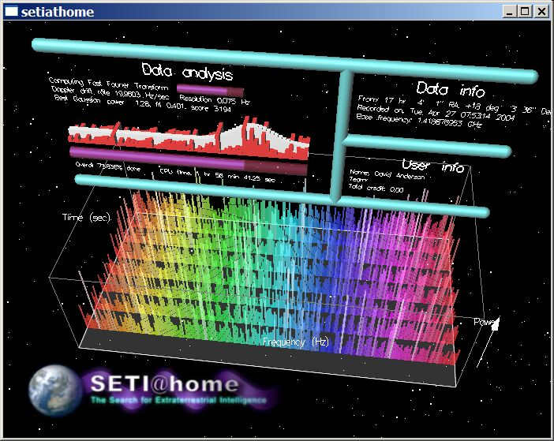</p>
(출처: https://setiathome.berkeley.edu/sah_graphics.php)
<br><br>
1997년에 UC 버클리에서 시작된 프로젝트로 푸에르토 리코에 위치한 아레시보 전파 망원경의 데이터를 통해 외계 생명체의 신호를 탐색하고자 했습니다. 전파 데이터가 너무 방대했기 때문에 이를 처리하기 위해 많은 컴퓨터가 필요했었는데요, 인터넷 연결이 가능한 PC를 가지고 있는 사람 누구나 프로젝트에 참여할 수 있도록 했습니다. 전세계 226개국에서 500만명 이상의 사람들이 자원해서 참여했고, 2020년 데이터 수집이 중단되었다고 합니다.
<br><br>

이렇게 컴퓨팅 파워의 한계와 장애 극복을 위한 분산 컴퓨팅은 계속 발전해왔고 DCOM, CORBA 등의 벤더 종속적인 기술이 등장했습니다. 그리고 SOAP 웹서비스 등의 벤더 독립적인 기술이 등장해 세상을 바꾸나 싶었지만, 찻잔 속의 태풍으로 끝이 났죠. 그리고 SOA 등의 현학적인 용어가 난무하는 시대를 지나 지금 우리는 클라우드가 보편적인 시대를 살고 있습니다. 이제는 분산 시스템이라는 말을 잘 쓰지 않긴합니다. 그게 기본이니까요.

하지만 기본이라는 말은 반대로 하면 원리를 모르는 사람들이 많다는 말도 되겠죠. 물론.... 저도 그 중에 하나입니다. 하하하하....

## CAP, PACELC

분산 시스템의 유명한 이론적 정리는 CAP, PACELC가 있습니다. 우선 CAP을 볼까요?

### CAP

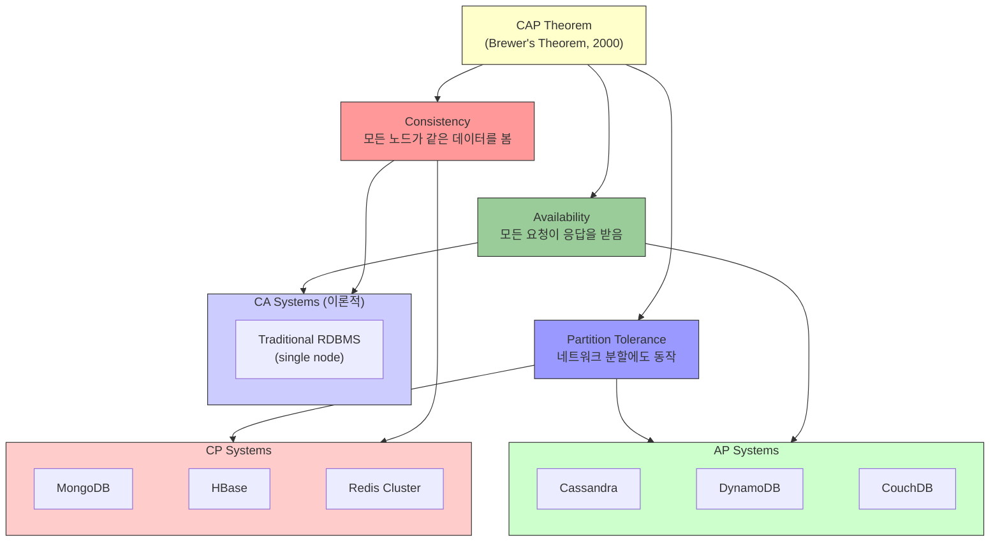
```mermaid
graph TD
    CAP["CAP Theorem<br/>(Brewer's Theorem, 2000)"]

    CAP --> C["Consistency<br/>모든 노드가 같은 데이터를 봄"]
    CAP --> A["Availability<br/>모든 요청이 응답을 받음"]
    CAP --> P["Partition Tolerance<br/>네트워크 분할에도 동작"]

    C ~~~ A ~~~ P

    subgraph CP["CP Systems"]
        CP1["MongoDB"] ~~~ CP2["HBase"] ~~~ CP3["Redis Cluster"]
    end
    subgraph AP["AP Systems"]
        AP1["Cassandra"] ~~~ AP2["DynamoDB"] ~~~ AP3["CouchDB"]
    end
    subgraph CA["CA Systems (이론적)"]
        CA1["Traditional RDBMS<br/>(single node)"]
    end

    C --> CP
    P --> CP
    A --> AP
    P --> AP
    C --> CA
    A --> CA

    style C fill:#ff9999,stroke:#333
    style A fill:#99cc99,stroke:#333
    style P fill:#9999ff,stroke:#333
    style CP fill:#ffcccc,stroke:#333
    style AP fill:#ccffcc,stroke:#333
    style CA fill:#ccccff,stroke:#333
    style CAP fill:#ffffcc,stroke:#333
```

Consistency, Availability, Partition Tolerance 이 세가지 요소 중에서 2가지를 선택해야 한다는 게 CAP 이론입니다. 하지만 이 이론에는 함정이 있는데요, 세상에 장애가 발생하지 않은 완벽한 네트워크는 없으므로 반드시 Partition Tolerance는 챙겨야 하기 때문에 CP 또는 AP 둘 중의 하나로 강제된다는 거죠. 그리고 요즘 대세인 결과적 일관성(Eventual Consistency)의 경우 AP에 해당하기는 하지만 일관성(C)을 포기한 건 아니므로 엄밀히 말하면 CAP의 이분법적 분류로는 정확히 설명하기 어렵다는 문제가 있습니다.

### PACELC

그래서 대안적으로 제시된 게 PACELC 입니다.

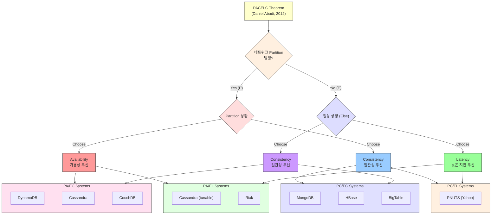
```mermaid
graph TD
    PACELC["PACELC Theorem<br/>(Daniel Abadi, 2012)"]

    PACELC --> Q{"네트워크 Partition<br/>발생?"}

    Q -->|"Yes (P)"| PAC{"Partition 상황"}
    Q -->|"No (E)"| ELC{"정상 상황 (Else)"}

    PAC -->|"Choose"| PA["Availability<br/>가용성 우선"]
    PAC -->|"Choose"| PC["Consistency<br/>일관성 우선"]

    ELC -->|"Choose"| EL["Latency<br/>낮은 지연 우선"]
    ELC -->|"Choose"| EC["Consistency<br/>일관성 우선"]

    subgraph PA_EC["PA/EC Systems"]
        direction LR
        S1["DynamoDB"] ~~~ S2["Cassandra"] ~~~ S3["CouchDB"]
    end

    subgraph PA_EL["PA/EL Systems"]
        direction LR
        S4["Cassandra (tunable)"] ~~~ S5["Riak"]
    end

    subgraph PC_EC["PC/EC Systems"]
        direction LR
        S6["MongoDB"] ~~~ S7["HBase"] ~~~ S8["BigTable"]
    end

    subgraph PC_EL["PC/EL Systems"]
        direction LR
        S9["PNUTS (Yahoo)"]
    end

    PA --> PA_EC
    PA --> PA_EL
    PC --> PC_EC
    PC --> PC_EL
    EC --> PA_EC
    EC --> PC_EC
    EL --> PA_EL
    EL --> PC_EL

    style PACELC fill:#ffffcc,stroke:#333
    style Q fill:#fff0e0,stroke:#333
    style PAC fill:#ffdddd,stroke:#333
    style ELC fill:#ddddff,stroke:#333
    style PA fill:#ff9999,stroke:#333
    style PC fill:#99ccff,stroke:#333
    style EL fill:#99ff99,stroke:#333
    style EC fill:#cc99ff,stroke:#333
    style PA_EC fill:#ffe0f0,stroke:#333
    style PA_EL fill:#e0ffe0,stroke:#333
    style PC_EC fill:#e0e0ff,stroke:#333
    style PC_EL fill:#fff0e0,stroke:#333
```

선택지는 다음과 같습니다.
- 네트워크 장애시(P) -> 가용성(A)이냐 일관성(C)이냐.
- 정상 상황(E)에서 -> 일관성(C)이냐 낮은 지연(L)이냐.

예를 들면 이번에 알아볼 Paxos 알고리즘은 `PC/EC` 에 해당합니다.
- 네트워크 장애시(P) -> 다수의 노드는 동작하지만, 소수의 노드는 동작을 멈춘다. 따라서 일관성(C)을 가용성(A)보다 우선한다.
- 정상 상황(E)에서 -> 다수의 노드 간에 합의 과정을 거치는데 이 과정에서 보다 많은 지연시간이 발생한다. 따라서 일관성(C)을 낮은 지연(L)보다 우선한다.

## Paxos 알고리즘

앞선 정리에서 볼 수 있듯이 Paxos 알고리즘은 합의를 통한 일관성을 가장 중요한 가치로 생각하며, 분산 시스템에서 모든 서버가 같은 상태와 결정을 공유하고 유지할 수 있는 방법을 제안합니다.

Paxos 알고리즘의 핵심 구성 요소는 다음과 같습니다.

- 제안자(Proposer): 제안자는 합의해야 할 값을 제안하고, 시스템의 다른 노드에 제안값을 전파합니다.
- 수용자(Acceptor): 제안자에게서 제안을 받고, 제안값의 수용 여부를 다른 노드에 알립니다.
- 학습자(Learner): 합의된 값을 수용하는 노드.

그럼 이 노드들이 어떻게 서로 합의를 진행하는지 알아볼까요?

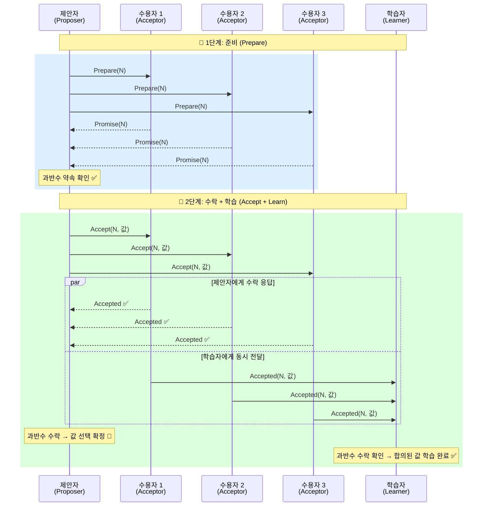
```mermaid
sequenceDiagram
    participant P as 제안자<br/>(Proposer)
    participant A1 as 수용자 1<br/>(Acceptor)
    participant A2 as 수용자 2<br/>(Acceptor)
    participant A3 as 수용자 3<br/>(Acceptor)
    participant L as 학습자<br/>(Learner)

    Note over P, L: 📌 1단계: 준비 (Prepare)
    rect rgb(220, 240, 255)
        P->>A1: Prepare(N)
        P->>A2: Prepare(N)
        P->>A3: Prepare(N)
        A1-->>P: Promise(N)
        A2-->>P: Promise(N)
        A3-->>P: Promise(N)
        Note over P: 과반수 약속 확인 ✅
    end

    Note over P, L: 📌 2단계: 수락 + 학습 (Accept + Learn)
    rect rgb(220, 255, 220)
        P->>A1: Accept(N, 값)
        P->>A2: Accept(N, 값)
        P->>A3: Accept(N, 값)
        par 제안자에게 수락 응답
            A1-->>P: Accepted ✅
            A2-->>P: Accepted ✅
            A3-->>P: Accepted ✅
        and 학습자에게 동시 전달
            A1->>L: Accepted(N, 값)
            A2->>L: Accepted(N, 값)
            A3->>L: Accepted(N, 값)
        end
        Note over P: 과반수 수락 → 값 선택 확정 🎉
        Note over L: 과반수 수락 확인 → 합의된 값 학습 완료 ✅
    end
```

여기서 중요한 점은 1단계에서는 제안 번호(N)을 제시하고, 2단계에서 제안 번호(N)와 함께 제안 값을 전달한다는 점입니다. 하나씩 알아볼까요?

> 여기서는 논리적인 구분을 위해서 제안자, 수용자, 학습자를 나눠놓았지만 사실 Paxos에 참여하는 각 노드가 3개의 역할을 모두 수행하는 경우도 있습니다. 이 글의 후반부에서 관련된 예시를 다룰 예정입니다!

### 1단계: 준비(Prepare)

1단계에서는 제안자가 수용자들에게 자신의 제안번호(N)를 제시하며, 자신의 제안번호(N)에 대해서 '수락할 것을 약속해달라(promise)'고 요청합니다.

수용자들은 제시 받은 제안번호(N)과 이전에 이미 약속한 제안번호(B)에 대해 다음과 같이 반응합니다.

- 이미 약속한 제안번호(B)가 존재하는가?
- 존재하지 않는다면, 현재의 제안번호(N)에 대해 수용할 것을 약속한다.
- 존재한다면, 이미 약속한 제안번호(B)과 현재의 제안번호(N)을 비교한다.
  - 이미 약속한 제안번호가 더 크다면(B > N), 현재의 제안번호(N)을 거절한다.
  - 현재의 제안번호(N)이 이미 약속한 제안번호(B)보다 더 크다면, 이전 약속(B)을 파기하고 현재의 제안번호(N)에 대해 수용할 것을 약속한다.

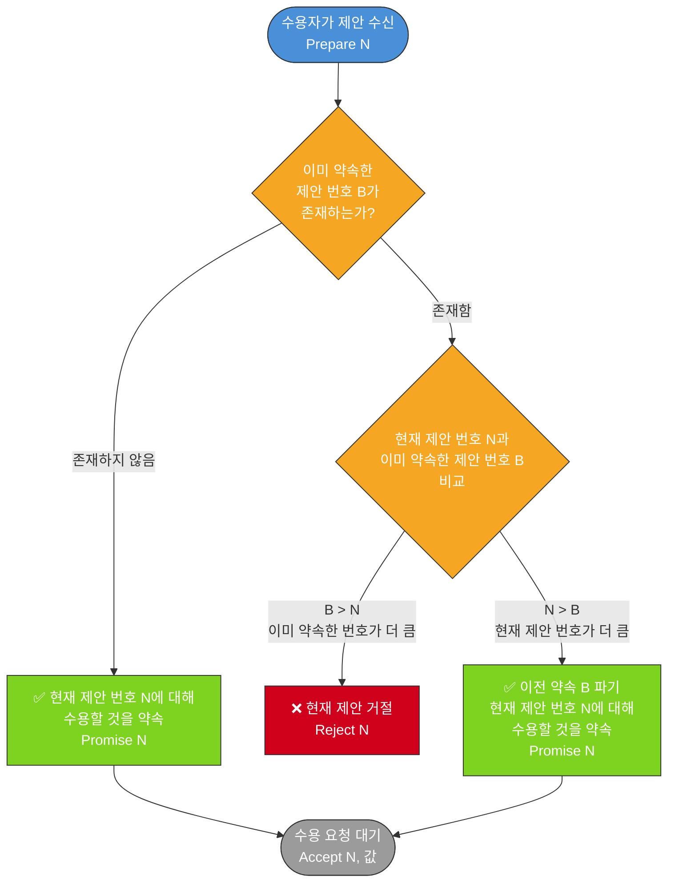
```mermaid
flowchart TD
    START([수용자가 제안 수신<br/>Prepare N]) --> CHECK{이미 약속한<br/>제안 번호 B가<br/>존재하는가?}

    CHECK -->|존재하지 않음| ACCEPT_NEW[✅ 현재 제안 번호 N에 대해<br/>수용할 것을 약속<br/>Promise N]

    CHECK -->|존재함| COMPARE{현재 제안 번호 N과<br/>이미 약속한 제안 번호 B<br/>비교}

    COMPARE -->|B > N<br/>이미 약속한 번호가 더 큼| REJECT[❌ 현재 제안 거절<br/>Reject N]

    COMPARE -->|N > B<br/>현재 제안 번호가 더 큼| ACCEPT_HIGHER[✅ 이전 약속 B 파기<br/>현재 제안 번호 N에 대해<br/>수용할 것을 약속<br/>Promise N]

    ACCEPT_NEW --> WAIT([수용 요청 대기<br/>Accept N, 값])
    ACCEPT_HIGHER --> WAIT

    style START fill:#4A90D9,stroke:#333,color:#fff
    style CHECK fill:#F5A623,stroke:#333,color:#fff
    style COMPARE fill:#F5A623,stroke:#333,color:#fff
    style ACCEPT_NEW fill:#7ED321,stroke:#333,color:#fff
    style REJECT fill:#D0021B,stroke:#333,color:#fff
    style ACCEPT_HIGHER fill:#7ED321,stroke:#333,color:#fff
    style WAIT fill:#9B9B9B,stroke:#333,color:#fff
```

어떤 값이든 수용할 것을 약속한 노드들은 이제 수용 요청 대시 상태로 진입합니다.

### 2단계: 수용(Accept)

이제 제안자는 각 수용자에게 자신있게 자신의 제안 번호(N)와 함께 값을 전달합니다. 이제 수용자들은 자신이 수용할 것을 약속한 제안 번호(B)와 비교하며 다음과 같이 반응합니다.

- 수용할 것을 약속한 제안 번호(B)가 존재하는지 확인
- B가 존재하지 않는다면, 제안 번호(N)의 값을 수용(Prepare 없이 Accept가 진행되는 경우는 생각하기 어렵긴 하지만!)
- B가 존재한다면, 제안 번호(N)과 비교
  - N < B 이면, 이미 약속한 제안 번호(B)가 더 크기 때문에 N을 거절
  - N = B 이면, 현재 제안 번호(N)가 수용할 것을 약속한 제안 번호이므로 값을 수용하고, 제안자 및 학습자에게 수용되었음을 통지
  - N > B 이면, 현재 제안 번호(N)가 이미 약속한 제안 번호(B)보다 크므로 이전 약속을 파기하고 N을 수용할 것을 약속

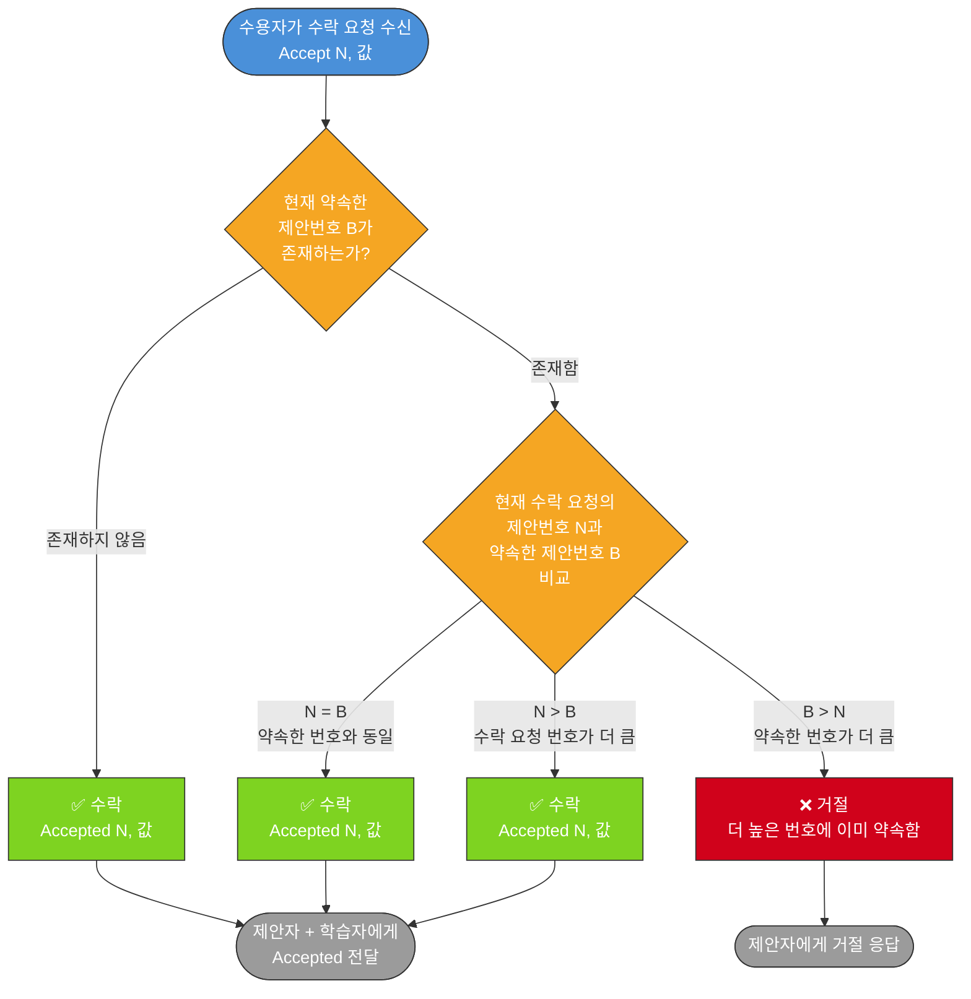
```mermaid
flowchart TD
    START([수용자가 수락 요청 수신<br/>Accept N, 값]) --> CHECK{현재 약속한<br/>제안번호 B가<br/>존재하는가?}

    CHECK -->|존재하지 않음| ACCEPT[✅ 수락<br/>Accepted N, 값]

    CHECK -->|존재함| COMPARE{현재 수락 요청의<br/>제안번호 N과<br/>약속한 제안번호 B<br/>비교}

    COMPARE -->|B > N<br/>약속한 번호가 더 큼| REJECT[❌ 거절<br/>더 높은 번호에 이미 약속함]

    COMPARE -->|N = B<br/>약속한 번호와 동일| ACCEPT2[✅ 수락<br/>Accepted N, 값]

    COMPARE -->|N > B<br/>수락 요청 번호가 더 큼| ACCEPT3[✅ 수락<br/>Accepted N, 값]

    ACCEPT --> NOTIFY([제안자 + 학습자에게<br/>Accepted 전달])
    ACCEPT2 --> NOTIFY
    ACCEPT3 --> NOTIFY
    REJECT --> WAIT([제안자에게 거절 응답])

    style START fill:#4A90D9,stroke:#333,color:#fff
    style CHECK fill:#F5A623,stroke:#333,color:#fff
    style COMPARE fill:#F5A623,stroke:#333,color:#fff
    style ACCEPT fill:#7ED321,stroke:#333,color:#fff
    style ACCEPT2 fill:#7ED321,stroke:#333,color:#fff
    style ACCEPT3 fill:#7ED321,stroke:#333,color:#fff
    style REJECT fill:#D0021B,stroke:#333,color:#fff
    style NOTIFY fill:#9B9B9B,stroke:#333,color:#fff
    style WAIT fill:#9B9B9B,stroke:#333,color:#fff
```

위 다이어그램에서 볼 수 있듯이 Prepare 단계에서 과반수의 약속을 받았더라도 Accept 단계에서 거절될 수도 있습니다. 더 높은 제안 번호의 Prepare가 중간에 끼어들 수도 있기 때문이죠.

## 좀 더 쓸모있는 예시를 들어보자: 분산 시스템의 리더 노드 선출

자, 알고리즘은 뭐 이런 식으로 진행됩니다. 그런데 제가 이 내용을 처음 봤을 때는 솔직히 `뭐 어쩌라고?` 싶었습니다. 이게 도대체 뭔 소린지, 그리고 어디다가 써먹을 수 있다는 건지 영 감이 안잡혔죠. 그래서 이리저리 머리를 굴려보다가 그럴듯한 예시를 하나 생각해냈습니다.

우리가 쓰는 디비든 쿠버네티스 같은 인프라 운영 시스템이든 각종 실패를 견디기 위해서 노드를 분산해둡니다. 쿠버네티스의 경우 클러스터 운영을 위한 마스터 노드(또는 컨트롤 플레인)와 서비스를 돌리기 위한 워커 노드가 있죠. 특히 마스터 노드의 경우 전체 시스템 관리 및 워커 노드를 제어하는 등의 핵심 역할을 맡고 있습니다. 이런 마스터 노드가 죽으면 곤란하기 때문에 여러 마스터 노드를 실행해서 특정 노드에 장애가 생겨도 서비스 운영에 문제가 없도록 하고 있죠.

그런데 이 글을 시작하면서 분산 시스템에서는 합의가 중요하다고 했었습니다. 여러대의 마스터 노드가 있을 때 각자 서로 다른 결정을 하면 안되겠죠. 그래서 리더 노드를 선출하고 다른 노드들은 리더가 결정한 내용을 따르도록 하고 있습니다. 지금 부터 살펴볼 예제는 바로 그 리더를 선출하는 과정을 Paxos 알고리즘으로 구현해 볼 겁니다!

### 시스템 개요

간결한 구현을 위해서 시작점이 되는 cli 앱이 3개의 웹 서버 클러스터를 실행하고, 3개의 웹 서버가 서로 통신하면서 Paxos 알고리즘을 통해 리더를 선출하게 됩니다. 그리고 필요에 따라서 각 서버를 죽이거나 재실행해서 다양한 경우를 실험해 볼 수 있도록 할 겁니다.

원래 이런 시스템은 멀티 Paxos로 구현해야 합니다. Paxos는 원래 합의를 한 번 하면 그걸로 끝이기 때문에 여러번의 합의를 하려면 계속 새로운 Paxos 인스턴스를 생성해야 합니다. 그런데 그렇게 하면 너무 복잡하니까, 단일 Paxos로 구현해서 매 라운드 마다 상태 값을 초기화 하고 다시 설정하는 형태로 구현해서 멀티 Paxos를 흉내내는 형태로 구현할 겁니다.

node.js와 typescript를 이용해서 2개의 파일로 구현할 겁니다.

- runCluster.ts: 3개의 웹 서버를 실행하고 관리하는 클러스터 관리자 cli 구현
- node.ts: 각 웹서버를 express로 구현

그리고 시스템 아키텍처는 다음과 같습니다.

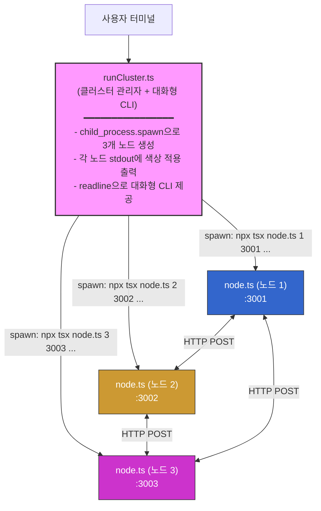
```mermaid
graph TD
    USER["사용자 터미널"] --> CLI["runCluster.ts<br/>(클러스터 관리자 + 대화형 CLI)<br/>━━━━━━━━━━━━━━━━<br/>- child_process.spawn으로 3개 노드 생성<br/>- 각 노드 stdout에 색상 적용 출력<br/>- readline으로 대화형 CLI 제공"]

    CLI -->|"spawn: npx tsx node.ts 1 3001 ..."| N1["node.ts (노드 1)<br/>:3001"]
    CLI -->|"spawn: npx tsx node.ts 2 3002 ..."| N2["node.ts (노드 2)<br/>:3002"]
    CLI -->|"spawn: npx tsx node.ts 3 3003 ..."| N3["node.ts (노드 3)<br/>:3003"]

    N1 <-->|"HTTP POST"| N2
    N2 <-->|"HTTP POST"| N3
    N1 <-->|"HTTP POST"| N3

    style CLI fill:#f9f,stroke:#333,stroke-width:2px
    style N1 fill:#36c,stroke:#333,color:#fff
    style N2 fill:#c93,stroke:#333,color:#fff
    style N3 fill:#c3c,stroke:#333,color:#fff
```

`runCluster.ts`가 3개의 웹서버 노드 프로세스를 생성하고, 각 노드는 Express 서버를 실행하여 HTTP로 통신합니다.

#### 클러스터 관리자 cli 구현

클러스터 관리자 cli는 각 웹서버 노드 프로세스를 실행하고, 특정 노드 프로세스를 죽이거나 다시 시작하거나 할 수 있습니다.

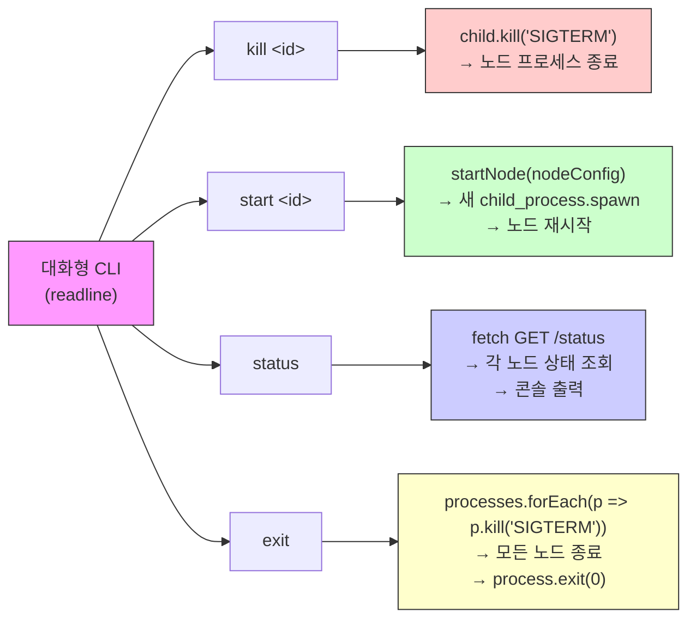
```mermaid
graph LR
    CLI["대화형 CLI<br/>(readline)"] --> KILL["kill &lt;id&gt;"]
    CLI --> START["start &lt;id&gt;"]
    CLI --> STATUS["status"]
    CLI --> EXIT["exit"]

    KILL --> K_ACTION["child.kill('SIGTERM')<br/>→ 노드 프로세스 종료"]
    START --> S_ACTION["startNode(nodeConfig)<br/>→ 새 child_process.spawn<br/>→ 노드 재시작"]
    STATUS --> ST_ACTION["fetch GET /status<br/>→ 각 노드 상태 조회<br/>→ 콘솔 출력"]
    EXIT --> E_ACTION["processes.forEach(p => p.kill('SIGTERM'))<br/>→ 모든 노드 종료<br/>→ process.exit(0)"]

    style CLI fill:#f9f,stroke:#333
    style K_ACTION fill:#fcc,stroke:#333
    style S_ACTION fill:#cfc,stroke:#333
    style ST_ACTION fill:#ccf,stroke:#333
    style E_ACTION fill:#ffc,stroke:#333
```

`runCluster.ts`의 전체 코드는 다음과 같습니다.

```typescript
import { spawn, ChildProcess } from 'child_process';
import * as readline from 'readline';
import { fileURLToPath } from 'url';
import { dirname } from 'path';

const __filename = fileURLToPath(import.meta.url);
const __dirname = dirname(__filename);

type NodeConfig = {
  id: number;
  port: number;
};

// 각 노드 아이디와 포트 번호 정의
const NODES: NodeConfig[] = [
  { id: 1, port: 3001 },
  { id: 2, port: 3002 },
  { id: 3, port: 3003 }
];

// 노드 프로세스 관리를 위한 맵 정의
const processes = new Map<number, ChildProcess>();

// 가독성을 위해 각 노드의 아이디별 출력 색상 정의
const colors = {
  1: '\x1b[36m', // 파란색
  2: '\x1b[33m', // 노란색
  3: '\x1b[35m', // 핑크색
  reset: '\x1b[0m', // 기본 색상
};

/**
 * 노드 프로세스를 시작하는 함수
 * @param nodeConfig - 노드 아이디와 포트 번호 정의
 */
function startNode(nodeConfig: NodeConfig) {
  // 현재 노드가 통신해야 할 다른 노드의 URL 목록 생성
  const peers: string[] = NODES
    .filter((n: NodeConfig) => n.id !== nodeConfig.id)
    .map((n: NodeConfig) => `http://localhost:${n.port}`);

  console.log(`${colors[nodeConfig.id as keyof typeof colors]}노드 ${nodeConfig.id} 시작...${colors.reset}`);

  // 노드 프로세스 생성
  const child = spawn(
    'npx',
    ['tsx', 'node.ts', String(nodeConfig.id), String(nodeConfig.port), ...peers],
    {
      cwd: __dirname,
      stdio: ['ignore', 'pipe', 'pipe'],
    }
  );

  // 노드 프로세스의 출력에 색상을 적용 하여 출력
  child.stdout?.on('data', (data: Buffer) => {
    const color = colors[nodeConfig.id as keyof typeof colors] || colors.reset;
    process.stdout.write(`${color}${data.toString()}${colors.reset}`);
  });

  // 노드 프로세스의 에러 출력에 색상을 적용 하여 출력
  child.stderr?.on('data', (data: Buffer) => {
    const color = colors[nodeConfig.id as keyof typeof colors] || colors.reset;
    process.stderr.write(`${color}[노드 ${nodeConfig.id} 오류] ${data.toString()}${colors.reset}`);
  });

  // 노드 프로세스가 종료될 때 처리
  child.on('exit', (code, signal) => {
    console.log(`${colors[nodeConfig.id as keyof typeof colors]}[노드 ${nodeConfig.id}] 프로세스 종료 (code: ${code}, signal: ${signal})${colors.reset}`);
    processes.delete(nodeConfig.id);
  });

  // 노드 프로세스를 관리하는 맵에 추가
  processes.set(nodeConfig.id, child);
}

/**
 * 노드 프로세스 종료
 * @param id - 종료할 노드의 아이디
 */
function killNode(id: number) {
  const child = processes.get(id);

  // 노드 프로세스가 존재하면 종료
  if (child) {
    child.kill('SIGTERM');
    console.log(`\n${colors[id as keyof typeof colors]}[클러스터] 노드 ${id} 종료${colors.reset}\n`);
  } else {
    console.log(`\n[클러스터] 노드 ${id} 실행 중이 아님\n`);
  }
}

/**
 * 클러스터 상태 출력
 */
async function printStatus() {
  console.log('\n=== 클러스터 상태 ===');

  for (const node of NODES) {
    try {
      const res = await fetch(`http://localhost:${node.port}/status`, {
        signal: AbortSignal.timeout(1000),
      });
      const data = await res.json();
      const color = colors[node.id as keyof typeof colors] || colors.reset;
      const leaderMark = data.isLeader ? '👑' : '  ';

      // 노드 상태 출력
      console.log(
        `${color}${leaderMark} 노드 ${node.id}: 리더=${data.currentLeaderId ?? '없음'}, ` +
        `턴=${data.currentTurn}, 리더=${data.isLeader}, ` +
        `약속한 제안 번호=${data.promisedProposal ?? '없음'}, 수락한 제안 번호=${data.acceptedProposal ?? '없음'}${colors.reset}`
      );
    } catch {
      const color = colors[node.id as keyof typeof colors] || colors.reset;
      console.log(`${color}   노드 ${node.id}: ❌ 다운${colors.reset}`);
    }
  }

  console.log('');
}

/**
 * 대화형 CLI 구현
 */

const rl = readline.createInterface({
  input: process.stdin,
  output: process.stdout,
});

// 모든 노드 시작
console.log('\n🚀 Starting Paxos Leader Election Cluster...\n');
for (const node of NODES) {
  startNode(node);
}

// 모든 노드가 시작될 때까지 대기 후 명령어 출력
setTimeout(() => {
  console.log('\n' + '='.repeat(60));
  console.log('📋 사용 가능한 명령어:');
  console.log('  kill <id>   - 노드 종료 (특정 노드에 장애가 발생하여 종료되는 걸 시뮬레이션)');
  console.log('  start <id>  - 종료된 노드 재시작');
  console.log('  status      - 클러스터 상태 출력');
  console.log('  exit        - 모든 노드 종료 및 종료');
  console.log('='.repeat(60) + '\n');
}, 1000);

// 대화형 CLI 명령어 처리
rl.on('line', async (line: string) => {
  const [cmd, arg] = line.trim().split(' ');

  // 명령어 처리
  switch (cmd) {
    case 'kill':
      const killId = parseInt(arg);
      if (NODES.find((n) => n.id === killId)) {
        killNode(killId);
      } else {
        console.log(`잘못된 노드 ID: ${arg}\n`);
      }
      break;

    case 'start':
      const startId = parseInt(arg);
      const node = NODES.find((n) => n.id === startId);
      if (node) {
        if (processes.has(startId)) {
          console.log(`\n노드 ${startId}: 이미 실행 중\n`);
        } else {
          startNode(node);
        }
      } else {
        console.log(`잘못된 노드 ID: ${arg}\n`);
      }
      break;

    case 'status':
      await printStatus();
      break;

    case 'exit':
      console.log('\n🛑 모든 노드 종료...\n');
      processes.forEach((p) => p.kill('SIGTERM'));
      setTimeout(() => process.exit(0), 500);
      break;

    case 'help':
      console.log('\n📋 사용 가능한 명령어:');
      console.log('  kill <id>   - 노드 종료');
      console.log('  start <id>  - 종료된 노드 재시작');
      console.log('  status      - 클러스터 상태 출력');
      console.log('  exit        - 모든 노드 종료 및 종료\n');
      break;

    default:
      if (line.trim()) {
        console.log(`알 수 없는 명령어: ${cmd}. 'help' 명령어를 사용하여 사용 가능한 명령어를 확인하세요.\n`);
      }
  }
});

// Ctrl+C 처리
process.on('SIGINT', () => {
  console.log('\n\n🛑 모든 노드 종료...\n');
  processes.forEach((p) => p.kill('SIGTERM'));
  setTimeout(() => process.exit(0), 500);
});
```

#### 웹 서버 노드 구현

웹 서버 노드는 paxos 알고리즘을 위한 변수들과 각종 타이머, API 라우트 등을 포함하고 있습니다.

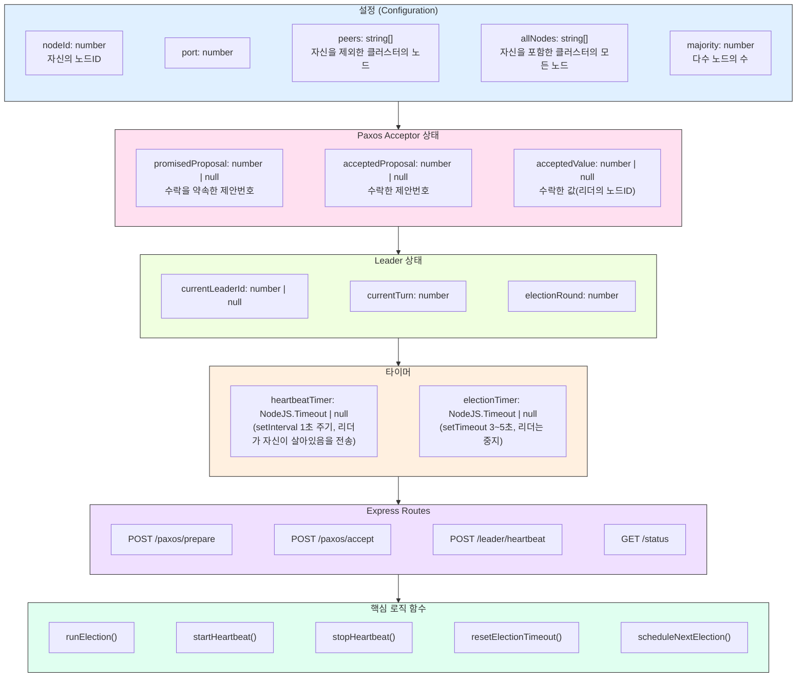
```mermaid
graph TD
    subgraph CONFIG["설정 (Configuration)"]
        C1["nodeId: number<br>자신의 노드ID"] ~~~ C2["port: number"] ~~~ C3["peers: string[]<br>자신을 제외한 클러스터의 노드"] ~~~ C4["allNodes: string[]<br>자신을 포함한 클러스터의 모든 노드"] ~~~ C5["majority: number<br>다수 노드의 수"]
    end
    subgraph PAXOS["Paxos Acceptor 상태"]
        P1["promisedProposal: number | null<br>수락을 약속한 제안번호"] ~~~ P2["acceptedProposal: number | null<br>수락한 제안번호"] ~~~ P3["acceptedValue: number | null<br>수락한 값(리더의 노드ID)"]
    end
    subgraph LEADER["Leader 상태"]
        L1["currentLeaderId: number | null"] ~~~ L2["currentTurn: number"] ~~~ L3["electionRound: number"]
    end
    subgraph TIMERS["타이머"]
        T1["heartbeatTimer: NodeJS.Timeout | null<br/>(setInterval 1초 주기, 리더가 자신이 살아있음을 전송)"] ~~~ T2["electionTimer: NodeJS.Timeout | null<br/>(setTimeout 3~5초, 리더는 중지)"]
    end
    subgraph ROUTES["Express Routes"]
        R1["POST /paxos/prepare"] ~~~ R2["POST /paxos/accept"] ~~~ R3["POST /leader/heartbeat"] ~~~ R4["GET /status"]
    end
    subgraph LOGIC["핵심 로직 함수"]
        F1["runElection()"] ~~~ F2["startHeartbeat()"] ~~~ F3["stopHeartbeat()"] ~~~ F4["resetElectionTimeout()"] ~~~ F5["scheduleNextElection()"]
    end

    CONFIG --> PAXOS --> LEADER --> TIMERS --> ROUTES --> LOGIC

    style CONFIG fill:#e0f0ff,stroke:#333
    style PAXOS fill:#ffe0f0,stroke:#333
    style LEADER fill:#f0ffe0,stroke:#333
    style TIMERS fill:#fff0e0,stroke:#333
    style ROUTES fill:#f0e0ff,stroke:#333
    style LOGIC fill:#e0fff0,stroke:#333
```

각 API는 paxos 알고리즘의 Prepare, Accept 단계를 위한 `/paxos/prepare`, `/paxos/accept`와 리더의 생존 신호를 수신할 `/leader/heartbeat`를 구현합니다.

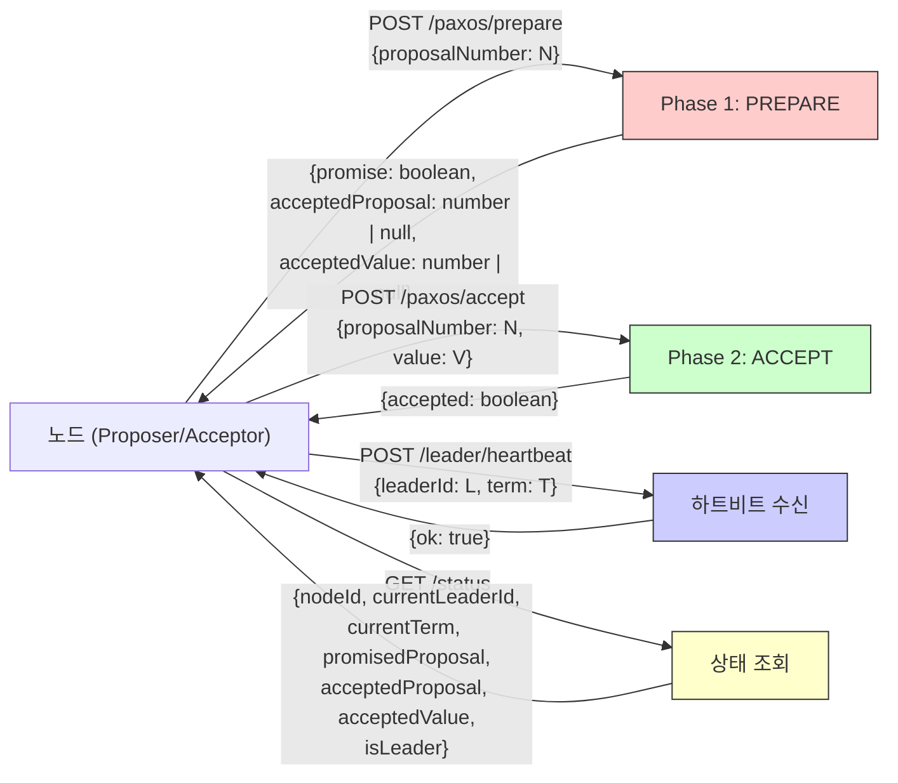
```mermaid
graph LR
    N["노드 (Proposer/Acceptor)"]

    N -->|"POST /paxos/prepare<br/>{proposalNumber: N}"| PREP["Phase 1: PREPARE"]
    PREP -->|"{promise: boolean,<br/>acceptedProposal: number | null,<br/>acceptedValue: number | null}"| N

    N -->|"POST /paxos/accept<br/>{proposalNumber: N, value: V}"| ACC["Phase 2: ACCEPT"]
    ACC -->|"{accepted: boolean}"| N

    N -->|"POST /leader/heartbeat<br/>{leaderId: L, term: T}"| HB["하트비트 수신"]
    HB -->|"{ok: true}"| N

    N -->|"GET /status"| ST["상태 조회"]
    ST -->|"{nodeId, currentLeaderId,<br/>currentTerm, promisedProposal,<br/>acceptedProposal, acceptedValue,<br/>isLeader}"| N

    style PREP fill:#ffcccc,stroke:#333
    style ACC fill:#ccffcc,stroke:#333
    style HB fill:#ccccff,stroke:#333
    style ST fill:#ffffcc,stroke:#333
```

**엔드포인트 요약**:

| 엔드포인트 | 메서드 | 요청 | 응답 | 용도 |
|-----------|--------|------|------|------|
| `/paxos/prepare` | POST | `{ proposalNumber }` | `{ promise, acceptedProposal, acceptedValue }` | Paxos Phase 1 - 약속 요청 |
| `/paxos/accept` | POST | `{ proposalNumber, value }` | `{ accepted }` | Paxos Phase 2 - 수락 요청 |
| `/leader/heartbeat` | POST | `{ leaderId, term }` | `{ ok }` | 리더 생존 신호 전송 |
| `/status` | GET | - | 전체 상태 객체 | 노드 상태 조회 (디버깅용) |

`node.ts`의 전체 코드는 다음과 같습니다.

```typescript
import express from 'express';

// === 타입 정의 ===

type NodeConfig = {
  id: number;
  port: number;
  peers: string[];
};

type PrepareRequest = {
  proposalNumber: number;
};

type PrepareResponse = {
  promise: boolean;
  acceptedProposal: number | null;
  acceptedValue: number | null;
};

type AcceptRequest = {
  proposalNumber: number;
  value: number;
};

type AcceptResponse = {
  accepted: boolean;
};

type HeartbeatMessage = {
  leaderId: number;
  turn: number;
};

// cli 매개변수로 전달받은 노드 아이디, 포트, 통신해야 할 다른 노드의 URL 목록 등의 값을 변수에 저장
const nodeId = parseInt(process.argv[2]);
const port = parseInt(process.argv[3]);
const peers = process.argv.slice(4);
const allNodes = [`http://localhost:${port}`, ...peers];
const majority = Math.floor(allNodes.length / 2) + 1;

console.log(`[노드 ${nodeId}] 시작 with 통신해야 할 다른 노드의 URL 목록: ${peers.join(', ')}`);
console.log(`[노드 ${nodeId}] 다수 필요: ${allNodes.length} 중 ${majority} 이상`);

// === Paxos Acceptor 상태 변수들 ===

let promisedProposal: number | null = null;
let acceptedProposal: number | null = null;
// 수락된 값(리더의 노드 아이디)
let acceptedValue: number | null = null;

// === Leader 상태와 Heartbeat ===

let currentLeaderId: number | null = null;
let currentTurn: number = 0;
// 리더의 하트비트 전송 타이머
let heartbeatTimer: NodeJS.Timeout | null = null;
// 리더 부재시 선출을 진행하기 위한 타이머
let electionTimer: NodeJS.Timeout | null = null;
let electionRound = 0;

// === Paxos Proposer 로직 ===

/**
 * 리더 선출 시작
 * @returns 리더 선출 성공 여부, 실패시 null 반환
 */
async function runElection(): Promise<boolean | null> {
  // 제안 번호가 이미 있는 것보다 큰지 확인
  if (promisedProposal !== null) {
    /**
     * 이전에 약속된 제안 번호가 있는 경우, 라운드 조정(다른 노드가 이미 제안한 제안 번호보다 높은 제안 번호를 사용하도록 함)
     * 
     * ex: Math.max(0, Math.ceil(6 / 3)) = Math.max(0, 2) = 2
     */
    electionRound = Math.max(electionRound, Math.ceil(promisedProposal / allNodes.length));
  }
  electionRound++;

  /**
   * 제안 번호 = 노드 아이디 + (라운드 * 노드 개수) -> 각 라운드 마다 노드의 제안 번호의 고유성을 보장하기 위함
   * 
   * 예를 들어, 노드 1, 2, 3이 있고, 라운드가 1인 경우,
   * 노드 1, 라운드 1: 1 + (1 * 3) = 4
   * 노드 2, 라운드 1: 2 + (1 * 3) = 5
   * 노드 3, 라운드 1: 3 + (1 * 3) = 6
   * 노드 1, 라운드 2: 1 + (2 * 3) = 7
   * 노드 2, 라운드 2: 2 + (2 * 3) = 8
   * 노드 3, 라운드 2: 3 + (2 * 3) = 9
   * ...
   */
  const proposalNumber = nodeId + (electionRound * allNodes.length);

  console.log(`\n[노드 ${nodeId}] 🗳️  리더 선출 시작 / 제안 번호 #${proposalNumber}`);

  // Phase 1: PREPARE 요청 전송
  console.log(`[노드 ${nodeId}] Phase 1: 모든 노드에 PREPARE 요청 전송...`);

  const preparePromises = allNodes.map(async (nodeUrl) => {
    // 자신을 포함한 모든 노드에 PREPARE 요청 전송
    try {
      // PREPARE 요청 전송
      const response = await fetch(`${nodeUrl}/paxos/prepare`, {
        method: 'POST',
        headers: { 'Content-Type': 'application/json' },
        body: JSON.stringify({ proposalNumber } as PrepareRequest),
        signal: AbortSignal.timeout(1000),
      });

      // PREPARE 요청 실패 시 null 반환
      if (!response.ok) return null;
      return await response.json() as PrepareResponse;
    } catch (error) {
      // PREPARE 요청 실패 시 null 반환
      return null;
    }
  });

  // PREPARE 요청 결과 처리
  const prepareResults = await Promise.allSettled(preparePromises);
  // PREPARE 요청 결과 중 성공한 것들 중 약속을 받은 것들만 추출
  const promises = prepareResults
    .filter((r): r is PromiseFulfilledResult<PrepareResponse> =>
      r.status === 'fulfilled' && r.value !== null && !!r.value.promise
    )
    .map((r) => r.value);

  console.log(`[노드 ${nodeId}] Phase 1: 약속을 받은 노드 ${promises.length}/${allNodes.length} 개 (필요 ${majority} 개)`);

  if (promises.length < majority) {
    console.log(`[노드 ${nodeId}] ❌ Phase 1 실패: 약속을 받은 노드가 다수 필요 개수보다 적습니다. 리더 선출을 중단하고 다음 선거 시작.`);
    scheduleNextElection();
    return false;
  }

  // 수락된 값 중 가장 높은 값을 채택, 없으면 자신을 제안
  let proposedValue = nodeId;
  let highestAcceptedProposal = -1;

  for (const p of promises) {
    // 수락된 값 중 가장 높은 값을 채택
    if (p.acceptedProposal !== null && p.acceptedProposal > highestAcceptedProposal) {
      highestAcceptedProposal = p.acceptedProposal;
      proposedValue = p.acceptedValue!;
    }
  }

  if (highestAcceptedProposal > -1) {
    console.log(`[노드 ${nodeId}] Phase 1: 이전에 수락된 값 (노드 ${proposedValue}) 채택 / 제안 번호 #${highestAcceptedProposal}`);
  } else {
    console.log(`[노드 ${nodeId}] Phase 1: 이전에 수락된 값이 없으므로 자신을 제안 (노드 ${proposedValue})`);
  }

  // Phase 2: Accept
  console.log(`[노드 ${nodeId}] Phase 2: 모든 노드에 ACCEPT (값: 노드 ${proposedValue}) 요청 전송...`);

  const acceptPromises = allNodes.map(async (nodeUrl) => {
    // 자신을 포함한 모든 노드에 ACCEPT 요청 전송
    try {
      // ACCEPT 요청 전송
      const response = await fetch(`${nodeUrl}/paxos/accept`, {
        method: 'POST',
        headers: { 'Content-Type': 'application/json' },
        body: JSON.stringify({ proposalNumber, value: proposedValue } as AcceptRequest),
        signal: AbortSignal.timeout(1000),
      });

      // ACCEPT 요청 실패 시 null 반환
      if (!response.ok) return null;
      return await response.json() as AcceptResponse;
    } catch (error) {
      // ACCEPT 요청 실패 시 null 반환
      return null;
    }
  });

  // ACCEPT 요청 결과 처리
  const acceptResults = await Promise.allSettled(acceptPromises);
  // ACCEPT 요청 결과 중 성공한 것들 중 수락된 것들만 추출
  const accepts = acceptResults
    .filter((r) => r.status === 'fulfilled' && r.value !== null && r.value.accepted)
    .length;

  console.log(`[노드 ${nodeId}] Phase 2: 수락된 노드 ${accepts}/${allNodes.length} 개 (필요 ${majority} 개)`);

  if (accepts >= majority) {
    console.log(`[노드 ${nodeId}] ✅ 리더 선출 성공! 노드 ${proposedValue} 가 리더가 되었습니다. (제안 번호 ${proposalNumber})`);

    if (proposedValue === nodeId) {
      console.log(`[노드 ${nodeId}] 👑 나는 리더!`);
      // 리더는 자신의 선출 타임아웃을 중지 (팔로워만 타임아웃을 감시해야 함)
      if (electionTimer) {
        clearTimeout(electionTimer);
        electionTimer = null;
      }
      startHeartbeat(proposalNumber);
    }

    return true;
  } else {
    console.log(`[노드 ${nodeId}] ❌ Phase 2 실패: 수락된 노드가 다수 필요 개수보다 적습니다. 리더 선출을 중단하고 다음 선거 시작.`);
    scheduleNextElection();
    return false;
  }
}

/**
 * 다음 리더 선출 예약
 */
function scheduleNextElection() {
  // 다음 선거 시작 전 랜덤 딜레이 적용
  const delay = 2000 + Math.random() * 3000;
  setTimeout(() => {
    // 현재 리더가 없으면 다음 선거 시작
    if (currentLeaderId === null) {
      runElection();
    }
  }, delay);
}

/**
 * 하트비트 시작
 * @param turn 현재 턴
 */
function startHeartbeat(turn: number) {
  // 하트비트 중지
  stopHeartbeat();

  heartbeatTimer = setInterval(() => {
    console.log(`[노드 ${nodeId}] 💓 하트비트 전송 (턴 ${turn})`);

    // 자신(리더)를 제외한 나머지 노드에 하트비트 전송
    peers.forEach(async (peerUrl) => {
      try {
        await fetch(`${peerUrl}/leader/heartbeat`, {
          method: 'POST',
          headers: { 'Content-Type': 'application/json' },
          body: JSON.stringify({ leaderId: nodeId, turn } as HeartbeatMessage),
          signal: AbortSignal.timeout(1000),
        });
      } catch (error) {
        // 노드 다운 시 무시
      }
    });
  }, 1000);
}

/**
 * 하트비트 중지
 */
function stopHeartbeat() {
  if (heartbeatTimer) {
    clearInterval(heartbeatTimer);
    heartbeatTimer = null;
  }
}

/**
 * 리더 선출 타임아웃 리셋
 * 
 * 타임아웃 이후, 리더가 없으면 리더 선출 시작
 */
function resetElectionTimeout() {
  if (electionTimer) {
    clearTimeout(electionTimer);
  }

  // 리더 선출 타임아웃 랜덤 적용 (3-5초)
  const timeout = 3000 + Math.random() * 2000;

  electionTimer = setTimeout(() => {
    console.log(`[노드 ${nodeId}] ⏰ 하트비트 타임아웃 - 리더 없음 감지, 리더 선출 시작...`);
    currentLeaderId = null;
    // 현재 리더로 선출된 노드가 서비스 다운되는 경우에 해당 노드는 리더 선출에서 제외되어야 함
    // 따라서 수락된 상태를 리셋하여 진행하며, 각 리더 선출은 사실상 새로운 Paxos 인스턴스가 되도록 함
    acceptedProposal = null;
    acceptedValue = null;
    runElection();
  }, timeout);
}

// === Express Routes ===

const app = express();
app.use(express.json());

// Paxos Phase 1: Prepare
app.post('/paxos/prepare', (req, res) => {
  const { proposalNumber } = req.body as PrepareRequest;

  console.log(`[노드 ${nodeId}] PREPARE 요청 수신 / 제안 번호 #${proposalNumber}`);

  if (promisedProposal === null || proposalNumber > promisedProposal) {
    promisedProposal = proposalNumber;
    // 수락된 상태를 리셋하여 진행하며, 각 리더 선출은 사실상 새로운 Paxos 인스턴스가 되도록 함(죽은 리더 재선출 방지)
    acceptedProposal = null;
    acceptedValue = null;
    console.log(`[노드 ${nodeId}] → 제안 번호 #${proposalNumber} 약속`);

    res.json({
      promise: true,
      acceptedProposal: null,
      acceptedValue: null,
    } as PrepareResponse);
  } else {
    console.log(`[노드 ${nodeId}] → 이미 약속한 제안 번호 #${promisedProposal} 거절`);
    res.json({
      promise: false,
      acceptedProposal: null,
      acceptedValue: null,
    } as PrepareResponse);
  }
});

// Paxos Phase 2: ACCEPT 요청 처리
app.post('/paxos/accept', (req, res) => {
  const { proposalNumber, value } = req.body as AcceptRequest;

  console.log(`[노드 ${nodeId}] ACCEPT 요청 수신 / 제안 번호 #${proposalNumber}, 값: 노드 ${value}`);

  // 약속된 제안 번호가 없거나, 현재 제안 번호가 약속된 제안 번호보다 크거나 같으면 수락
  if (promisedProposal === null || proposalNumber >= promisedProposal) {
    // 약속된 제안 번호 갱신
    promisedProposal = proposalNumber;
    // 수락된 제안 번호 갱신
    acceptedProposal = proposalNumber;
    // 수락된 값 갱신(리더의 노드 아이디)
    acceptedValue = value;
    // 현재 리더 아이디 갱신
    currentLeaderId = value;
    // 현재 턴 갱신
    currentTurn = proposalNumber;

    console.log(`[노드 ${nodeId}] → 수락! 새로운 리더: 노드 ${value} (제안 번호 ${proposalNumber})`);

    // 리더가 아니라면 하트비트 중지
    if (value !== nodeId) {
      stopHeartbeat();
    }

    // 리더 선출 타임아웃 리셋
    resetElectionTimeout();

    res.json({ accepted: true } as AcceptResponse);
  } else {
    console.log(`[노드 ${nodeId}] → 이미 약속한 제안 번호 #${promisedProposal} 거절`);
    res.json({ accepted: false } as AcceptResponse);
  }
});

// 리더가 전송하는 하트비트 수신
app.post('/leader/heartbeat', (req, res) => {
  const { leaderId, turn } = req.body as HeartbeatMessage;

  // 새로운 턴이 시작되었다면,
  if (turn >= currentTurn) {
    // 새로운 리더가 등장했다면,
    if (leaderId !== currentLeaderId) {
      console.log(`[노드 ${nodeId}] 💓 새로운 리더로부터 하트비트 수신 / 리더: 노드 ${leaderId} (턴 ${turn})`);
    }

    // 현재 리더 아이디 갱신
    currentLeaderId = leaderId;
    // 현재 턴 갱신
    currentTurn = turn;
    
    /**
     * 리더 선출 타임아웃 리셋(타임아웃 이후, 리더가 없으면 리더 선출 시작)
     * 
     * 리더의 하트비트가 안정적으로 수신된다면, 리더 선출의 타임아웃은 계속 리셋된다. -> 현재 상태 유지.
     */
    resetElectionTimeout();
  }

  res.json({ ok: true });
});

// 상태 조회 엔드포인트
app.get('/status', (req, res) => {
  res.json({
    nodeId,
    currentLeaderId,
    currentTurn,
    promisedProposal,
    acceptedProposal,
    acceptedValue,
    isLeader: currentLeaderId === nodeId,
  });
});

// === 메인 함수 ===

app.listen(port, () => {
  console.log(`[노드 ${nodeId}] 🚀 포트 ${port}에서 수신 중...`);

  // 리더 선출 예약(랜덤 딜레이 적용)
  const delay = 1000 + Math.random() * 2000;
  console.log(`[노드 ${nodeId}] 리더 조회 전 ${Math.round(delay)}ms 대기...`);

  // 랜덤 딜레이 이후, 리더가 없으면 리더 선출 시작
  setTimeout(() => {
    if (currentLeaderId === null) {
      console.log(`[노드 ${nodeId}] 리더 없음, 리더 선출 시작...`);
      runElection();
    }
  }, delay);

  // 리더 선출 타임아웃 리셋(타임아웃 이후, 리더가 없으면 리더 선출 시작)
  resetElectionTimeout();
});
```

### 이제 돌려보자!

이제 모든 준비가 끝났습니다. `npm start` 명령으로 예제를 실행해볼까요?

```bash
❯ npm start        

> paxos-leader-election@1.0.0 start
> npx tsx runCluster.ts


🚀 Starting Paxos Leader Election Cluster...

노드 1 시작...
노드 2 시작...
노드 3 시작...
[노드 1] 시작 with 통신해야 할 다른 노드의 URL 목록: http://localhost:3002, http://localhost:3003
[노드 2] 시작 with 통신해야 할 다른 노드의 URL 목록: http://localhost:3001, http://localhost:3003
[노드 2] 다수 필요: 3 중 2 이상
[노드 3] 시작 with 통신해야 할 다른 노드의 URL 목록: http://localhost:3001, http://localhost:3002
[노드 3] 다수 필요: 3 중 2 이상
[노드 1] 다수 필요: 3 중 2 이상
[노드 2] 🚀 포트 3002에서 수신 중...
[노드 2] 리더 조회 전 2639ms 대기...
[노드 3] 🚀 포트 3003에서 수신 중...
[노드 3] 리더 조회 전 2096ms 대기...
[노드 1] 🚀 포트 3001에서 수신 중...
[노드 1] 리더 조회 전 1722ms 대기...

============================================================
📋 사용 가능한 명령어:
  kill <id>   - 노드 종료 (특정 노드에 장애가 발생하여 종료되는 걸 시뮬레이션)
  start <id>  - 종료된 노드 재시작
  status      - 클러스터 상태 출력
  exit        - 모든 노드 종료 및 종료
============================================================

[노드 1] 리더 없음, 리더 선출 시작...

[노드 1] 🗳️  리더 선출 시작 / 제안 번호 #4
[노드 1] Phase 1: 모든 노드에 PREPARE 요청 전송...
[노드 1] PREPARE 요청 수신 / 제안 번호 #4
[노드 1] → 제안 번호 #4 약속
[노드 3] PREPARE 요청 수신 / 제안 번호 #4
[노드 3] → 제안 번호 #4 약속
[노드 2] PREPARE 요청 수신 / 제안 번호 #4
[노드 2] → 제안 번호 #4 약속
[노드 1] Phase 1: 약속을 받은 노드 3/3 개 (필요 2 개)
[노드 1] Phase 1: 이전에 수락된 값이 없으므로 자신을 제안 (노드 1)
[노드 1] Phase 2: 모든 노드에 ACCEPT (값: 노드 1) 요청 전송...
[노드 1] ACCEPT 요청 수신 / 제안 번호 #4, 값: 노드 1
[노드 1] → 수락! 새로운 리더: 노드 1 (제안 번호 4)
[노드 3] ACCEPT 요청 수신 / 제안 번호 #4, 값: 노드 1
[노드 3] → 수락! 새로운 리더: 노드 1 (제안 번호 4)
[노드 2] ACCEPT 요청 수신 / 제안 번호 #4, 값: 노드 1
[노드 2] → 수락! 새로운 리더: 노드 1 (제안 번호 4)
[노드 1] Phase 2: 수락된 노드 3/3 개 (필요 2 개)
[노드 1] ✅ 리더 선출 성공! 노드 1 가 리더가 되었습니다. (제안 번호 4)
[노드 1] 👑 나는 리더!
[노드 1] 💓 하트비트 전송 (턴 4)
[노드 1] 💓 하트비트 전송 (턴 4)
[노드 1] 💓 하트비트 전송 (턴 4)
[노드 1] 💓 하트비트 전송 (턴 4)
[노드 1] 💓 하트비트 전송 (턴 4)
ki[노드 1] 💓 하트비트 전송 (턴 4)
ll[노드 1] 💓 하트비트 전송 (턴 4)
 1[노드 1] 💓 하트비트 전송 (턴 4)


[클러스터] 노드 1 종료

[노드 1] 프로세스 종료 (code: 143, signal: null)
[노드 3] ⏰ 하트비트 타임아웃 - 리더 없음 감지, 리더 선출 시작...

[노드 3] 🗳️  리더 선출 시작 / 제안 번호 #12
[노드 3] Phase 1: 모든 노드에 PREPARE 요청 전송...
[노드 2] PREPARE 요청 수신 / 제안 번호 #12
[노드 2] → 제안 번호 #12 약속
[노드 3] PREPARE 요청 수신 / 제안 번호 #12
[노드 3] → 제안 번호 #12 약속
[노드 3] Phase 1: 약속을 받은 노드 2/3 개 (필요 2 개)
[노드 3] Phase 1: 이전에 수락된 값이 없으므로 자신을 제안 (노드 3)
[노드 3] Phase 2: 모든 노드에 ACCEPT (값: 노드 3) 요청 전송...
[노드 3] ACCEPT 요청 수신 / 제안 번호 #12, 값: 노드 3
[노드 3] → 수락! 새로운 리더: 노드 3 (제안 번호 12)
[노드 2] ACCEPT 요청 수신 / 제안 번호 #12, 값: 노드 3
[노드 2] → 수락! 새로운 리더: 노드 3 (제안 번호 12)
[노드 3] Phase 2: 수락된 노드 2/3 개 (필요 2 개)
[노드 3] ✅ 리더 선출 성공! 노드 3 가 리더가 되었습니다. (제안 번호 12)
[노드 3] 👑 나는 리더!
[노드 3] 💓 하트비트 전송 (턴 12)
[노드 3] 💓 하트비트 전송 (턴 12)
st[노드 3] 💓 하트비트 전송 (턴 12)
art 1
노드 1 시작...
[노드 3] 💓 하트비트 전송 (턴 12)
[노드 1] 시작 with 통신해야 할 다른 노드의 URL 목록: http://localhost:3002, http://localhost:3003
[노드 1] 다수 필요: 3 중 2 이상
[노드 1] 🚀 포트 3001에서 수신 중...
[노드 1] 리더 조회 전 1960ms 대기...
[노드 3] 💓 하트비트 전송 (턴 12)
[노드 1] 💓 새로운 리더로부터 하트비트 수신 / 리더: 노드 3 (턴 12)
[노드 3] 💓 하트비트 전송 (턴 12)
[노드 3] 💓 하트비트 전송 (턴 12)
[노드 3] 💓 하트비트 전송 (턴 12)
k[노드 3] 💓 하트비트 전송 (턴 12)
ill 3[노드 3] 💓 하트비트 전송 (턴 12)


[클러스터] 노드 3 종료

[노드 3] 프로세스 종료 (code: 143, signal: null)
[노드 1] ⏰ 하트비트 타임아웃 - 리더 없음 감지, 리더 선출 시작...

[노드 1] 🗳️  리더 선출 시작 / 제안 번호 #4
[노드 1] Phase 1: 모든 노드에 PREPARE 요청 전송...
[노드 2] PREPARE 요청 수신 / 제안 번호 #4
[노드 2] → 이미 약속한 제안 번호 #12 거절
[노드 1] PREPARE 요청 수신 / 제안 번호 #4
[노드 1] → 제안 번호 #4 약속
[노드 1] Phase 1: 약속을 받은 노드 1/3 개 (필요 2 개)
[노드 1] ❌ Phase 1 실패: 약속을 받은 노드가 다수 필요 개수보다 적습니다. 리더 선출을 중단하고 다음 선거 시작.
[노드 2] ⏰ 하트비트 타임아웃 - 리더 없음 감지, 리더 선출 시작...

[노드 2] 🗳️  리더 선출 시작 / 제안 번호 #17
[노드 2] Phase 1: 모든 노드에 PREPARE 요청 전송...
[노드 1] PREPARE 요청 수신 / 제안 번호 #17
[노드 1] → 제안 번호 #17 약속
[노드 2] PREPARE 요청 수신 / 제안 번호 #17
[노드 2] → 제안 번호 #17 약속
[노드 2] Phase 1: 약속을 받은 노드 2/3 개 (필요 2 개)
[노드 2] Phase 1: 이전에 수락된 값이 없으므로 자신을 제안 (노드 2)
[노드 2] Phase 2: 모든 노드에 ACCEPT (값: 노드 2) 요청 전송...
[노드 2] ACCEPT 요청 수신 / 제안 번호 #17, 값: 노드 2
[노드 2] → 수락! 새로운 리더: 노드 2 (제안 번호 17)
[노드 1] ACCEPT 요청 수신 / 제안 번호 #17, 값: 노드 2
[노드 1] → 수락! 새로운 리더: 노드 2 (제안 번호 17)
[노드 2] Phase 2: 수락된 노드 2/3 개 (필요 2 개)
[노드 2] ✅ 리더 선출 성공! 노드 2 가 리더가 되었습니다. (제안 번호 17)
[노드 2] 👑 나는 리더!
[노드 2] 💓 하트비트 전송 (턴 17)
[노드 2] 💓 하트비트 전송 (턴 17)
[노드 2] 💓 하트비트 전송 (턴 17)
[노드 2] 💓 하트비트 전송 (턴 17)
[노드 2] 💓 하트비트 전송 (턴 17)
^C

🛑 모든 노드 종료...
```

클러스터가 실행된 뒤, 1번 노드가 리더로 선출이 되었습니다. 그리고 게속해서 1번 노드가 자신이 살아있음을 다른 노드에서 전송하죠. 이 동안에는 다른 노드들이 리더가 살아있기 때문에 리더 선출을 시도하지 않습니다.

그리고 중간에 `kill 1`을 입력해서 1번 노드를 제거했습니다. 그러자 리더의 생존 신고(하트비트)가 더 이상 도착하지 않게되고, 이를 감지한 다른 노드들이 리더 선출을 시작합니다. 그리고 노드 3번이 리더가 됩니다.

다시 `start 1`을 입력해서 1번 노드를 시작하면, 1번 노드는 현재 3번 노드가 리더라는 걸 파악하고 따르기로 합니다. 그리고 다시 3번 노드를 제거하면, 리더 선출이 시작되고 이번엔 2번 노드가 리더가 됩니다.

이 과정을 다이어그램으로 도식화 해보면 다음과 같습니다.

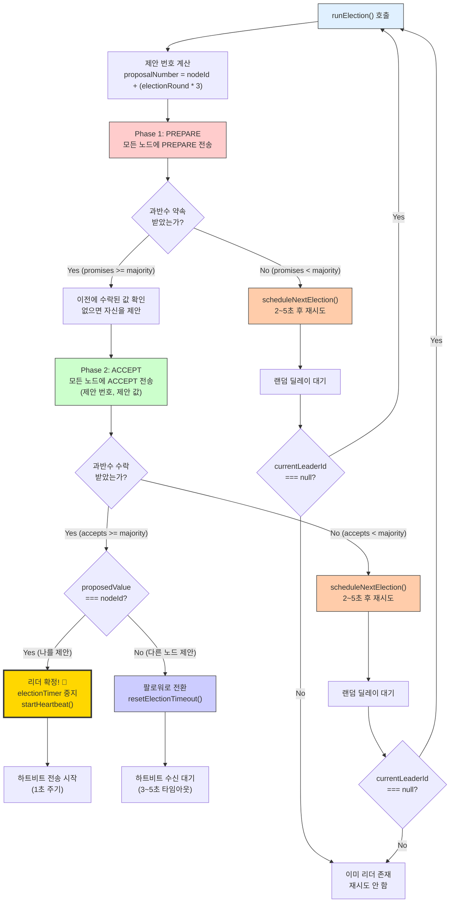
```mermaid
flowchart TD
    START["runElection() 호출"] --> CALC["제안 번호 계산<br/>proposalNumber = nodeId + (electionRound * 3)"]

    CALC --> PHASE1["Phase 1: PREPARE<br/>모든 노드에 PREPARE 전송"]

    PHASE1 --> PROMISE_CHECK{"과반수 약속<br/>받았는가?"}

    PROMISE_CHECK -->|"No (promises < majority)"| FAIL1["scheduleNextElection()<br/>2~5초 후 재시도"]
    PROMISE_CHECK -->|"Yes (promises >= majority)"| VALUE_CHECK["이전에 수락된 값 확인<br/>없으면 자신을 제안"]

    VALUE_CHECK --> PHASE2["Phase 2: ACCEPT<br/>모든 노드에 ACCEPT 전송<br/>(제안 번호, 제안 값)"]

    PHASE2 --> ACCEPT_CHECK{"과반수 수락<br/>받았는가?"}

    ACCEPT_CHECK -->|"No (accepts < majority)"| FAIL2["scheduleNextElection()<br/>2~5초 후 재시도"]
    ACCEPT_CHECK -->|"Yes (accepts >= majority)"| LEADER_CHECK{"proposedValue<br/>=== nodeId?"}

    LEADER_CHECK -->|"Yes (나를 제안)"| LEADER["리더 확정! 👑<br/>electionTimer 중지<br/>startHeartbeat()"]
    LEADER_CHECK -->|"No (다른 노드 제안)"| FOLLOWER["팔로워로 전환<br/>resetElectionTimeout()"]

    LEADER --> END1["하트비트 전송 시작<br/>(1초 주기)"]
    FOLLOWER --> END2["하트비트 수신 대기<br/>(3~5초 타임아웃)"]

    FAIL1 --> WAIT1["랜덤 딜레이 대기"]
    FAIL2 --> WAIT2["랜덤 딜레이 대기"]

    WAIT1 --> CHECK1{"currentLeaderId<br/>=== null?"}
    WAIT2 --> CHECK2{"currentLeaderId<br/>=== null?"}

    CHECK1 -->|Yes| START
    CHECK1 -->|No| END3["이미 리더 존재<br/>재시도 안 함"]

    CHECK2 -->|Yes| START
    CHECK2 -->|No| END3

    style START fill:#e0f0ff,stroke:#333
    style PHASE1 fill:#ffcccc,stroke:#333
    style PHASE2 fill:#ccffcc,stroke:#333
    style LEADER fill:#ffd700,stroke:#333,stroke-width:3px
    style FOLLOWER fill:#ccccff,stroke:#333
    style FAIL1 fill:#ffccaa,stroke:#333
    style FAIL2 fill:#ffccaa,stroke:#333
```

혹시 더 상세한 설명을 원하는 분들 위해서(음.. 미래의 저를 위해서...!) 더 자세한 알고리즘의 흐름을 이 글 마지막의 Appendix에 추가해두었습니다.

## Appendix - 더 상세한 설명

미래의 저를 위해서 더 상세한 설명을 남겨두겠습니다!

### 구체적 시나리오: 노드 3이 리더로 선출

#### 초기 상태

| 노드 | promisedProposal | acceptedProposal | acceptedValue | currentLeaderId | currentTerm | electionRound |
|------|------------------|------------------|---------------|-----------------|-------------|---------------|
| 1 | null | null | null | null | 0 | 0 |
| 2 | null | null | null | null | 0 | 0 |
| 3 | null | null | null | null | 0 | 0 |

노드 3이 가장 먼저 랜덤 딜레이가 만료되어 선출을 시작한다고 가정합니다.

#### Phase 1: PREPARE 시퀀스

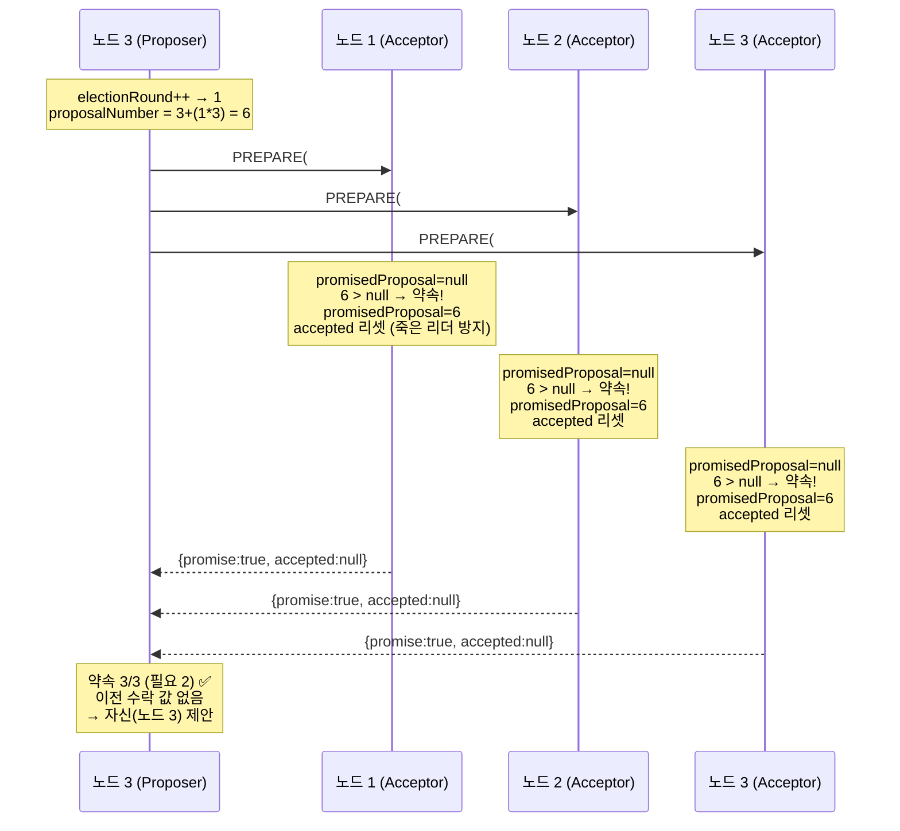
```mermaid
sequenceDiagram
    participant P as 노드 3 (Proposer)
    participant A1 as 노드 1 (Acceptor)
    participant A2 as 노드 2 (Acceptor)
    participant A3 as 노드 3 (Acceptor)

    Note over P: electionRound++ → 1<br/>proposalNumber = 3+(1*3) = 6

    P->>A1: PREPARE(#6)
    P->>A2: PREPARE(#6)
    P->>A3: PREPARE(#6)

    Note over A1: promisedProposal=null<br/>6 > null → 약속!<br/>promisedProposal=6<br/>accepted 리셋 (죽은 리더 방지)
    Note over A2: promisedProposal=null<br/>6 > null → 약속!<br/>promisedProposal=6<br/>accepted 리셋
    Note over A3: promisedProposal=null<br/>6 > null → 약속!<br/>promisedProposal=6<br/>accepted 리셋

    A1-->>P: {promise:true, accepted:null}
    A2-->>P: {promise:true, accepted:null}
    A3-->>P: {promise:true, accepted:null}

    Note over P: 약속 3/3 (필요 2) ✅<br/>이전 수락 값 없음<br/>→ 자신(노드 3) 제안
```

**핵심 포인트**:
- `promisedProposal === null || proposalNumber > promisedProposal` 조건 충족 시 약속
- **PREPARE 처리 시 `acceptedProposal`과 `acceptedValue`를 null로 리셋** (node.ts:295-296)
  - 이유: 리더 선출에서는 각 선거가 새로운 Paxos 인스턴스처럼 동작
  - 죽은 리더가 재선출되는 것을 방지
- 응답에 이전 수락 값 포함 (표준 Paxos 메커니즘)

#### Phase 1 이후 상태

| 노드 | promisedProposal | acceptedProposal | acceptedValue | currentLeaderId | currentTerm |
|------|------------------|------------------|---------------|-----------------|-------------|
| 1 | **6** | null (리셋) | null (리셋) | null | 0 |
| 2 | **6** | null (리셋) | null (리셋) | null | 0 |
| 3 | **6** | null (리셋) | null (리셋) | null | 0 |

#### Phase 2: ACCEPT 시퀀스

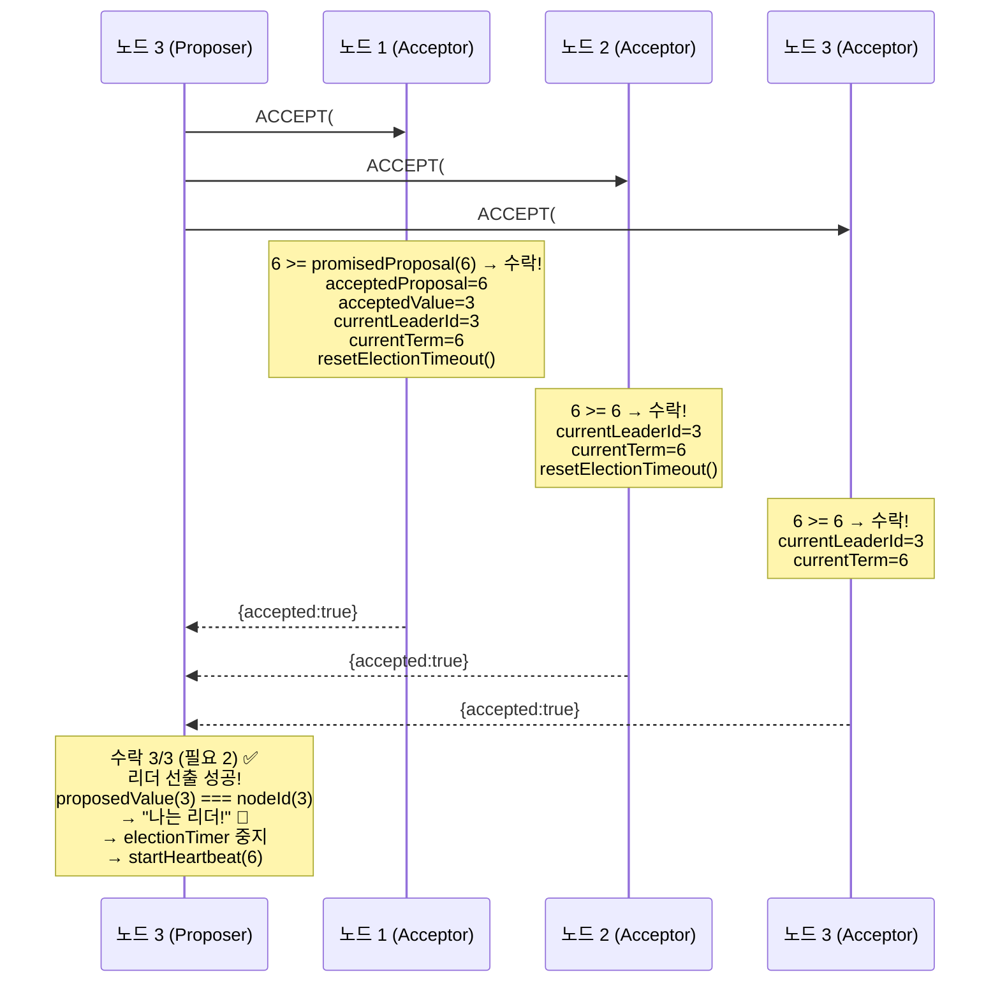
```mermaid
sequenceDiagram
    participant P as 노드 3 (Proposer)
    participant A1 as 노드 1 (Acceptor)
    participant A2 as 노드 2 (Acceptor)
    participant A3 as 노드 3 (Acceptor)

    P->>A1: ACCEPT(#6, value:3)
    P->>A2: ACCEPT(#6, value:3)
    P->>A3: ACCEPT(#6, value:3)

    Note over A1: 6 >= promisedProposal(6) → 수락!<br/>acceptedProposal=6<br/>acceptedValue=3<br/>currentLeaderId=3<br/>currentTerm=6<br/>resetElectionTimeout()
    Note over A2: 6 >= 6 → 수락!<br/>currentLeaderId=3<br/>currentTerm=6<br/>resetElectionTimeout()
    Note over A3: 6 >= 6 → 수락!<br/>currentLeaderId=3<br/>currentTerm=6

    A1-->>P: {accepted:true}
    A2-->>P: {accepted:true}
    A3-->>P: {accepted:true}

    Note over P: 수락 3/3 (필요 2) ✅<br/>리더 선출 성공!<br/>proposedValue(3) === nodeId(3)<br/>→ "나는 리더!" 👑<br/>→ electionTimer 중지<br/>→ startHeartbeat(6)
```

**핵심 포인트**:
- `promisedProposal === null || proposalNumber >= promisedProposal` 조건 충족 시 수락
- 모든 Acceptor가 상태 업데이트:
  - `acceptedProposal`, `acceptedValue` 설정
  - `currentLeaderId`, `currentTerm` 갱신
  - 리더가 아닌 노드는 `stopHeartbeat()` 호출
  - **`resetElectionTimeout()` 호출** → 3~5초 타이머 리셋
- 노드 3은 `proposedValue === nodeId` 확인 후:
  - **`electionTimer` 중지** (node.ts:192-194) ← 중요! 리더는 타이머 불필요
  - `startHeartbeat(6)` 호출

#### Phase 2 이후 최종 상태

| 노드 | promisedProposal | acceptedProposal | acceptedValue | currentLeaderId | currentTerm | heartbeatTimer | electionTimer | 역할 |
|------|------------------|------------------|---------------|-----------------|-------------|----------------|---------------|------|
| 1 | 6 | 6 | 3 | **3** | **6** | null | 활성 (3~5초) | 팔로워 |
| 2 | 6 | 6 | 3 | **3** | **6** | null | 활성 (3~5초) | 팔로워 |
| 3 | 6 | 6 | 3 | **3** | **6** | **활성 (1초)** | **null (중지)** | **리더** 👑 |

### 선출 후 하트비트 흐름

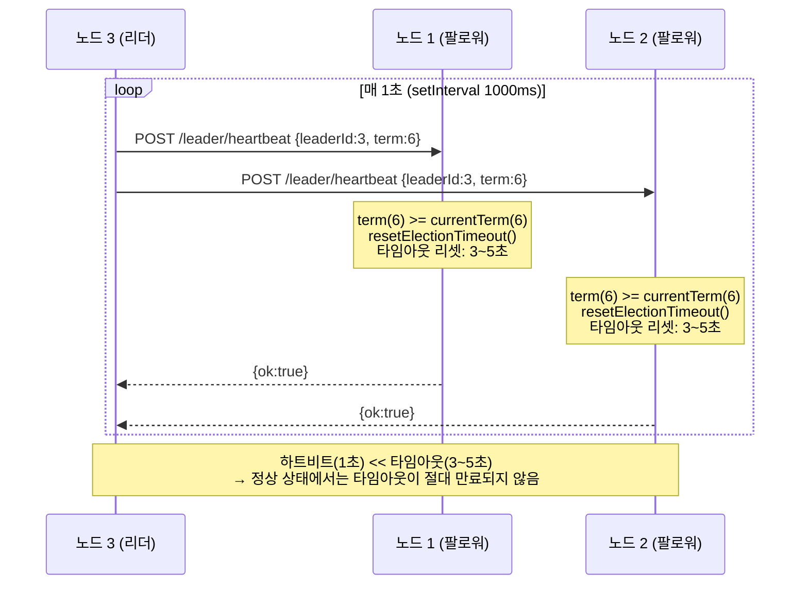
```mermaid
sequenceDiagram
    participant L as 노드 3 (리더)
    participant F1 as 노드 1 (팔로워)
    participant F2 as 노드 2 (팔로워)

    loop 매 1초 (setInterval 1000ms)
        L->>F1: POST /leader/heartbeat {leaderId:3, term:6}
        L->>F2: POST /leader/heartbeat {leaderId:3, term:6}
        Note over F1: term(6) >= currentTerm(6)<br/>resetElectionTimeout()<br/>타임아웃 리셋: 3~5초
        Note over F2: term(6) >= currentTerm(6)<br/>resetElectionTimeout()<br/>타임아웃 리셋: 3~5초
        F1-->>L: {ok:true}
        F2-->>L: {ok:true}
    end

    Note over L,F2: 하트비트(1초) << 타임아웃(3~5초)<br/>→ 정상 상태에서는 타임아웃이 절대 만료되지 않음
```

**하트비트 전송 코드** (node.ts:225-245):
```typescript
function startHeartbeat(term: number) {
  stopHeartbeat(); // 기존 타이머 제거

  heartbeatTimer = setInterval(() => {
    console.log(`[노드 ${nodeId}] 💓 하트비트 전송 (턴 ${term})`);

    // ★ 자신(리더)를 제외한 peers에만 전송
    peers.forEach(async (peerUrl) => {
      try {
        await fetch(`${peerUrl}/leader/heartbeat`, {
          method: 'POST',
          headers: { 'Content-Type': 'application/json' },
          body: JSON.stringify({ leaderId: nodeId, term }),
          signal: AbortSignal.timeout(1000),
        });
      } catch (error) {
        // 노드 다운 시 무시
      }
    });
  }, 1000);
}
```

**하트비트 수신 핸들러** (node.ts:352-375):
```typescript
app.post('/leader/heartbeat', (req, res) => {
  const { leaderId, term } = req.body;

  if (term >= currentTerm) {
    if (leaderId !== currentLeaderId) {
      console.log(`[노드 ${nodeId}] 💓 새로운 리더로부터 하트비트 수신`);
    }
    currentLeaderId = leaderId;
    currentTerm = term;
    resetElectionTimeout(); // ★ 핵심! 타임아웃 리셋
  }

  res.json({ ok: true });
});
```

**타이밍 관계**:
- 하트비트 전송: **1초** (`setInterval(1000)`)
- 선출 타임아웃: **3~5초** (`3000 + Math.random() * 2000`)
- **하트비트 주기 << 타임아웃 범위** → 정상 상태에서는 타임아웃 절대 만료 안 됨

### 리더 장애 감지와 재선출

#### 시나리오: kill 3 → 노드 2가 새 리더로 선출

```mermaid
sequenceDiagram
    participant CLI as 클러스터 CLI
    participant N3 as 노드 3 (리더)
    participant N1 as 노드 1 (팔로워)
    participant N2 as 노드 2 (팔로워)

    CLI->>N3: kill 3 (SIGTERM)
    Note over N3: 프로세스 종료<br/>하트비트 중단
    destroy N3

    Note over N1: 하트비트 안 옴...
    Note over N2: 하트비트 안 옴...

    Note over N2: 3.5초 후 타임아웃 만료!<br/>currentLeaderId = null<br/>accepted 상태 리셋<br/>→ runElection()

    Note over N2: promisedProposal = 6<br/>electionRound = max(0, ceil(6/3)) = 2<br/>electionRound++ = 3<br/>proposalNumber = 2+(3*3) = 11

    N2->>N1: PREPARE(#11)
    N2->>N2: PREPARE(#11) (자신)
    N2--xN3: PREPARE(#11) (타임아웃)

    Note over N1: 11 > 6 → 약속!<br/>promisedProposal=11<br/>accepted 리셋
    N1-->>N2: {promise:true}
    Note over N2: 자신도 약속

    Note over N2: 약속 2/3 (필요 2) ✅

    N2->>N1: ACCEPT(#11, value:2)
    N2->>N2: ACCEPT(#11, value:2) (자신)
    N2--xN3: ACCEPT(#11, value:2) (타임아웃)

    Note over N1: 11 >= 11 → 수락!<br/>currentLeaderId=2<br/>currentTerm=11<br/>resetElectionTimeout()
    N1-->>N2: {accepted:true}
    Note over N2: 자신도 수락

    Note over N2: 수락 2/3 (필요 2) ✅<br/>새 리더 확정! 👑<br/>electionTimer 중지<br/>startHeartbeat(11)

    loop 매 1초
        N2->>N1: heartbeat {leaderId:2, term:11}
        Note over N1: resetElectionTimeout()
    end
```

**electionRound 조정 로직** (node.ts:70-71):
```typescript
if (promisedProposal !== null) {
  electionRound = Math.max(electionRound, Math.ceil(promisedProposal / allNodes.length));
}
electionRound++;
```

**예시**:
- `promisedProposal = 6`, `allNodes.length = 3`
- `electionRound = max(0, ceil(6/3)) = max(0, 2) = 2`
- `electionRound++ = 3`
- `proposalNumber = 2 + (3*3) = 11`

**과반수 요구**:
- 3개 노드 중 1개 다운 → 2개 응답 (= 과반수) → 선출 가능!
- **Paxos의 장애 허용 능력**: N개 노드에서 (N-1)/2개 장애 허용

#### 재선출 후 상태

| 노드 | promisedProposal | acceptedProposal | acceptedValue | currentLeaderId | currentTerm | heartbeatTimer | electionTimer | 역할 |
|------|------------------|------------------|---------------|-----------------|-------------|----------------|---------------|------|
| 1 | 11 | 11 | 2 | **2** | **11** | null | 활성 (3~5초) | 팔로워 |
| 2 | 11 | 11 | 2 | **2** | **11** | **활성 (1초)** | **null (중지)** | **리더** 👑 |
| 3 | - | - | - | - | - | - | - | **DOWN** |

### 노드 재시작과 팔로워 합류

#### 시나리오: start 3 → 노드 3이 팔로워로 자연스럽게 합류

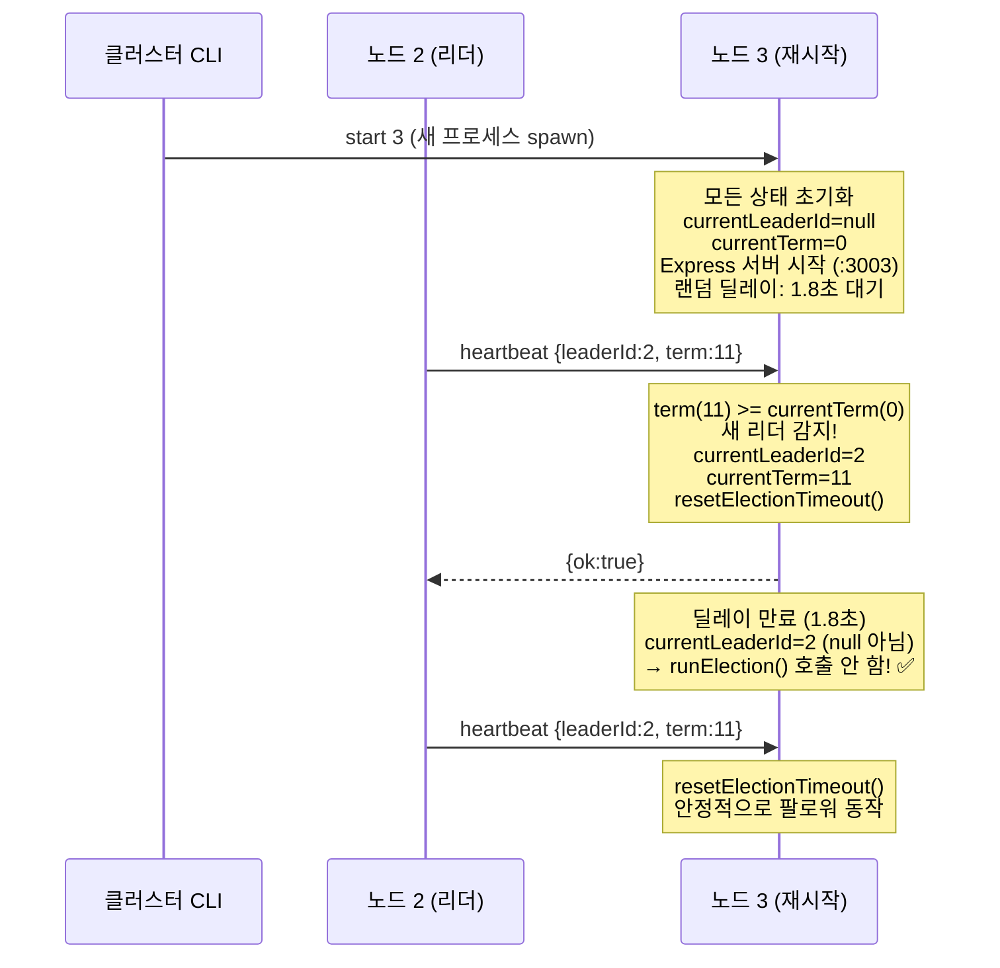
```mermaid
sequenceDiagram
    participant CLI as 클러스터 CLI
    participant N2 as 노드 2 (리더)
    participant N3 as 노드 3 (재시작)

    CLI->>N3: start 3 (새 프로세스 spawn)
    Note over N3: 모든 상태 초기화<br/>currentLeaderId=null<br/>currentTerm=0<br/>Express 서버 시작 (:3003)<br/>랜덤 딜레이: 1.8초 대기

    N2->>N3: heartbeat {leaderId:2, term:11}
    Note over N3: term(11) >= currentTerm(0)<br/>새 리더 감지!<br/>currentLeaderId=2<br/>currentTerm=11<br/>resetElectionTimeout()
    N3-->>N2: {ok:true}

    Note over N3: 딜레이 만료 (1.8초)<br/>currentLeaderId=2 (null 아님)<br/>→ runElection() 호출 안 함! ✅

    N2->>N3: heartbeat {leaderId:2, term:11}
    Note over N3: resetElectionTimeout()<br/>안정적으로 팔로워 동작
```

**재시작 초기화 흐름** (node.ts:393-409):
```typescript
app.listen(port, () => {
  console.log(`[노드 ${nodeId}] 🚀 포트 ${port}에서 수신 중...`);

  // 1~3초 랜덤 딜레이
  const delay = 1000 + Math.random() * 2000;
  console.log(`[노드 ${nodeId}] 리더 조회 전 ${Math.round(delay)}ms 대기...`);

  // 딜레이 후 리더가 없으면 선출 시작
  setTimeout(() => {
    if (currentLeaderId === null) { // ★ 핵심 조건
      console.log(`[노드 ${nodeId}] 리더 없음, 리더 선출 시작...`);
      runElection();
    }
  }, delay);

  resetElectionTimeout();
});
```

**핵심 메커니즘**:
1. 노드 3이 재시작하면 모든 상태 변수가 초기값 (`currentLeaderId = null`)
2. 랜덤 딜레이 (1~3초) 동안 대기
3. 이 시간 동안 리더(노드 2)의 하트비트(1초 주기)가 도착
4. 하트비트 수신 시 `currentLeaderId = 2`로 설정
5. 딜레이 만료 시 `currentLeaderId !== null` → 선출 시작 안 함!
6. 자연스럽게 팔로워로 합류

#### 재시작 후 안정 상태

| 노드 | promisedProposal | acceptedProposal | acceptedValue | currentLeaderId | currentTerm | electionTimer | 역할 |
|------|------------------|------------------|---------------|-----------------|-------------|---------------|------|
| 1 | 11 | 11 | 2 | 2 | 11 | 활성 | 팔로워 |
| 2 | 11 | 11 | 2 | 2 | 11 | null (중지) | 리더 👑 |
| 3 | **null** | **null** | **null** | **2 (학습)** | **11 (학습)** | **활성** | **팔로워 (새로 합류)** |

**주목**: 노드 3은 Paxos 상태가 null이지만 하트비트만으로 리더 정보를 학습합니다. 메모리 기반 구현이므로 재시작 시 상태 복구 없음.

### 타이밍 관계 요약

| 타이머 | 시간 | 구현 | 용도 |
|--------|------|------|------|
| 하트비트 전송 주기 | **1초** | `setInterval(1000)` | 리더가 팔로워에게 생존 신호 전송 |
| 하트비트 타임아웃 (선출 트리거) | **3~5초** | `3000 + Math.random() * 2000` | 팔로워가 리더 장애 감지 |
| 초기 선출 딜레이 | **1~3초** | `1000 + Math.random() * 2000` | 클러스터 시작 시 동시 선출 방지 |
| 선거 실패 후 재시도 딜레이 | **2~5초** | `2000 + Math.random() * 3000` | Phase 실패 후 재시도 간격 |
| HTTP 요청 타임아웃 | **1초** | `AbortSignal.timeout(1000)` | 네트워크 요청 타임아웃 |

**타이밍 설계 원칙**:
- **하트비트 주기 << 타임아웃** → 정상 상태에서 타임아웃 절대 만료 안 됨
- **모든 딜레이/타임아웃에 랜덤 범위** → 선출 충돌 방지 (livelock 방지)
- **HTTP 타임아웃 << 하트비트 주기** → 빠른 장애 감지

### 전체 흐름 한눈에 보기

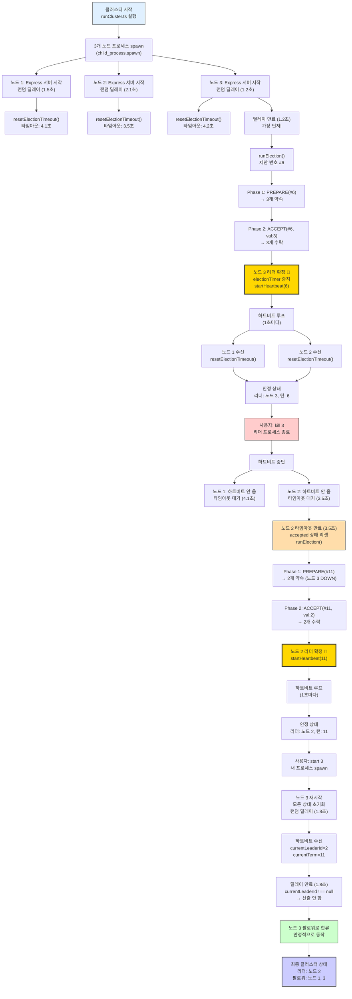
```mermaid
flowchart TD
    START["클러스터 시작<br/>runCluster.ts 실행"] --> SPAWN["3개 노드 프로세스 spawn<br/>(child_process.spawn)"]

    SPAWN --> NODE1["노드 1: Express 서버 시작<br/>랜덤 딜레이 (1.5초)"]
    SPAWN --> NODE2["노드 2: Express 서버 시작<br/>랜덤 딜레이 (2.1초)"]
    SPAWN --> NODE3["노드 3: Express 서버 시작<br/>랜덤 딜레이 (1.2초)"]

    NODE1 --> TIMEOUT1["resetElectionTimeout()<br/>타임아웃: 4.1초"]
    NODE2 --> TIMEOUT2["resetElectionTimeout()<br/>타임아웃: 3.5초"]
    NODE3 --> TIMEOUT3["resetElectionTimeout()<br/>타임아웃: 4.2초"]

    NODE3 --> FIRST["딜레이 만료 (1.2초)<br/>가장 먼저!"]
    FIRST --> ELECTION1["runElection()<br/>제안 번호 #6"]

    ELECTION1 --> P1["Phase 1: PREPARE(#6)<br/>→ 3개 약속"]
    P1 --> P2["Phase 2: ACCEPT(#6, val:3)<br/>→ 3개 수락"]
    P2 --> LEADER1["노드 3 리더 확정 👑<br/>electionTimer 중지<br/>startHeartbeat(6)"]

    LEADER1 --> HB_LOOP["하트비트 루프<br/>(1초마다)"]

    HB_LOOP --> HB1["노드 1 수신<br/>resetElectionTimeout()"]
    HB_LOOP --> HB2["노드 2 수신<br/>resetElectionTimeout()"]

    HB1 --> STABLE["안정 상태<br/>리더: 노드 3, 턴: 6"]
    HB2 --> STABLE

    STABLE --> KILL["사용자: kill 3<br/>리더 프로세스 종료"]

    KILL --> STOP_HB["하트비트 중단"]

    STOP_HB --> DETECT1["노드 1: 하트비트 안 옴<br/>타임아웃 대기 (4.1초)"]
    STOP_HB --> DETECT2["노드 2: 하트비트 안 옴<br/>타임아웃 대기 (3.5초)"]

    DETECT2 --> REELECTION["노드 2 타임아웃 만료 (3.5초)<br/>accepted 상태 리셋<br/>runElection()"]

    REELECTION --> RE_P1["Phase 1: PREPARE(#11)<br/>→ 2개 약속 (노드 3 DOWN)"]
    RE_P1 --> RE_P2["Phase 2: ACCEPT(#11, val:2)<br/>→ 2개 수락"]
    RE_P2 --> LEADER2["노드 2 리더 확정 👑<br/>startHeartbeat(11)"]

    LEADER2 --> HB_LOOP2["하트비트 루프<br/>(1초마다)"]

    HB_LOOP2 --> STABLE2["안정 상태<br/>리더: 노드 2, 턴: 11"]

    STABLE2 --> RESTART["사용자: start 3<br/>새 프로세스 spawn"]

    RESTART --> NODE3_NEW["노드 3 재시작<br/>모든 상태 초기화<br/>랜덤 딜레이 (1.8초)"]

    NODE3_NEW --> HB_RECEIVE["하트비트 수신<br/>currentLeaderId=2<br/>currentTerm=11"]

    HB_RECEIVE --> DELAY_EXPIRE["딜레이 만료 (1.8초)<br/>currentLeaderId !== null<br/>→ 선출 안 함"]

    DELAY_EXPIRE --> FOLLOWER["노드 3 팔로워로 합류<br/>안정적으로 동작"]

    FOLLOWER --> FINAL["최종 클러스터 상태<br/>리더: 노드 2<br/>팔로워: 노드 1, 3"]

    style START fill:#e0f0ff,stroke:#333
    style LEADER1 fill:#ffd700,stroke:#333,stroke-width:3px
    style LEADER2 fill:#ffd700,stroke:#333,stroke-width:3px
    style KILL fill:#ffcccc,stroke:#333
    style REELECTION fill:#ffddaa,stroke:#333
    style FOLLOWER fill:#ccffcc,stroke:#333
    style FINAL fill:#ccccff,stroke:#333,stroke-width:2px
```

## 참고자료

- 요즘 개발자를 위한 시스템 설계 수업. 디렌드라 신하, 테자스 초프라 저. 길벗
- https://www.ibm.com/history/700
- https://setiathome.berkeley.edu/sah_graphics.php
- CLAUDE
- Perpexity