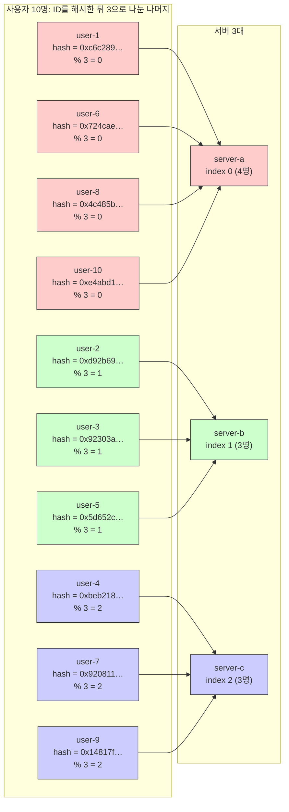
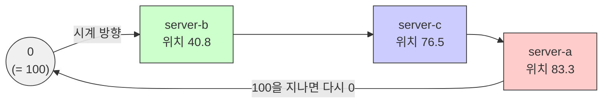
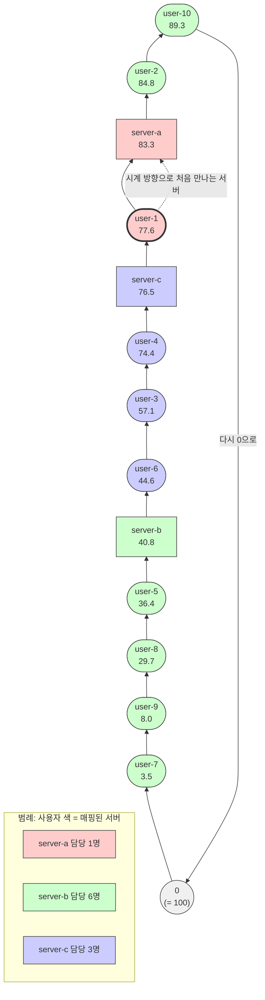
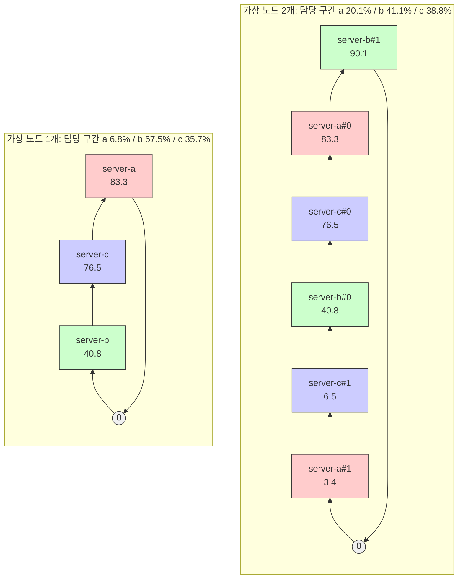
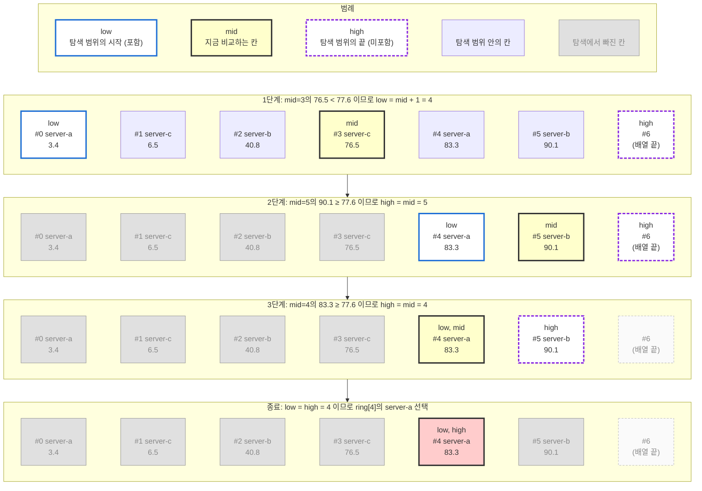
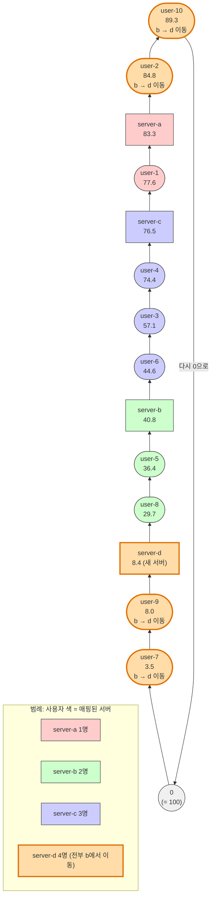
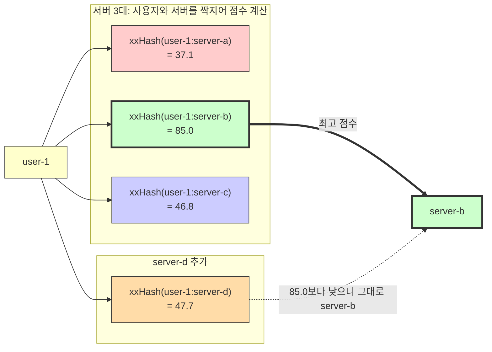

# 분산 시스템 설계(2) - 일관된 해싱

해시 함수는 `주어진 입력에 대해서 고정된 범위의 값으로 매핑`합니다. 어떤 값이 주어져도 고정된 범위로 매핑해주기 때문에 분산 시스템에서는 이런 해시 알고리즘이 중요하게 사용됩니다. 분산 시스템에서는 들어오는 사용자의 입력을 분산된 시스템 중 어느 인스턴스에 전달해서 처리하게 할지, 그리고 인스턴스가 추가되거나 삭제될 때는 어떻게 할지 등의 문제를 해결해야 하기 때문이죠.

## 나머지 연산 해시(modulo hash)

가장 간단한 방법은 시스템으로 들어오는 요청을 해시로 변환하고, 그 해시를 인스턴스 개수로 나눈 나머지를 이용하는 방법입니다.

사용자 10명을 서버 3대에 나누는 모습입니다. 각 사용자 ID를 해시한 뒤 3으로 나눈 나머지가 곧 서버 번호가 됩니다.



각 사용자 ID의 해시 값을 서버 개수로 나눈 나머지에 따라 서버와 매핑되고 있습니다. 같은 ID를 해시하면 항상 같은 값이 나오기 때문에 user-1은 몇 번을 물어봐도 server-a입니다.

### 나머지 연산 해시 구현

그럼 예시 코드를 확인해볼까요? 우선 나머지 연산 해시 관련 코드입니다.

```typescript
// src/hash.ts
import crypto from "node:crypto";

/**
 * 나머지 연산(mod) 분배 알고리즘
 * 서버 수가 바뀌면 거의 모든 키의 나머지 값이 바뀐다. 그래서 대부분의 키가 이동한다.
 * @param key 유저ID 등의 키
 * @param servers 서버 목록
 * @returns 분배 대상이 되는 서버 이름
 */
export function modHash(key: string, servers: string[]) {
    const index = Number(hash(key) % BigInt(servers.length));

    return servers[index];
}

/**
 * 노드의 기본 crypto 모듈을 사용하여 입력 값을 해시한다.
 * @param input 입력 값
 * @param algorithm 해시 알고리즘
 * @returns 해시 결과
 */
export function hash(input: string, algorithm = "sha256"): bigint {
    // 256비트 해시 생성 -> 64개의 16진수 문자열(64 * 4 = 256)
    const digest = crypto.createHash(algorithm).update(input).digest("hex");

    // 결과로 나온 16진수 문자열을 256비트 숫자로 변환
    // number는 double 형식이므로, 정수의 범위는 -(2⁵³ - 1) ~ (2⁵³ - 1) 이므로 256bit 정수를 정확하게 표현불가.
    // 그래서 BigInt를 사용함. BigInt의 경우 자바스크립트 엔진에서 단일 값에 허용하는 최대 비트 수까지 할당가능.
    // 정수 비교를 위해 BigInt를 썼지만, sha256 해시의 결과는 항상 같은 길이의 문자열이므로 문자열을 그대로 비교해도 같은 결과를 얻을 수 있다!
    return BigInt(`0x${digest}`);
}
```

`hash` 함수는 node.js에서 기본으로 제공하는 crypto 모듈을 통해 입력값의 해시를 생성합니다. 해시 알고리즘의 기본 값은 sha256으로 결과값이 항상 256비트로 구성됩니다. 그리고 나머지 연산 해시는 `hash`함수를 이용해서 특정 사용자의 식별자를 해시로 변환하고, 서버 개수로 나눈 나머지를 인덱스로 사용해서 사용자와 서버를 매핑합니다.

그리고 이어서 사용자 목록과 서버 목록을 받아서 해시 알고리즘을 적용하는 헬퍼 함수와 매핑 결과를 출력하는데 사용될 헬퍼 함수를 정의합니다.

```typescript
// src/hash.ts

/**
 * 각 키를 대응하는 서버에 라우팅하여 할당
 * @param keys 유저ID 등의 키 목록
 * @param servers 서버 목록
 * @param hashFn 해시 알고리즘(링, 랑데뷰)
 * @returns 
 */
export function assign(
    keys: string[], 
    servers: string[], 
    hashFn: (key: string, servers: string[]) => string): Record<string, string> {
    const result: Record<string, string> = {};

    for (const key of keys) {
        result[key] = hashFn(key, servers);
    }

    return result;
}

/**
 * 각 서버별 분배 결과를 테이블로 출력.
 */
export function printDistribution(result: Record<string, string>) {
    const distribution: Record<string, number> = {};

    for (const server of Object.values(result)) {
        distribution[server] = (distribution[server] ?? 0) + 1;
    }

    console.table(distribution);
}
```

그리고 마지막으로 사용자와 서버를 선언하고, 매핑을 진행하는 코드를 작성합니다.

```typescript
// src/distribution.ts
import { assign, modHash, printDistribution } from "./hash.js";

const users = Array.from(
    {length: 10},
    (_, i) => `user-${String(i + 1)}`,
);

// 해시 알고리즘과 각 해시 알고리즘 실행을 위한 hashFn 구성
const algorithms: Record<string, (servers: string[]) => (key: string, servers: string[]) => string> = {
    "mod": () => modHash,
};

// 각 해시 알고리즘 별로 실행하여 결과 확인
for (const [name, makeHashFn] of Object.entries(algorithms)) {
    console.log(`\n===== ${name} =====`);

    console.log("--- 서버 3대 ---");

    const servers = ["server-a", "server-b", "server-c"];

    const before = assign(users, servers, makeHashFn(servers));

    printDistribution(before);
}
```

사용자 10명과 서버 3대를 선언하고, 나머지 해시 알고리즘을 통해 매핑을 진행하고 결과를 확인하는 순서로 진행됩니다. 결과를 볼까요?

```bash
> npx tsx ./src/distribution.ts

===== mod =====
--- 서버 3대 ---
┌──────────┬────────┐
│ (index)  │ Values │
├──────────┼────────┤
│ server-a │ 4      │
│ server-b │ 3      │
│ server-c │ 3      │
└──────────┴────────┘
```

4:3:3 이라면 얼추 균등하게 요청이 분배되었네요. 유저를 1000명까지 늘려볼까요?

```bash
> npx tsx ./src/distribution.ts

===== mod =====
--- 서버 3대 ---
┌──────────┬────────┐
│ (index)  │ Values │
├──────────┼────────┤
│ server-a │ 339    │
│ server-b │ 347    │
│ server-c │ 314    │
└──────────┴────────┘
```

역시나 비슷한 결과가 나옵니다.

### 그런데 말입니다...

그러면 여기서 한 가지 의문이 생깁니다. `얼추 비슷한데 그냥 나머지 연산 해시 이거면 다 되는 거 아닌가?` 하고 말이죠. 그러면 서버가 추가되거나 삭제될 때도 잘 동작하는지 추가로 확인해 보겠습니다.

우선 src/hash.ts에 다음 함수를 추가합니다.

```typescript
// src/hash.ts
/**
 * 서버 목록에 변동이 발생하여 사용자를 재분배한 경우, 재분배로 인해 발생한 이동을 확인한다.
 * @param previous 이전 분배 결과
 * @param current 재분배 결과
 * @returns 재분배 결과 발생한 이동
 */
export function compare(previous: Record<string, string>, current: Record<string, string>) {
    let moved = 0;

    for (const key of Object.keys(previous)) {
        if (previous[key] !== current[key]) {
            moved++;
        }
    }

    return moved;
}
```

그리고 다음과 같이 src/distribution.ts를 수정합니다.

```typescript
//src/distribution.ts
...

// 각 해시 알고리즘 별로 실행하여 결과 확인
for (const [name, makeHashFn] of Object.entries(algorithms)) {
    console.log(`\n===== ${name} =====`);

    console.log("--- 서버 3대 ---");

    const servers = ["server-a", "server-b", "server-c"];

    const before = assign(users, servers, makeHashFn(servers));

    printDistribution(before);

    console.log("--- server-d 추가 ---");

    servers.push("server-d");

    const after = assign(users, servers, makeHashFn(servers));

    printDistribution(after);

    console.log(`이동된 사용자 수: ${compare(before, after)} / ${users.length}`);
}
```

서버를 한 대 추가하고 재분배를 진행해서 얼마나 많은 사용자가 재분배로 인해 다른 서버로 이동되었는지 확인하는 코드가 추가되었습니다. 실행해서 결과를 볼까요?

```bash
> npx tsx ./src/distribution.ts

===== mod =====
--- 서버 3대 ---
┌──────────┬────────┐
│ (index)  │ Values │
├──────────┼────────┤
│ server-a │ 339    │
│ server-b │ 347    │
│ server-c │ 314    │
└──────────┴────────┘
--- server-d 추가 ---
┌──────────┬────────┐
│ (index)  │ Values │
├──────────┼────────┤
│ server-d │ 244    │
│ server-b │ 242    │
│ server-c │ 259    │
│ server-a │ 255    │
└──────────┴────────┘
이동된 사용자 수: 756 / 1000
```

서버가 한 대 추가되어도 사용자의 분배는 거의 1/4에 가깝게 진행됩니다. 하지만, 이동된 사용자 수는 1/4이 아니라 3/4죠!

서버가 상태를 가지지 않는(stateless) 웹 서버라면 굳이 문제될 건 없어 보입니다. nginx도 기본값으로 순차적으로 돌아가며 요청을 분배하는 라운드 로빈(round-robin) 방식을 사용하고, node.js 프로세스를 관리할 때 많이 사용하는 PM2 역시 라운드 로빈을 사용합니다.

그런데 로컬 캐시와 같이 상태를 가지는 연결이라면, 75%의 사용자가 이동되는 문제는 매우 심각한 문제가 아닐까요?

> 물론 Redis같은 전역 캐시를 사용해도 됩니다. 다만, 대규모 서비스로 갈수록 단순히 Redis만 사용하기 보다는 메모리 기반 로컬 캐시와 Redis를 조합해서 사용하는 경향이 있습니다. 로컬 캐시에서 응답할 수 있다면 Redis와 네트워크 통신에 걸리는 지연시간을 줄일 수 있기 때문이죠. DB가 업데이트 되면, pub/sub등으로 로컬 캐시를 무효화하고 다시 로드하도록 하는 등의 방식을 사용합니다.

## 링 해시(ring hash)

그래서 등장한 게 일관성 있게 요청을 분배할 수 있도록 해주는 링 해시 알고리즘입니다.

사용자가 매핑될 수 있는 모든 해시 지점을 하나의 링(원)으로 구성한 뒤에, 그 위에 서버 인스턴스를 해시하여 배치합니다.

SHA256을 사용하는 경우 해시 값은 0부터 2²⁵⁶ - 1까지의 아주 큰 숫자인데요, 이후 표시된 도식에서는 해시 값을 0에서 100 사이 눈금으로 줄여서 표시합니다(해시 값 ÷ 2²⁵⁶ × 100). 매핑 가능한 지점들을 하나의 링으로 구성하기 때문에 눈금 100은 다시 0으로 이어집니다.

그러면 링 위에 서버 3대를 우선 배치해 볼까요?



서버 이름을 해시하면 각 서버는 링 위의 한 점이 됩니다. server-b는 40.8, server-c는 76.5, server-a는 83.3에 놓였습니다.

> 눈치채신 분도 있겠지만, 각 서버는 1/3 지점에 정확하게 매핑되지 않았습니다. 그렇기 때문에 server-b가 가장 많은 요청을, server-a가 가장 적은 요청을 받게 됩니다. 이걸 어떻게 해결할지 나중에 다시 이야기 하겠습니다!

사용자 A를 서버에 매핑해야 할 때, A를 해시로 변환해서 원 위의 한 점에 놓고 시계 방향으로 가장 가까운 서버를 찾아서 사용자와 서버를 매핑합니다.

> 링 해시 도식에서는 시작점(0)이 아래쪽에 위치하고 시계 방향으로 이동해서 다시 시작점(100)으로 이동합니다!



user-1을 해시한 값이 77.6이기 때문에 시계 방향으로 처음 만나는 서버는 83.3의 server-a입니다. 같은 규칙으로 10명을 전부 배치하면 server-b 6명, server-c 3명, server-a 1명이 됩니다. 83.3을 지나 0으로 돌아와서 40.8까지 이어지는 긴 구간이 전부 server-b 몫이기 때문이죠.

그럴듯해 보이지만 몇 가지 단점이 있습니다.

- 링 위에 각 서버가 균등하게 배치되지 않아서 특정 서버에게 더 많은 사용자가 매핑된다.
- 서버 하나가 종료되어 사라지는 경우, 그 다음 시계 방향에 위치한 서버가 모든 부담을 떠안는다.

그래서 이런 단점을 해소하기 위해서 각 서버 인스턴스의 가상 노드를 N개 더 만들어서 링 위에 배치합니다.



도식의 왼쪽은 가상 노드가 1개인 경우, 그러니까 가상노드를 사용하지 않는 경우와 똑같습니다. 오른쪽은 각 서버 별로 가상 노드를 2개씩 배치하는 예시입니다. 각 점들의 배치가 조금 더 촘촘해졌는데요. 가상 노드가 없을 때 가장 큰 문제였던 server-a와 server-b의 구간에 다른 가상 노드가 몇 개 더 배치되면서 분배가 비교적 더 균등해지게 된 거죠.

이렇게 하면 초기 서버 배치의 불평등을 완화할 수 있고, 서버의 추가/삭제에도 비교적 유연하게 대응할 수 있습니다. 그러면 링 알고리즘을 구현해봅시다!

### 링 해시 구현

다음과 같이 코드를 작성합니다.

```typescript
// src/ring.ts
import { hash } from "./hash.js";

/**
 * 해시 링 위의 노드 위치
 */
export type RingPoint = { 
    point: bigint; 
    /**
     * 노드가 소속된 서버
     */
    server: string 
};

/**
 * 해시 링(consistent hashing)을 만든다.
 * 서버 이름에 번호를 붙여 해시한 값이 링 위의 점이 되고, 서버 하나가 점을 vnodes개씩 가지도록 한다.
 * 서버 목록이 바뀔 때마다 링을 새로 만들어야 한다.
 * @param servers 서버 목록
 * @param vnodes 서버 하나가 가지는 지점(virtual node) 수. 기본값 100.
 * @returns point 오름차순으로 정렬된 링. ringHash에 넘겨 재사용한다.
 */
export function makeRing(servers: string[], vnodes = 100): RingPoint[] {
    const ring: RingPoint[] = [];

    for (const server of servers) {
        for (let i = 0; i < vnodes; i++) {
            // 가상노드의 개수만큼 해시를 추가
            ring.push({ point: hash(`${server}#${i}`), server });
        }
    }

    // 이진 탐색을 위해 해시 위치를 기준으로 오름차순 정렬
    return ring.sort((a, b) => (a.point < b.point ? -1 : a.point > b.point ? 1 : 0));
}

/**
 * 해시 링(consistent hashing) 분배 알고리즘
 * 키를 해시한 지점에서 시계 방향으로 처음 만나는 서버를 고른다.
 * 서버가 추가되거나 제거되면 그 서버가 차지한 구간의 키만 이동한다.
 * @param key 유저ID 등의 키
 * @param ring makeRing으로 만든 링
 * @returns 분배 대상이 되는 서버 이름
 */
export function ringHash(key: string, ring: RingPoint[]): string {
    // 키를 해시 링 위의 한 점으로 변환
    const keyPoint = hash(key);

    // 이진 탐색을 위한 양쪽 끝 경계. keyPoint보다 크거나 같은 첫 지점을 찾는다.
    let low = 0;
    let high = ring.length;

    // 탐색 구간이 비게 되면 탐색 종료
    while (low < high) {
        // 탐색 중간 지점 계산
        const mid = Math.floor((low + high) / 2)

        // 중간 지점의 값이 keyPoint보다 작으면, mid이전에는 찾는 값이 없으므로 탐색 범위를 mid+1~high로 재설정
        if (ring[mid].point < keyPoint) {
            low = mid + 1;
        } else { // 중간 지점의 값이 keyPoint보다 더 크면, mid이전에 찾는 값이 있을 수도 있으므로, 탐색 범위를 low~mid로 재설정
            high = mid;
        }
    }

    // 마지막 지점보다 큰 keyPoint의 경우 low가 최대 ring.length까지 갈 수 있다.
    // 그런데 ring[ring.length]는 존재하지 않으므로, % 연산으로 처음부터 순환하도록 한다.(wrap-around)
    return ring[low % ring.length].server;
}
```

makeRing 함수를 통해 가상 노드 개수만큼 각 서버별로 가상노드를 생성하고, 각 가상노드의 해시 값을 링 위에 배치합니다.

그리고 그렇게 만들어진 해시 링을 사용해서 각 사용자의 요청을 시계 방향의 가장 가까운(사용자 요청의 해시 값보다 크거나 같은) 노드에 매핑하는 거죠.

### 링에 배치된 서버와 매핑하는 방법: 이진 탐색

각 사용자의 요청을 매핑하기 위해서 이진 탐색을 사용하고 있는데요, 이 과정을 좀 더 자세히 알아보겠습니다.

가상 노드 2개짜리 링(지점 6개)에서 user-1(77.6)의 서버를 찾는 과정입니다. 정렬된 배열에서 77.6보다 크거나 같은 첫 지점을 찾습니다. low는 파란 테두리, high는 보라색 점선 테두리, mid는 노란색 칸입니다. high는 마지막 칸 다음, 즉 배열 끝(6)을 가리킬 수 있어서 #6 칸을 하나 더 그렸습니다. 회색은 탐색에서 빠진 칸입니다.



세 번 비교하고 index 4의 server-a에 도착했습니다. 지점이 600개(서버 6대 × 가상 노드 100개)라도 10번이면 끝납니다. 만약 키가 마지막 지점 90.1보다 크면 low가 6까지 가는데, 6 % 6 = 0이므로 처음 지점인 server-a#1로 돌아갑니다. 이게 코드 마지막 줄의 wrap-around입니다.

### 링 해시 분배 코드 작성

이제 링 해시를 사용해서 분배를 진행하는 코드를 작성할 차례입니다.

```typescript
// src/distribution.ts
import { makeRing, ringHash } from "./ring.js";
...

// 해시 알고리즘과 각 해시 알고리즘 실행을 위한 hashFn 구성
const algorithms: Record<string, (servers: string[]) => (key: string, servers: string[]) => string> = {
    "mod": () => modHash,
    "ring hash": (servers) => {
        const ring = makeRing(servers);

        return (key) => ringHash(key, ring);
    }
};

// 각 해시 알고리즘 별로 실행하여 결과 확인
for (const [name, makeHashFn] of Object.entries(algorithms)) {
    console.log(`\n===== ${name} =====`);

    console.log("--- 서버 3대 ---");

    const servers = ["server-a", "server-b", "server-c"];

    const before = assign(users, servers, makeHashFn(servers));

    printDistribution(before);

    console.log("--- server-d 추가 ---");

    servers.push("server-d");

    const after = assign(users, servers, makeHashFn(servers));

    printDistribution(after);

    console.log(`이동된 사용자 수: ${compare(before, after)} / ${users.length}`);
}
```

링 해시 알고리즘은 분배를 진행하려면 미리 링을 구성해야 합니다. 그래서 링 해시를 진행하기 전에 makeRing 함수를 통해서 링을 먼저 만들고, 그 링을 사용하는 해시 함수를 리턴합니다.

실행 결과를 볼까요?

```bash
> npx tsx ./src/distribution.ts

===== mod =====
--- 서버 3대 ---
┌──────────┬────────┐
│ (index)  │ Values │
├──────────┼────────┤
│ server-a │ 339    │
│ server-b │ 347    │
│ server-c │ 314    │
└──────────┴────────┘
--- server-d 추가 ---
┌──────────┬────────┐
│ (index)  │ Values │
├──────────┼────────┤
│ server-d │ 244    │
│ server-b │ 242    │
│ server-c │ 259    │
│ server-a │ 255    │
└──────────┴────────┘
이동된 사용자 수: 756 / 1000

===== ring hash =====
--- 서버 3대 ---
┌──────────┬────────┐
│ (index)  │ Values │
├──────────┼────────┤
│ server-b │ 317    │
│ server-c │ 316    │
│ server-a │ 367    │
└──────────┴────────┘
--- server-d 추가 ---
┌──────────┬────────┐
│ (index)  │ Values │
├──────────┼────────┤
│ server-b │ 215    │
│ server-c │ 268    │
│ server-a │ 280    │
│ server-d │ 237    │
└──────────┴────────┘
이동된 사용자 수: 237 / 1000
```

링 해시는 나머지 연산 해시 보다 노드 변경에 훨씬 유연하게 대응하는 걸 볼 수 있습니다. 링 위에 새로운 점이 추가되는 거니까, 예전 노드가 더 가까운 요청들은 계속 기존의 노드와 매핑이 되기 때문에 그렇습니다.

앞의 가상 노드 1개짜리 링에 server-d를 넣어 보겠습니다. server-d는 8.4에 놓입니다.



server-d가 8.4에 들어오면 83.3에서 8.4까지의 구간이 server-d 몫이 됩니다. 그 구간에 있던 user-2, user-10, user-7, user-9 네 명이 server-b에서 server-d로 옮겨 가고, 나머지 여섯 명은 그대로인 거죠. 위 실행 결과에서 이동된 사용자 수 237과 server-d에 배정된 수 237이 정확히 같은 것도 같은 이유인데요, 새 서버로 가야 할 사용자만 움직이고 나머지는 한 명도 안 움직이는 거죠.

## 랑데뷰 해시(HRW, Highest Random Weight)

랑데뷰 해시는 링 해시보다 훨씬 간결하면서도 링 해시와 같은 수준으로 요청을 분배합니다. 사용자의 요청이 들어올 때마다 요청에 대해 가장 해시 점수가 높은 서버를 골라서 매핑시킵니다. 링을 미리 만들 필요도 없고, 서버가 추가되거나 삭제되어도 링을 재구성할 필요 없이 각 요청에 대한 각 서버의 해시 점수만 비교하면 됩니다.

user-1을 서버에 매핑하는 과정입니다. 점수는 링 도식과 같은 방식으로 0에서 100 사이 눈금으로 줄여서 표시했습니다(xxHash 값 ÷ 2⁶⁴ × 100).



user-1은 server-b와 짝지었을 때 점수가 85.0으로 가장 높으니 server-b에 매핑됩니다. server-d가 추가되어도 새 점수 47.7은 85.0보다 낮기 때문에 user-1은 그대로 server-b에 남습니다. 새 서버에 대해 최고 점수를 받는 사용자만 옮겨 가기 때문에, 링 해시처럼 꼭 필요한 만큼만 이동합니다.

### 랑데뷰 해시 구현

다음과 같이 코드를 작성해볼까요?

```typescript
// src/hrw.ts
import xxhash_addon from "xxhash-addon";
const { XXHash64 } = xxhash_addon;

/**
 * 고성능 non-cryptographic xxHash를 통한 해시를 진행한다.
 * @param input 입력값
 * @returns 해시결과
 */
export function xxHash(input: string): bigint {
    const digest = XXHash64.hash(Buffer.from(input));

    // 해시 결과(8바이트 Buffer)를 BigInt로 변환. number는 double 형식이고 표현가능한 정수의 범위는 -(2⁵³ - 1) ~ (2⁵³ - 1) 이므로 64비트를 표현 불가.
    // 16진수 문자열을 거치지 않고 Buffer에서 바로 읽는다. 문자열 변환과 파싱 비용을 줄이기 위해서다.
    return digest.readBigUInt64BE(0);
}

/**
 * 랑데뷰(HRW, Highest Random Weight) 분배 알고리즘
 * @param key 유저ID 등의 키
 * @param servers 서버 목록
 * @returns 분배 대상이 되는 서버 이름
 */
export function rendezvousHash(key: string, servers: string[]): string {
    let selected = "";
    let highestScore = -1n;

    for (const server of servers) {
        // 요청에 대한 각 서버별 해시 계산
        const score = xxHash(`${key}:${server}`);

        // 제일 높은 값의 서버를 선택
        if (score > highestScore) {
            highestScore = score;
            selected = server;
        }
    }

    return selected;
}
```

사실 랑데뷰 해시의 구현 자체는 간단하기 때문에 별다른 설명이 필요 없는 수준입니다. 정말 간결하죠.

### 빠르고 균등한 비 암호학적 해시

대신에 위 코드에서 주목할 점은 기존의 SHA-256 알고리즘 대신에 xxHash를 사용한다는 점입니다. 

들어오는 요청을 분배하기 위한 해시는 암호학적 요소가 필요 없고, 빠르고 균등하게 분배 되는지가 가장 중요합니다. 

> 이 점은 랑데뷰 해시 뿐만 아니라 다른 모든 해시(나머지, 링 해시)에도 해당되는 내용입니다!

예를 들어서 SHA-256 알고리즘은 암호학적 해시입니다. 공격자가 원래의 값을 찾기 어렵도록 하기 위해서 다음과 같은 방어 기법이 들어가 있죠.

- Preimage resistance: 해시에서 원래 입력값을 찾기 어렵게 만든다
- Collision resistance: 서로 다른 두 입력이 같은 해시값을 갖기 어렵게 해야 한다

그래서 SHA-256은 대략 다음과 같은 과정으로 해시를 만듭니다.

```
Input
  ↓
Padding
  ↓
512-bit block으로 분할
  ↓
Block 1 ─┐
Block 2  │
Block 3  ├─→ Compression function
...      │
Block N ─┘
  ↓
256-bit hash
```

반면에 xxHash는 암호학적 고려 없이 `데이터를 최대한 빠르게 잘 섞어서 좋은 분포를 만들자`가 목표입니다. 그래서 CPU 친화적인 연산을 많이 사용해서 빠르게 계산할 수 있도록 대략 다음과 같은 과정을 거칩니다.

```
입력
 ↓
여러 accumulator
 ↓
ADD / MUL / ROTATE / XOR
 ↓
mix
 ↓
avalanche
 ↓
64-bit output
```

간단하게 두 해시의 성능을 비교해볼까요?

```typescript
// src/perf-check.ts
import { hash } from "./hash.js";
import { xxHash } from "./hrw.js";

const users = Array.from(
    {length: 100000},
    (_, i) => `user-${String(i + 1)}`,
);

const ROUNDS = 5;

/**
 * 해시 함수를 사용자 10만 명에 대해 실행하고 걸린 시간을 잰다.
 * 첫 번째 측정은 JIT 예열(warmup)이므로 측정에서 빼고, ROUNDS만큼 돌린 평균을 출력한다.
 */
function bench(name: string, fn: (input: string) => bigint) {
    for (const user of users) {
        fn(user);
    }

    const start = performance.now();

    for (let round = 0; round < ROUNDS; round++) {
        for (const user of users) {
            fn(user);
        }
    }

    const elapsed = (performance.now() - start) / ROUNDS;

    console.log(`${name}: ${elapsed.toFixed(1)}ms`);
}

bench("SHA256", (user) => hash(user, "sha256"));
bench("XXHash64", (user) => xxHash(user));
```

실행 결과는 다음과 같습니다.

```bash
> npx tsx ./src/perf-check.ts
SHA256: 40.2ms
XXHash64: 23.1ms
```

xxHash가 약 1.7배 빠른 결과를 보여주고 있네요!

> `user-1` 같은 짧은 키는 해시 계산 자체보다 함수 호출과 Buffer 생성 같은 부차적인 시간이 더 많이 소요됩니다. 그래서 두 해시의 차이가 실제보다 작게 보이지만, 입력이 길어질수록 xxHash의 속도 차이는 더 벌어집니다!

### 랑데뷰 해시 분배 코드 작성

다시 랑데뷰 해시로 돌아와서, 이제 분배를 진행해볼 수 있도록 코드를 작성할 차례입니다.

```typescript
// src/distribution.ts
import { rendezvousHash } from "./hrw.js";

...

// 해시 알고리즘과 각 해시 알고리즘 실행을 위한 hashFn 구성
const algorithms: Record<string, (servers: string[]) => (key: string, servers: string[]) => string> = {
    "mod": () => modHash,
    "ring hash": (servers) => {
        const ring = makeRing(servers); // 링을 재사용하기 위해서 클로저로 캡쳐한다.

        return (key) => ringHash(key, ring);
    },
    "랑데뷰(HRW)": () => rendezvousHash,
};
```

실행 결과는 다음과 같습니다.

```bash
> npx tsx ./src/distribution.ts

===== mod =====
--- 서버 3대 ---
┌──────────┬────────┐
│ (index)  │ Values │
├──────────┼────────┤
│ server-a │ 339    │
│ server-b │ 347    │
│ server-c │ 314    │
└──────────┴────────┘
--- server-d 추가 ---
┌──────────┬────────┐
│ (index)  │ Values │
├──────────┼────────┤
│ server-d │ 244    │
│ server-b │ 242    │
│ server-c │ 259    │
│ server-a │ 255    │
└──────────┴────────┘
이동된 사용자 수: 756 / 1000

===== ring hash =====
--- 서버 3대 ---
┌──────────┬────────┐
│ (index)  │ Values │
├──────────┼────────┤
│ server-b │ 317    │
│ server-c │ 316    │
│ server-a │ 367    │
└──────────┴────────┘
--- server-d 추가 ---
┌──────────┬────────┐
│ (index)  │ Values │
├──────────┼────────┤
│ server-b │ 215    │
│ server-c │ 268    │
│ server-a │ 280    │
│ server-d │ 237    │
└──────────┴────────┘
이동된 사용자 수: 237 / 1000

===== 랑데뷰(HRW) =====
--- 서버 3대 ---
┌──────────┬────────┐
│ (index)  │ Values │
├──────────┼────────┤
│ server-b │ 368    │
│ server-c │ 289    │
│ server-a │ 343    │
└──────────┴────────┘
--- server-d 추가 ---
┌──────────┬────────┐
│ (index)  │ Values │
├──────────┼────────┤
│ server-b │ 261    │
│ server-c │ 222    │
│ server-a │ 263    │
│ server-d │ 254    │
└──────────┴────────┘
이동된 사용자 수: 254 / 1000
```

링 해시보다 훨씬 간단하면서도 유사한 결과를 내고 있습니다. 다만, HRW는 노드 개수가 n일 때, O(n)의 복잡도를 가지기 때문에 노드가 수백 개를 넘어가거나 초당 요청 수가 수백만 정도로 매우 많다면 효율이 많이 떨어지는 문제가 있습니다.

| 구분 | 나머지 연산(mod) | 링 해시 | 랑데뷰(HRW) |
|---|---|---|---|
| 서버 3대 → 4대일 때 이동한 사용자(1000명 중) | 756명 | 237명 | 254명 |
| 사용자 한 명을 배정하는 비용 | 해시 1번, O(1) | 해시 1번 + 이진 탐색, O(log(n·v)) | 해시 n번, O(n) |
| 미리 만들어 둘 것 | 없음 | 정렬된 링(서버가 바뀔 때마다 다시) | 없음 |
| 메모리 | 없음 | 지점 n·v개 | 없음 |
| 부하 균등 | 좋음 | 가상 노드 수(v)에 따라 달라짐 | 좋음 |
| 어울리는 상황 | 상태 없는 서버 | 서버가 많을 때(수백 대 이상) | 서버가 적을 때, 코드가 단순해야 할 때 |

n은 서버 수, v는 서버당 가상 노드 수입니다.

## 참고 자료

- 요즘 개발자를 위한 시스템 설계 수업, 길벗
- [xxhash-addon](https://github.com/ktrongnhan/xxhash-addon)