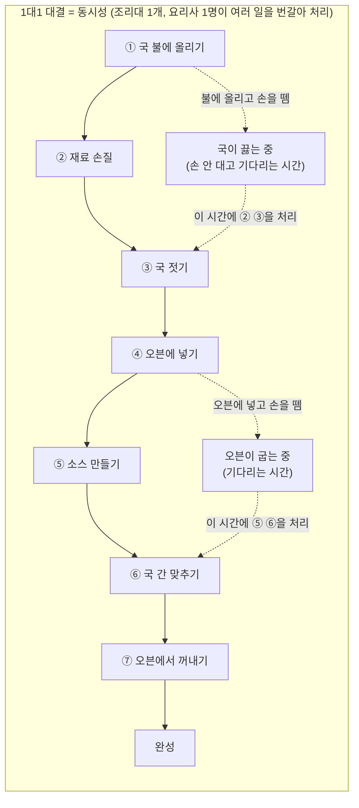
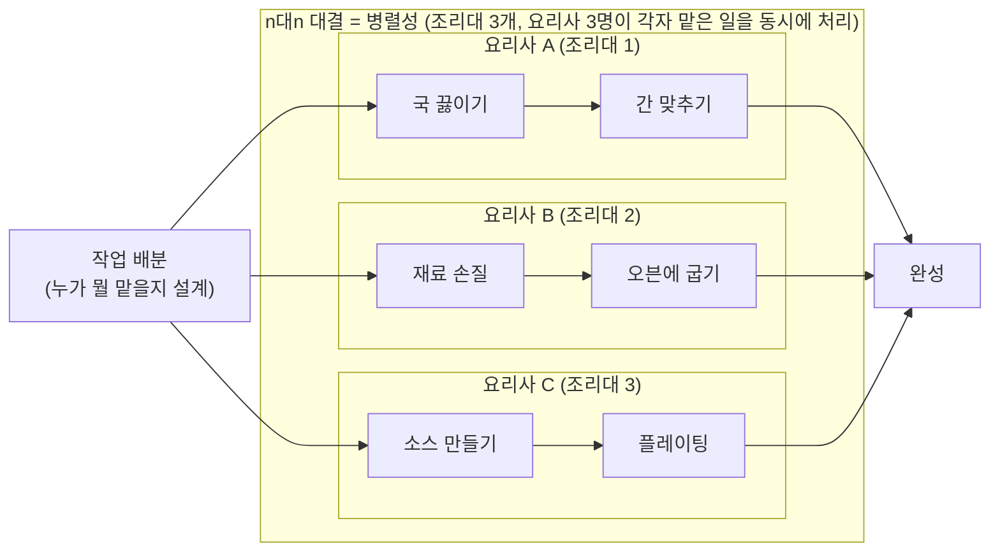
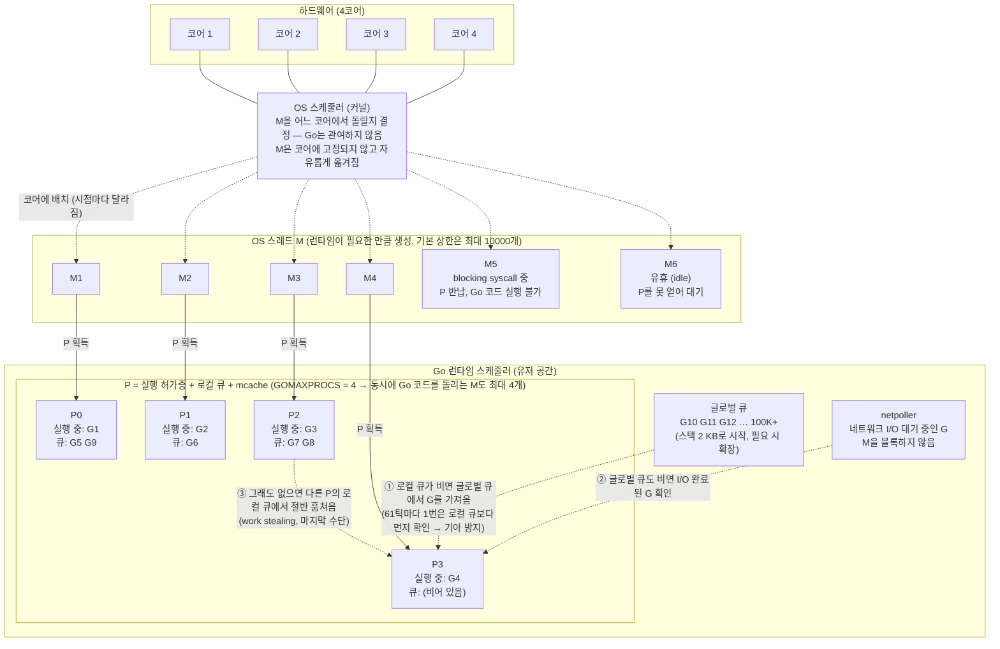
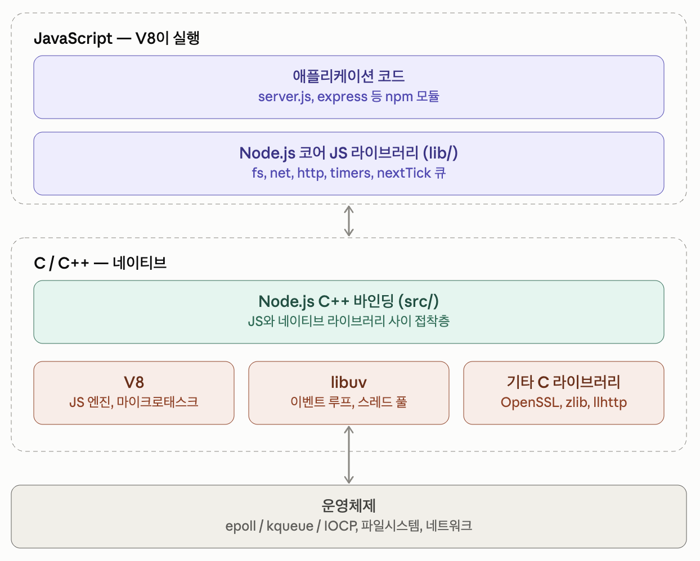
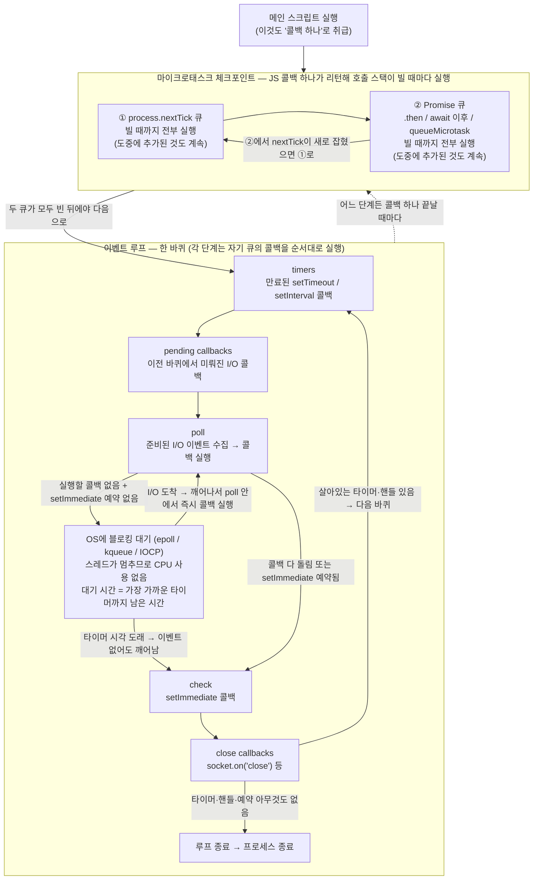
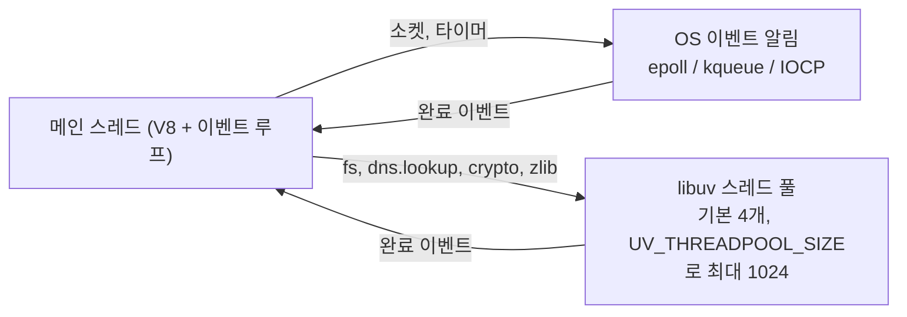
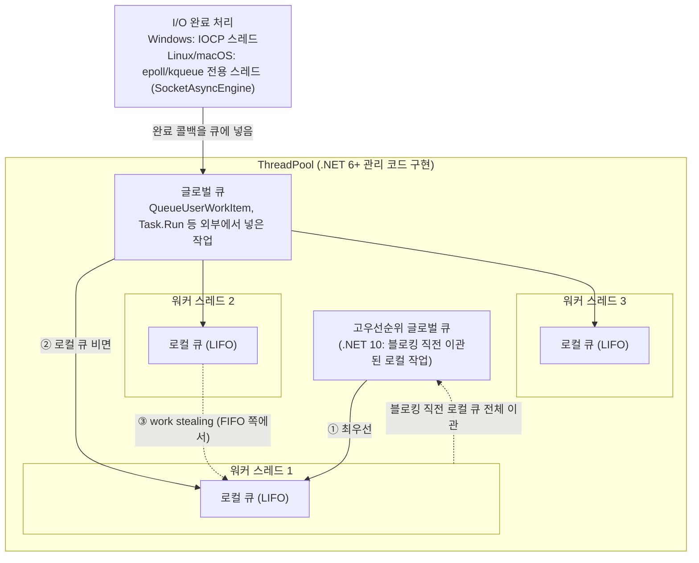
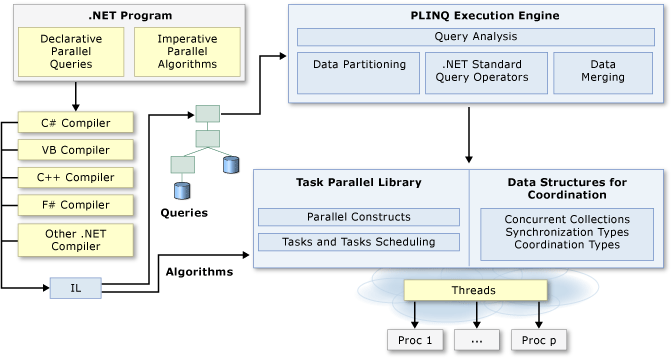
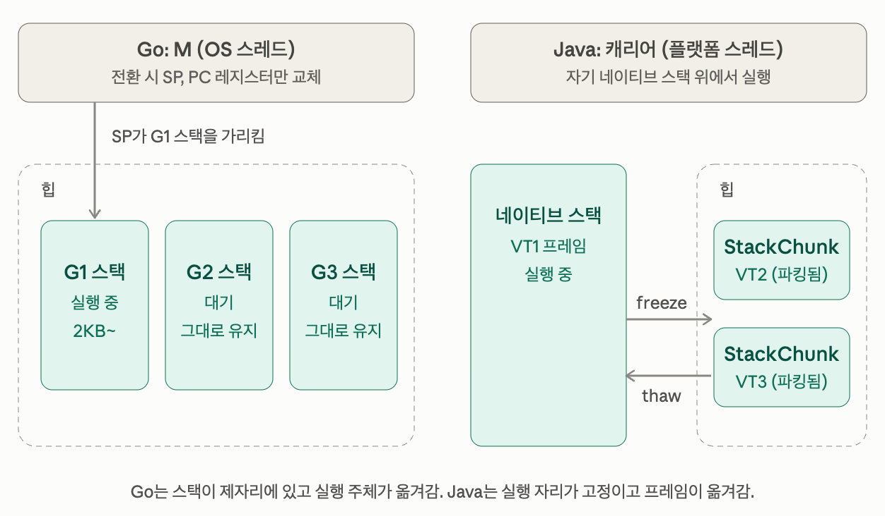

# 분산 시스템 설계(3) - 액터 모델(1) feat. Go, Node.js, .NET, Java, Rust

> 원래는 액터 모델에 대해서 다루려고 했으나... 조사를 하다 보니, 동시성과 병렬성에 대해서 먼저 정리하고 가는 게 좋겠다 싶은 마음이 들었습니다.(제가 헷갈렸기 때문이기도 하죠!) 그리고 정리를 하다 보니... 모르는 내용이 많아서 이거 저거 정리해서 넣다 보니 일단 각 주요 언어별로 어떻게 동시성과 병렬성을 처리하는지에 대해서 정리하는 문서가 되어버렸습니다!

아주 간단하게 설명하면, 동시성은 여러 작업을 어떻게 처리할지 프로그램을 설계하는 문제고, 병렬성은 동시 실행을 처리하는 하드웨어의 문제입니다.

아마도 흑백요리사 같은 요리 경연 프로그램을 누구나 한 번쯤은 봤을 겁니다. 1대1 또는 n대n으로 요리대결을 진행하죠.

1대1로 요리대결을 할 때는 동시성의 문제가 절대적입니다. 제한된 시간 내에 국을 끓이면서 재료를 손질하다가 오븐에 재료를 넣고 다시 국을 젓고 등의 작업을 어떻게 번갈아가면서 동시에 진행할지 잘 설계해야 되죠. 반면에 n대n으로 요리대결을 할 때는 동시성보다 병렬성의 문제가 더 큽니다. 각자의 작업 배분과 진행 순서를 잘 설계한 다음에 실수 없이 동시에 각자 할 일을 잘 진행해야만 하죠.

먼저 1대1 대결입니다. 조리대는 하나, 요리사도 한 명이죠. 국이 끓는 동안 손 놓고 기다리면 시간이 아까우니까, 그 사이에 재료를 손질하고 오븐을 돌립니다. 이렇게 `기다리는 시간에 다른 일을 끼워 넣는 설계`가 동시성입니다.



다음은 n대n 대결입니다. 조리대도 여러 개, 요리사도 여러 명이죠. 누가 뭘 맡을지 나눈 다음에는 각자 자기 조리대에서 `동시에 병렬로` 작업합니다. 물론 그 와중에도 요리사 한 명 한 명은 여전히 자기가 해야 할 일에 대해서 동시성을 고민해야 합니다.



> 뒤에서 살펴볼 런타임 얘기로 바꿔 말하면, 조리대는 CPU 코어, 요리사는 OS 스레드, 각 요리 작업은 goroutine이나 Task 같은 작업 단위에 해당합니다. 조리대가 하나뿐이어도 동시성 설계는 필요하고, 조리대가 여러 개라야 동시에 작업할 수 있는 병렬성이 생기는 거죠.

각 언어의 런타임은 이런 동시성과 병렬성을 해결하는 모습이 조금씩 다릅니다. 흥미를 위해서 그 부분을 먼저 확인해보고 넘어갈까 합니다.

## Go

Go는 `동시성을 위해서 goroutine을 사용합니다.` goroutine은 OS 스레드와 달리 매우 작은 2-4KB 정도의 스택에서 시작하기 때문에 수십만 개까지도 생성이 가능하고, OS 스레드에서 처리할 goroutine을 쉽게 전환할 수 있기 때문에 goroutine의 전환은 OS 스레드의 문맥 교환(context switching)이 필요하지 않습니다.

> 참고로 OS 스레드의 문맥 교환은 대략 다음과 같은 과정을 거칩니다. *표시는 특히 많은 시간이 소요되는 과정을 나타냅니다.
> - 커널 모드 진입*: CPU는 필요한 권한을 얻기 위해 유저 모드에서 커널 모드로 진입
> - 스레드1의 상태 저장: CPU 레지스터, 프로그램 카운터, 스택 포인터 등 스레드1의 모든 상태를 스레드1의 메모리 블록에 기록(TCB, Thread Control Block)
> - 스케줄러 상태 갱신: OS가 스레드1을 대기 상태로 설정하고 스레드2를 대기 큐에서 선택
> - TLB/cache 초기화*: 스레드1과 스레드2가 서로 다른 프로세스의 스레드라면, TLB(translation lookaside buffer)를 초기화
> - 스레드2의 상태 불러오기: 스레드2의 TCB에서 모든 상태를 불러오기
> - 유저 모드로 복귀*: CPU가 유저 모드로 돌아와서 스레드2의 이전 상태로부터 계속 실행

병렬성은 논리 코어 개수를 가리키는 `GOMAXPROCS` 설정을 통해 해결합니다.(기본값이 논리 코어 개수이고, 자유롭게 설정할 수 있습니다.) 런타임 스케줄러가 goroutine을 여러 OS 스레드에 배분하고, 여러 개의 CPU 코어에서 동시에 실행하면서 자연스럽게 병렬 실행이 가능해지는 구조인 거죠. Go는 GMP(Goroutine-Machine-Processor) 스케줄러를 통해 병렬성을 관리합니다.

- G (goroutine): 실행할 작업 단위. OS 스레드와 다르게 스택이 [2KB로 시작해서](https://github.com/golang/go/blob/6e676ab2b809d46623acb5988248d95d1eb7939c/src/runtime/stack.go#L76) 수십만 개 만들 수 있어요.
- M (machine): 실제 OS 스레드.
- P (processor): 논리 프로세서. 각 P가 자기 고루틴 실행 큐를 갖고, M이 P를 하나 획득해야 고루틴을 실행할 수 있어요.

각 G, M, P를 통해 병렬성을 관리하는 과정을 도식화 해보면 다음과 같습니다.



- 위 예시에서는 CPU에서 사용 가능한 `논리 코어가 4개`(`GOMAXPROCS`가 4로 설정된 상태)인 상태를 예시로 보여주고 있습니다.
- OS 스케줄러는 각 OS 스레드(M)가 어떤 논리 코어에서 작동할지를 결정합니다.
- 논리 코어가 4개이기 때문에 `OS 스레드가 사용할 수 있는 프로세서(P)도 4개`입니다. `동시에 처리할 수 있는 작업 수가 4개`인 셈이죠.
- 각 OS 스레드(M)는 작업을 위해 프로세서(P)를 획득해야 합니다.
- 3번 프로세서(P3)를 보면 현재 goroutine G4를 실행 중이고, 로컬 큐에 다음 작업이 없기 때문에 G4가 끝나면 처리할 작업이 없는 상태입니다.
- ① G4가 끝나면 우선 글로벌 큐에서 goroutine을 가져옵니다.
- ② 글로벌 큐에도 작업이 없다면 완료된 I/O 작업이 있는지 확인합니다.
- ③ 글로벌 큐와 완료된 I/O 작업도 없다면, 다른 프로세서(P)에서 goroutine 절반을 가져옵니다.

매우 간결하면서도 효과적으로 동시성, 병렬성을 관리하고 있습니다.

### 정리

정리하자면,

- `P(프로세서)`는 Go 런타임이 만드는 자료구조로, Go 코드를 실행하기 위한 작업대입니다 (작업 더미인 로컬 큐, 공구함인 mcache 포함).
- `P`는 `GOMAXPROCS` 개수만큼 생성된다. 기본값은 논리 코어 수이며, Go 1.25부터는 cgroup CPU 제한도 반영합니다.
- `M(OS 스레드)`은 고루틴을 실행하는 주체다. 런타임이 필요에 따라 생성하며(ex: goroutine이 특정 `M`을 독점하면, 그 `M`은 다른 goroutine을 실행하지 못하므로 런타임이 추가로 `M`을 생성), 기본 상한은 10,000개입니다.
- `M`이 어떤 코어에서 실행될지는 `OS 스케줄러`가 결정한다. Go는 관여하지 않습니다.
- `M`은 `P`를 획득해야만 고루틴을 실행할 수 있다. 따라서 동시에 Go 코드를 실행하는 `M`은 최대 `GOMAXPROCS`개입니다.

## Node.js

Node.js는 싱글 스레드 기반으로 실행되며 파일, 네트워크 I/O 등의 이벤트가 발생할 때마다 작업 큐에 쌓아뒀다가 해당 이벤트들을 처리할 순서가 되면 큐에서 작업을 꺼내 순차적으로 처리합니다. 즉, I/O 중심의 동시성 작업 처리를 가장 잘할 수 있는 구조를 선택하고 있습니다. 우선 Node.js의 동시성 처리 구조에 대해서 좀 더 자세히 알아볼까 합니다.

Node.js는 다음과 같이 JS 영역과 C/C++기반의 네이티브 런타임 영역으로 구성되어 있습니다.

<p align="center"></p>

Node.js 는 JS 코드를 실행해야 할 때마다 V8에게 실행을 요청합니다. 스크립트 코드 실행, 이벤트 루프의 콜백(파일, 네트워크 I/O 등) 등이 발생할 때마다 V8에게 실행을 요청하는 거죠. 이때, 네이티브 영역에서 JS 영역으로 넘어가게 되며 JS의 호출이 모두 끝났을 때(JS 호출 스택이 완전히 비었을 때) 다시 네이티브 영역으로 돌아오게 됩니다.

스크립트 실행 후 발생하는 각 이벤트의 콜백을 처리하기 위해서 네이티브 영역의 libuv는 여러 단계로 구성된 루프를 순환하면서 각 단계의 콜백들을 순차적으로 처리합니다.



여기서 주목해야 할 부분은 두 가지입니다.

- 메인 스크립트 실행(`CommonJS 기준`, 이벤트 루프 진입 전 1회)
- 이벤트 루프에서 콜백 하나가 종료될 때마다 실행되는 마이크로태스크

> 위 두 가지 경우 모두 JS 코드 실행을 위해서 네이티브->JS 영역으로 진입했다가 JS 실행이 모두 끝나서 다시 네이티브 영역으로 돌아오는 상황입니다. 즉, JS 실행 후 네이티브 영역으로 돌아올 때마다 마이크로태스크 큐(nextTick 큐 -> Promise 큐 순서) 정리 작업을 진행하는 셈이죠!

> 참고로 만료된 타이머 여러 개가 있는 경우 각 타이머 콜백을 JS의 반복문 안에서 순차적으로 처리하기 때문에 네이티브 영역으로 돌아가지 않지만, JS 코드에서 runNextTicks()를 명시적으로 호출해서 네이티브로 돌아간 것과 같은 효과를 냅니다. 그리고 setImmediate도 같은 방식으로 처리됩니다.

### 메인 스크립트 실행

어떻게 메인 스크립트를 실행하고 이벤트 루프에 진입하는지는 모듈의 형식에 따라 달라집니다. 그 이유는 [CommonJS, ESM 모듈을 처리하는 방식이 다르기 때문](https://netscout.github.io/posts/node-js-experimental-vm-modules/)인데요. 아주 간단한 express 예제를 통해 차이점을 알아보겠습니다.

> 각 모듈의 차이점에 대해서 더 자세한 내용은 [Node.js: --experimental-vm-modules](https://netscout.github.io/posts/node-js-experimental-vm-modules/)를 참조하세요!

#### CommonJS

아주 간단한 express를 CommonJS 형식으로 작성해봤습니다.

```javascript
// server.js (CommonJS)
const express = require('express');
const app = express();

app.get('/', (req, res) => {
  res.send('hello');
});

app.listen(3000, () => console.log('listening')); // 내부적으로 콜백을 process.nextTick으로 등록
process.nextTick(() => console.log('tick'));
Promise.resolve().then(() => console.log('promise'));
console.log('end of script');
```

아래쪽의 4줄을 보면, 총 3개의 콜백과 콘솔 출력이 있죠? 일단 결과를 볼까요?

```bash
> node server.js
end of script
listening
tick
promise
```

`end of script` -> `listening` -> `tick` -> `promise`의 순서로 출력되네요. 그러니까,

- console.log 실행: `end of script`
- process.nextTick: `listening`
- process.nextTick: `tick`
- promise: `promise`

이런 순서로 실행된 건데요, 앞서 살펴봤던 도식의 `메인 스크립트 실행` 후 리턴하면서 콜스택이 비었기 때문에 `process.nextTick 큐` -> `promise 큐`의 순서로 큐를 비우면서 콜백을 실행한 결과입니다.

CommonJS는 스크립트를 실행하기 전에, [스크립트의 내용을 다음과 같은 wrapper 함수로 감싸서 함수 형태로 만듭니다.](https://github.com/nodejs/node/blob/577b9c2bd86e878d1b3c06fa922afb2080fc785e/lib/internal/modules/cjs/loader.js#L412)

```javascript
(function (exports, require, module, __filename, __dirname) {
  // server.js 내용 전체
});
```

그리고 V8에게 이 함수의 실행을 요청합니다.

> 더 자세하게 설명하면 [V8이 run_main_module.js를 실행하는 과정](https://github.com/nodejs/node/blob/577b9c2bd86e878d1b3c06fa922afb2080fc785e/src/node.cc#L403)에서 함수 wrapping 및 실행이 진행됩니다.

그리고 메인 스크립트의 콜 스택이 모두 비어서 실행이 종료되면 V8은 JS 실행을 종료하고 리턴합니다. 그리고는 마이크로태스크 큐에 있는 작업들을 nextTick -> promise의 순서로 모두 실행하게 됩니다. 그래서 다음과 같은 순서로 출력이 진행되죠:

1. 메인 스크립트의 console.log('end of script');
2. nextTick에 등록된 순서대로, console.log('listening'), console.log('tick')
3. 다음으로 promise에 등록된 console.log('promise')

#### ESM

다음은 동일한 코드를 ESM 방식으로 작성한 코드입니다.

```javascript
// server.mjs
import express from 'express';
const app = express();

app.get('/', (req, res) => {
    res.send('hello')
});

app.listen(3000, () => console.log('listening')); // 내부적으로 콜백을 process.nextTick으로 등록
process.nextTick(() => console.log('tick'));
Promise.resolve().then(() => console.log('promise'));
console.log('end of script');
```

실행 결과는 다음과 같습니다.

```bash
> node server.mjs
end of script
promise
listening
tick
```

이번에는 `end of script` -> `promise` -> `listening` -> `tick` 의 순서로 출력되네요. 그러니까,

- console.log 실행: `end of script`
- promise: `promise`
- process.nextTick: `listening`
- process.nextTick: `tick`

이런 순서로 출력된 셈이죠. 마이크로태스크 작업 중에 process.nextTick 대신에 promise 큐의 작업이 먼저 실행된 건데요. 그 과정을 간략하게 살펴보겠습니다.

ESM의 경우 CommonJS처럼 함수로 wrapping하지 않고, 모듈이 비동기(async)방식으로 로드됩니다. CommonJS와 동일하게 실행되다가 [ESM 로더를 사용해야 하는지](https://github.com/nodejs/node/blob/577b9c2bd86e878d1b3c06fa922afb2080fc785e/lib/internal/modules/run_main.js#L147) 판단 과정을 거친 뒤에 [비동기로 모듈을 로드](https://github.com/nodejs/node/blob/577b9c2bd86e878d1b3c06fa922afb2080fc785e/lib/internal/modules/run_main.js#L122)하게 됩니다.

그러니까 Node.js는 모듈 로드 작업을 promise 체인으로 걸고 메인 스크립트 실행을 종료합니다. 파일 자체는 동기로 읽지만, 모듈 로더는 async 함수이기 때문에 이후의 작업은 모두 promise 큐에서 진행됩니다. 그래서 메인 스크립트가 끝나고 마이크로태스크를 비우는 시점에 본문이 실행됩니다. 아직은 이벤트 루프가 실행되지 않은 상태이고, 대략 다음과 같이 진행됩니다.

```
메인 스크립트(run_main_module) 종료 → 마이크로태스크 비우기
  ├ nextTick 큐 (비어 있음)
  └ Promise 큐
       ├ 로더의 await 이어짐
       ├ … link, instantiate
       └ module.evaluate() → server.mjs 본문 실행   ← 여기
            └ 본문에서 건 .then → 같은 큐에 붙어 바로 이어서 실행
            └ 본문에서 건 nextTick → Promise 큐 다 빈 뒤 실행
```

그렇기 때문에 nextTick보다 promise 콜백이 먼저 화면에 출력된 거죠!

#### I/O는 누가 기다리나

I/O의 성격에 따라 메인 스레드(정확히는 OS 커널)와 별도의 스레드가 I/O 이벤트를 대기 및 처리합니다.



libuv는 이벤트 루프를 관리하면서 필요한 작업을 스레드 풀에 대기 중인 스레드에 할당합니다. 스레드 풀에는 기본적으로 4개의 스레드가 생성되는데요, 만약 4개의 스레드가 무언가 스레드 블록(block)이 필요한 I/O 작업을 진행 중이라면, dns.lookup을 진행해야 되는 HTTP 요청이 막힐 수도 있습니다!

### Node.js의 병렬성

Node.js에서 병렬성을 확보하기 위해서는 별도의 worker_threads나 프로세스를 클러스터링해야 하는데요, 다음은 worker_threads를 사용하는 예시입니다.

```javascript
// worker_thread.mjs
import { Worker, isMainThread, parentPort, workerData } from 'node:worker_threads';

if (isMainThread) { // 메인 스레드에서 실행할 코드
  const w = new Worker(new URL(import.meta.url), { workerData: 10000000000 }); // 워커 스레드 실행
  w.on('message', (sum) => console.log(sum));
} else { // 워커 스레드에서 실행할 코드
  let sum = 0;
  for (let i = 0; i < workerData; i++) {
    sum += i;
  }
  parentPort.postMessage(sum); // 메인 스레드에 결과 전달
}
```

그리고 웹서버로 Node.js를 사용하는 경우, 일반적으로 PM2 같은 오케스트레이터를 사용하여 프로세스를 클러스터링하거나 k8s 등의 환경에 배포합니다.

### 정리

-- 정리가 필요할까? 아마도 필요하지 않을까? 그리고 위 내용을 바탕으로 어떤 인사이트를 얻었는지도 적으면 좋을 듯?

## .NET

.NET은 런타임이 관리하는 ThreadPool을 통해 비동기 작업을 나타내는 Task 실행을 조율합니다. async/await를 통해 I/O 등의 비동기 작업을 실행할 때는 관련 코드를 상태 머신으로 전환하여 스레드를 점유하지 않고 완료를 기다리도록 합니다.

> .NET 10 부터 Runtime Async를 실험적인 기능(Preview)으로 제공하고 있습니다. 원래 async/await는 컴파일러가 상태 머신으로 변환해야 했습니다. 컴파일러가 코드를 컴파일하다가 async가 붙어있는 메서드를 보면, `IAsyncStateMachine`을 구현하는 상태 머신 구조체로 변환해서 비동기 작업이 완료될 때 까지 정지할 수 있도록 했었습니다. 그런데 Runtime Async의 경우 컴파일러는 `[MethodImpl(MethodImplOptions.Async)]` 어트리뷰트가 붙은 IL 코드를 생성하기만 하고, 이후의 비동기 작업 처리는 런타임이 처리하도록 한 거죠. 이렇게 하면 상태 머신의 오버헤드를 줄일 수 있고, 스택 트레이스도 깔끔해지는 등 여러가지 장점이 있습니다. 다만, 아직은 Preview 단계라서 어떤 부분에서 더 성능이 향상되는지 면밀한 검토가 필요해보입니다. 더 자세한 내용은 이 글 끝에 있는 참고 자료를 확인해주세요!

그리고 ThreadPool이 CPU의 여러 코어를 동시에 사용하기 때문에 병렬성은 자연스럽게 따라오는 구조인데요, 앞서 살펴봤던 Go의 GMP와 유사한 구조라고 볼 수 있죠.(물론 아직 goroutine 같은 도구는 지원하지 않고, 각 스레드는 OS 스레드와 1:1로 대응되는 구조입니다!)

> .NET은 병렬 프로그래밍을 위해 별도의 런타임 엔진과 라이브러리를 제공합니다! 이건 좀 이따가 더 살펴보죠.

### ThreadPool의 구조

ThreadPool의 구조를 간략하게 표현하면 다음과 같습니다.



- **글로벌 큐**: 외부에서 넣은 작업. FIFO.
- **로컬 큐**: 워커 스레드가 실행 중 만든 자식 Task는 자기 로컬 큐에 (LIFO, 캐시 지역성).
- **워크 스틸링**: 자기 큐가 비고 글로벌 큐도 비면 다른 워커의 로컬 큐 반대쪽에서 훔친다.
- **스레드 수 조절**: 최소(기본 논리 코어 수)까지 즉시 생성. 그 이상은 hill climbing 알고리즘이 처리량을 측정하며 천천히 늘린다. 블로킹 감지 시 더 빨리 추가하는 로직은 .NET 6부터.
- **Windows 스레드 풀 옵션**: `UseWindowsThreadPool` 설정으로 OS 스레드 풀을 쓸 수 있다. Windows Native AOT에서는 기본값. 이 경우 `SetMinThreads`/`SetMaxThreads`가 무효.

각 스레드가 자신의 로컬 큐를 가지고 있고, 로컬 큐가 비면 글로벌 큐나 다른 스레드의 로컬 큐에서 가져오는 등의 작업은 Go의 구조와 유사하죠?

> .NET의 Thread는 OS 스레드와 1:1 관계이기 때문에 비동기 작업에 대해서 async/await를 사용하지 않으면, 해당 작업을 처리하는 OS 스레드는 작업이 완료될 때까지 블록(block) 됩니다. 만약 윈도우 앱이라면 UI 스레드가 블록돼서 UI가 먹통이 되는 증상이 발생하게 됩니다!

### .NET의 병렬성

.NET은 쉽게 병렬성을 얻을 수 있도록 PLINQ(Parallel LINQ)와 TPL(Task Parallel Library)를 제공합니다. 각 기술들은 기존에 제공하는 SDK와 유사하게 사용할 수 있으면서도 사용 가능한 모든 CPU의 자원을 활용하여 작업을 병렬화해서 실행합니다.

<p align="center"><br />출처: https://learn.microsoft.com/en-us/dotnet/standard/parallel-programming/</p>

이런 라이브러리를 활용하면, 순차 버전의 반복문을 아주 간단하게 병렬화 시킬 수 있습니다.

```csharp
// 순차 버전, 한 번에 하나씩
foreach (var item in sourceCollection)
{
    Process(item);
}

// 병렬화, 여러 개를 동시에!
Parallel.ForEach(sourceCollection, item => Process(item));
```

## 그외의 언어들

### Java

Java는 .NET과 유사하게 OS 스레드와 1:1 대응되는 Thread를 제공하면서도 goroutine과 유사한 경량 스레드인 가상 스레드(Virtual Thread, JDK 21부터)를 제공합니다. Go와의 차이점이라면 각 goroutine은 전용 스택을 가지는데, 가상 스레드는 전용 스택이 없고 캐리어 스레드(OS 스레드)의 스택 위에서 실행됩니다.

<p align="center"></p>

Go는 실행할 goroutine을 스위칭할 때, 각 goroutine의 스택은 고정된 상태로 레지스터 몇 개만 교체하면 되기 때문에 작업의 전환이 매우 빠릅니다. 반면에 가상 스레드는 전환이 일어날 때, 캐리어 스레드의 스택에서 가상 스레드의 프레임을 빼내고, 다른 가상 스레드의 프레임으로 교체하죠. 메모리 사용을 더 효율적으로 하는 측면이 있지만, 가상 스레드 전환은 goroutine에 비해 덩치가 큰 작업이 됩니다.

Go는 처음부터 런타임을 직접 설계해서 goroutine에 최적화된 방식으로 만들 수 있었지만, Java는 매우 역사가 오래된 언어입니다. 그래서 기존에 이미 많은 JVM의 동작 방식에 대한 역사가 쌓여있죠. 기존에 동작하는 부분에 거의 영향을 주지 않으면서도 가상 스레드를 도입하기 위해서 이런 구조를 선택했다고 하는데, 꽤나 영리하면서도 현실적인 선택으로 보입니다.

### Rust

요즘 Rust가 참 많이 뜨는 거 같아서 겸사겸사 그냥 한 번 조사해봤습니다. 최근엔 [MS에서 Rust가 기존의 C++, C#, TypeScript와 함께 1티어 언어로 선정](https://rustfoundation.org/media/guest-post-rust-is-tier-1-language-at-microsoft/)하기도 했죠!

Rust는 앞서 알아본 4가지 언어와는 근본적으로 다른데요, Rust는 표준 라이브러리 수준의 기본 런타임만 제공하기 때문에 다른 언어처럼 async를 사용하려면 tokio 같은 외부 런타임을 사용해야 합니다. C/C++ 같은 네이티브 계열의 언어라서 그런 듯합니다.

그리고 데이터 레이스(race)의 발생이 컴파일러 레벨에서 차단된다고 하는데요, `데이터 레이스는 동기화되지 않은 상태에서 두 스레드가 같은 메모리에 접근하여 읽기와 쓰기를 동시에 하는 경우에 발생`합니다. 누가 빨리 하느냐에 따라서 예측하기 힘든 결과가 발생하는 거죠. 이걸 원천 차단하기 위해서 Rust는 다음과 같은 빌림(Borrow) 규칙을 정하고 있습니다.

- 가변 참조(&mut)는 딱 하나만 존재
- 불변 참조(&)는 여러 개 존재 가능
- 하지만 가변 참조와 불변 참조는 동시에 존재할 수 없음.

그러니까 가변 참조를 통해 쓰기만 하든지, 불변 참조를 통해 읽기만 하든지 해야 한다는 거죠. 그러니까 다음 같은 상황은 오류라는 겁니다.

```rust
let mut v = vec![1, 2, 3];
let r1 = &v;        // 불변 참조
let r2 = &mut v;    // 가변 참조 → 컴파일 에러
println!("{}", r1[0]);
```

이런 규칙이 자연스럽게 멀티 스레드를 사용하는 경우에도 전파됩니다. 스레드 10개가 counter 하나를 같이 올리는 코드를 볼까요?

```rust
let mut counter = 0;
std::thread::scope(|s| {
    for _ in 0..10 {
        s.spawn(|| { counter += 1; }); // 클로저마다 counter의 가변 참조(&mut)를 잡음
    }
});
```

> `std::thread::scope`는 안에서 만든 스레드가 모두 끝날 때까지 기다려주는 스레드 묶음입니다. 그래서 스레드가 바깥의 변수를 빌려 쓸 수 있죠.

각 클로저는 counter를 고쳐야 하니까 counter의 가변 참조를 하나씩 잡습니다. 10개의 스레드가 동시에 살아있으니 가변 참조도 10개가 되죠. 그래서 `가변 참조(&mut)는 딱 하나만 존재` 규칙에 위배되므로 컴파일 에러입니다.

```
error[E0499]: cannot borrow `counter` as mutable more than once at a time
```

> 참고로 `scope` 없이 `std::thread::spawn`을 바로 쓰면 다른 에러가 먼저 나옵니다. spawn으로 만든 스레드는 main 함수보다 오래 살 수도 있어서, 곧 사라질지도 모르는 지역 변수를 빌려주는 것 자체가 금지되기 때문이죠.(E0373) 이 경우에는 `move`를 붙여서 소유권을 넘겨야 하는데, 그러면 숫자가 스레드마다 복사되어서 각자 자기 복사본만 올리게 됩니다. 공유가 안 되는 거죠!

그래서 데이터에 대한 동기화를 강제하는 타입을 사용합니다.

```rust
let counter = Mutex::new(0); // lock()을 통해서만 접근 가능한 타입
std::thread::scope(|s| {
    for _ in 0..10 {
        s.spawn(|| { *counter.lock().unwrap() += 1; });
    }
});
```

Mutex는 안에 든 값을 lock()을 통해서만 만질 수 있게 해주는 상자입니다. lock()을 잡은 스레드는 한 순간에 하나뿐이니, 가변 참조도 그 순간 하나뿐이죠. 그리고 각 클로저는 counter 자체를 불변 참조(&)로만 빌리기 때문에 빌림 규칙에도 어긋나지 않습니다.

> `scope` 없이 `spawn`을 쓰는 경우에는 Arc로 감싸서 소유권을 나눠 갖습니다. Arc는 여러 스레드가 같은 값을 함께 소유하게 해주는 참조 카운터입니다.
> ```rust
> let counter = Arc::new(Mutex::new(0));
> for _ in 0..10 {
>     let c = Arc::clone(&counter);
>     std::thread::spawn(move || { *c.lock().unwrap() += 1; });
> }
> ```

그렇기 때문에 타입 수준에서 동기화 실수가 방지되는 측면이 있죠!

그리고 마지막으로 타입마다 스레드의 경계를 넘어서 보낼 수 있는지 여부를 컴파일러가 판단합니다. 스레드 안전한 타입인지(thread-safe)에 따라서 컴파일러가 판단하여(Send/Sync) 그렇지 않은 경우 컴파일 에러를 발생시킵니다.

정리하자면, 빌림(Borrow) 규칙과 Mutex 같이 동기화를 강제하는 타입, 스레드 안전 타입 여부 등을 통해서 데이터 레이스를 원천적으로 막습니다.

## 참고 자료

- [Concurrent computing](https://en.wikipedia.org/wiki/Concurrent_computing)
- [Parallel programming in .NET: A guide to the documentation](https://learn.microsoft.com/en-us/dotnet/standard/parallel-programming/)
- [The Node.js Event Loop](https://nodejs.org/learn/asynchronous-work/event-loop-timers-and-nexttick)
- [Concurrency is not parallelism (Rob Pike)](https://go.dev/blog/waza-talk)
- [Scalable Go Scheduler Design Doc (Dmitry Vyukov)](https://golang.org/s/go11sched)
- [Go 1.25 Release Notes - GOMAXPROCS와 cgroup CPU 제한](https://go.dev/doc/go1.25#container-aware-gomaxprocs)
- [Don't Block the Event Loop (or the Worker Pool)](https://nodejs.org/en/learn/asynchronous-work/dont-block-the-event-loop)
- [libuv: Thread pool work scheduling - 기본 4개, UV_THREADPOOL_SIZE, 최대 1024](https://docs.libuv.org/en/v1.x/threadpool.html)
- [Node.js: Worker threads](https://nodejs.org/api/worker_threads.html)
- [.NET: The managed thread pool](https://learn.microsoft.com/en-us/dotnet/standard/threading/the-managed-thread-pool)
- [Exploring .NET 11 Preview 1 Runtime Async: A dive into the Future of Async in .NET](https://laurentkempe.com/2026/02/14/exploring-net-11-preview-1-runtime-async-a-dive-into-the-future-of-async-in-net/)
- [Why the Future of C# Is Faster](https://medium.com/@schmidt.jeanbaptiste/why-the-future-of-c-is-faster-0949e30fe8bd)
- [JEP 444: Virtual Threads](https://openjdk.org/jeps/444)
- [The Rust Book: References and Borrowing](https://doc.rust-lang.org/book/ch04-02-references-and-borrowing.html)
- [The Rust Book: Using Threads to Run Code Simultaneously - thread::spawn과 move 클로저(E0373)](https://doc.rust-lang.org/book/ch16-01-threads.html)
- [The Rust Book: Shared-State Concurrency - Mutex, Arc](https://doc.rust-lang.org/book/ch16-03-shared-state.html)
- [The Rust Book: Extensible Concurrency with Send and Sync](https://doc.rust-lang.org/book/ch16-04-extensible-concurrency-sync-and-send.html)