# 분산 시스템 설계(3) - 액터 모델(2): 상태는 누가 어떻게 관리하나?

모든 어플리케이션은 종류를 막론하고 결국은 `상태를 어떻게 관리하나?`라는 하나의 질문을 해결합니다. 쇼핑 앱에 로그인해서 주문을 하기 위해서는 회원, 상품, 주문 상태를 관리해야 합니다. 실시간 온라인 게임에서는 각 플레이어의 캐릭터 HP/MP, 스킬 등의 상태와 NPC 들의 상태를 관리하면서 각 플레이어, NPC간의 상호작용을 상태에 실시간으로 반영해야 하죠. 그러니까 좀 단순화해서 말하자면, 개발자가 작성하는 코드는 대부분이 이 상태를 어떻게 안전하면서도 효율적으로 처리할거냐 하는 문제가 됩니다.

그렇기 때문에 이 문제는 역사적으로도 매우 중요한 문제였고, 하드웨어와 네트워크의 발전으로 인해 상태를 관리하기 위한 방법도 많은 변화가 있었습니다.

[액터 모델은 병렬성을 달성하기 위한 방법으로 1973년에 이미 제시](https://www.ijcai.org/Proceedings/73/Papers/027B.pdf)되었지만, 한동안 빛을 보지는 못했고, 2010년대 들어서야 다시 세상의 주목을 받게 되었죠. 이 글에서는 상태를 다루기 위해 분투했던 지난 날의 역사를 좀 돌아보고자 합니다.(제가 궁금해서 그렇습니다. 하하하...)

## 객체의 탄생(1960~1970): 상태는 객체 안에 존재한다!

### 최초의 OOP 언어: Simula 67

객체라는 개념이 현실에 구현된 건 1967년으로 보는 게 적절해 보입니다. 1967년에 Ole-Johan Dahl과 Kristen Nygaard가 Simula 67이라는 언어를 발표하는데요, 우리에게 익숙한 객체, 클래스, 상속 등의 개념과 함께 가상(virtual) 프로시저, coroutine(코드 실행을 정지하고 다시 실행할 수 있는 개념) 등을 제시했습니다.

[wikipedia에서 발췌한 Simula 67의 예제 코드](https://en.wikipedia.org/wiki/Simula#Classes,_subclasses_and_virtual_procedures)를 볼까요?

```
Begin
   Class Glyph;
      Virtual: Procedure print Is Procedure print;;
   Begin
   End;
   
   Glyph Class Char (c);
      Character c;
   Begin
      Procedure print;
        OutChar(c);
   End;
   
   Glyph Class Line (elements);
      Ref (Glyph) Array elements;
   Begin
      Procedure print;
      Begin
         Integer i;
         For i:= 1 Step 1 Until UpperBound (elements, 1) Do
            elements (i).print;
         OutImage;
      End;
   End;
   
   Ref (Glyph) rg;
   Ref (Glyph) Array rgs (1 : 4);
   
   ! Main program;
   rgs (1):- New Char ('A');
   rgs (2):- New Char ('b');
   rgs (3):- New Char ('b');
   rgs (4):- New Char ('a');
   rg:- New Line (rgs);
   rg.print;
End;
```

부모 클래스 `Glyph`가 있고, `Glyph`에는 가상 프로시저(가상 메서드) `print`가 선언되어 있습니다. 그리고 자식 클래스 `Char`, `Line`이 선언되어 있고, 각각 `print`함수를 구현하고 있습니다. 메인 프로그램 코드가 실행되면서 화면에 `Abba`가 출력되겠죠.

프로세스를 번갈아 실행하기 위해서 coroutine을 제공했지만, 두 프로세스가 동시에 한 객체를 접근하는 경우는 언어의 설계상 존재할 수 없었습니다.

### 액터 모델에 영감을 주다: Smalltalk

1970년대, Xerox PARC 연구소의 Alan Kay는 Simula에서 영감을 받아 순수 OOP 언어인 Smalltalk를 만들었고([최초의 Smalltalk-71은 1971년에 고안되었습니다.](https://web.archive.org/web/20070930075844/http://gagne.homedns.org/%7etgagne/contrib/EarlyHistoryST.html#12)), `Object Oriented`라는 말을 최초로 사용했습니다. Smalltalk를 순수 OOP 언어로 부르는 이유는, 원시(primitive) 타입이 존재하지 않기 때문입니다. 정수나 부울 등의 모든 값들이 객체이며, 정수간의 계산도 객체 간의 메세지를 전달하여 처리됩니다.

그러니까 이렇게 간단해 보이는 덧셈이,

```
3 + 4
```

수신자 객체 `3`에게 메세지 `+`와 매개변수 `4`를 전달해서 결과를 얻는다고 하네요... 지금와서 보면 이렇게 까지 순수할 필요가 있었을까 싶긴합니다만, 어쨌거나 모든 객체가 서로 메세지를 주고 받는다는 이 아이디어는 이후 [액터 모델에 영향을 주게 됩니다.](https://web.archive.org/web/20070930075844/http://gagne.homedns.org/%7etgagne/contrib/EarlyHistoryST.html#17)

> In November, I presented these ideas and a demonstration of the interpretation scheme to the MIT AI lab. `This eventuall led to Carl Hewitt's more formal "Actor" approach` [Hewitt 73]. In the first Actor paper the resemblence to Smalltalk is at its closest. The paths later diverged, partly because we were much more interested in making things than theorizing, and partly because we had something no one else had: Chuck Thacker's Interim Dynabook (later known as the "ALTO").

하지만 Alan Kay는 그 당시에 이론보다는 `Dynabook` 이라고 하는 어린이 학습용 기기를 만드는 데 훨씬 관심이 있었기 때문에, 액터 모델을 계속 연구하지는 않았다고 합니다. 참고로 그 당시에 구상하던 Dynabook의 모습이라는데요, 참 시대를 앞서 나간 거 같습니다!

<p align="center">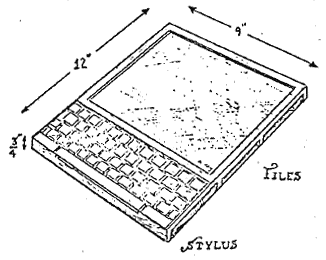<br />By Kay, A.C. - "A personal computer for children of all ages" - paper presented at the ACM National Conference, Boston, Fair use, https://en.wikipedia.org/w/index.php?curid=19820380</p>

Smalltalk는 객체를 `메세지로만 소통하는 독립 단위`로 보는 관점을 제시했지만, 이후 OOP는 정적 타입과 가상 함수 테이블을 제시했던 Simula의 방식이 주류로 자리잡게 됩니다.

## 액터 모델의 태동(1973)

앞서 살펴봤듯이 액터 모델의 이론은 1973년에 Carl Hewitt 등이 발표한 [A Universal Modular ACTOR Formalism for Artificial Intelligence](https://www.ijcai.org/Proceedings/73/Papers/027B.pdf)을 통해 제안되었습니다. 액터 모델을 제안한 이유는 당시 하드웨어가 발전함에 따라 물리적인 프로세서를 여러 개 병렬로 실행하는 아이디어를 생각하기 시작하던 때였는데요, 액터 모델이 거기에 적합하다는 거 였습니다.

> Current developments in hardware technology are making it economically attractive to run many physical processors in parallel. This leads to a "swarm of bees" style of programming. The actor formalism provides a coherent method for organizing and controlling all these processors. `One way to build an ACTOR machine is to put each actor on a chip and build a decoding network so that each actor chip can address all the others.` In certain applications parallel processing can greatly speed up the processing. For example with sufficient parallelism, garbage collection can be done in a time which is proportional to the logarithm of the storage collected instead of a time proportional to the amount of storage collected which is the best that a serial processor can do. Also the architecture looks very promising for parallel processing in the lower levels of computer audio and visual processing.

그러니까 칩 하나에 액터 하나를 심어서 그걸 네트워크로 연결하면 액터가 서로를 찾을 수 있다, 그러면 특정한 상황에서 순차 프로세싱 보다 병렬 프로세싱은 매우 빨라질거다 뭐 그런 이야기 입니다. 액터가 뭐길래 칩 하나에 액터 하나를 심는다는 걸까요? 액터 모델에서 이야기하는 액터는 3가지 작업을 수행할 수 있었습니다.

1. 다른 액터에게 메세지를 보낸다.
2. 새 액터를 만든다.
3. 다음 메세지를 받았을 때 어떻게 행동할지 결정한다.

3번 작업은 곧 액터 자신의 상태를 변경한다는 말인데요, 직접 다른 액터의 상태를 읽거나 변경할 방법은 없으며 메세지를 통해서 작업을 하도록 부탁해야 합니다. 즉, 독자적으로 행동하면서 서로 메세지를 주고 받는 액터를 칩하나에 심어서 병렬 처리를 하자 뭐 그런 이야기였던 셈이죠.

왜 이런 구상을 했는지 당시 상황을 좀 살펴보면 인텔 4004(1971), 8008(1972)등 CPU가 칩 하나로 만들어 지고 있었고, `반도체 칩에 집적되는 트랜지스터의 수가 약 2년마다 두 배로 증가한다`(1965년 당시 최초 발언에서는 1년마다 였지만, 1975년 2년마다로 수정)는 `무어의 법칙`도 맞아가던 시절이었습니다. 그러니까 프로세서가 이제 찍어낼 수 있는 부품의 개념으로 바뀌고 있었고, 실제로 [ILLIAC IV(1972)](https://en.wikipedia.org/wiki/ILLIAC_IV)등 여러 병렬 컴퓨터가 만들어 지고 있었습니다.(이후 1975년에 이르러서 제대로 동작했다고 합니다.)

<p align="center">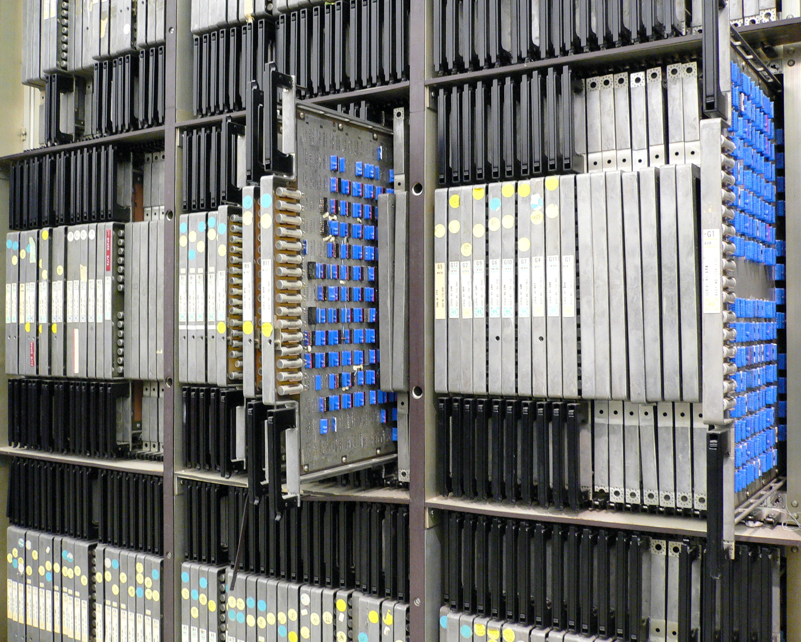<br />ILLIAC IV의 모습. By Steve Jurvetson from Menlo Park, USA - Flickr, CC BY 2.0, https://commons.wikimedia.org/w/index.php?curid=755549</p>

게다가 현대 인터넷의 시초인 ARPANET이 1969년 구축되어 독립된 노드들이 메세지를 주고받는 통신 모델이 현실화 되었고, Smalltalk가 객체 간의 메세지 통신이 실제로 동작한다는 아이디어를 제공했습니다.

그리고 이후 액터 모델을 실제로 만들려는 시도가 있었습니다.(MIT의 [Act 1](https://web.archive.org/web/20170706134358/ftp://publications.ai.mit.edu/ai-publications/pdf/AIM-672.pdf), [Act 2](https://web.archive.org/web/20170706144407/ftp://publications.ai.mit.edu/ai-publications/pdf/AITR-728.pdf)나 일본에서 개발된 [ABCL](https://en.wikipedia.org/wiki/Actor-Based_Concurrent_Language) 등) 하지만 연구실 밖에서는 전혀 주목받지 못했고, 액터 모델이 제대로 구현될 수 있다는 걸 세상에 알린 건 Erlang 이었습니다.

### Erlang

Erlang은 [에릭슨](https://en.wikipedia.org/wiki/Ericsson)의 전화 교환기의 소프트웨어를 개선하기 위해 Joe Armstrong 등이 설계했습니다. 수많은 동시성 처리와 여러 컴퓨터에 걸친 분산 처리, 수년간 무중단 운영이 가능해야 하며, 하드웨어 및 소프트웨어 오류에 대한 내결함성(fault tolerance)을 가져야 했습니다. 1986년에 개발을 시작한 뒤 Prolog 인터프리터에서 C기반의 VM 환경으로 개선(1992)하는 등의 많은 노력 끝에 실제 개발에 투입될 수 있었고, 1998년에 출시된 AXD301 스위치는 100만 라인이 넘는 Erlang으로 작성되었고 [9-nines](https://en.wikipedia.org/wiki/Nines_(notation)#Nomenclature)의 가용성을 달성했다고 알려져 있습니다.

하지만 통신 업계를 제외하면 Erlang은 무명에 가까웠고, 주류는 Erlang과는 다른 길로 발전해갔습니다.

> 사실 Erlang은 액터 모델에서 영향을 받았다기 보다는, 문제를 해결하려고 노력한 결과 액터 모델의 형태를 갖추게 되었습니다. Joe Armstrong은 자신이 액터 모델을 전혀 몰랐다고 말하기도 했는데요, 어쨌거나 결과적으로는 액터 모델이 잘 동작한다는 걸 증명했습니다.

## OOP 전성시대(1980~1990년대)

Bjarne Stroustrup은 1979년, Simula 67의 클래스 개념을 C에 얹은 `C with Classes` 작업을 시작했습니다. C의 속도와 이식성을 잃지 않으면서도 클래스, 상속, 가상 함수, 함수 오버로딩 등을 추가하려고 했던 거죠. 그리고 1983년에 이름을 C++로 바꾸고 1985년에 첫 번째 상용 컴파일러 Cfront가 출시 됩니다.

이후 90년대에 이르러 C++의 대중화, Delphi, Java 등의 OOP 언어 들이 잇따라 출시되고 전성시대를 이루게 됩니다.

주류 OOP 언어의 객체는 `메세지로만 소통하는 독립 단위`가 아닌 메모리위의 구조체 + 가상 함수 테이블로 구현되었고, 각각의 객체가 자신의 정보를 은닉하고 외부에 공개한 메서드로만 자신의 상태를 변경할 수 있도록 했습니다. 이런 방식은 처음에는 문제가 없어보였지만 멀티 스레드 상황에서는 스레드 간에 객체의 상태가 가변적으로 공유되는 문제가 있었습니다. 서로 다른 스레드가 동일한 객체의 메서드를 호출할 때, 메모리에서 읽고 쓰는 과정이 겹치면 객체의 상태가 오염되었던 거죠.

물론 훨씬 더 오래 전에 이런 문제를 이미 고민한 사람들이 있었는데요, [모니터](https://en.wikipedia.org/wiki/Monitor_(synchronization))를 통해 동시성 문제를 해결하고자 했습니다. 모니터는 mutex(mutual exclusion 또는 lock)와 조건 변수(~까지 기다려 같은 조건 설정)를 통해 접근권을 가지지 못한 스레드가 공유 객체의 상태 값에 접근하지 못하도록 막아줍니다.

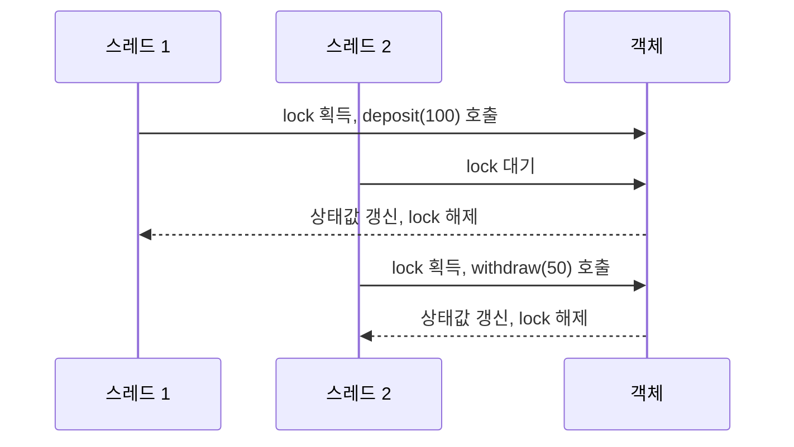

위 예제에서 락이 두 스레드의 동시 접근을 순차적으로 정렬하고, 스레드2는 스레드1이 락을 해제할 때 까지 대기 하게 됩니다.

단, 모니터가 데드락이나 라이브락을 막아주지는 못하므로 프로그래머는 신중하게 락의 순서와 범위를 결정해야 합니다.

두 스레드가 계좌 A와 B 사이에서 서로 반대 방향으로 송금한다고 해볼까요? 스레드 1은 A → B, 스레드 2는 B → A로 보내려고 하고, 송금하려면 두 계좌의 락을 모두 잡아야 합니다.

**데드락(deadlock)** 은 서로가 가진 락을 기다리면서 둘 다 영원히 멈춰버리는 상황입니다.

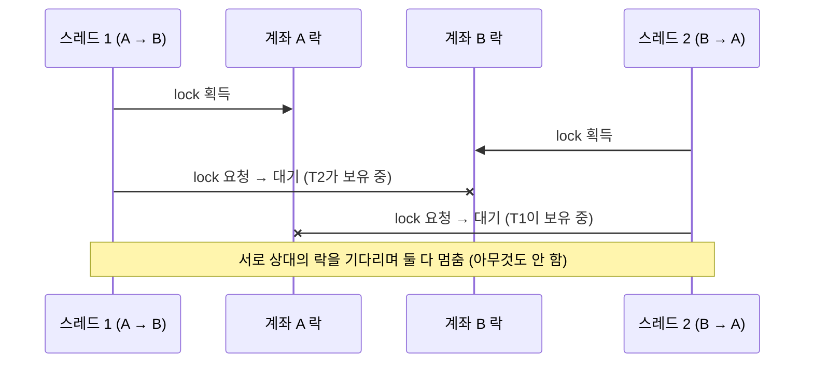

**라이브락(livelock)** 은 데드락을 피하려고 "상대 락을 못 잡으면 내 락을 풀고 다시 시도하자"고 했는데, 둘이 똑같은 타이밍에 양보를 반복하는 상황입니다. 스레드는 계속 바쁘게 움직이지만, 일은 하나도 진행되지 않습니다.

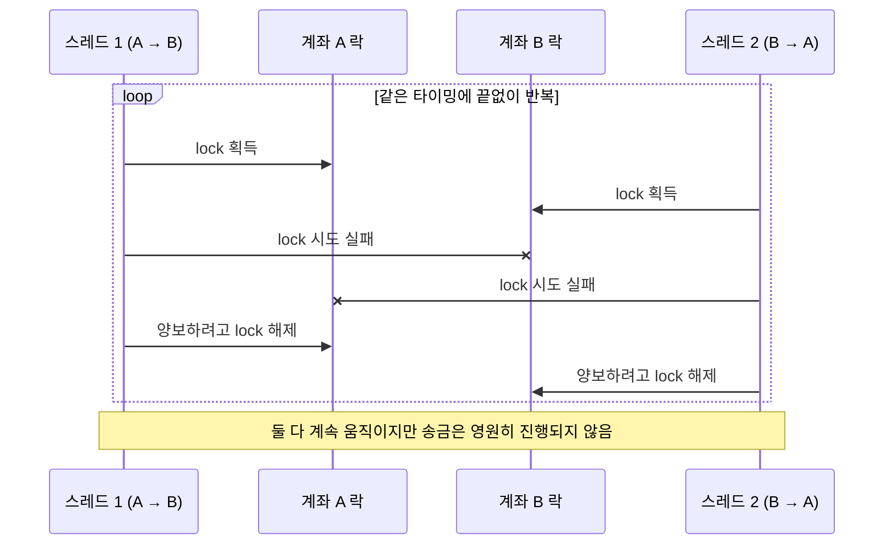

좁은 복도에서 마주친 두 사람으로 비유하면, 데드락은 둘 다 "당신이 먼저 비켜요" 하고 가만히 서 있는 거고, 라이브락은 둘 다 같은 쪽으로 계속 비켜주느라 좌우로 왔다 갔다만 하는 겁니다. 보통 데드락은 모든 스레드가 락을 **같은 순서**로 잡게 해서(예: 계좌 번호가 작은 쪽 먼저) 막고, 라이브락은 재시도 전에 **무작위로 잠깐 기다리게**(random backoff) 해서 타이밍을 어긋나게 만들어 막습니다.

## 분산 객체(1990-2000년대 초)

80년대 후반부터 PC와 유닉스 워크스테이션의 성능이 향상되고 가격은 대중화 되기 시작했습니다. 그래서 기존에 쓰던 비싼 메인프레임 컴퓨터 대신에 여러대의 컴퓨터로 업무를 나눠 처리하는 클라이언트/서버 아키텍처가 유행했고, 클라이언트와 서버를 네트워크로 연결하기 위한 LAN도 대중화 되었습니다.

<p align="center">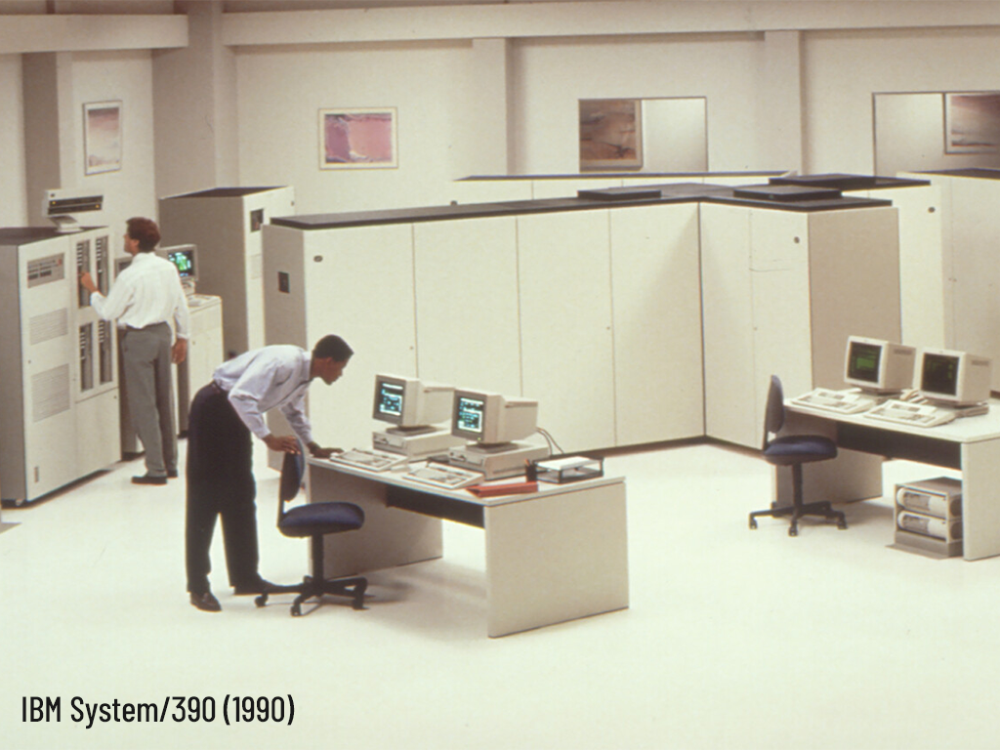<br />메인프레임과 PC가 한 공간에서, https://www.sleutelboek.eu/web/computerhardware30-13-de-krachtigste-computers</p>

그러다 보니 기업이 쓰던 기존의 메인프레임(주로 COBOL을 사용), 유닉스 서버, 윈도우 등 수많은 기종이 뒤섞이게 되었고, 기업 간에 쓰는 시스템도 매우 달라서 서로 호환이 되지 않는 경우가 종종 발생했습니다. 기업이 합병하는 일이 생기면 시스템 통합이 아주 큰 문제였던 거죠.

1989년 HP, Sun등의 기업이 업계 표준을 만들 목표로 `OMG(Object Management Group)`을 결성했고, 1991년 CORBA 1.0을 발표했습니다.

<p align="center">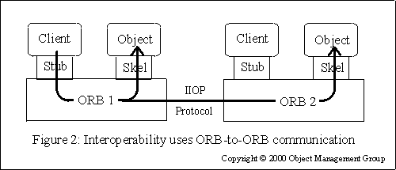<br />CORBA 원격 호출, https://userpages.umbc.edu/~dgorin1/451/middleware/objectoriented.htm</p>

위 다이어그램에 등장하는 요소는 다음과 같습니다.

- Client: 원격 객체의 메서드를 호출하는 쪽 프로그램
- Object: 실제 처리 로직을 담고 있는 서버 쪽 객체
- Stub: 클라이언트 쪽 대리인. IDL 인터페이스 정의로 부터 생성되며, Stub에 대한 호출을 네트워크로 전송할 수 있는 바이트 형태로 변환(마샬링)
- Skel(Skeleton): 서버 쪽 대리인. IDL 인터페이스 정의로 부터 생성되며, 도착한 바이트를 메서드 이름과 인자로 복원하고(언마샬링), 실제 객체의 메서드를 호출하고 결과를 다시 마샬링해서 리턴.
- ORB(Object Request Broker): 요청을 받아 목적지 객체를 찾고 전달한다. 객체가 같은 프로세스 또는 다른 컴퓨터에 있는지 찾고 연결하여 통신을 처리한다.
- IIOP(Internet Inter-ORB Protocol): ORB가 TCP/IP를 통해 통신을 주고 받는데 사용하는 표준 프로토콜. CORBA 2.0에 추가됨.

도식의 화살표를 따라가보면 두 개의 호출을 확인할 수 있습니다. 첫 번째는 같은 ORB에서 관리되는 객체를 호출하는 경우, 그리고 두 번째는 원격의 ORB에서 관리되는 객체를 호출하는 경우입니다.

MS에서도 자신들만의 독자적인 길을 가고 있었는데요, 1996년 윈도우 NT 4.0 기반의 DCOM을 발표했습니다.

<p align="center">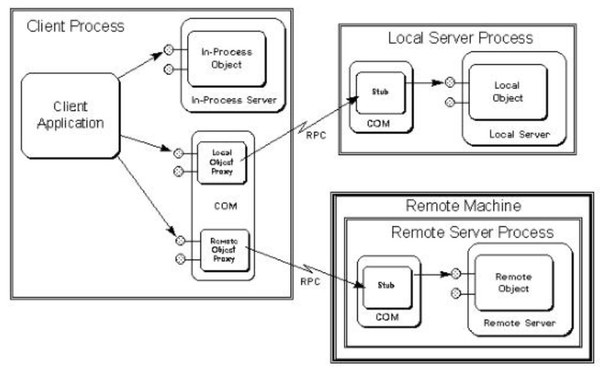<br />DCOM Technology. Şevket Duran Haşim Sak. https://www.slideserve.com/truong/dcom-technology</p>

앞서 살펴본 CORBA와 구조는 거의 동일합니다. COM 런타임이 CORBA의 ORB의 역할을 맡아 객체 생성 및 참조 관리와 호출을 관리합니다. 클라이언트 측에서는 Proxy, 서버에서는 Stub이 호출을 받아 마샬링/언마샬링을 담당합니다.

두 기술 모두 분산 시스템 환경에서 객체가 어디에 존재하는지와 상관없이 로컬 호출 처럼 사용할 수 있도록 하는 위치 투명성을 확보하고자 했습니다. 하지만, 분산 객체는 로컬 객체와 본질적으로 다르다는 주장이 설득력을 얻었죠.

Jim Waldo등 [A Note on Distributed Computing](https://waldo.scholars.harvard.edu/publications/note-distributed-computing)의 저자들은 초록(abstract)에서 이렇게 말하고 있습니다.

>  We argue that objects that interact in a distributed system need to be dealt with in ways that are intrinsically different from objects that interact in a single address space. These differences are required because distributed systems require that the programmer be aware of latency, have a different model of memory access, and take into account issues of concurrency and partial failure.

즉, 로컬 호출과 원격 호출은 다음과 같이 차이가 있다는 겁니다.

| 차이 | 로컬 호출 | 원격 호출 |
| --- | --- | --- |
| 지연 | 나노초 | 밀리초, 4\~5자릿수 차이 |
| 메모리 접근 | 포인터 공유 가능 | 주소 공간이 다름, 포인터 무의미 |
| 부분 실패 | 호출자와 피호출자가 같이 죽거나 같이 산다 | 원격 피호출자만 죽을 수 있고, 죽었는지 느린지 구분 불가 |
| 동시성 | 호출 순서를 제어할 수 있다 | 다른 클라이언트가 언제든 끼어든다 |

이 중에 가장 심각한 문제는 동시성과 부분 실패일 겁니다. 은행 시스템에서 입금/인출 하는데 부분적으로 실패한다? 입금이 진행 중인데 인출 돼버렸다? 이건 굉장히 심각하죠. 객체를 네트워크위에 올려놓았지만, 객체의 동시성을 제어하기 위한 락은 네트워크를 넘지 못했죠.

### 분산 락과 2단계 커밋

분산 시스템에서 원격 객체의 상태를 지키기 위해서는 두 가지 문제를 풀어야 합니다.

- 상호 배제: 네트워크를 통해 참여하는 여러 노드가 "이 객체를 지금 누가 접근할 수 있나?"에 대해 합의해야 하는 문제입니다. 이 문제를 해결하려면 락이 로컬을 넘어서, 합의 프로토콜(paxos, raft 등)을 통해 복제되는 서비스(분산 락 매니저)여야 합니다. 최근에는 ZooKeeper나 etcd등이 이런 역할을 담당합니다.

- 원자적 커밋: 여러 노드에 걸쳐있는 변경이 전부 성공하여 반영되거나, 모두 실패하여 취소하는 문제입니다. 이 문제를 해결하기 위해서 2단계 커밋이 제시되었습니다. 각 노드에서 오는 요청을 코디네이터가 처리하며, 코디네이터는 모든 참여자에게 PREPARE를 보냅니다. 모든 참여자가 VOTE_COMMIT으로 응답하면 COMMIT 요청을 보내고, 하나라도 ABORT로 응답하면 ABORT를 보냅니다.

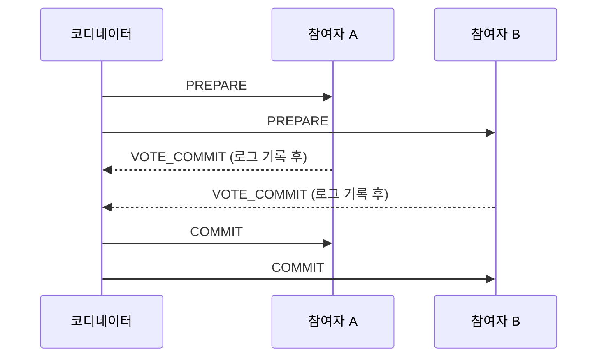

두 경우 모두 조정자가 필요하고, 조정자는 결론이 날 때 까지 요청을 블록해야 합니다. CORBA OTS(Object Transaction Service) 와 DCOM의 MTS(Microsoft Transaction Server)가 2단계 커밋을 분산 객체에 구현한 것인데, 네트워크에서 객체에 락을 걸기 위해 매우 복잡한 절차를 거쳐야 했던 거죠.

## 마이크로서비스(2010~)

이후 XML을 HTTP로 주고받으면서 이기종간의 상호운용성을 확보하자는 SOAP기반의 웹서비스가 제시되었고 MS등의 각 벤더가 여기 집중했지만 너무 복잡한 표준 명세와 IDE나 프레임워크의 과도한 의존, 그리고 XML 구조가 너무 복잡하고 무거운 이유 등의 문제가 있었습니다. 게다가 2000년대 중반 웹2.0과 ajax의 확산으로 웹의 중심이 브라우저로 옮겨간 것도 SOAP기반 웹서비스가 외면받는 이유가 되었습니다.

그리고 SOA라는 개념도 2000년대 들어 유행했지만, 역시 각 벤더가 고가의 제품과 컨설팅을 중심으로 사업을 전개하면서 그 자체가 또 하나의 병목지점이자 블랙박스가 되었습니다.

그리고 지금 우리는 자유로운 JSON기반의 REST API와 계약 기반의 gRPC등을 통해 마이크로서비스 시대에 살고 있는데요, 마이크로서비스에서 상태는 DB가 책임지고 있습니다.

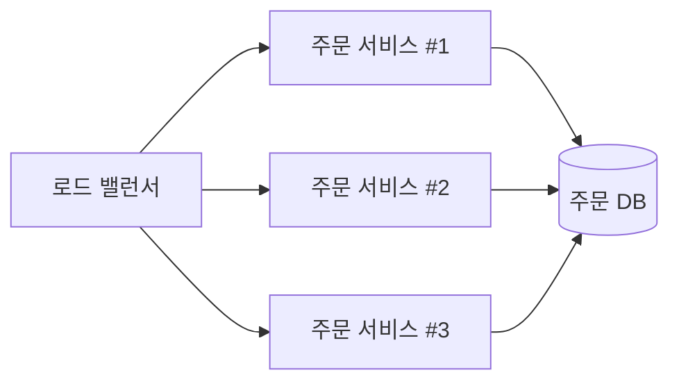

이상적인 마이크로서비스 구조에서 각 서비스는 자기 도메인과 연관된 DB만 가지기 때문에 서비스 간의 트랜잭션은 존재하지 않으며, 여러 서비스에 걸친 변경을 처리할 때는 saga 패턴을 사용하게 됩니다.

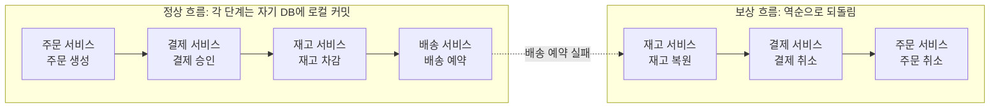

각 단계는 성공시 즉시 커밋되는데, 중간에 요청 하나가 실패할 경우 역순으로 각 커밋을 되돌리는 구조입니다. 각 서비스가 취소와 복원을 위한 로직을 따로 설계해야 하는 거죠. 트랜잭션의 롤백이 아닌 `실패를 보상하기 위한 새 트랜잭션`을 수행하기 때문에 중간 상태가 다른 요청에 노출될 수 있습니다.

이런 구조는 모든 상태가 DB에 존재하는 상태 없는 서비스에는 잘 맞지만, 실시간 게임이나 장바구니 처럼 처리 대상이 오래 유지되는 상태를 가지는 경우라면, 매번 요청을 받을 때 마다 상태를 DB에서 복원/저장하는 식으로 처리해야 합니다.

이런 경우 `상태를 메모리에 올려놓고, 딱 1 군데에서만 그걸 접근하면 어떨까?` 하는 질문이 제기되었고, 그래서 액터 모델이 다시 돌아오게 됩니다!

## 액터 모델의 귀환(2010~)

앞서 상태를 공유함으로써, 또는 분산 시스템에서 상태를 공유하고자 하면서 발생한 문제들과 해결책들을 살펴봤습니다. 그 중에서도 마이크로서비스는 현재 가장 성공적으로 구현되어 운영되고 있습니다. DDD(Domain Driven Design), EDA(Event Driven Architecture)등의 설계를 통해서 서비스 간의 의존성을 명확하게 구분하고 결과적 일관성을 목표로 해서 조금 더 유연하게 상태를 관리하면서 시스템 실패에 대응하는 형태로 진화하고 있죠.

하지만 액터 모델은 상태 관리 문제를 아예 다르게 접근합니다. 처음부터 아예 상태를 공유하지 않으면 된다는 거죠! 2009년에 JVM 기반의 [Akka](https://akka.io/)가 나왔고, 이후에 Akka를 .net으로 포팅한 [Akka.net](https://getakka.net/)이 나왔습니다. 그리고 2015년에 MS는 자사 서비스에서 활용하던 [Orleans](https://learn.microsoft.com/en-us/dotnet/orleans/overview?pivots=orleans-10-0)를 오픈소스로 공개했습니다.

고전 액터 모델에서 액터의 생성 및 삭제는 개발자가 처리해야 했습니다. 특정 액터에게 메세지를 보내려면 반드시 먼저 액터가 생성되어 있어야 하는데, 그래야 액터의 주소를 알 수 있고 거기에 메세지를 보낼 수 있기 때문이죠. Orleans는 항상 액터가 존재한다고 가정하는 가상 액터(virtual actor)를 새롭게 제시했습니다. 개발자는 액터의 존재 유무와 상관없이 메세지를 그냥 보내기만 하면 되고, 액터의 생성 및 삭제 그리고 활성/비활성화는 런타임이 담당하는 구조인거죠.

이렇게 보면 앞서 이야기 했던 분산 객체와도 좀 비슷한 느낌이 들죠? 하지만, 액터 모델의 경우 분산 객체 처럼 RPC(Remote Procedure Call) 호출을 한다기 보다는, 분산 시스템 어딘가에 존재할 액터에게 메세지를 보내는 개념으로 처리됩니다. 그러면 액터는 자신에게 도달한 메세지를 큐에 쌓아뒀다가 순서대로 처리하게 되는 거죠.

그러니까 분산 객체가 `원격의 객체가 로컬에 있는 거 처럼 호출`하는 게 목표였다면, 액터 모델은 `로컬에 있더라도 원격 메세지 호출 처럼 다루자`의 느낌입니다. 액터가 어디에 있는지 신경쓰지 말고 메세지 전송/수신 방식을 사용하자는 거죠.

> 그러니까 로컬에서 로컬로 전송되는 메세지의 경우 `네트워크 실패가 거의 발생하지 않는 원격 메세지`정도로 생각하자는 거죠.

> .NET Orleans의 경우 액터에 대한 메세지 전송이(`await order.AddItem(x)`) 마치 RPC처럼 보이기도 합니다.

액터 모델을 아주 간단한 도식으로 살펴 보면 다음과 같습니다.

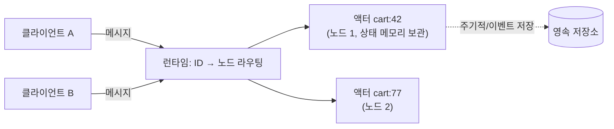

액터에게 메세지를 보내는 클라이언트는 런타임이 이해할 수 있는 액터의 식별자 ID를 목표로 메세지를 전송합니다. 그러면 런타임은 ID를 통해 액터가 어떤 노드에 있는지 찾고, 액터에게 메세지를 전달 해줍니다. 각 액터는 자신의 상태를 메모리에 가지고 있으며(상태는 최종적으로 DB에 저장하지만, 액터가 생성/활성화될 때 메모리에 로드합니다. 시스템에서 액터는 결과적으로 유일하기 때문에 메모리에서 상태를 관리해도 문제가 없습니다!), 큐에 쌓인 메세지를 순서대로 처리하므로 락을 사용하지 않고도 상태의 일관성이 보장됩니다.

> 시스템에서 액터가 결과적으로 유일한 이유는, 클러스터간의 네트워크 단절등의 불안정한 상황에서는 액터가 중복되어 활성화 될 수도 있기 때문입니다! Orleans의 경우 액터는 활성화 될 때, 저장소에서 ETag(버전 표시)를 확인합니다. 그래서 자신이 가진 ETag을 비교해서 값이 다르다면 저장소에 상태를 덮어쓸 수 없도록 합니다.

물론 액터 모델도 여러 액터에 걸친 처리를 해야 하는 경우가 생길 수도 있습니다. 예를 들어서 하나의 주문에 여러 상품이 포함되는 경우를 생각해보면, 주문도 액터고 상품도 액터입니다. 그런데 주문 액터는 주문에 포함된 모든 상품 주문 상태(장바구니에 뒀다가 주문하는 그 순간에 재고가 없어졌을 수도 있죠!)를 확인하고 주문의 상태를 변경해야 합니다.

Orleans는 이런 문제를 위해서 분산 ACID 트랜잭션을 지원하긴 합니다. 이미 앞서 살펴봤던 `락+2단계 커밋`기반이기 때문에, 빈번한 데이터 쓰기가 발생하는 경우 성능이 저하될 수 있겠죠. 그리고 [ITransactionalStateStorage를 구현하는 데이터 스토리지](https://learn.microsoft.com/en-us/dotnet/orleans/grains/transactions#transactional-state-storage)만 지원되는데 Azure Table Storage, [AWS DynamoDB](https://www.nuget.org/packages/Microsoft.Orleans.Transactions.DynamoDB), [MSSQL/MySQL](https://github.com/Scythemen/Cellar.Orleans.Transactions.AdoNet) 등이 지원되고 있습니다. 그런데 DynamoDB의 경우 최신 버전 다운로드가 398회(2026-09-28 기준)에 불과하고, MSSQL/MySQL 라이브러리의 경우 오래전에 개발이 중단되는 등 사실상 Azure Table Storage 정도가 안정적인 버전이라서 선택지가 좁은 상황입니다.

아무래도 일반적인 해결책은 앞서 살펴봤던 saga 패턴을 사용하는 거겠죠. 그게 아니라면 이 문제가 액터 모델로 풀기에 적절하지 않은 문제 일 수도 있습니다.(DB에서 상태를 관리하는 경우, 트랜잭션 하나로 해결할 수도 있기 때문이죠.) 그래서 액터 모델과 DB에 상태를 저장하는 방식을 섞어 쓰는 경우도 있다고 합니다.

## 정리

뭔가 액터 모델에 대해서 정리하려다 보니 동시성과 병렬성에 대한 정리도 하고, 객체를 기반으로 한 분산 시스템의 역사에 대해서 살펴보게 됐습니다. 그냥 단순히 제가 궁금해서 그랬던 거긴 한데, 꼼꼼하게 정리하자니 다뤄야할 내용이 너무 많아서 좀 핵심 내용위주로 살펴보면서 정리했습니다. 어쨌거나 다음에는 .NET Orleans를 통해서 액터 모델을 직접 구현해볼까 합니다!

## 참고자료

- [Alan Kay, "Dr. Alan Kay on the Meaning of Object-Oriented Programming" (2003년 이메일, Stefan Ram 정리)](http://userpage.fu-berlin.de/~ram/pub/pub_jf47ht81Ht/doc_kay_oop_en)
- [cppreference, History of C++](https://en.cppreference.com/w/cpp/language/history)
- [Wikipedia, Monitor (synchronization)](https://en.wikipedia.org/wiki/Monitor_(synchronization))
- [Wikipedia, Actor model](https://en.wikipedia.org/wiki/Actor_model)
- [Wikipedia, ILLIAC IV](https://en.wikipedia.org/wiki/ILLIAC_IV)
- [Wikipedia, Erlang (programming language)](https://en.wikipedia.org/wiki/Erlang_(programming_language))
- [erlang-questions 메일링 리스트, "Erlang is *not* a implementation of the Actor model" (2014)](http://erlang.org/pipermail/erlang-questions/2014-June/079891.html), [Wikiquote, Joe Armstrong](https://en.wikiquote.org/wiki/Joe_Armstrong_(programmer))
- [Wikipedia, Common Object Request Broker Architecture](https://en.wikipedia.org/wiki/Common_Object_Request_Broker_Architecture)
- [UMBC, Object-Oriented Middleware](https://userpages.umbc.edu/~dgorin1/451/middleware/objectoriented.htm)
- [Jim Waldo, Geoff Wyant, Ann Wollrath, Sam Kendall, "A Note on Distributed Computing" (Sun Microsystems Laboratories, SMLI TR-94-29, 1994)](https://doc.akka.io/libraries/misc/smli_tr-94-29.pdf)
- [CORBA FAQ, Object Transaction Service](https://www4.cs.fau.de/~geier/corba-faq/transaction-service.html)
- [Oracle, Using Microsoft Transaction Server with Oracle Database](https://docs.oracle.com/cd/E11882_01/win.112/e26104/using.htm)
- [Hector Garcia-Molina, Kenneth Salem, "Sagas" (ACM SIGMOD 1987)](https://dl.acm.org/doi/10.1145/38713.38742)
- [Akka Documentation, Location Transparency](https://doc.akka.io/libraries/akka-core/current/general/remoting.html)
- [Microsoft Learn, Orleans Grain identity](https://learn.microsoft.com/en-us/dotnet/orleans/grains/grain-identity)
- [Microsoft Learn, Orleans Grain directory](https://learn.microsoft.com/en-us/dotnet/orleans/host/grain-directory)
- [Microsoft Learn, Transactions in Orleans](https://learn.microsoft.com/en-us/dotnet/orleans/grains/transactions)

